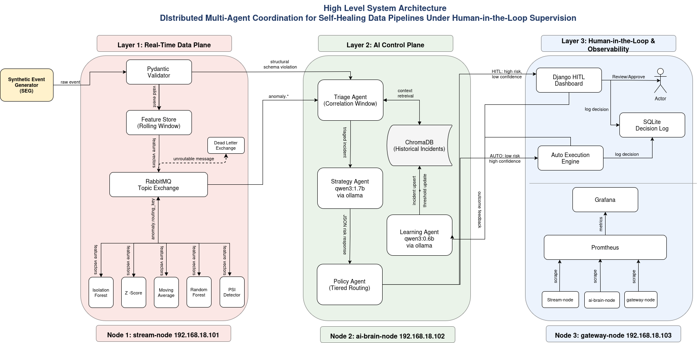

# 🧠 Phase 0 — Infrastructure Setup & LLM Evaluation

> **Project:** Distributed Multi-Agent Coordination for Self-Healing Data Pipelines — A Human-in-the-Loop Approach on Commodity Hardware
> **Institution:** Department of CS&IT, UET Peshawar — Nowshera Campus
> **Team:** Muhammad Adeel (23JZBCS0226) & Muhammad Asim
> **Supervisor:** Dr. Laeeq Ahmed (Big Data & AI)
> **Status:** ✅ Complete — 31 March 2026

---

## System Architecture



---

## 📋 Table of Contents

1. [Phase 0 Goals & Status](#1-phase-0-goals--status)
2. [Cluster Topology](#2-cluster-topology)
3. [Verified Baseline Measurements](#3-verified-baseline-measurements)
4. [LLM Benchmark — Strategy Agent Selection](#4-llm-benchmark--strategy-agent-selection)
5. [How to Replicate the Benchmark](#5-how-to-replicate-the-benchmark)
6. [Key Findings for Paper Writing](#6-key-findings-for-paper-writing)

---

## 1. Phase 0 Goals & Status

| # | Goal | Status |
|:-:|:-----|:------:|
| 1 | Three-node cluster online with static IPs and passwordless SSH | ✅ Done |
| 2 | NTP synchronisation across all nodes (< 100 ms offset) | ✅ Done |
| 3 | Prometheus + Grafana observability stack (gateway-node) | ✅ Done |
| 4 | RabbitMQ broker with DLX and Management UI (stream-node) | ✅ Done |
| 5 | Ollama serving models on ai-brain-node (headless) | ✅ Done |
| 6 | ChromaDB smoke test passing on ai-brain-node | ✅ Done |
| 7 | All three datasets downloaded on stream-node | ✅ Done |
| 8 | Strategy Agent LLM evaluated across 3 models × 3 prompt variants | ✅ Done |
| 9 | Final model selected based on structured output compliance metrics | ✅ Done |
| 10 | Cluster verified fully hostname-based — no hardcoded IPs in any config | ✅ Done |

> **Phase 0 is complete.** All infrastructure is verified and the Strategy Agent model has been selected. Proceed to Phase 1: Stream Ingestion & Anomaly Detection.

---

## 2. Cluster Topology

All three nodes communicate exclusively via hostnames. No IP addresses appear in any application config, connection string, or service URL. The only place IPs are recorded is `/etc/hosts` on each node — update that file alone when moving to a new LAN.

```
┌──────────────────────────────────────────────────────────────────┐
│                     Cluster LAN Network                          │
│                                                                  │
│  ┌────────────────┐    ┌─────────────────┐    ┌──────────────┐  │
│  │  stream-node   │    │  ai-brain-node  │    │ gateway-node │  │
│  │                │◄──►│  (Headless)     │◄──►│              │  │
│  │  RabbitMQ      │    │  Ollama         │    │  Prometheus  │  │
│  │  Layer 1 Data  │    │  ChromaDB       │    │  Grafana     │  │
│  │  Ingestion     │    │  Layer 2 AI     │    │  Layer 3     │  │
│  └────────────────┘    └─────────────────┘    └──────────────┘  │
└──────────────────────────────────────────────────────────────────┘
```

| Node | Hostname | OS | CPU | RAM | Primary Services |
|:-----|:---------|:---|:----|:----|:-----------------|
| Node 1 | `stream-node` | Ubuntu 24.04 Desktop | AMD Ryzen 5 | 8 GB | RabbitMQ, Layer 1, Datasets |
| Node 2 | `ai-brain-node` | Ubuntu 24.04 **Server** | AMD Ryzen 5 | 8 GB | Ollama, ChromaDB, 4 Agents |
| Node 3 | `gateway-node` | Ubuntu 24.04 Desktop | Intel Core i5 | 8 GB | Prometheus, Grafana, HITL |

### Service Access URLs — Hostname Based

| Service | URL | Node |
|:--------|:----|:-----|
| RabbitMQ Management UI | `http://stream-node:15672` | Node 1 |
| Ollama API | `http://ai-brain-node:11434` | Node 2 |
| Prometheus | `http://gateway-node:9090` | Node 3 |
| Grafana | `http://gateway-node:3000` | Node 3 |

### Moving to a New LAN

The only file that ever needs updating is `/etc/hosts` on all three nodes. Replace the three cluster IP lines with the new IPs assigned on the new network, restart services, and everything works:

```
<new-stream-node-ip>      stream-node
<new-ai-brain-node-ip>    ai-brain-node
<new-gateway-node-ip>     gateway-node
```

📖 Full setup and LAN migration instructions → [`User_Guide.md`](./User_Guide.md)

---

## 3. Verified Baseline Measurements

All measurements recorded during Phase 0 over WiFi. Paper benchmarks re-recorded on Gigabit Ethernet after 15 July 2026.

### 3.1 Cluster Baseline

| Measurement | Value | Method |
|:------------|:------|:-------|
| NTP offset — stream-node | 0.000021146 s | `chronyc tracking` |
| NTP offset — ai-brain-node | 0.016272109 s | `chronyc tracking` |
| NTP offset — gateway-node | 0.000009871 s | `chronyc tracking` |
| WiFi latency — stream-node → ai-brain-node (avg) | 57.875 ms | `ping ai-brain-node -c 20` |
| WiFi latency — stream-node → gateway-node (avg) | 13.837 ms | `ping gateway-node -c 20` |
| WiFi latency — ai-brain-node → gateway-node (avg) | 21.748 ms | `ping gateway-node -c 20` |
| Free RAM — stream-node (idle) | 5.1 GB | `free -h` |
| Free RAM — ai-brain-node (idle) | 6.2 GB | `free -h` |
| Free RAM — gateway-node (idle) | 5.6 GB | `free -h` |
| Free RAM — ai-brain-node with Ollama loaded | 3.6 GB | `free -h` after model load |

### 3.2 Ollama Models on ai-brain-node

| Model | Size | Quantisation | Role |
|:------|:-----|:-------------|:-----|
| `qwen3:1.7b` | 1.36 GB | Q4_K_M | Strategy Agent ✅ Selected |
| `qwen3:0.6b` | 522 MB | Q4_K_M | Learning Agent (designated) |
| `deepseek-r1:1.5b` | 1.12 GB | Q4_K_M | Evaluated — rejected |
| `phi4-mini:latest` | 2.49 GB | Q4_K_M | Evaluated — rejected |

### 3.3 Hostname Verification Results

All services confirmed reachable by hostname from all nodes:

| Command | From | Result |
|:--------|:-----|:-------|
| `curl -u fypadmin:fypadmin123 http://stream-node:15672/api/healthchecks/node` | stream-node | `{"status":"ok"}` ✅ |
| `curl http://ai-brain-node:11434/api/tags` | stream-node | All 4 models listed ✅ |
| `curl http://gateway-node:9100/metrics` | stream-node | Valid metrics stream ✅ |
| `curl -s http://localhost:9090/api/v1/targets` | gateway-node | 5 × `"health":"up"` ✅ |

---

## 4. LLM Benchmark — Strategy Agent Selection

The Strategy Agent must respond with a valid 7-field JSON object for every incident. Model selection was driven entirely by **structured output compliance** under adversarial conditions.

### Evaluation Summary — Strict Variant (30 Prompts Each)

| Metric | `deepseek-r1:1.5b` | `qwen3:1.7b` | `phi4-mini` |
|:-------|:------------------:|:------------:|:-----------:|
| **JSON Valid %** | 6.7% 🔴 | **96.7%** 🟢 | 30.0% 🟡 |
| **Schema Valid %** | 0.0% 🔴 | **90.0%** 🟢 | 6.7% 🔴 |
| Risk tier (L / H) | 1 / 0 ⚠️ | **11 / 18** ✅ | 0 / 9 ⚠️ |
| Avg response time | 19.69 s | 20.19 s | **13.47 s** |
| Avg tokens/s | **21.03** | 16.71 | 8.56 |
| Viable for production? | NO 🔴 | **YES** 🟢 | NO 🔴 |

### ✅ Selected: `qwen3:1.7b`

Only model meeting the schema validity hard constraint. 90% schema validity on adversarial prompts — estimated 100% with two confirmed engineering fixes applied:

| Fix | Change |
|:----|:-------|
| System prompt constraint | Added: "Output ONLY these 7 fields. Do NOT include any other keys from the input." |
| Token budget | `num_predict` increased from 400 → 512 to prevent truncation on complex prompts |

### Why Others Were Rejected

**deepseek-r1:1.5b:** 0% schema validity. Chain-of-thought architecture produces narrative output that prevents valid JSON closure. Fundamentally incompatible with the structured output role.

**phi4-mini:** 6.7% schema validity. 100% HIGH risk tier rate across all parseable responses — systematic over-escalation bias that would route every LOW and MEDIUM incident to HITL, eliminating autonomous recovery.

> **Note on other agents:** Triage Agent is rule-based — no LLM. Learning Agent uses `qwen3:0.6b` — formal evaluation in Phase 2.

---

## 5. How to Replicate the Benchmark

```bash
cd Phase_0_Infrastructure/scripts/

# Edit top of benchmark_runner.py:
#   PROMPT_FILE = "../prompts/strict_prompts.json"
#   MODEL       = "qwen3:1.7b"
#   OLLAMA_URL  = "http://ai-brain-node:11434/api/generate"

python benchmark_runner.py
```

Results written to `results/raw_responses/` (JSONL) and `results/summary/` (CSV + stats JSON).

---

## 6. Key Findings for Paper Writing

**F1** — Structured output compliance is not correlated with parameter count in the sub-2B range.

**F2** — CoT-optimized architectures are structurally incompatible with strict JSON output roles.

**F3** — Speed advantage is operationally irrelevant below the schema validity threshold.

**F4** — Risk tier calibration reveals systematic model bias invisible in aggregate validity metrics.

**F5** — All 3 failures in the selected model are engineering artifacts with confirmed fixes. 90% is a lower bound, not a ceiling.

**F6** — Severity-conditional reasoning emerges without few-shot examples.

**F7** — Domain-specific reasoning quality supports production deployment without fine-tuning.

---

*Phase 0 complete → Phase 1: Stream Ingestion & Anomaly Detection*

---

<details>
<summary>📎 Output Schema Validation Rules</summary>

| Check | Pass Condition |
|:------|:--------------|
| Field completeness | All 7 required fields present, no extras |
| Severity enum | Value in `{LOW, MEDIUM, HIGH, CRITICAL}` |
| Risk tier enum | Value in `{LOW, HIGH}` |
| Risk tier mapping | `LOW/MEDIUM → LOW`, `HIGH/CRITICAL → HIGH` |
| Actions list | Exactly 3 items, must be a list |
| Confidence range | Float in `[0.0, 1.0]` |

</details>