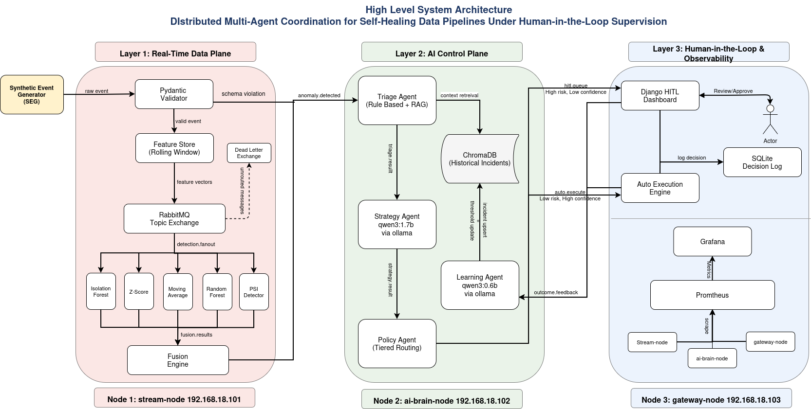

# Distributed Multi-Agent Coordination for Self-Healing Data Pipelines
## A Human-in-the-Loop Approach on Commodity Hardware

> **Institution:** Department of CS&IT, UET Peshawar — Nowshera Campus
> **Team:** Muhammad Adeel (23JZBCS0226) &amp; Muhammad Asim (23JZBCS0227)
> **Supervisor:** Dr. Laeeq Ahmad — HEC Approved PhD Supervisor

---

## System Architecture



---

## What This Project Does

This system detects anomalies in a distributed streaming data pipeline and autonomously decides whether to fix them or escalate them to a human operator. It runs on three physical commodity machines with no cloud or GPU dependency. When an anomaly is detected — a CPU spike, error rate surge, authentication flood, throughput drop, or schema drift — five ML models detect it, a Fusion Engine correlates the signals into a single enriched incident, and a chain of four AI agents classifies it, reasons about the best response using a local LLM, routes it to either automatic execution or a human review dashboard, and learns from the outcome to improve future decisions.

The research goal is to prove that this class of self-healing agentic system — previously only described theoretically in the AIOps literature — can be built and benchmarked on real commodity hardware, with measurable improvements in Mean Time To Acknowledge (MTTA) and Mean Time To Remediate (MTTR) over a static threshold-only baseline.

---

## Architecture at a Glance

```
Node 1 — stream-node                         Layer 1: Real-Time Data Plane
  SEG → Pydantic Validator → Feature Store
    → 5 ML Detectors (detection.fanout exchange)
    → Fusion Engine (3s correlation window, compound incident merging)
    → anomaly.detected queue

Node 2 — ai-brain-node                       Layer 2: AI Control Plane
  Triage Agent (rule-based + RAG)
    → Strategy Agent (qwen3:1.7b via Ollama)
    → Policy Agent (tiered routing)
    → Learning Agent (qwen3:0.6b via Ollama)
  ChromaDB (RAG — Historical Incidents)

Node 3 — gateway-node                        Layer 3: HITL & Observability
  Django HITL Dashboard → Auto-Execution Engine → SQLite Decision Log
  Prometheus + Grafana (scraping all 3 nodes)
```

---

## Repository Structure

```
fyp-pipeline/
│
├── layer1/                        — Node 1: stream-node
│   ├── seg/                       — Synthetic Event Generator (corpus + live replay mode)
│   │   └── config/seg_config.json — Replay speed, seed, event counts
│   ├── validator/                 — Pydantic schema enforcement + schema drift router
│   ├── feature_store/             — Rolling window feature computation (10 features)
│   ├── adm/
│   │   ├── detectors/             — 5 models: Isolation Forest, Z-Score, Moving Average,
│   │   │                            Rate-gate + Random Forest, PSI Detector
│   │   └── models/                — Trained .pkl files (git-ignored)
│   ├── fusion_engine/             — Signal correlation, confidence scoring, compound merging
│   └── rabbitmq/                  — detection.fanout producer + fusion_publisher
│
├── layer2/                        — Node 2: ai-brain-node
│   ├── agents/                    — Triage, Strategy, Policy, Learning agents
│   ├── chromadb_utils/            — RAG client, query (3-step protocol), upsert
│   ├── prompts/                   — System prompts for qwen3:1.7b and qwen3:0.6b
│   └── config/                    — EMA confidence threshold (threshold_config.json)
│
├── layer3/                        — Node 3: gateway-node
│   ├── dashboard/                 — Django HITL project (queue, incident detail, SSE)
│   │   └── hitl/templates/        — queue.html, incident_detail.html, auto_monitor.html
│   ├── auto_executor/             — Consumes auto.execute, publishes outcome.feedback
│   └── sqlite_logger/             — Centralised decision log writer
│
├── evaluation/                    — Dataset generation, baseline, metrics, kappa
├── Phase_0_Infrastructure/        — Phase 0 cluster setup and LLM benchmark (COMPLETE)
│   ├── scripts/                   — Benchmark runner scripts (3 models x 3 variants)
│   ├── prompts/                   — simple, medium, strict, stricter prompt sets
│   ├── results/summary/           — Aggregate stats JSON files (per run)
│   └── static/                    — system_architecture.png
├── datasets/                      — Download instructions: NAB, Loghub HDFS, KDD99
├── docs/                          — System design, proposal, evaluation summary documents
├── system_architecure.png         — High-level architecture diagram
└── README.md
```

---

## Selected Models

| Agent | Model | Selection Basis |
|:------|:------|:----------------|
| Strategy Agent | `qwen3:1.7b` via Ollama | 90% schema validity on 30 strict adversarial prompts. Only model meeting the production viability hard constraint. All 3 failures traced to fixable engineering issues. |
| Learning Agent | `qwen3:0.6b` via Ollama | Sub-1B RAM budget for Node 2. Formal quality evaluation in Phase 2. |
| Triage Agent | None — rule-based + RAG | No LLM needed. ChromaDB retrieval only. Keeps latency within 3s SLA. |
| Policy Agent | None — pure Python | Deterministic routing table. Zero inference latency. |

Full evaluation details → `Phase_0_Infrastructure/README.md`
Paper-ready summary → `docs/Phase0_Evaluation_Summary.docx`

---

## Evaluation Dataset — 1,950 Events

| Category | Count |
|:---------|------:|
| Normal events (baseline healthy traffic) | 1,000 |
| CPU / Memory Spike | 200 |
| Error Rate Surge (5xx) | 200 |
| Throughput Drop / Silent Crash | 200 |
| Auth Failure Flood | 200 |
| Schema Change — 3 sub-types (missing fields, type mutations, value shifts) | 150 |
| **TOTAL** | **1,950** |

Ground truth labels are stored separately in `evaluation/labels.csv` and are never visible to the pipeline during evaluation runs.

---

## Cluster Infrastructure

| Node | Hostname | OS | CPU | RAM | Primary Services |
|:-----|:---------|:---|:----|:----|:-----------------|
| Node 1 | `stream-node` | Ubuntu 24.04 Desktop | AMD Ryzen 5 | 8 GB | RabbitMQ, Layer 1, Datasets |
| Node 2 | `ai-brain-node` | Ubuntu 24.04 Server | AMD Ryzen 5 | 8 GB | Ollama, ChromaDB, 4 Agents |
| Node 3 | `gateway-node` | Ubuntu 24.04 Desktop | Intel Core i5 | 8 GB | Prometheus, Grafana, HITL |

All three nodes communicate exclusively via hostnames — no hardcoded IPs in any config or application code. When moving to a new LAN, only `/etc/hosts` on each node needs updating.

### Service Access URLs

| Service | URL |
|:--------|:----|
| RabbitMQ Management UI | `http://stream-node:15672` |
| Ollama API | `http://ai-brain-node:11434` |
| Prometheus | `http://gateway-node:9090` |
| Grafana | `http://gateway-node:3000` |
| HITL Dashboard | `http://gateway-node:8000` |

---

## Primary Research Metrics

| Metric | Symbol | Target |
|:-------|:-------|:-------|
| Mean Time To Acknowledge | MTTA | Median < 33 seconds (includes 3s Fusion Engine window) |
| Mean Time To Remediate | MTTR | Measurably lower than 60s static baseline |
| False Escalation Rate | FER | < 30% |
| False Automation Rate | FAR | < 5% (safety-critical upper bound) |
| Risk Tier Accuracy | RTA | ≥ 75% |
| Schema Validity Rate | SVR | ≥ 95% in production |
| Fusion Suppression Rate | FSR | Higher is better — measures false positive reduction |
| Compound Detection Rate | CDR | Measures multi-signal incident merging accuracy |

---

## RabbitMQ Queue Map

| Queue / Exchange | Type | Published By | Consumed By |
|:----------------|:-----|:-------------|:------------|
| `detection.fanout` | Topic Exchange | ADM Runner | All 5 detectors |
| `fusion.results` | Queue | All 5 detectors | Fusion Engine |
| `anomaly.detected` | Queue | Fusion Engine + Validator (direct) | Triage Agent |
| `triage.result` | Queue | Triage Agent | Strategy Agent |
| `strategy.result` | Queue | Strategy Agent | Policy Agent |
| `auto.execute` | Queue | Policy Agent | Auto-Executor |
| `hitl.queue` | Queue | Policy Agent | HITL Dashboard |
| `outcome.feedback` | Queue | Auto-Executor + HITL | Learning Agent |
| `dead.letters` | Queue | RabbitMQ DLX | Manual review |

---

## Getting Started

1. **Cluster infrastructure** → `Phase_0_Infrastructure/User_Guide.md`
2. **Layer 1 (Node 1)** → `layer1/README.md` then `layer1/User_Guide.md`
3. **Layer 2 (Node 2)** → `layer2/README.md` then `layer2/User_Guide.md`
4. **Layer 3 (Node 3)** → `layer3/README.md` then `layer3/User_Guide.md`
5. **Evaluation** → `evaluation/README.md`

---

## Git Branch Strategy

| Branch | Purpose |
|:-------|:--------|
| `main` | Production-quality code only. Tagged at each phase milestone. Never commit broken code. |
| `develop` | Integration branch. Feature branches merge here first after end-to-end demo passes. |
| `feature/*` | One branch per component. Examples: `feature/seg`, `feature/fusion-engine`, `feature/triage-agent`. |

---

*Full system design, agent I/O contracts, Fusion Engine specification, and research hypotheses are in `docs/System_Design_Methodology_v1.2.docx`.*
