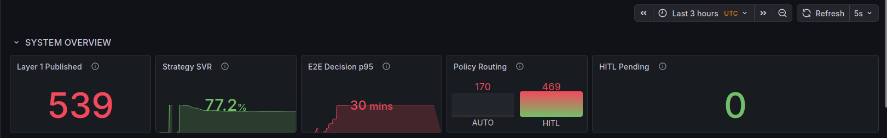
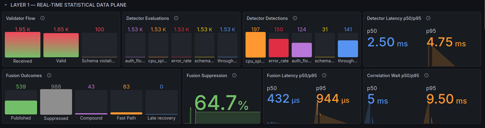
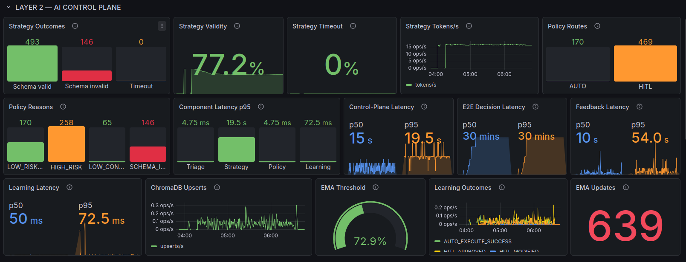
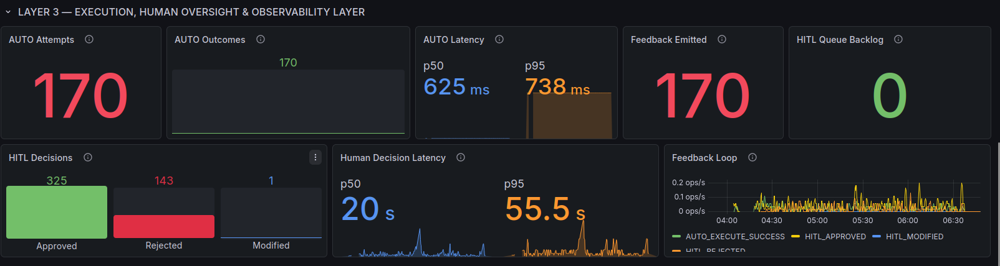
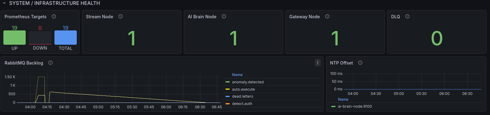
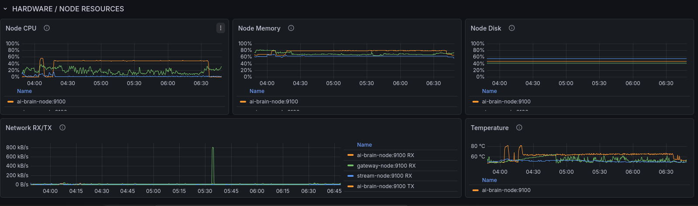

# Distributed Multi-Agent Coordination for Self-Healing Data Pipelines

> An experimental, policy-bounded research prototype for coordinating detection,
> diagnosis, remediation planning, human oversight, and learning across three
> commodity-hardware nodes.

## Project summary

Modern data pipelines can suffer resource spikes, error-rate surges, throughput
degradation, authentication-failure floods, schema drift, and structural data
violations. Monitoring often detects these symptoms, but diagnosis, remediation
recommendation, execution, human escalation, and post-incident learning remain
separate activities.

This project investigates whether those responsibilities can be coordinated by a
distributed, heterogeneous multi-agent architecture on commodity hardware while
retaining a deterministic safety boundary around automatic action. It is a
research prototype, not a claim of universal or production-ready self-healing.

The authoritative final experiment is the cold-memory Wi-Fi run
**wifi_cold_20260913_041045**, performed with frozen implementation commit
**377250945c253b9c9da233d84391d1458d181fc9**.

## Research problem and proposed solution

The problem is not merely anomaly detection. It is safe coordination after an
incident is found: deciding what an incident means, proposing an appropriate
response, ensuring an unsafe proposal cannot execute automatically, involving a
human when needed, and preserving the outcome for future adaptation.

The proposed solution combines:

- statistical and deterministic incident detection;
- RabbitMQ event-driven communication;
- deterministic Triage with retrieval-assisted context;
- local LLM remediation planning only in Strategy;
- deterministic Policy enforcement;
- controlled simulated AUTO handling;
- persistent human-in-the-loop escalation;
- feedback-driven ChromaDB memory and EMA threshold adaptation; and
- Prometheus/Grafana observability across the deployment.

This division is intentional: Triage, Policy, Learning, Layer 1 detectors,
execution control, and the HITL workflow are not LLM agents. **Only Strategy is
LLM-backed**, using local **qwen3:1.7b** inference through Ollama.

## Safety and authority model

~~~text
Strategy proposes remediation.
Policy authorizes or escalates.
Layer 3 executes an authorized AUTO decision or presents a HITL case.
~~~

The LLM never receives unrestricted execution authority. Strategy output must
satisfy a seven-field structured contract, an allowed action vocabulary, exactly
three distinct actions, and the severity-to-risk-tier constraint. A bounded
regeneration permits no more than two model-generation attempts. Deterministic
validation and Policy then fail closed: malformed, invalid, unsafe, high-risk,
or insufficient-confidence proposals route to HITL rather than AUTO.

## Full-system architecture

~~~mermaid
flowchart LR
    classDef l1 fill:#0c4a6e,color:#fff,stroke:#0369a1,stroke-width:2px
    classDef l2 fill:#7c2d12,color:#fff,stroke:#c2410c,stroke-width:2px
    classDef l3 fill:#14532d,color:#fff,stroke:#166534,stroke-width:2px
    classDef queue fill:#334155,color:#fff,stroke:#475569
    classDef store fill:#312e81,color:#fff,stroke:#4f46e5
    classDef obs fill:#5b215f,color:#fff,stroke:#a21caf

    subgraph N1["Node 1 — stream-node Layer 1 — Real-Time Statistical Data Plane + RabbitMQ"]
        direction TB
        SEG[Synthetic Event Generator]
        VAL[Pydantic Validator]
        FS[Feature Store + ADM Runner]
        FAN[RabbitMQ detection.fanout]
        CPU[CPU / memory detector]
        ERR[Error-rate detector]
        THR[Throughput detector]
        AUTH[Auth-flood detector]
        SCH[Schema-drift detector]
        FUS[Fusion Engine]
        BYP[Structural schema bypass router]
        AD[(RabbitMQ anomaly.detected)]
        SEG --> VAL
        VAL -->|valid| FS --> FAN
        FAN --> CPU
        FAN --> ERR
        FAN --> THR
        FAN --> AUTH
        FAN --> SCH
        CPU --> FUS
        ERR --> FUS
        THR --> FUS
        AUTH --> FUS
        SCH --> FUS
        FUS -->|fused incident| AD
        VAL -->|structural violation| BYP --> AD
    end

    subgraph N2["Node 2 — ai-brain-node Layer 2 — AI Control Plane"]
        direction TB
        TRI[Triage deterministic protocol + RAG]
        STR[Strategy qwen3:1.7b structured proposal]
        POL[Policy deterministic authority boundary]
        LEARN[Learning deterministic feedback + EMA]
        OLL[Ollama]
        CHR[(ChromaDB)]
        TRI -->|triage.result| STR -->|strategy.result| POL
        TRI <--> CHR
        STR <--> OLL
        LEARN --> CHR
        LEARN -->|adaptive threshold| POL
    end

    subgraph N3["Node 3 — gateway-node Layer 3 — Execution, Human Oversight & Observability Layer"]
        direction TB
        AUTO[Auto Executor controlled simulated handling]
        HITL[Django HITL persistent review]
        DB[(SQLite decision audit and HITL state)]
        PROM[Prometheus]
        GRAF[Grafana]
        HITL --> DB
        AUTO --> DB
        PROM --> GRAF
    end

    AD --> TRI
    POL -->|AUTO: auto.execute| AUTO
    POL -->|HITL: hitl.queue| HITL
    AUTO -->|outcome.feedback| LEARN
    HITL -->|outcome.feedback| LEARN
    N1M[Layer 1 exporters] -. scrape .-> PROM
    N2M[Layer 2 exporters] -. scrape .-> PROM
    N3M[Layer 3 exporters + RabbitMQ] -. scrape .-> PROM

    class SEG,VAL,FS,FAN,CPU,ERR,THR,AUTH,SCH,FUS,BYP l1
    class TRI,STR,POL,LEARN,OLL l2
    class AUTO,HITL l3
    class AD queue
    class CHR,DB store
    class PROM,GRAF,N1M,N2M,N3M obs
~~~

The system is physically distributed but uses one consistent message backbone.
Structural schema violations bypass Feature Store/Fusion and enter
**anomaly.detected** directly. Valid events are enriched, analysed by five
specialised detectors, then correlated by Fusion before moving to Layer 2.

## Commodity-hardware deployment

| Node | Platform | Primary responsibilities |
|---|---|---|
| **Node 1 — stream-node** | Ubuntu 24.04 Desktop; AMD Ryzen 5; 8 GB RAM | Layer 1, RabbitMQ, corpus replay |
| **Node 2 — ai-brain-node** | Ubuntu 24.04 Server; AMD Ryzen 5; 8 GB RAM | Layer 2, CPU-only Ollama inference, ChromaDB |
| **Node 3 — gateway-node** | Ubuntu 24.04 Desktop; Intel Core i5; 8 GB RAM | Layer 3, Django HITL, Auto Executor, Prometheus, Grafana |

The deployment demonstrates a distributed research architecture on commodity
hardware. It is not evidence of universal scalability or a production capacity
claim.

## How an incident moves through the system

1. **Generate and validate.** SEG replays the synthetic corpus. Pydantic
   validation accepts structurally valid events and routes structural violations
   through the schema bypass.
2. **Enrich and detect.** The Feature Store performs component-level
   calibration and computes rolling features. Five detectors independently
   assess each fusion-eligible event.
3. **Fuse.** Fusion applies a 3.0-second primary correlation window and a
   0.75-second recovery window to suppress, correlate, and publish incidents.
4. **Triage.** A deterministic protocol mapping normalises incident context and
   retrieves related history from ChromaDB.
5. **Plan.** Strategy requests a local qwen3:1.7b structured proposal through
   Ollama; it is the only LLM-backed stage.
6. **Authorize.** Policy independently validates the proposal and selects
   AUTO or HITL under deterministic rules.
7. **Handle.** AUTO messages enter controlled simulated execution. HITL
   messages are persisted for approve, reject, or modify decisions.
8. **Learn.** Both paths emit outcome.feedback. Learning stores feedback in
   ChromaDB and updates the Policy confidence threshold through an EMA.
9. **Observe.** Prometheus collects application and infrastructure metrics;
   Grafana visualises them without participating in decisions.

## Technology stack

| Area | Technology |
|---|---|
| Language | Python |
| Messaging | RabbitMQ |
| Validation | Pydantic |
| Detection | Python statistical/deterministic rules with NumPy |
| Local LLM runtime | Ollama |
| Active Strategy model | qwen3:1.7b |
| Retrieval memory | ChromaDB with sentence-transformer embeddings |
| HITL application | Django and SQLite/Django ORM |
| Metrics | Prometheus Python client |
| Monitoring / dashboards | Prometheus and Grafana |
| Operating system | Ubuntu 24.04 |
| Source control | Git |

Historical Random Forest and Isolation Forest experiments are retained under
Layer 1 historical evaluation material only; they are not active runtime
detectors.

## Layer summaries

### Layer 1 — Real-Time Statistical Data Plane

Layer 1 converts the generated event stream into incidents. It contains the
Pydantic Validator, Schema Drift Router, Feature Store, ADM Runner, CPU/memory,
error-rate, throughput, authentication-flood, and schema-drift detectors, plus
Fusion. The first 20 accepted events per component provide cold-state
calibration; structural violations never enter this path. The primary Fusion
window is 3.0 seconds with a 0.75-second recovery window.

Read [Layer 1 overview](layer1/README.md) and the
[detailed component log](layer1/docs/layer1_component_log.md).

### Layer 2 — AI Control Plane

Triage uses deterministic protocol mapping plus Chroma retrieval. Strategy
uses qwen3:1.7b through Ollama to produce seven fields and three distinct
allowed actions. The severity/risk-tier relationship is dynamically constrained,
and at most one bounded validation retry allows two generation attempts total.
Policy is the deterministic, fail-closed safety boundary. Learning is
deterministic: it processes feedback, writes Chroma history, and persists an
EMA confidence threshold.

Read [Layer 2 overview](layer2/README.md) and the
[detailed component log](layer2/docs/layer2_component_log.md).

### Layer 3 — Execution, Human Oversight & Observability Layer

Layer 3 performs authorised AUTO handling, operates Django-based persistent
HITL review, records decisions, emits feedback, and centralises observability.
A RabbitMQ **HITL Queue Backlog** is unconsumed broker work; **HITL Pending** is
the database-backed count of persisted incidents still awaiting a human
decision. They are intentionally different measures.

Read [Layer 3 overview](layer3/README.md) and the
[detailed component log](layer3/docs/layer3_component_log.md).

## Experimental methodology

The authoritative Wi-Fi evaluation began from a cold state: Layer 1 calibration
baselines were cleared, Layer 2 Chroma memory was cleared, the EMA threshold was
reset, RabbitMQ queues and HITL state were empty, and a fresh run identifier was
used. All three nodes used the same frozen commit. Chroma memory and the EMA
threshold were then allowed to evolve naturally during the run.

The synthetic corpus contains **1,950** events:

| Event class | Count |
|---|---:|
| NORMAL | 1,000 |
| CPU / memory spike | 200 |
| Error-rate surge | 200 |
| Throughput drop | 200 |
| Authentication-failure flood | 200 |
| Schema drift | 150 |
| **Total** | **1,950** |

Schema drift contains 50 missing-field cases, 50 type mutations, and 50 value
shifts. Missing-field and type-mutation events are structural violations; value
shifts remain structurally valid and pass through detection/Fusion. Ground-truth
labels in **evaluation/labels.csv** are evaluation-only and are not exposed to
runtime components.

Operational reproduction commands are maintained in
[Full_Rerun.md](Full_Rerun.md), not duplicated here.

## Final Wi-Fi experiment results

### Cross-layer accounting

~~~text
Generated events                 1,950
Validated events                 1,850
Structural schema violations       100
Fusion-eligible events           1,527

Fusion published                   539
Structural bypass                  100
Layer 2 incidents                  639

Strategy schema-valid              493
Strategy schema-invalid            146
Strategy timeouts                    0

AUTO                               170
HITL                               469

HITL approved                      325
HITL rejected                      143
HITL modified                        1

Total feedback                     639
Learning updates                   639
Final Chroma documents             639
~~~

~~~text
539 fused + 100 structural bypass = 639 Layer 2 incidents
170 AUTO + 469 HITL = 639 Policy decisions
325 approved + 143 rejected + 1 modified = 469 HITL decisions
170 AUTO feedback + 469 HITL feedback = 639 feedback events
~~~

This reconciliation is a key experiment-integrity result: each published or
bypassed incident can be followed through Policy, handling, feedback, and
Learning.

### Layer 1 runtime results

| Measure | Final count |
|---|---:|
| Validator received / valid / structural violations | 1,950 / 1,850 / 100 |
| Evaluations by each detector | 1,527 |
| CPU / error / auth / schema / throughput runtime detections | 197 / 150 / 124 / 31 / 141 |
| Fusion published / suppressed | 539 / 988 |
| Fusion compound / Fast Path / late recovery | 43 / 83 / 0 |

Runtime detections are operational detector counts, not true-positive claims.

### Layer 2 control-plane results

| Measure | Final result |
|---|---:|
| Strategy incidents | 639 |
| Valid JSON / invalid JSON | 639 / 0 |
| Schema-valid / schema-invalid | 493 / 146 |
| Strategy schema-validity rate | 77.15% |
| Timeouts | 0 |
| Policy AUTO / HITL | 170 (26.60%) / 469 (73.40%) |
| Policy reasons: HIGH_RISK / LOW_CONFIDENCE / LOW_RISK_HIGH_CONFIDENCE / SCHEMA_INVALID | 258 / 65 / 170 / 146 |
| Risk-tier accuracy | 513 / 630 = 81.43% |
| FAR / FER | Not computable from available ground truth |

All 146 schema-invalid proposals were safely fail-closed to HITL. Schema
validity is a structured-output compliance measure, not a measure of remediation
correctness.

### Feedback, learning, and Layer 3 results

| Measure | Final result |
|---|---:|
| AUTO attempts / outcomes / feedback emitted | 170 / 170 / 170 |
| HITL approved / rejected / modified | 325 / 143 / 1 |
| Persisted HITL pending at completion | 0 |
| Total feedback completion | 639 / 639 |
| Learning updates / final Chroma documents | 639 / 639 |
| Final EMA threshold | 0.7291 |
| Prometheus targets / DOWN | 19 UP / 0 |
| Dead-letter queue | 0 |

A zero final queue depth means the queues drained; it does not claim they never
accumulated. The dominant backlog formed around CPU-only Strategy inference and
later drained without recorded dead-letter loss.

## Latency interpretation

| Measure | Mean | Median | p95 | Maximum |
|---|---:|---:|---:|---:|
| Strategy processing | 13.0546 s | 11.142 s | 19.409 s | 22.084 s |
| Control-plane processing | 13.0606 s | 11.17 s | 19.41 s | 22.085 s |
| End-to-end decision | 68.4 min | 68.5 min | 131.7 min | 139.2 min |
| Feedback completion | 37.611 s | 23.107 s | 126.545 s | 367.597 s |
| Learning processing | 58.97 ms | 46.09 ms | 77.73 ms | — |

The offline Layer 2 analyzer is authoritative for final aggregate latency.
End-to-end decision time includes queueing. With 639 incidents at approximately
13.05 seconds of serial, CPU-only Strategy inference each, the approximately
139-minute maximum is consistent with Strategy queue accumulation:

~~~text
639 incidents × 13.05 seconds ≈ 8,339 seconds ≈ 139 minutes
~~~

Do not substitute the visually clipped Grafana end-to-end panel for the
authoritative offline p95.

Layer 3 dashboard observations are separate: AUTO execution p50/p95 was
approximately 625/738 ms, while persisted-incident-to-human-decision p50/p95
was approximately 20/55.5 s. Neither value establishes verified service
restoration.

## Key research findings

1. Complete accounting was achieved from 639 Layer 2 incidents through 639
   feedback events and 639 final Chroma documents.
2. No Strategy timeout occurred, but structured output was not perfect: SVR was
   77.15%, with 146 schema-invalid proposals safely escalated.
3. Deterministic Policy prevented those invalid proposals from reaching AUTO.
4. All 469 HITL incidents received a human decision; none remained pending.
5. Layer 1 processed and filtered the event stream quickly relative to Strategy.
6. CPU-only local LLM inference was the dominant throughput bottleneck, creating
   queueing rather than evidence of message loss.
7. Prometheus/Grafana remained available while queues accumulated and drained.

## Final Wi-Fi observability screenshots

These existing screenshots are final experiment evidence; they are embedded
without alteration.

### System Overview

Shows Layer 1 publication, Strategy validity, Policy routing, and persisted HITL
state in the final experiment.

### Layer 1 — Data Plane

Shows validator, detector, Fusion, and Layer 1 latency telemetry.

### Layer 2 — AI Control Plane

Shows Strategy validity, Policy reasons, processing latency, EMA threshold, and
Learning state.

### Layer 3 — Execution and HITL

Shows AUTO handling, HITL decisions, pending-work semantics, and feedback
visibility.

### Infrastructure Health

Shows target health, RabbitMQ queue behaviour, dead-letter status, and clock
synchronisation.

### Hardware and Node Resources

Shows qualitative resource behaviour across stream-node, ai-brain-node, and
gateway-node.

## Limitations and future work

- The workload is synthetic and the three-node environment is a laboratory
  deployment.
- Strategy uses CPU-only qwen3:1.7b inference with constrained/serial
  throughput; its 77.15% schema-validity result leaves 146 invalid proposals.
- HITL throughput and observed human timing depend on the controlled reviewer
  workflow and should not be generalized.
- FAR and FER are not computable from the available labels; runtime detections
  are not truth labels.
- AUTO outcomes are controlled simulated execution-path outcomes, not verified
  service recovery. No service-recovery duration was measured.
- SQLite/HITL persistence and centralised observability are experimental-scale
  choices, not high-availability or production-scale evidence.
- The Wi-Fi run is the current authoritative result. A controlled Ethernet
  comparison remains future work.

Potential next work includes a controlled Ethernet-versus-Wi-Fi comparison,
faster or parallel local Strategy inference, broader workloads, safer
expected-route labels, richer Policy controls, verified service restoration, and
replicated persistence.

## Repository structure

~~~text
fyp-pipeline/
├── layer1/
│   ├── README.md
│   └── docs/layer1_component_log.md
├── layer2/
│   ├── README.md
│   └── docs/layer2_component_log.md
├── layer3/
│   ├── README.md
│   └── docs/layer3_component_log.md
├── docs/
│   ├── experiment_results/
│   └── System_Design_and_Methodology.md
├── Full_Rerun.md
└── README.md
~~~

## Documentation map

| Document | Purpose |
|---|---|
| This README | Project and research overview |
| [Layer 1 README](layer1/README.md) | Statistical data-plane overview |
| [Layer 1 component log](layer1/docs/layer1_component_log.md) | Detailed Layer 1 implementation |
| [Layer 2 README](layer2/README.md) | AI control-plane overview |
| [Layer 2 component log](layer2/docs/layer2_component_log.md) | Detailed Layer 2 implementation |
| [Layer 3 README](layer3/README.md) | Execution, HITL, and observability overview |
| [Layer 3 component log](layer3/docs/layer3_component_log.md) | Detailed Layer 3 implementation |
| [Full_Rerun.md](Full_Rerun.md) | Complete reproduction/run procedure |
| [System Design and Methodology](docs/System_Design_and_Methodology.md) | Design rationale, methodology, metrics, and validity considerations |

## Project status

The frozen Wi-Fi implementation and its documentation form the current research
baseline. Review the layer documents and [Full_Rerun.md](Full_Rerun.md) before
starting a new experiment; do not treat this README as a replacement for the
runbook.
