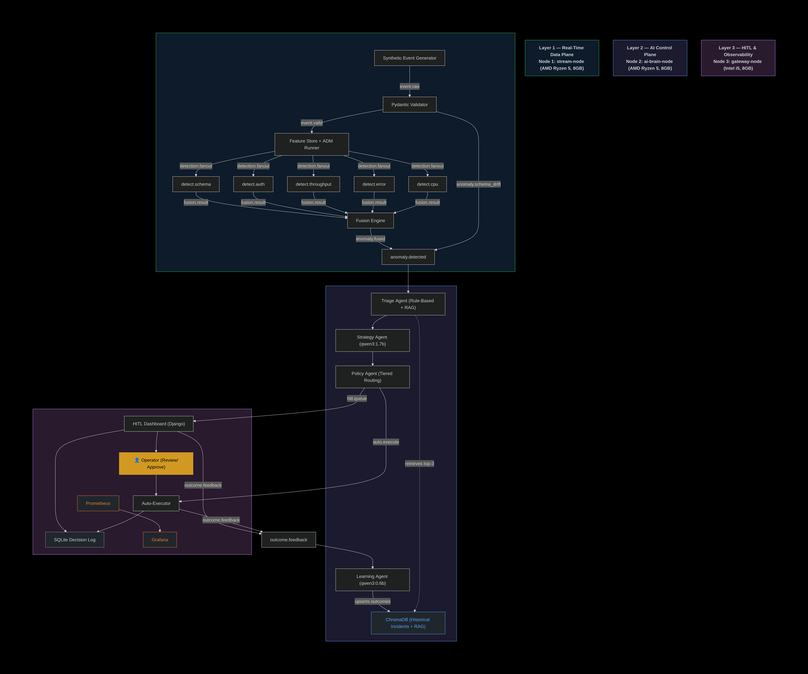
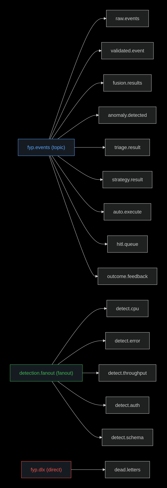

# Distributed Multi-Agent Coordination for Self-Healing Data Pipelines

### A Human-in-the-Loop Approach on Commodity Hardware

<div align="center">

**Department of CS&IT, UET Peshawar — Nowshera Campus**

**Team:** Muhammad Adeel (23JZBCS0226) &nbsp;•&nbsp; Muhammad Asim (23JZBCS0227)

**Supervisor:** Dr. Laeeq Ahmad — HEC Approved PhD Supervisor

</div>

---

## Table of Contents

- [What This Project Does](#what-this-project-does)
- [Architecture at a Glance](#architecture-at-a-glance)
- [System Architecture Diagram](#system-architecture-diagram)
- [RabbitMQ Topology Diagram](#rabbitmq-topology-diagram)
- [Repository Structure](#repository-structure)
- [Selected Models](#selected-models)
- [Evaluation Dataset](#evaluation-dataset--1950-events)
- [Cluster Infrastructure](#cluster-infrastructure)
- [Primary Research Metrics](#primary-research-metrics)
- [RabbitMQ Topology (Detailed)](#rabbitmq-topology-detailed)
- [Getting Started](#getting-started)
- [Git Branch Strategy](#git-branch-strategy)

---

## What This Project Does

This system detects anomalies in a distributed streaming data pipeline and autonomously decides whether to fix them or escalate them to a human operator.

It runs on **three physical commodity machines** with **no cloud or GPU dependency**. When an anomaly is detected — a CPU spike, error rate surge, authentication flood, throughput drop, or schema drift — the pipeline responds as follows:

1. **Five detectors** analyze the anomaly independently.
2. A **Fusion Engine** correlates the signals into a single enriched incident.
3. A chain of **four AI agents**:
   - Classifies the incident
   - Reasons about the best response using a local LLM
   - Routes it to either automatic execution or a human review dashboard
   - Learns from the outcome to improve future decisions

### Research Goal

To prove that this class of self-healing agentic system — previously only described theoretically in the AIOps literature — can be built and benchmarked on real commodity hardware, with measurable improvements in **Mean Time To Acknowledge (MTTA)** and **Mean Time To Remediate (MTTR)** over a static threshold-only baseline.

---

## Architecture at a Glance

```
Node 1 — stream-node                         Layer 1: Real-Time Data Plane
  SEG → Pydantic Validator → Feature Store
    → 5 Detectors (detection.fanout exchange)
    → Fusion Engine (3s correlation window, compound incident merging)
    → anomaly.detected queue

Node 2 — ai-brain-node                       Layer 2: AI Control Plane
  Triage Agent (rule-based + RAG)
    → Strategy Agent (qwen3:1.7b via Ollama)
    → Policy Agent (tiered routing)
    → Learning Agent (qwen3:0.6b via Ollama)
  ChromaDB (RAG — Historical Incidents)

Node 3 — gateway-node                        Layer 3: HITL & Observability
  Django HITL Dashboard (Approve/Reject/Modify) → Auto-Execution Engine → SQLite Decision Log
  Prometheus + Grafana (scraping all 3 nodes)
```

---

## System Architecture Diagram



---

## RabbitMQ Topology Diagram



---

## Repository Structure

```text
fyp-pipeline/
│
├── layer1/                        — Node 1: stream-node
│   ├── seg/                       — Synthetic Event Generator (corpus + live replay mode)
│   │   └── config/seg_config.json — Replay speed, seed, event counts
│   ├── validator/                 — Pydantic schema enforcement + schema drift router
│   ├── feature_store/             — Rolling window feature computation (10 features)
│   ├── adm/
│   │   ├── detectors/             — 5 detectors: Z-Score, Moving Average, Rate-gate + RF,
│   │   │                            Z-Score (CPU), PSI + Shift Marker
│   │   └── models/                — Trained .pkl files (git-ignored)
│   ├── fusion_engine/             — Signal correlation, confidence scoring, compound merging
│   └── rabbitmq/                  — One-time topology setup script
│
├── layer2/                        — Node 2: ai-brain-node
│   ├── agents/                    — Triage, Strategy, Policy, Learning agents
│   ├── chromadb_utils/            — RAG client, query (3-step protocol), upsert
│   ├── ollama/                    — Local Ollama HTTP client
│   ├── rabbitmq/                  — Remote RabbitMQ connection helper
│   ├── prompts/                   — System prompts for qwen3:1.7b and qwen3:0.6b
│   ├── config/                    — EMA confidence threshold (threshold_config.json)
│   ├── chromadb_data/             — Persistent vector store (git-ignored)
│   ├── User_Guide.md              — Layer-2 startup and troubleshooting
│   └── README.md
│
├── layer3/                        — Node 3: gateway-node
│   ├── dashboard/                 — Django HITL project (queue, incident detail, SSE)
│   │   └── hitl/templates/        — queue.html, incident_detail.html, modify.html, auto_monitor.html
│   ├── auto_executor/             — Consumes auto.execute, publishes outcome.feedback
│   ├── sqlite_logger/             — Centralised decision log writer
│   ├── grafana/                   — Agent Pipeline & Fusion Engine dashboard JSON model
│   ├── rabbitmq/                  — Remote RabbitMQ connection helper
│   ├── User_Guide.md              — Layer-3 startup and troubleshooting
│   └── README.md
│
├── evaluation/                    — Dataset generation, baseline, metrics, kappa
├── Phase_0_Infrastructure/        — Phase 0 cluster setup and LLM benchmark (COMPLETE)
│   ├── scripts/                   — Benchmark runner scripts (3 models x 3 variants)
│   ├── prompts/                   — simple, medium, strict, stricter prompt sets
│   ├── results/summary/           — Aggregate stats JSON files (per run)
│   └── static/                    — system_architecture.png
├── datasets/                      — Download instructions: NAB, Loghub HDFS, KDD99
├── docs/                          — Architecture diagrams, system design documents
├── USER_GUIDE.md                  — Full pipeline operation guide (project root)
└── README.md
```

---

## Selected Models

| Agent | Model | Selection Basis |
|:------|:------|:----------------|
| **Strategy Agent** | `qwen3:1.7b` via Ollama | 90% schema validity on 30 strict adversarial prompts. Only model meeting the production viability hard constraint. All 3 failures traced to fixable engineering issues. |
| **Learning Agent** | `qwen3:0.6b` via Ollama | Sub-1B RAM budget for Node 2. Formal quality evaluation in Phase 2. |
| **Triage Agent** | None — rule-based + RAG | No LLM needed. ChromaDB retrieval only. Keeps latency within 3s SLA. |
| **Policy Agent** | None — pure Python | Deterministic routing table. Zero inference latency. |

> Full evaluation details → [`Phase_0_Infrastructure/README.md`](Phase_0_Infrastructure/README.md)

---

## Evaluation Dataset — 1,950 Events

| Category | Count |
|:---------|------:|
| Normal events (baseline healthy traffic) | 1,000 |
| CPU / Memory Spike | 200 |
| Error Rate Surge (5xx) | 200 |
| Throughput Drop / Silent Crash | 200 |
| Auth Failure Flood | 200 |
| Schema Change — 3 sub-types (missing fields, type mutations, value shifts) | 150 |
| **TOTAL** | **1,950** |

> Ground truth labels are stored separately in `evaluation/labels.csv` and are **never** visible to the pipeline during evaluation runs.

---

## Cluster Infrastructure

| Node | Hostname | OS | CPU | RAM | Primary Services |
|:-----|:---------|:---|:----|:----|:------------------|
| Node 1 | `stream-node` | Ubuntu 24.04 Desktop | AMD Ryzen 5 | 8 GB | RabbitMQ, Layer 1, Datasets |
| Node 2 | `ai-brain-node` | Ubuntu 24.04 Server | AMD Ryzen 5 | 8 GB | Ollama, ChromaDB, 4 Agents |
| Node 3 | `gateway-node` | Ubuntu 24.04 Desktop | Intel Core i5 | 8 GB | Prometheus, Grafana, HITL |

> All three nodes communicate exclusively via **hostnames** — no hardcoded IPs in any config or application code. When moving to a new LAN, only `/etc/hosts` on each node needs updating.

### Service Access URLs

| Service | URL |
|:--------|:----|
| RabbitMQ Management UI | `http://stream-node:15672` |
| Ollama API | `http://ai-brain-node:11434` |
| Prometheus | `http://gateway-node:9090` |
| Grafana | `http://gateway-node:3000` |
| HITL Dashboard | `http://gateway-node:8000` |

---

## Primary Research Metrics

| Metric | Symbol | Target |
|:-------|:-------|:-------|
| Mean Time To Acknowledge | MTTA | Median < 33 seconds (includes 3s Fusion Engine window) |
| Mean Time To Remediate | MTTR | Measurably lower than 60s static baseline |
| False Escalation Rate | FER | < 30% |
| False Automation Rate | FAR | < 5% (safety-critical upper bound) |
| Risk Tier Accuracy | RTA | ≥ 75% |
| Schema Validity Rate | SVR | ≥ 95% in production |
| Fusion Suppression Rate | FSR | Higher is better — measures false positive reduction |
| Compound Detection Rate | CDR | Measures multi-signal incident merging accuracy |

---

## RabbitMQ Topology (Detailed)

| Exchange | Type | Queue | Routing Key | Layer | Consumed By |
|:---------|:-----|:------|:-------------|:------|:------------|
| `fyp.events` | Topic | `raw.events` | `event.raw` | L1 → L1 | Validator |
| `fyp.events` | Topic | `validated.event` | `event.valid` | L1 → L1 | ADM Runner |
| `detection.fanout` | Fanout | `detect.cpu` | `""` | L1 → L1 | CPU Spike Detector |
| `detection.fanout` | Fanout | `detect.error` | `""` | L1 → L1 | Error Rate Detector |
| `detection.fanout` | Fanout | `detect.throughput` | `""` | L1 → L1 | Throughput Detector |
| `detection.fanout` | Fanout | `detect.auth` | `""` | L1 → L1 | Auth Flood Detector |
| `detection.fanout` | Fanout | `detect.schema` | `""` | L1 → L1 | Schema Drift Detector |
| `fyp.events` | Topic | `fusion.results` | `fusion.result` | L1 → L1 | Fusion Engine |
| `fyp.events` | Topic | `anomaly.detected` | `anomaly.#` | L1 → L2 | Triage Agent |
| `fyp.events` | Topic | `triage.result` | `triage.result` | L2 → L2 | Strategy Agent |
| `fyp.events` | Topic | `strategy.result` | `strategy.result` | L2 → L2 | Policy Agent |
| `fyp.events` | Topic | `auto.execute` | `auto.execute` | L2 → L3 | Auto-Executor |
| `fyp.events` | Topic | `hitl.queue` | `hitl.queue` | L2 → L3 | HITL Dashboard |
| `fyp.events` | Topic | `outcome.feedback` | `outcome.feedback` | L3 → L2 | Learning Agent |
| `fyp.dlx` | Direct | `dead.letters` | `dead` | All | Manual review |

---

## Getting Started

| Step | Component | Guide |
|:----:|:----------|:------|
| 0 | Full pipeline operation | `USER_GUIDE.md` (project root) |
| 1 | Cluster infrastructure | `Phase_0_Infrastructure/User_Guide.md` |
| 2 | Layer 1 (Node 1) | `layer1/README.md` → `layer1/User_Guide.md` |
| 3 | Layer 2 (Node 2) | `layer2/README.md` → `layer2/User_Guide.md` |
| 4 | Layer 3 (Node 3) | `layer3/README.md` → `layer3/User_Guide.md` |
| 5 | Evaluation | `evaluation/README.md` |

---

## Git Branch Strategy

| Branch | Purpose |
|:-------|:--------|
| `main` | Production-quality code only. Tagged at each phase milestone. Never commit broken code. |
| `develop` | Integration branch. Feature branches merge here first after end-to-end demo passes. |
| `feature/*` | One branch per component. Examples: `feature/seg`, `feature/fusion-engine`, `feature/triage-agent`. |