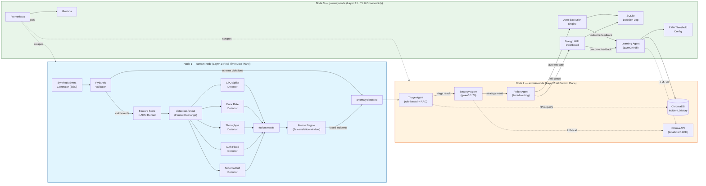
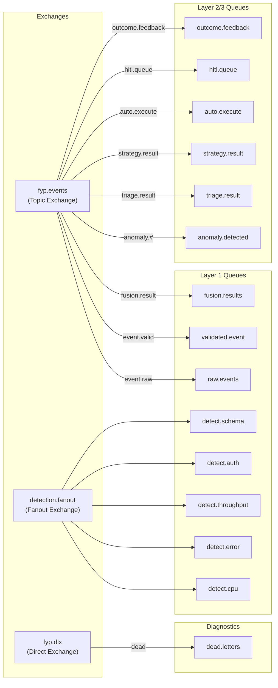

<div align="center">

# Distributed Multi-Agent Coordination for Self-Healing Data Pipelines

### A Human-in-the-Loop Approach on Commodity Hardware

**Department of CS&IT, UET Peshawar — Nowshera Campus**

**Team:** Muhammad Adeel (23JZBCS0226) &nbsp;•&nbsp; Muhammad Asim (23JZBCS0227)

**Supervisor:** Dr. Laeeq Ahmad — HEC Approved PhD Supervisor

</div>

---

## Table of Contents

- [What This Project Does](#what-this-project-does)
- [Architecture at a Glance](#architecture-at-a-glance)
- [System Architecture Diagram](#system-architecture-diagram)
- [RabbitMQ Topology Diagram](#rabbitmq-topology-diagram)
- [Repository Structure](#repository-structure)
- [Selected Models](#selected-models)
- [Evaluation Dataset](#evaluation-dataset--1950-events)
- [Cluster Infrastructure](#cluster-infrastructure)
- [Primary Research Metrics](#primary-research-metrics)
- [RabbitMQ Topology (Detailed)](#rabbitmq-topology-detailed)
- [Getting Started](#getting-started)
- [Git Branch Strategy](#git-branch-strategy)

---

## What This Project Does

This system detects anomalies within a distributed streaming data pipeline and autonomously determines whether each anomaly should be remediated automatically or escalated to a human operator.

The system operates on **three physical commodity machines**, with **no dependency on cloud infrastructure or GPU acceleration**. When an anomaly is detected — such as a CPU spike, an error-rate surge, an authentication flood, a throughput drop, or schema drift — the pipeline responds through the following sequence:

1. **Five specialised detectors** analyse the anomaly independently.
2. A **Fusion Engine** correlates the detector signals into a single enriched incident, suppressing duplicate alerts and identifying compound anomalies.
3. A coordinated chain of **four AI agents**:
   - Classifies the incident and retrieves relevant historical context.
   - Reasons about the optimal remediation strategy using a local, quantised LLM.
   - Routes the proposed action to either automatic execution or a human-review dashboard.
   - Learns from the eventual outcome to refine future decision-making.

### Research Objective

This project empirically evaluates whether a **policy-bounded, multi-agent self-healing framework** — a concept previously proposed largely at the architectural level — can be implemented, deployed, and benchmarked on commodity hardware, yielding measurable improvements in detection quality, reasoning reliability, and operational safety relative to a static, threshold-only baseline.

---

## Architecture at a Glance

```
Node 1 — stream-node                         Layer 1: Real-Time Data Plane
  SEG → Pydantic Validator → Feature Store
    → 5 Detectors (detection.fanout exchange)
    → Fusion Engine (3s correlation window, compound incident merging)
    → anomaly.detected queue

Node 2 — ai-brain-node                       Layer 2: AI Control Plane
  Triage Agent (rule-based + RAG)
    → Strategy Agent (qwen3:1.7b via Ollama)
    → Policy Agent (tiered routing)
    → Learning Agent (qwen3:0.6b via Ollama)
  ChromaDB (RAG — Historical Incidents)

Node 3 — gateway-node                        Layer 3: HITL & Observability
  Django HITL Dashboard (Approve/Reject/Modify)
    → Auto-Execution Engine
    → SQLite Decision Log
  Prometheus + Grafana (scraping all 3 nodes)
```

---

## System Architecture Diagram



> **Diagram note:** Each node (SEG, detectors, agents, dashboard, etc.) is declared exactly once, inside the subgraph representing its home layer. All edges that cross node boundaries — for example, `Policy Agent → Auto-Execution Engine` or `Learning Agent → Ollama` — are declared after the three subgraphs are closed. This avoids a common Mermaid rendering fault in which a node referenced inside two different subgraph blocks gets pulled into the wrong cluster, and keeps the three-layer grouping visually accurate.

---

## RabbitMQ Topology Diagram



> **Diagram note:** The five fanout bindings from `detection.fanout` (`E2`) carry no routing key by design — a fanout exchange delivers to every bound queue unconditionally — so the previous empty-string edge labels (`-->|""|`) have been removed in favour of plain, unlabeled arrows for cleaner rendering.

---

## Repository Structure

```text
fyp-pipeline/
│
├── layer1/                        — Node 1: stream-node
│   ├── seg/                       — Synthetic Event Generator (corpus + live replay mode)
│   │   └── config/seg_config.json — Replay speed, seed, event counts
│   ├── validator/                 — Pydantic schema enforcement + schema drift router
│   ├── feature_store/             — Rolling window feature computation (10 features)
│   ├── adm/
│   │   ├── detectors/             — 5 detectors: Z-Score, Moving Average, Rate-gate + RF,
│   │   │                            Z-Score (CPU), PSI + Shift Marker
│   │   └── models/                — Trained .pkl files (git-ignored)
│   ├── fusion_engine/             — Signal correlation, confidence scoring, compound merging
│   └── rabbitmq/                  — One-time topology setup script
│
├── layer2/                        — Node 2: ai-brain-node
│   ├── agents/                    — Triage, Strategy, Policy, Learning agents
│   ├── chromadb_utils/            — RAG client, query (3-step protocol), upsert
│   ├── ollama/                    — Local Ollama HTTP client
│   ├── rabbitmq/                  — Remote RabbitMQ connection helper
│   ├── utils/                     — Shared file logger and utility helpers
│   ├── logs/                      — Append-only JSONL runtime logs (git-ignored)
│   ├── prompts/                   — System prompts for qwen3:1.7b and qwen3:0.6b
│   ├── config/                    — EMA confidence threshold (threshold_config.json)
│   ├── chromadb_data/             — Persistent vector store (git-ignored)
│   ├── User_Guide.md              — Layer-2 startup and troubleshooting
│   └── README.md
│
├── layer3/                        — Node 3: gateway-node
│   ├── dashboard/                 — Django HITL project (queue, incident detail, action views)
│   │   └── hitl/templates/        — queue.html, incident_detail.html, modify.html, auto_monitor.html
│   ├── auto_executor/             — Consumes auto.execute, publishes outcome.feedback
│   ├── sqlite_logger/             — Centralised decision log writer
│   ├── grafana/                   — Agent Pipeline & Fusion Engine dashboard JSON model
│   ├── rabbitmq/                  — Remote RabbitMQ connection helper
│   ├── User_Guide.md              — Layer-3 startup and troubleshooting
│   └── README.md
│
├── evaluation/                    — Dataset generation, baseline, offline metrics, kappa
├── Phase_0_Infrastructure/        — Phase 0 cluster setup and LLM benchmark (COMPLETE)
│   ├── scripts/                   — Benchmark runner scripts (3 models x 3 variants)
│   ├── prompts/                   — simple, medium, strict, stricter prompt sets
│   ├── results/summary/           — Aggregate stats JSON files (per run)
│   └── static/                    — system_architecture.png
├── datasets/                      — Download instructions: NAB, Loghub HDFS, KDD99
├── docs/                          — Architecture diagrams, system design documents
├── USER_GUIDE.md                  — Full pipeline operation guide (project root)
└── README.md
```

---

## Selected Models

| Agent | Model | Selection Basis |
|:------|:------|:----------------|
| **Strategy Agent** | `qwen3:1.7b` via Ollama | Achieved **90% schema validity** across 30 strict adversarial prompts — the only model to satisfy the production-viability hard constraint. All three observed failures were traced to fixable engineering issues. |
| **Learning Agent** | `qwen3:0.6b` via Ollama | Selected to remain within a sub-1B-parameter budget for Node 2 RAM compliance. Formal quality evaluation is planned. |
| **Triage Agent** | None — rule-based + RAG | Requires no LLM; relies solely on ChromaDB retrieval, maintaining sub-3-second latency. |
| **Policy Agent** | None — pure Python | Deterministic routing table with zero inference latency. |

> Full model evaluation details are available in [`Phase_0_Infrastructure/README.md`](Phase_0_Infrastructure/README.md).

---

## Evaluation Dataset — 1,950 Events

| Category | Count |
|:---------|------:|
| Normal events (baseline healthy traffic) | 1,000 |
| CPU / Memory Spike | 200 |
| Error Rate Surge (5xx) | 200 |
| Throughput Drop / Silent Crash | 200 |
| Auth Failure Flood | 200 |
| Schema Change — 3 sub-types (missing fields, type mutations, value shifts) | 150 |
| **TOTAL** | **1,950** |

> Ground-truth labels are stored separately in `evaluation/labels.csv` and are **never** exposed to the pipeline during evaluation runs.

---

## Cluster Infrastructure

| Node | Hostname | OS | CPU | RAM | Primary Services |
|:-----|:---------|:---|:----|:----|:------------------|
| Node 1 | `stream-node` | Ubuntu 24.04 Desktop | AMD Ryzen 5 | 8 GB | RabbitMQ, Layer 1, Datasets |
| Node 2 | `ai-brain-node` | Ubuntu 24.04 Server | AMD Ryzen 5 | 8 GB | Ollama, ChromaDB, 4 Agents |
| Node 3 | `gateway-node` | Ubuntu 24.04 Desktop | Intel Core i5 | 8 GB | Prometheus, Grafana, HITL |

> All nodes communicate exclusively via **hostnames**; no hardcoded IP addresses are used in configuration or application code. When migrating to a new LAN, only the `/etc/hosts` file on each node requires updating.

### Service Access URLs

| Service | URL |
|:--------|:----|
| RabbitMQ Management UI | `http://stream-node:15672` |
| Ollama API | `http://ai-brain-node:11434` |
| Prometheus | `http://gateway-node:9090` |
| Grafana | `http://gateway-node:3000` |
| HITL Dashboard | `http://gateway-node:8000` |

---

## Primary Research Metrics

The evaluation is centred on **control-plane reasoning quality**, **fusion accuracy**, and **decision safety**, alongside standard hardware-level benchmarks.

| Metric | Symbol | Definition | Target |
|:-------|:-------|:-----------|:-------|
| Control-Plane Latency | CPL | Average time spent in Triage + Strategy + Policy per incident | < 30 s |
| Schema Validity Rate | SVR | Valid seven-field JSON responses / total responses (excluding timeouts) | ≥ 95% production |
| Fusion Suppression Rate | FSR | Suppressed duplicate/normal events / (published + suppressed) | Higher is better |
| Compound Detection Rate | CDR | Compound fusion events / total published fusion events | Measured |
| Auto-Execution Success Rate | — | Successful automatic remediations / attempted automatic remediations | ≥ 95% |
| False Escalation Rate | FER | Low-risk ground-truth incidents routed to HITL / total low-risk incidents | < 30% (offline) |
| False Automation Rate | FAR | High-risk ground-truth incidents routed to AUTO / total high-risk incidents | < 5% (offline) |
| Risk Tier Accuracy | RTA | Correct risk-tier assignments / total incidents | ≥ 75% |
| MTTA / MTTR (control-plane definition) | MTTA / MTTR | `policy_timestamp − triage_timestamp` / `outcome_feedback_time − triage_timestamp` | Measured |

> **Note on MTTA/MTTR:**
> The conventional end-to-end MTTA/MTTR metrics are sensitive to queue backlog when the pipeline operates in batch mode. For this project, MTTA and MTTR are therefore defined as **control-plane latencies**, isolating AI reasoning and routing time from asynchronous queue delays. FER and FAR are computed offline after each run by joining decision records with ground-truth labels.

---

## RabbitMQ Topology (Detailed)

| Exchange | Type | Queue | Routing Key | Layer | Consumed By |
|:---------|:-----|:------|:-------------|:------|:------------|
| `fyp.events` | Topic | `raw.events` | `event.raw` | L1 → L1 | Validator |
| `fyp.events` | Topic | `validated.event` | `event.valid` | L1 → L1 | ADM Runner |
| `detection.fanout` | Fanout | `detect.cpu` | `""` | L1 → L1 | CPU Spike Detector |
| `detection.fanout` | Fanout | `detect.error` | `""` | L1 → L1 | Error Rate Detector |
| `detection.fanout` | Fanout | `detect.throughput` | `""` | L1 → L1 | Throughput Detector |
| `detection.fanout` | Fanout | `detect.auth` | `""` | L1 → L1 | Auth Flood Detector |
| `detection.fanout` | Fanout | `detect.schema` | `""` | L1 → L1 | Schema Drift Detector |
| `fyp.events` | Topic | `fusion.results` | `fusion.result` | L1 → L1 | Fusion Engine |
| `fyp.events` | Topic | `anomaly.detected` | `anomaly.#` | L1 → L2 | Triage Agent |
| `fyp.events` | Topic | `triage.result` | `triage.result` | L2 → L2 | Strategy Agent |
| `fyp.events` | Topic | `strategy.result` | `strategy.result` | L2 → L2 | Policy Agent |
| `fyp.events` | Topic | `auto.execute` | `auto.execute` | L2 → L3 | Auto-Executor |
| `fyp.events` | Topic | `hitl.queue` | `hitl.queue` | L2 → L3 | HITL Dashboard |
| `fyp.events` | Topic | `outcome.feedback` | `outcome.feedback` | L3 → L2 | Learning Agent |
| `fyp.dlx` | Direct | `dead.letters` | `dead` | All | Manual review |

---

## Persistent Logging and Observability

All Layer 2 agents write append-only JSONL logs to `layer2/logs/`, ensuring that cumulative agent-level counts remain recoverable across restarts, even when the pipeline is executed across multiple sessions. Grafana dashboards consume Prometheus metrics for live monitoring, while file logs, SQLite, and ChromaDB together provide the authoritative historical record.

---

## Getting Started

| Step | Component | Guide |
|:----:|:----------|:------|
| 0 | Full pipeline operation | `USER_GUIDE.md` (project root) |
| 1 | Cluster infrastructure | `Phase_0_Infrastructure/User_Guide.md` |
| 2 | Layer 1 (Node 1) | `layer1/README.md` → `layer1/User_Guide.md` |
| 3 | Layer 2 (Node 2) | `layer2/README.md` → `layer2/User_Guide.md` |
| 4 | Layer 3 (Node 3) | `layer3/README.md` → `layer3/User_Guide.md` |
| 5 | Evaluation | `evaluation/README.md` |

---

## Git Branch Strategy

| Branch | Purpose |
|:-------|:--------|
| `main` | Production-quality code only. Tagged at each phase milestone. Broken code is never committed. |
| `develop` | Integration branch. Feature branches merge here first, after the end-to-end demo passes. |
| `feature/*` | One branch per component — for example, `feature/seg`, `feature/fusion-engine`, `feature/triage-agent`. |