# Distributed Multi-Agent Coordination for Self-Healing Data Pipelines:
## A Human-in-the-Loop Approach on Commodity Hardware

> An experimental, policy-bounded research prototype for coordinating detection,
> diagnosis, remediation planning, human oversight, and learning across three
> commodity-hardware nodes.

## Project summary

Modern data pipelines can suffer resource spikes, error-rate surges, throughput
degradation, authentication-failure floods, schema drift, and structural data
violations. Monitoring often detects these symptoms, but diagnosis, remediation
recommendation, execution, human escalation, and post-incident learning remain
separate activities.

This project investigates whether those responsibilities can be coordinated by a
distributed, heterogeneous multi-agent architecture on commodity hardware while
retaining a deterministic safety boundary around automatic action. It is a
research prototype, not a claim of universal or production-ready self-healing.

The authoritative historical Wi-Fi baseline is the cold-memory run
**wifi_cold_20260913_041045**, performed with frozen implementation commit
**377250945c253b9c9da233d84391d1458d181fc9**. The matched proposed-system Ethernet
reproduction **ethernet_cold_20261002_023108** is now complete.

## Research problem and proposed solution

The problem is not merely anomaly detection. It is safe coordination after an
incident is found: deciding what an incident means, proposing an appropriate
response, preventing policy-disallowed proposals from entering AUTO, involving a
human when needed, and preserving the outcome for future adaptation.

The proposed solution combines:

- statistical and deterministic incident detection;
- RabbitMQ event-driven communication;
- deterministic Triage with retrieval-assisted context;
- local LLM remediation planning only in Strategy;
- deterministic Policy enforcement;
- controlled simulated AUTO handling;
- persistent human-in-the-loop escalation;
- feedback-driven ChromaDB memory and EMA threshold adaptation; and
- Prometheus/Grafana observability across the deployment.

This division is intentional: Triage, Policy, Learning, Layer 1 detectors,
execution control, and the HITL workflow are not LLM agents. **Only Strategy is
LLM-backed**, using local **qwen3:1.7b** inference through Ollama.

## Literature-derived design rationale

The [Literature Review](docs/Literature_Review.md#8-literature-derived-design-requirements)
connects streaming timing constraints, governed automation, human oversight,
asynchronous communication, and feedback evaluation to six design requirements.
Those requirements motivate the three layers: Layer 1 keeps fast statistical
detection independent of generation; Layer 2 separates contextual planning from
deterministic authorization; Layer 3 handles execution, persistent human
decisions, feedback, and observability. The selected tools and three-node layout
are engineering choices, not uniquely mandated by the literature.

## Safety and authority model

~~~text
Strategy proposes remediation.
Policy authorizes or escalates.
Layer 3 handles the authorized AUTO path or presents the HITL path.
~~~

The LLM never receives unrestricted execution authority. Strategy output must
satisfy a seven-field structured contract, an allowed action vocabulary, exactly
three distinct actions, and the severity-to-risk-tier constraint. A bounded
regeneration permits no more than two model-generation attempts. Deterministic
validation and Policy then fail closed: malformed, invalid, policy-disallowed, high-risk,
or insufficient-confidence proposals route to HITL rather than AUTO.

## Full-system architecture

~~~mermaid
flowchart LR
    classDef l1 fill:#0c4a6e,color:#fff,stroke:#0369a1
    classDef l2 fill:#7c2d12,color:#fff,stroke:#c2410c
    classDef l3 fill:#14532d,color:#fff,stroke:#166534
    classDef queue fill:#334155,color:#fff,stroke:#475569
    classDef store fill:#312e81,color:#fff,stroke:#4f46e5
    classDef obs fill:#5b215f,color:#fff,stroke:#a21caf

    subgraph N1["Node 1 — stream-node Layer 1 — Real-Time Statistical Data Plane"]
        direction TB
        SEG["Synthetic Event Generator / replay"]
        RAW[("RabbitMQ raw.events")]
        VAL["Pydantic Validator"]
        VQ[("RabbitMQ validated.event")]
        ADM["ADM Runner"]
        FS["Feature Store in-process enrichment"]
        FAN{{"detection.fanout fanout exchange"}}
        CPU["CPU / memory detector detect.cpu"]
        ERR["Error-rate detector detect.error"]
        THR["Throughput detector detect.throughput"]
        AUTH["Auth-flood detector detect.auth"]
        SCH["Schema-drift detector detect.schema"]
        FQ[("RabbitMQ fusion.results")]
        FUS["Fusion Engine"]
        BYP["Structural schema bypass router"]
        AD[("RabbitMQ anomaly.detected")]
        N1M["Layer 1 / node exporters RabbitMQ metrics :15692"]
        SEG -->|"event.raw"| RAW --> VAL
        VAL -->|"event.valid"| VQ --> ADM
        ADM -->|"local call"| FS
        FS -->|"eligible enriched event via ADM"| FAN
        FAN --> CPU & ERR & THR & AUTH & SCH
        CPU & ERR & THR & AUTH & SCH -->|"fusion.result"| FQ
        FQ --> FUS -->|"anomaly.fused"| AD
        VAL -->|"structural violation"| BYP
        BYP -->|"anomaly.schema_drift"| AD
    end

    subgraph N2["Node 2 — ai-brain-node Layer 2 — AI Control Plane"]
        direction TB
        TRI["Triage deterministic protocol + retrieval"]
        STR["Strategy qwen3:1.7b structured proposal"]
        POL["Policy deterministic authority boundary"]
        LEARN["Learning deterministic feedback + EMA"]
        OLL["Ollama"]
        CHR[("ChromaDB")]
        N2M["Layer 2 / node exporters"]
        TRI -->|"RabbitMQ: triage.result"| STR
        STR -->|"RabbitMQ: strategy.result"| POL
        TRI <-->|"query / context"| CHR
        STR <-->|"local inference"| OLL
        LEARN -->|"upsert"| CHR
        LEARN -->|"persisted threshold"| POL
    end

    subgraph N3["Node 3 — gateway-node Layer 3 — Execution, Human Oversight & Observability Layer"]
        direction TB
        AUTO["Auto Executor controlled simulated handling"]
        HITL["Django HITL Approve / Reject / Modify"]
        DB[("SQLite decision audit and persistent HITL state")]
        PROM["Prometheus"]
        GRAF["Grafana"]
        N3M["Layer 3 / node exporters"]
        HITL --> DB
        AUTO --> DB
        PROM -. "query results" .-> GRAF
    end

    AD -->|"RabbitMQ: anomaly.detected"| TRI
    POL -->|"RabbitMQ: auto.execute"| AUTO
    POL -->|"RabbitMQ: hitl.queue"| HITL
    AUTO -->|"RabbitMQ: outcome.feedback"| LEARN
    HITL -->|"RabbitMQ: outcome.feedback"| LEARN
    N1M -. "scraped metrics" .-> PROM
    N2M -. "scraped metrics" .-> PROM
    N3M -. "scraped metrics" .-> PROM
    class SEG,VAL,ADM,FS,CPU,ERR,THR,AUTH,SCH,FUS,BYP l1
    class TRI,STR,POL,LEARN,OLL l2
    class AUTO,HITL l3
    class RAW,VQ,FAN,FQ,AD queue
    class CHR,DB store
    class PROM,GRAF,N1M,N2M,N3M obs
~~~

The system is physically distributed but uses one consistent message backbone.
All queue handoffs shown above pass through RabbitMQ on stream-node; only local
Feature Store, inference, retrieval, and persistence operations are direct calls.
Dotted arrows carry observational data, not execution commands.
Structural schema violations bypass Feature Store/Fusion and enter
**anomaly.detected** directly. Valid events are enriched, analysed by five
specialised detectors, then correlated by Fusion before moving to Layer 2.

## Commodity-hardware deployment

| Node | Platform | Primary responsibilities |
|---|---|---|
| **Node 1 — stream-node** | Ubuntu 24.04 Desktop; AMD Ryzen 5; 8 GB RAM | Layer 1, RabbitMQ, corpus replay |
| **Node 2 — ai-brain-node** | Ubuntu 24.04 Server; AMD Ryzen 5; 8 GB RAM | Layer 2, CPU-only Ollama inference, ChromaDB |
| **Node 3 — gateway-node** | Ubuntu 24.04 Desktop; Intel Core i5; 8 GB RAM | Layer 3, Django HITL, Auto Executor, Prometheus, Grafana |

The deployment demonstrates a distributed research architecture on commodity
hardware. It is not evidence of universal scalability or a production capacity
claim.

## How an incident moves through the system

1. **Generate and validate.** SEG replays the synthetic corpus. Pydantic
   validation accepts structurally valid events and routes structural violations
   through the schema bypass.
2. **Enrich and detect.** The Feature Store performs component-level
   calibration and computes rolling features. Five detectors independently
   assess each fusion-eligible event.
3. **Fuse.** Fusion applies a 3.0-second primary correlation window and a
   0.75-second recovery window (approximately 3.75 seconds maximum) to suppress,
   correlate, and publish incidents. Fast Path marks priority without early
   finalization; event ID/model identity checks protect against duplicates.
4. **Triage.** A deterministic protocol mapping normalises incident context and
   retrieves related history from ChromaDB.
5. **Plan.** Strategy requests a local qwen3:1.7b structured proposal through
   Ollama; it is the only LLM-backed stage.
6. **Authorize.** Policy checks Strategy validation status, risk, confidence,
   and actions, then selects AUTO or HITL under deterministic rules.
7. **Handle.** AUTO messages enter controlled simulated execution. HITL
   messages are persisted for approve, reject, or modify decisions.
8. **Learn.** Both paths emit outcome.feedback. Learning stores feedback in
   ChromaDB and updates the Policy confidence threshold through an EMA.
9. **Observe.** Prometheus collects application and infrastructure metrics;
   Grafana visualises them without participating in decisions.

## Technology stack

| Area | Technology |
|---|---|
| Language | Python |
| Messaging | RabbitMQ |
| Validation | Pydantic |
| Detection | Python statistical/deterministic rules with NumPy |
| Local LLM runtime | Ollama |
| Active Strategy model | qwen3:1.7b |
| Retrieval memory | ChromaDB with sentence-transformer embeddings |
| HITL application | Django and SQLite/Django ORM |
| Metrics | Prometheus Python client |
| Monitoring / dashboards | Prometheus and Grafana |
| Operating system | Ubuntu 24.04 |
| Source control | Git |

Historical Random Forest and Isolation Forest experiments are retained under
Layer 1 historical evaluation material only; they are not active runtime
detectors.

## Layer summaries

### Layer 1 — Real-Time Statistical Data Plane

Layer 1 converts the generated event stream into incidents. It contains the
Pydantic Validator, Schema Drift Router, Feature Store, ADM Runner, CPU/memory,
error-rate, throughput, authentication-flood, and schema-drift detectors, plus
Fusion. The first 20 accepted events per component provide cold-state
calibration; structural violations never enter this path. The primary Fusion
window is 3.0 seconds with a 0.75-second recovery window.

Read [Layer 1 overview](layer1/README.md) and the
[detailed component log](layer1/docs/layer1_component_log.md).

### Layer 2 — AI Control Plane

Triage uses deterministic protocol mapping plus Chroma retrieval. Strategy
uses qwen3:1.7b through Ollama to produce seven fields and three distinct
allowed actions. The severity/risk-tier relationship is dynamically constrained,
and at most one bounded validation retry allows two generation attempts total.
Policy is the deterministic, fail-closed safety boundary. Learning is
deterministic: it processes feedback, writes Chroma history, and persists an
EMA confidence threshold.

Read [Layer 2 overview](layer2/README.md) and the
[detailed component log](layer2/docs/layer2_component_log.md).

### Layer 3 — Execution, Human Oversight & Observability Layer

Layer 3 performs authorised AUTO handling, operates Django-based persistent
HITL review, records decisions, emits feedback, and centralises observability.
A RabbitMQ **HITL Queue Backlog** is unconsumed broker work; **HITL Pending** is
the database-backed count of persisted incidents still awaiting a human
decision. They are intentionally different measures.

Read [Layer 3 overview](layer3/README.md) and the
[detailed component log](layer3/docs/layer3_component_log.md).

## Experimental methodology

The authoritative Wi-Fi evaluation began from a cold state: Layer 1 calibration
baselines were cleared, Layer 2 Chroma memory was cleared, the EMA threshold was
reset, RabbitMQ queues and HITL state were empty, and a fresh run identifier was
used. All three nodes used the same frozen commit. Chroma memory and the EMA
threshold were then allowed to evolve naturally during the run.

The synthetic corpus contains **1,950** events:

| Event class | Count |
|---|---:|
| NORMAL | 1,000 |
| CPU / memory spike | 200 |
| Error-rate surge | 200 |
| Throughput drop | 200 |
| Authentication-failure flood | 200 |
| Schema drift | 150 |
| **Total** | **1,950** |

Schema drift contains 50 missing-field cases, 50 type mutations, and 50 value
shifts. Missing-field and type-mutation events are structural violations; value
shifts remain structurally valid and pass through detection/Fusion. Ground-truth
labels in SEG-generated **labels.csv** are evaluation-only and are not exposed
to runtime components. The SEG default output directory is `evaluation/`; the
runbook uses a run-specific output directory and copies labels for offline analysis.

Operational reproduction commands are maintained in
[Full_Rerun.md](Full_Rerun.md), not duplicated here.

## Final Wi-Fi experiment results

### Cross-layer accounting

~~~text
Generated events                 1,950
Validated events                 1,850
Structural schema violations       100
Fusion-eligible events           1,527

Fusion published                   539
Structural bypass                  100
Layer 2 incidents                  639

Strategy schema-valid              493
Strategy schema-invalid            146
Strategy timeouts                    0

AUTO                               170
HITL                               469

HITL approved                      325
HITL rejected                      143
HITL modified                        1

Total feedback                     639
Learning updates                   639
Final Chroma documents             639
~~~

~~~text
539 fused + 100 structural bypass = 639 Layer 2 incidents
170 AUTO + 469 HITL = 639 Policy decisions
325 approved + 143 rejected + 1 modified = 469 HITL decisions
170 AUTO feedback + 469 HITL feedback = 639 feedback events
~~~

This reconciliation is a key experiment-integrity result: each published or
bypassed incident can be followed through Policy, handling, feedback, and
Learning.

### Layer 1 runtime results

| Measure | Final count |
|---|---:|
| Validator received / valid / structural violations | 1,950 / 1,850 / 100 |
| Evaluations by each detector | 1,527 |
| CPU / error / auth / schema / throughput runtime detections | 197 / 150 / 124 / 31 / 141 |
| Fusion published / suppressed | 539 / 988 |
| Fusion compound / Fast Path / late recovery | 43 / 83 / 0 |

Runtime detections are operational detector counts, not true-positive claims.

### Layer 2 control-plane results

| Measure | Final result |
|---|---:|
| Strategy incidents | 639 |
| Valid JSON / invalid JSON | 639 / 0 |
| Schema-valid / schema-invalid | 493 / 146 |
| Strategy schema-validity rate | 77.15% |
| Timeouts | 0 |
| Policy AUTO / HITL | 170 (26.60%) / 469 (73.40%) |
| Policy reasons: HIGH_RISK / LOW_CONFIDENCE / LOW_RISK_HIGH_CONFIDENCE / SCHEMA_INVALID | 258 / 65 / 170 / 146 |
| Risk-tier accuracy | 513 / 630 = 81.43% |
| FAR / FER | Not computable from available ground truth |

All 146 schema-invalid proposals were safely fail-closed to HITL. Schema
validity is a structured-output compliance measure, not a measure of remediation
correctness.

### Feedback, learning, and Layer 3 results

| Measure | Final result |
|---|---:|
| AUTO attempts / outcomes / feedback emitted | 170 / 170 / 170 |
| HITL approved / rejected / modified | 325 / 143 / 1 |
| Persisted HITL pending at completion | 0 |
| Total feedback completion | 639 / 639 |
| Learning updates / final Chroma documents | 639 / 639 |
| Final EMA threshold | 0.7291 |
| Prometheus targets / DOWN | 19 UP / 0 |
| Dead-letter queue | 0 |

A zero final queue depth means the queues drained; it does not claim they never
accumulated. The dominant backlog formed around CPU-only Strategy inference and
later drained without recorded dead-letter loss.

## Latency interpretation

| Measure | Mean | Median | p95 | Maximum |
|---|---:|---:|---:|---:|
| Strategy processing | 13.0546 s | 11.142 s | 19.409 s | 22.084 s |
| Control-plane processing | 13.0606 s | 11.17 s | 19.41 s | 22.085 s |
| End-to-end decision | 68.4 min | 68.5 min | 131.7 min | 139.2 min |
| Feedback completion | 37.611 s | 23.107 s | 126.545 s | 367.597 s |
| Learning processing | 58.97 ms | 46.09 ms | 77.73 ms | — |

The offline Layer 2 analyzer is authoritative for final aggregate latency.
End-to-end decision time includes queueing. With 639 incidents at approximately
13.05 seconds of serial, CPU-only Strategy inference each, the approximately
139-minute maximum is consistent with Strategy queue accumulation:

~~~text
639 incidents × 13.05 seconds ≈ 8,339 seconds ≈ 139 minutes
~~~

Do not substitute the visually clipped Grafana end-to-end panel for the
authoritative offline p95.

Layer 3 dashboard observations are separate: AUTO execution p50/p95 was
approximately 625/738 ms, while persisted-incident-to-human-decision p50/p95
was approximately 20/55.5 s. Neither value establishes verified service
restoration.

## Key research findings

1. Complete accounting was achieved from 639 Layer 2 incidents through 639
   feedback events and 639 final Chroma documents.
2. No Strategy timeout occurred, but structured output was not perfect: SVR was
   77.15%, with 146 schema-invalid proposals safely escalated.
3. Deterministic Policy prevented those invalid proposals from reaching AUTO.
4. All 469 HITL incidents received a human decision; none remained pending.
5. Layer 1 processed and filtered the event stream quickly relative to Strategy.
6. CPU-only local LLM inference was the dominant throughput bottleneck, creating
   queueing rather than evidence of message loss.
7. Prometheus/Grafana remained available while queues accumulated and drained.

## Final Wi-Fi observability screenshots

These existing screenshots are final experiment evidence; they are embedded
without alteration.

### System Overview

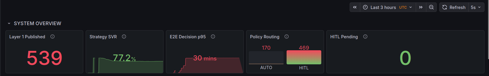

Shows Layer 1 publication, Strategy validity, Policy routing, and persisted HITL
state in the final experiment.

### Layer 1 — Real-Time Statistical Data Plane

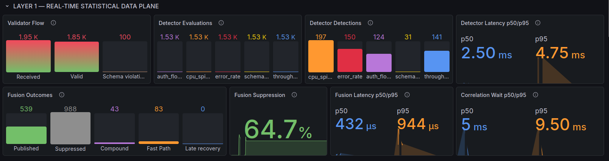

Shows validator, detector, Fusion, and Layer 1 latency telemetry.

### Layer 2 — AI Control Plane

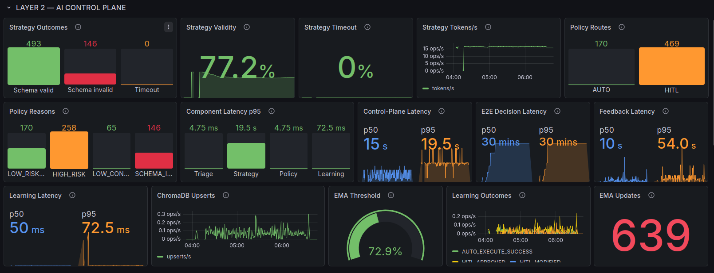

Shows Strategy validity, Policy reasons, processing latency, EMA threshold, and
Learning state.

### Layer 3 — Execution, Human Oversight & Observability Layer

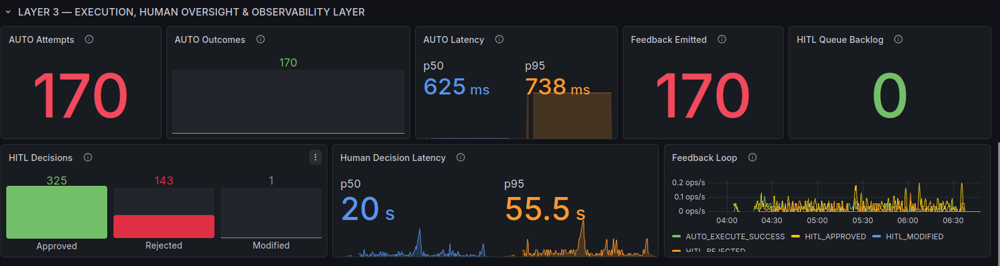

Shows AUTO handling, HITL decisions, pending-work semantics, and feedback
visibility.

### Infrastructure Health

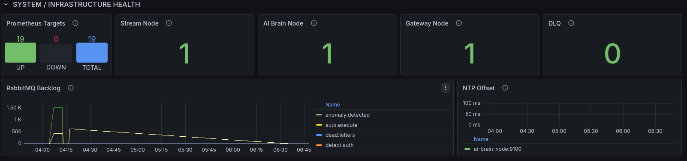

Shows target health, RabbitMQ queue behaviour, dead-letter status, and clock
synchronisation.

### Hardware and Node Resources

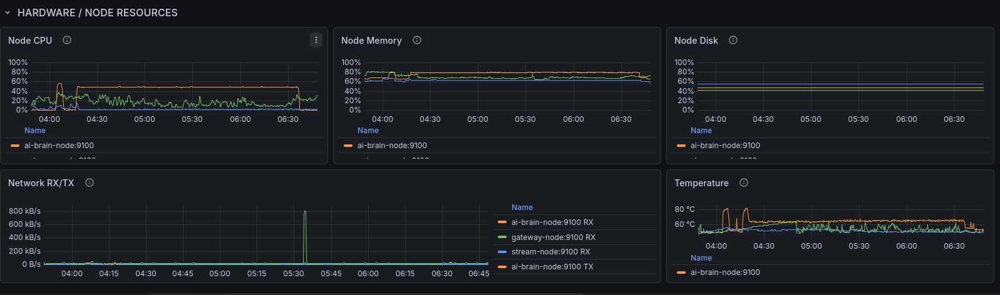

Shows qualitative resource behaviour across stream-node, ai-brain-node, and
gateway-node.

## Final Ethernet experiment results

The completed **ethernet_cold_20261002_023108** run reproduced the proposed
full pipeline over Ethernet using the preserved authoritative Wi-Fi workload
from **wifi_cold_20260913_041045**, including its event IDs, order, final labels
and configuration, at replay speed **1**. The recorded implementation commit is
**c595459ce64a479a2bf725df2fbffb7142d6f66b**; the Ethernet application/deployment
base is **c0ad6be9c84955240cf4499d586ad46b1d579ecc**. Reported completion is
**2026-10-02T06:45:49Z**.

Evidence is node-local under `experiment_runs/ethernet_cold_20261002_023108/`.
The gateway's preserved `metrics/`, `layer3-final-state.txt`,
`transport/revision-before.txt`, `transport/prometheus-targets-after.json` and
screenshots were inspected for this update. Node 1's corpus hashes, completion,
protocol/reconciliation and broker-peer records, and Node 2's offline analyzer,
Chroma and final threshold records are reported from the operator-supplied
summary of those preserved files; they were not independently read on gateway.
Their absence on gateway is not absence of experiment evidence. The
[comparison document](docs/WIFI_VS_ETHERNET_COMPARISON.md) records this provenance
and the limits of the matched pair.

Reported preserved source hashes:

| File | SHA-256 |
|---|---|
| `events_1950.jsonl` | `427d64f93caf78d2ae58ae916e74e034ce3e17681f3580d04972263faa7594a3` |
| `labels.csv` | `da596042f35e2983b83414a7bbed84925fde2b734a7ea96255fa24454de8d936` |
| `seg_config.json` | `36910a5208a09724010f3e5d1fae359227c2f37daa47a3de0eb6626731446418` |

The manifest was created **retrospectively from the preserved authoritative
Wi-Fi files before Ethernet replay**, as reported for `protocol-freeze.txt`.
It is not a historically pre-existing independently approved manifest. The
recorded revision gate passed with a clean tree and no application/deployment
differences outside the root Ethernet runbook relative to the deployment base;
this does not itself prove identity to the earlier Wi-Fi implementation.

### Cross-layer accounting

~~~text
Generated/input events           1,950
Validator valid                  1,850
Structural schema violations       100
Fusion-eligible events           1,527
Fusion published                   539
Structural bypass                  100
Layer 2 incidents                  639
Strategy responses                 639
Strategy schema-valid              639
Strategy schema-invalid              0
Strategy timeouts                    0
AUTO                               175
HITL                               464
HITL approved                      463
HITL rejected                        0
HITL modified                        1
Total feedback                     639
Learning updates                   639
Final Chroma documents             639
~~~

~~~text
539 fused + 100 structural bypass = 639 Layer 2 incidents
175 AUTO + 464 HITL = 639 Policy decisions
463 approved + 0 rejected + 1 modified = 464 HITL decisions
175 AUTO feedback + 464 HITL feedback = 639 feedback events
~~~

### Layer 1 runtime results

| Measure | Final count |
|---|---:|
| Validator received / valid / structural violations | 1,950 / 1,850 / 100 |
| Evaluations by each detector | 1,527 |
| CPU / error / auth / schema / throughput runtime detections | 197 / 150 / 124 / 31 / 141 |
| Fusion published / suppressed | 539 / 988 |
| Fusion compound / Fast Path / late recovery | 43 / 83 / 0 |

The reported Node 1 operational counts match the recorded Wi-Fi counts.
Runtime detections are not independently established true positives.

### Layer 2 control-plane results

| Measure | Final result |
|---|---:|
| Strategy responses | 639 |
| Valid JSON / invalid JSON | 639 / 0 |
| Schema-valid / schema-invalid | 639 / 0 |
| Strategy schema-validity rate (non-timeout responses) | 639 / 639 = 100% |
| Timeouts | 0 |
| Policy AUTO / HITL | 175 (27.3865%) / 464 (72.6135%) |
| Policy reasons: HIGH_RISK / LOW_CONFIDENCE / LOW_RISK_HIGH_CONFIDENCE | 399 / 65 / 175 |
| Risk-tier accuracy | 513 / 630 = 81.43% |
| FAR / FER (routing-label-policy-v2, retrospective) | 38/174 = 21.84% / 104/240 = 43.33% |

Schema validity measures output-contract compliance, not remediation correctness.
The observed SVR difference from Wi-Fi is not evidence that Ethernet caused
better model output. Risk-tier accuracy and JSON accounting above are reported
from the Node 2 analyzer summary; routing/schema counters are also preserved in
the gateway metrics.

### Feedback, learning, Layer 3, and integrity

| Measure | Final result |
|---|---:|
| AUTO attempts / outcomes / feedback emitted | 175 / 175 / 175 |
| HITL total; approved / rejected / modified | 464; 463 / 0 / 1 |
| Persisted HITL pending at completion | 0 |
| Overall / AUTO / HITL feedback completion | 639/639; 175/175; 464/464 |
| Learning updates / final Chroma documents | 639 / 639 |
| Final EMA threshold / update_count | 0.7681 / 639 |
| Prometheus targets | 19 UP / 2 intentionally inactive baseline targets DOWN |
| Final experiment queues (ready / unacknowledged), including DLQ | 0 / 0 |

The supplied offline integrity summary reports zero missing Strategy, Policy,
feedback or Learning processing records; zero pending HITL without feedback;
zero unknown feedback IDs and malformed records; and zero duplicate Triage,
Strategy, Policy, Feedback or Learning records. These per-ID checks cannot be
established solely from aggregate counters. Final Chroma cardinality is reported
from Node 2; its 639 upserts and 639 Learning updates are locally corroborated.
AUTO remains controlled simulated execution; neither approval nor feedback
establishes verified service recovery or MTTR.

### Ethernet latency interpretation

The **offline Layer 2 analyzer is authoritative for aggregate E2E latency**.
These are the operator-supplied values from Node 2's
`layer2_evaluation/ethernet_cold_20261002_023108/evaluation_summary.json`;
all values in the following table are seconds.

| Measure | Mean | Median | p95 | p99 | Maximum |
|---|---:|---:|---:|---:|---:|
| Triage | 0.0707496088 | 0.058 | 0.112 | 0.158 | 3.828 |
| Strategy | 16.0009702660 | 15.855 | 17.828 | 19.567 | 27.633 |
| Policy | 0.0003020344 | 0.0 | 0.001 | 0.001 | 0.001 |
| Control-plane | 16.0720219092 | 15.924 | 17.873 | 19.646 | 28.171 |
| End-to-end decision | 3968.4311863349 | 3914.150887 | 7866.067336 | 8215.490266 | 8307.39702 |
| Feedback completion | 31.9257162801 | 24.646759 | 90.896488 | 126.563807 | 162.574282 |
| Learning processing | 0.0548606328 | 0.0364821540 | 0.0763020730 | 0.14229403 | 5.832444645 |

E2E mean/median/p95/p99/maximum are approximately **66.14 / 65.24 / 131.10 /
136.92 / 138.46 minutes**. The Grafana E2E panel visually clipped around
**30 minutes**; that display must not replace the offline **131.10-minute p95**.
Dashboard histogram estimates and time windows also differ from complete-run
offline aggregates. Serial CPU-only Strategy remained the dominant processing
bottleneck, with substantial queueing. This one matched pair does not establish
network causality or an overall Ethernet speed advantage.

### Final Ethernet observability screenshots

These preserved screenshots are embedded without alteration.

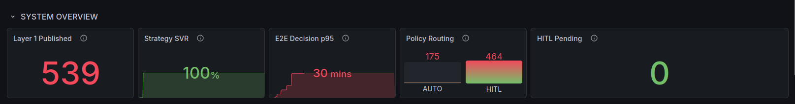

Shows final publication, SVR, routing and pending counts; the clipped E2E display
is not the authoritative latency.

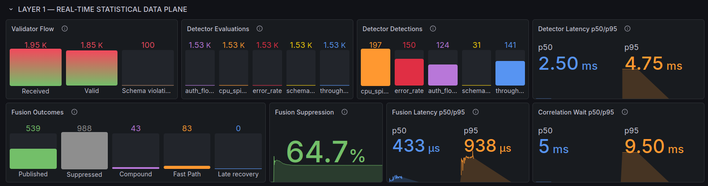

Shows Validator, detector and Fusion operational accounting.

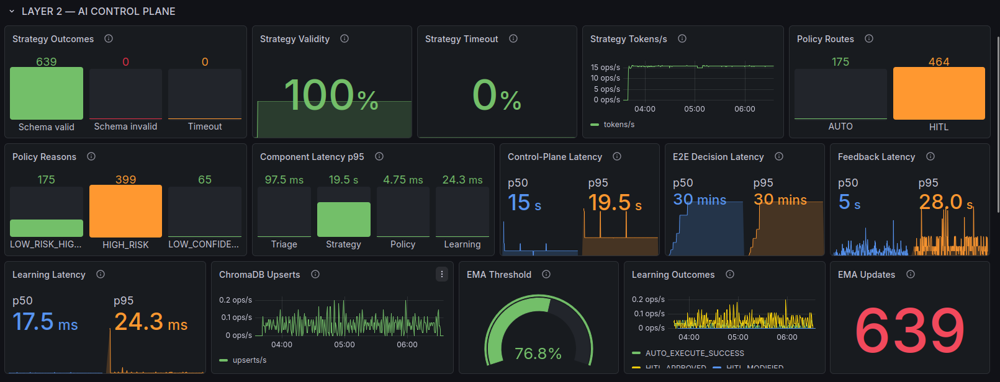

Shows Strategy validity, Policy reasons, Learning and EMA telemetry.

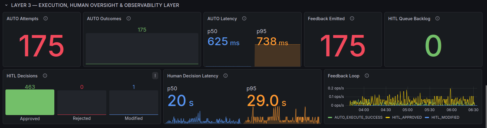

Shows simulated AUTO handling, human decisions and feedback activity.

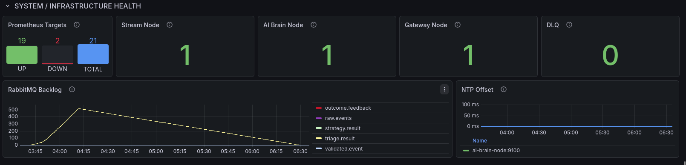

The two DOWN targets are the intentionally inactive Threshold-Only (`:8020`)
and Single-Agent (`:8030`) endpoints, not failures of the proposed system.

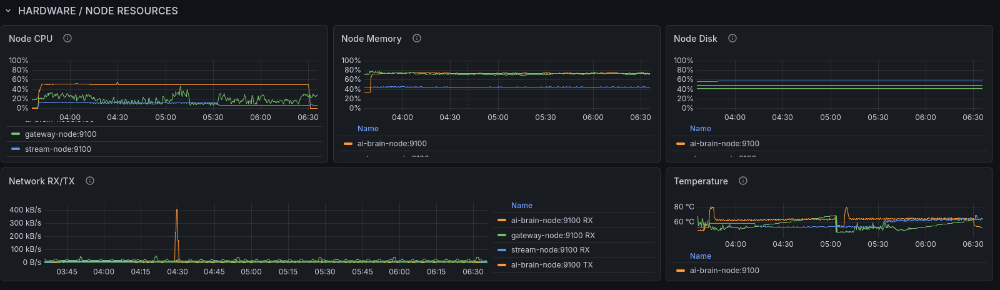

Shows qualitative resource behaviour; aggregate network plots alone do not
prove Ethernet transport or explain latency differences.

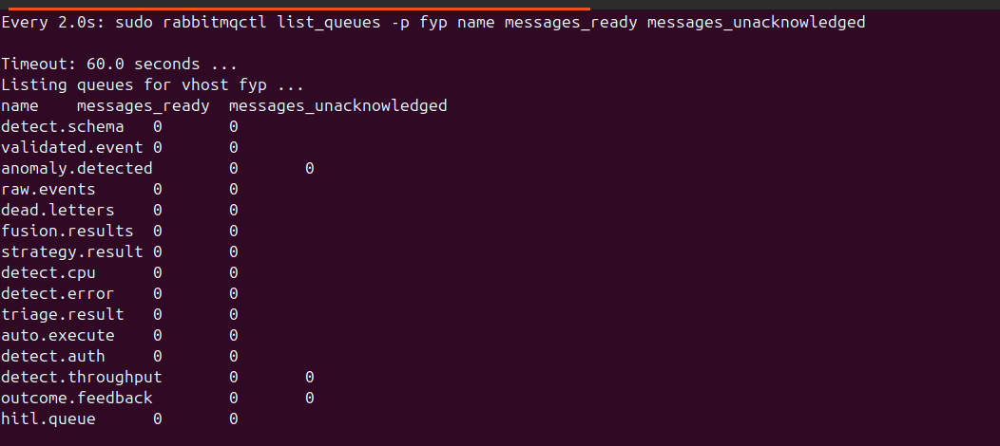

This final broker snapshot shows all listed experiment queues at zero ready and
unacknowledged messages, including the DLQ. It does not show that queues never
accumulated; the infrastructure screenshot records backlog growth and draining.

### Ethernet-specific limitations

This is one matched Ethernet run, with Wi-Fi first and Ethernet second rather
than randomized order. No dedicated warmup protocol was frozen for historical
Wi-Fi, so Ethernet intentionally introduced no Ethernet-only dedicated warmup
(operator-reported protocol limitation). The retrospective corpus manifest
limits claims of prospective freezing. The later routing-policy evaluation
below computes FAR and FER under the explicit benchmark translation.
This is retrospective evaluation, and
CPU-only Strategy remained the dominant processing bottleneck. Stochastic model
outputs, adaptive feedback and different realized reviewer choices prevent
attributing the observed differences solely to Ethernet. Repeated balanced runs
are needed for stronger causal inference.

## Offline routing ground truth and FAR/FER

On 2026-10-02, **routing-label-policy-v2** was finalized retrospectively for
the completed Proposed adaptive-EMA Ethernet run, before the remaining
Threshold-Only, Single-Agent and Proposed fixed-EMA/history-only Ethernet runs.
The same labels, script and metric definitions are frozen for all four systems;
no results for the three upcoming conditions are claimed.

The original SEG source predates the experiments and assigns LOW anomalies to
`AUTO_RESTART_CONSUMER` and HIGH anomalies to `ESCALATE_TO_HITL`. V2 translates
those exact categories into AUTO/true and HITL/false respectively; NORMAL stays
blank/excluded. Unexpected anomaly combinations fail annotation. The corpus
contains **380 expected AUTO, 570 expected HITL and 1,000 excluded NORMAL**.
`safe_to_auto=true` denotes **benchmark autonomous eligibility**, not formal
real-world operational safety certification. No Strategy, Policy, confidence or
EMA outputs construct these labels. Original fields, event IDs and order are
preserved in a separate `labels_routing.csv`.

V1 incorrectly tested corpus actions against runtime Strategy action identifiers,
labeling every anomaly HITL. It is superseded and archived, not erased. V2 is an
explicit methodological amendment, not a claim that the original blank routing
fields already constituted an operational safety contract. The completed run's
results were known when this policy was finalized; prospective blinding is not
claimed. The policy will not change based on comparative outcomes.

- **FAR** = actual AUTO with `safe_to_auto=false` / actual AUTO with authoritative
  nonblank eligibility labels (true or false).
- **FER** = actual HITL with `expected_route=AUTO` / expected-AUTO incidents
  with an actual AUTO/HITL Policy decision.
- **Expected-AUTO Policy Coverage** = expected AUTO with a Policy decision /
  all authoritative expected-AUTO corpus incidents.
- **Expected-AUTO Missing Before Policy** = expected AUTO without a Policy
  record / all authoritative expected-AUTO corpus incidents.

All exclude NORMAL/unlabeled routing cases; zero denominators are
`not_computable`, never zero error. Lower FAR/FER and missing-before-Policy rates
are better; higher Policy coverage is better.
The JSON key `false_automation_rate` is retained for compatibility.

### Confirmed proposed adaptive-EMA Ethernet re-evaluation

Locally preserved source CSV and five stage JSONLs under
`experiment_runs/ethernet_cold_20261002_023108/offline_eval_inputs/` give:

| Measure | Confirmed result |
|---|---:|
| Policy incidents | 639 |
| Joined expected AUTO / HITL / excluded NORMAL | 240 / 390 / 9 |
| Actual AUTO / HITL, before exclusions | 175 / 464 |
| NORMAL excluded from actual AUTO / HITL | 1 / 8 |
| FAR numerator / denominator / value | 38 / 174 / 21.84% |
| FER numerator / denominator / value | 104 / 240 / 43.33% |
| Expected-AUTO Policy Coverage | 240 / 380 = 63.16% |
| Expected-AUTO Missing Before Policy | 140 / 380 = 36.84% |
| Risk-tier accuracy | 513 / 630 = 81.43% |
| SVR; invalid JSON / schema-invalid / timeouts | 639/639 = 100%; 0 / 0 / 0 |
| Feedback overall / AUTO / HITL | 639/639; 175/175; 464/464 |

All reported missing-stage, missing-feedback, unknown-feedback, pending-HITL,
missing-Learning, malformed and duplicate checks are zero for observed incidents.
A separate event-ID join agrees exactly: 136 eligible incidents routed AUTO
and 104 routed HITL, totaling 240. FER measures routing only after an eligible
event reaches Policy. The 140 eligible IDs without Policy are upstream coverage
attrition, not false escalations, and do not enter the routing FER denominator.
Non-routing metrics and historical Wi-Fi results are unchanged.
These scores measure benchmark routing disagreement, not real-world harm or
verified service restoration.

Final CSV SHA-256:
`f57a7cf80f72c60a915286fa40ea93064cb9053e9e2272bffc765131ecee129c`.
Final summary, per-event results, independent verification and manifest are
preserved beside the inputs; v1 artifacts are in `routing-policy-v1-superseded/`.
See the [authoritative policy](layer2/evaluation/ROUTING_LABEL_POLICY.md) for
source evidence, hashes, exact semantics, history and reproduction commands.
The [Wi-Fi/Ethernet comparison](docs/WIFI_VS_ETHERNET_COMPARISON.md) retains the
original blank-routing-label analysis; this later evaluation supersedes its
Ethernet FAR/FER availability statement only.

## Limitations and future work

- The workload is synthetic and the three-node environment is a laboratory
  deployment.
- Strategy uses CPU-only qwen3:1.7b inference with constrained/serial
  throughput. The authoritative Wi-Fi run observed 77.15% schema validity and
  146 schema-invalid proposals; the Ethernet run observed 639/639 schema-valid
  responses. This observed difference does not establish Ethernet causality.
- HITL throughput and observed human timing depend on the controlled reviewer
  workflow and should not be generalized.
- Historical Wi-Fi FAR/FER remain uncomputed. The retrospective Ethernet
  routing-policy evaluation above gives FAR 21.84% and FER 43.33%,
  with the corpus-coverage limitation disclosed above. Runtime detections are not truth labels.
- AUTO outcomes are controlled simulated execution-path outcomes, not verified
  service recovery. No service-recovery duration was measured.
- SQLite/HITL persistence and centralised observability are experimental-scale
  choices, not high-availability or production-scale evidence.
- The Wi-Fi run remains the authoritative historical baseline. The matched
  Ethernet reproduction above adds one observed pair, not a causal network study.

Threshold-Only and Single-Agent comparisons, plus a fixed-versus-adaptive EMA
ablation, remain planned as described in the Literature Review. They are
separate from the infrastructure comparison.

Potential next work includes repeated balanced Ethernet-versus-Wi-Fi comparisons,
faster or parallel local Strategy inference, broader workloads, safer
expected-route labels, richer Policy controls, verified service restoration, and
replicated persistence.

## Repository structure

~~~text
fyp-pipeline/
├── layer1/
│   ├── README.md
│   └── docs/layer1_component_log.md
├── layer2/
│   ├── README.md
│   └── docs/layer2_component_log.md
├── layer3/
│   ├── README.md
│   └── docs/layer3_component_log.md
├── docs/
│   ├── experiment_results/
│   ├── Literature_Review.md
│   └── System_Design_and_Methodology.md
├── Full_Rerun.md
└── README.md
~~~

## Documentation map

| Document | Purpose |
|---|---|
| This README | Project and research overview |
| [Literature Review](docs/Literature_Review.md) | Verified literature, design requirements, architecture derivation, and planned comparisons |
| [Layer 1 README](layer1/README.md) | Statistical data-plane overview |
| [Layer 1 component log](layer1/docs/layer1_component_log.md) | Detailed Layer 1 implementation |
| [Layer 2 README](layer2/README.md) | AI control-plane overview |
| [Layer 2 component log](layer2/docs/layer2_component_log.md) | Detailed Layer 2 implementation |
| [Layer 3 README](layer3/README.md) | Execution, HITL, and observability overview |
| [Layer 3 component log](layer3/docs/layer3_component_log.md) | Detailed Layer 3 implementation |
| [Full_Rerun.md](Full_Rerun.md) | Complete reproduction/run procedure |
| [Wi-Fi vs Ethernet comparison](docs/WIFI_VS_ETHERNET_COMPARISON.md) | Proposed-system matched-pair results and validity limits |
| [System Design and Methodology](docs/System_Design_and_Methodology.md) | Design rationale, methodology, metrics, and validity considerations |

## Project status

The frozen Wi-Fi run remains the authoritative historical Wi-Fi baseline.
The matched proposed-system Ethernet full run is now complete; Threshold-Only
and Single-Agent Ethernet full-pipeline evaluations remain next. Review the
layer documents and the experiment runbooks, [Full_Rerun.md](Full_Rerun.md) and
[Ethernet_Full_Rerun.md](Ethernet_Full_Rerun.md), before starting a new experiment.
This README does not replace those runbooks.
