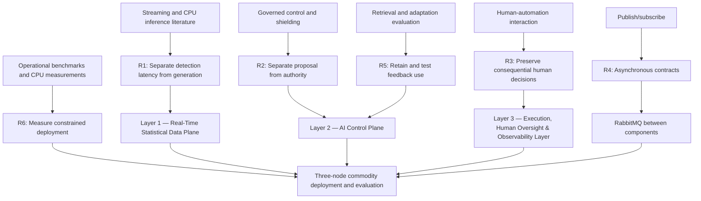
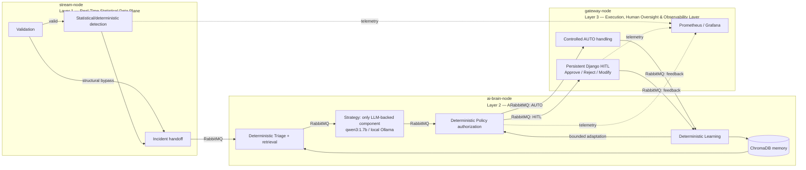

# Distributed Multi-Agent Coordination for Self-Healing Data Pipelines:
## A Human-in-the-Loop Approach on Commodity Hardware

# Literature Review

**Review date:** September 14, 2026  
**Scope:** Targeted literature synthesis and literature-derived architectural justification.

## 1. Introduction

Streaming data pipelines must handle both operational disturbances and changes in incoming data. Resource saturation, increasing error rates, falling throughput, authentication floods, and incompatible records require different responses. Detecting a symptom, selecting a response, authorizing an action, and establishing recovery are separate problems. Combining these responsibilities in an undifferentiated automation component makes its performance and authority difficult to evaluate.

This review develops the intellectual basis for **Distributed Multi-Agent Coordination for Self-Healing Data Pipelines: A Human-in-the-Loop Approach on Commodity Hardware**. It examines streaming computation, anomaly detection, self-management, agent decomposition, bounded automation, human oversight, local inference, and feedback. Its central question is how these strands support a practical architecture whose fast detection path remains independent of generative reasoning and whose execution authority remains explicit.

The project implements a heterogeneous control workflow across three commodity nodes. Only Strategy uses a generative language model; Triage, Policy, and Learning perform deterministic application logic. The term *multi-agent* therefore denotes cooperating specialized components with explicit message contracts, rather than four independent LLMs. The self-healing objective motivates the architecture, while the completed experiment demonstrates incident handling and feedback under simulated automatic execution. It does not establish restoration of real services.

The argument proceeds from established findings to remaining evaluation questions, design requirements, and the three-layer decomposition. Literature-derived principles are distinguished from project-specific engineering choices and from hypotheses that still require comparative experiments.

## 2. Background

### 2.1 Streaming data pipelines and operational failures

Unbounded streams require explicit treatment of time, incomplete information, and state. The Dataflow model treats correctness, latency, and cost as interacting concerns rather than assuming that every result can be simultaneously immediate and complete (Akidau et al., 2015). This supports careful definition of detector windows and decision timestamps; it does not itself prescribe an LLM architecture.

Anomaly detection identifies departures from expected behavior under assumptions about data and normality (Chandola et al., 2009). A structural violation is a different condition from an unusual but valid value. Likewise, a detected symptom does not uniquely identify a root cause. These distinctions prevent validation, anomaly scoring, diagnosis, and recovery from being reported as interchangeable accomplishments.

### 2.2 Self-healing systems and AIOps

Autonomic computing established self-management under human-specified objectives well before generative AI. Monitoring, analysis, planning, execution, and shared knowledge provide a useful control-loop foundation (Kephart & Chess, 2003). An LLM can contribute to planning without replacing the other functions. AIOps extends the operational setting, but successful diagnosis or message delivery still requires separate evidence from successful repair.

### 2.3 Agentic AI in data engineering

Specialization can separate contextual interpretation from action selection and checking. AutoGen illustrates agents combining LLMs, tools, and human input through configurable interactions (Wu et al., 2024). The relevant principle is composability. Whether a particular decomposition improves this project's outcomes remains an empirical question; naming components as agents cannot establish that benefit.

### 2.4 Human oversight and governance

Automation can operate at different levels across information acquisition, analysis, decision selection, and action implementation. Human workload and the consequences of incorrect actions matter when allocating those functions (Parasuraman et al., 2000). Thus, automatic observation can coexist with restricted planning and mandatory approval. Human-in-the-Loop (HITL) is an authority arrangement whose usability must be evaluated, not a guarantee that every reviewed decision is correct.

### 2.5 Resource-constrained and local AI

Local inference removes dependence on a remote inference service during operation, but consumes local processing capacity. CPU inference research demonstrates that low-bit performance depends on execution kernels as well as model storage size (Wei et al., 2025). Consequently, fitting a model in memory and sustaining an incident arrival rate are different deployment criteria. The project must measure both processing time and accumulated waiting time.

## 3. Review method and literature selection

This is a targeted, structured review, not an exhaustive systematic review. Searches conducted on September 14, 2026 began with the four titles in the historical review and expanded through searches for streaming computation, automated data validation, autonomic computing, AIOps evaluation, multi-agent conversation, runtime shielding, levels of automation, CPU LLM inference, retrieval-augmented generation, and concept drift. Foundational and recent sources were eligible; the selected publications span 2000–2025.

Web search located original publications and author-hosted manuscripts. Verification used arXiv, publisher pages, and official proceedings from VLDB, ACM, IEEE, AAAI, MLSys, COLM, and NeurIPS. Publisher metadata and paper front matter were used to check authors, dates, titles, publication venues, and persistent identifiers. This was not a separate exhaustive search within every bibliographic database, and no PRISMA screening counts or independent-reviewer agreement are claimed.

Inclusion required a verifiable publication and a direct contribution to at least one design or evaluation question. Conceptual articles were retained for context but given less evidential weight than implemented, experimentally evaluated methods. Secondary numerical claims were not treated as independently replicated findings. Search snippets, commercial summaries, and unverifiable performance assertions were excluded from the evidential argument.

Project-specific architectural descriptions were cross-checked against the current repository, system documentation, and finalized experimental records to prevent obsolete implementation claims from being propagated into the review.

## 4. Thematic literature analysis

### 4.1 Streaming detection and latency separation

Statistical detection provides interpretable departures from baselines, while data constraints identify unacceptable structure. Schelter et al. (2018) implement declarative data-quality verification, including incremental checks and historical metric analysis. Their contribution supports treating validation as an executable contract, although their Spark-based system is not this project's per-event detector implementation.

For this project, structural failures should become incidents before feature computation assumes valid input. Structurally valid records can instead enter rolling statistics and detector correlation. This is an engineering inference from validation and streaming requirements, rather than a claim that one paper mandates the exact bypass.

Combining the time/cost concerns of Akidau et al. (2015) with the CPU execution constraints of Wei et al. (2025) motivates keeping expensive generation outside the detector dependency chain. Asynchrony protects detection from waiting for a model response. It cannot remove the work required for downstream decisions or establish a hard real-time deadline. The phrase “Real-Time Statistical Data Plane” describes the layer's intended role, not a formal timing guarantee.

### 4.2 Self-healing and remediation

Kirubakaran et al. (2025) provide a close architectural precedent: a governed control plane whose proposed actions undergo policy checks. Their cloud study reports comparisons against static orchestration. It supports bounded control as a relevant pattern, but is not evidence for this project's effectiveness.

Chakraborty (2025) discusses cross-pipeline and domain-specific agent responsibilities using industry-oriented synthesis. Kothamasu (2025) describes monitoring, diagnosis, decisions, execution, and implementation considerations. Both help frame integration, but neither supplies a reproducible experiment validating the present CPU deployment.

Stronger evaluation precedents already exist. AIOpsLab integrates workloads, fault injection, telemetry, agent interaction, and evaluators (Chen et al., 2025). Thus, the unresolved question is the behavior of a particular governed deployment under constrained resources, rather than whether implemented AIOps evaluation exists at all.

### 4.3 Multi-agent and event-driven coordination

Decomposition allows responsibilities to have different implementations, failure handling, and measurement boundaries. However, multiple components also introduce handoffs and additional state. AutoGen supplies useful evidence for configurable role separation, including a single-agent versus separated safeguard experiment in a coding application. That task-specific result motivates comparison here without establishing superiority for pipeline remediation (Wu et al., 2024).

Publish/subscribe research distinguishes decoupling in space, time, and synchronization (Eugster et al., 2003). RabbitMQ applies an asynchronous messaging approach to this implementation. Producers can publish incident information without waiting for Strategy to finish. The project nevertheless depends on broker availability, queue capacity, acknowledgments, and consumer behavior. Distributed processes and named queues do not by themselves establish fault tolerance, exactly-once processing, or globally coordinated optimization.

### 4.4 Policy-bounded autonomy

Formal shielding separates a learner's proposed action from an enforcement mechanism that checks a specified safety property (Alshiekh et al., 2018). This supplies an architectural analogy for an external authorization boundary. The project uses deterministic authorization checks and routing, not a synthesized temporal-logic shield, so it does not inherit the paper's formal guarantees.

The resulting principle is **Strategy proposes; Policy authorizes or escalates**. Structured output enables checking, but valid JSON alone says nothing about action suitability. An allowlisted action may still be inappropriate for the affected component. Confidence is also a model-produced field rather than a demonstrated probability of successful repair. Fail-closed handling therefore means refusing AUTO under specified invalid or uncertain conditions; it does not mean all permitted actions have been proven safe.

### 4.5 Human-in-the-Loop systems

The levels-of-automation framework supports retaining human control over consequential decisions while automating information preparation (Parasuraman et al., 2000). Applied here, escalation must preserve the incident, proposal, reasoning, and decision state so that approval, rejection, or modification has an observable outcome.

Human review also creates a service-capacity constraint. An escalation route is ineffective if cases accumulate beyond reviewer capacity or arrive after the response has become irrelevant. Evaluation should therefore measure pending work and review delay alongside route proportions. A lower escalation rate is not automatically desirable: it may reflect either better proposals or weaker authorization criteria. Conversely, high escalation can reflect useful caution, poor structured generation, or excessive conservatism. Those interpretations require labeled decisions and workload evidence.

### 4.6 Local and edge LLM inference

Mayilsamy (2025) surveys streaming LLM applications and optimization topics, providing broad context rather than a benchmark of the current model or machines. T-MAC offers a stronger CPU-specific contribution: implemented low-bit kernels and measured execution on edge hardware. Its results depend on particular models, processors, and kernels; they cannot be transferred numerically to Ollama running `qwen3:1.7b` (Wei et al., 2025).

The practical inference is to evaluate complete request handling, including prompt processing, generation, retry, and queue delay. A smaller local model may make deployment feasible while still producing invalid proposals or an inadequate service rate. The project therefore treats commodity hardware as a measured constraint. It does not claim an established cost advantage over cloud inference or a verified quantization format from the model tag alone.

### 4.7 Feedback, memory, and adaptation

Retrieval-augmented generation combines generated output with externally retrieved information (Lewis et al., 2020). Historical incident memory can therefore supply context without changing model weights. This project adopts that general principle, not the original paper's jointly fine-tuned retriever/generator method.

Concept-drift research distinguishes changing predictive relationships and the evaluation of adaptive methods (Gama et al., 2014). That literature motivates testing adaptation over time, but does not validate this project's EMA signals or establish its Learning component as online model training.

The implementation stores both positive and negative outcomes, while Triage retrieves only examples labeled as successful automatic handling or human approval. Stored rejection evidence is consequently not used as retrieved negative examples. Moreover, simulated success and human approval do not prove repair effectiveness. Memory may preserve useful precedent, but it can also repeat unverified judgments; its contents and selection rules must remain visible to the evaluator.

## 5. Critical analysis of key studies

The following assessment distinguishes methodological strength from relevance. A paper can be highly relevant architecturally while offering limited evidence for the present experimental setting.

| Study | Contribution and method | Strength | Limitation and project relevance |
|---|---|---|---|
| Akidau et al. (2015) | Streaming model with explicit time and result semantics. | Makes latency/correctness tradeoffs explicit. | Does not evaluate LLM control; informs timing definitions rather than model selection. |
| Schelter et al. (2018) | Implemented declarative verification and dataset experiments. | Connects constraints to executable checks. | Large-scale data-quality workloads differ from this synthetic event stream. |
| Kirubakaran et al. (2025) | Governed cloud control with a static baseline. | Close proposal/authorization precedent. | Exact backend configurations and reproducibility details are insufficient for transferring performance expectations. |
| Chen et al. (2025) | AIOpsLab evaluates operational agents through interactive faults. | Tests behavior against an environment, beyond response formatting. | Its benchmark setting does not establish this project's commodity/HITL combination. |
| Wu et al. (2024) | Configurable agent interactions and application experiments. | Includes role-separation comparisons. | Coding safeguards differ from deterministic pipeline authorization. |
| Alshiekh et al. (2018) | Formal shielding with reinforcement-learning scenarios. | Defines enforcement independently of reward seeking. | Formal specifications and assumptions are absent from the current Policy implementation. |
| Wei et al. (2025) | CPU kernel implementation and hardware measurements. | Shows why execution efficiency needs measurement. | Does not evaluate remediation reasoning or this Ollama configuration. |
| Lewis et al. (2020) | Retrieval/generation models evaluated on knowledge-intensive tasks. | Establishes an empirical retrieval precedent. | QA evidence does not establish incident-memory quality or threshold benefit. |

The contextual and cloud-control studies require differentiated treatment. Mayilsamy reports a literature-selection process, but its selection process does not establish the reliability of every included claim. Chakraborty's performance numbers are presented through cited external examples rather than a new controlled benchmark. Kothamasu includes benchmarking recommendations; it should not be described as offering no evaluation guidance. Chakraborty and Kothamasu remain contextual sources, not numerical evidence of the project's likely gains.

The ACDE paper's recovery, cost, and intervention percentages appear in its original text, but they are not reproduced here because the workloads and outcome definitions differ. The paper names model families; it does not establish a specific GPU hardware requirement. “No commodity benchmark reported” is defensible; “commodity deployment explicitly impossible” is not. Its proposed future coordination across complex dependencies also exceeds simple sequential RabbitMQ handoffs.

## 6. Cross-literature gap analysis

The comparison records what selected publications substantiate, not every feature their associated software could support. **I** means implemented/evaluated in the cited work, **D** means discussed or designed, and **NR** means not established for the specified combination. NR is not proof of absence. The project column reflects the implemented architecture and the documented Wi-Fi experiment.

| Dimension | Schelter et al. (2018) | ACDE: Kirubakaran et al. (2025) | AIOpsLab: Chen et al. (2025) | AutoGen: Wu et al. (2024) | Current project |
|---|---|---|---|---|---|
| Working implementation | I | Reported prototype | I | I | I |
| Streaming/operational focus | Incremental data checks | Batch and streaming | Interactive cloud operations | General applications | Synthetic event stream |
| Deterministic validation | I | D/I policy checks | Task evaluators | Application-dependent | Pydantic and output validation |
| LLM reasoning | NR | I | I | I | Strategy only |
| Explicit component decomposition | Validation components | Specialized agents | Evaluation components | Conversational agents | Four heterogeneous agents |
| Independent authorization boundary | NR | D/I | NR for this contract | Application-dependent | Deterministic Policy |
| Persistent approve/reject/modify HITL | NR | Approvals discussed | NR | Human participation | I |
| Feedback or adaptation | Historical metrics | Outcomes; learning future work | Agent/environment feedback | Application-dependent | Memory and bounded EMA |
| Three commodity CPU-only nodes | NR | NR | NR | NR | Documented deployment |
| Comparative evaluation | I | Static baseline | Agent/task comparisons | Application comparisons | Planned |
| Telemetry/observability | Quality metrics | Operational telemetry | Integrated telemetry | Interaction records | Prometheus/Grafana |
| Verified service restoration | Outside scope | Recovery reported | Mitigation evaluation | Outside general scope | Not established |

The matrix reveals overlapping strengths, rather than a universally missing architecture. In particular, the project currently has weaker evidence of actual recovery than operational benchmarks that check environmental outcomes. Its distinctive emphasis is combining a constrained local planner, deterministic routing, persistent human decisions, and feedback on a small distributed installation. Whether that integration improves decision quality or workload remains unresolved.

## 7. Research gap

Among the works reviewed, there is limited directly comparable evidence for the joint behavior of fast non-generative event detection, asynchronous small-model planning, deterministic AUTO/HITL authorization, persistent human decisions, and feedback adaptation across three CPU-only commodity nodes. Existing work provides important pieces and implemented evaluation frameworks, but does not answer how this particular combination trades structured-output reliability, human workload, and queue accumulation under the project's workload.

The project addresses this bounded integration and evaluation question through an implementation and an initial controlled Wi-Fi experiment. It does not establish global priority or superior autonomous recovery. A remaining gap within the project itself is comparative evidence against deterministic and monolithic alternatives, together with independently verified remediation outcomes. This framing leaves open the possibility that a simpler baseline will perform as well as, or better than, the proposed architecture.

## 8. Literature-derived design requirements

These requirements are a synthesis of the cited principles and the project's deployment constraints. The literature supports the problem and design direction; exact tools, thresholds, and node counts remain engineering choices.

| Requirement | Literature basis | Architectural consequence | Evaluation obligation |
|---|---|---|---|
| **R1 — Keep prompt-dependent generation outside the fast detection dependency chain.** | Streaming timing tradeoffs and CPU inference costs (Akidau et al., 2015; Wei et al., 2025). | Layer 1 performs validation and statistical/deterministic detection; Layer 2 consumes incidents asynchronously. | Measure detection and decision latency separately, including backlog. |
| **R2 — Separate proposals from permission to act.** | Governed control and external enforcement (Alshiekh et al., 2018; Kirubakaran et al., 2025). | Strategy validates its proposal contract; deterministic Policy authorizes AUTO or escalates. | Measure invalid proposals and authorization behavior; do not equate schema validity with safety. |
| **R3 — Preserve human control where consequences or uncertainty require intervention.** | Function-specific automation and human performance concerns (Parasuraman et al., 2000). | Persistent Layer 3 HITL with approve/reject/modify decisions. | Measure pending work, review time, and independently assessed decision quality. |
| **R4 — Decouple independently paced components through explicit event contracts.** | Publish/subscribe decoupling (Eugster et al., 2003). | RabbitMQ handoffs with observable incident identities and destinations. | Reconcile records and distinguish queue wait from component processing. |
| **R5 — Retain outcomes for contextual reuse and evaluate adaptation separately.** | External retrieval and adaptive-method evaluation (Gama et al., 2014; Lewis et al., 2020). | ChromaDB memory and deterministic Learning with bounded EMA. | Compare fixed/adaptive thresholds; audit retrieval filters and feedback meaning. |
| **R6 — Measure complete behavior under the intended resource constraints.** | Interactive AIOps evaluation and CPU measurements (Chen et al., 2025; Wei et al., 2025). | Three commodity nodes with Prometheus/Grafana and offline analysis. | Evaluate correctness, queues, processing, hardware, and outcome completion without conflating them. |

No cited paper uniquely requires RabbitMQ, ChromaDB, Django, or precisely three nodes. These are feasible implementations of the requirements. The six requirements justify separation of responsibilities; comparisons are needed to justify the selected implementation against alternatives.

The following mapping connects the literature gaps and tensions to requirements and architectural responses.

| Literature gap or tension | Design requirement | Architectural response |
|---|---|---|
| Streaming work and local generation have different timing costs | R1: isolate their dependencies | Layer 1 detection feeding asynchronous Layer 2 |
| A plausible proposal is not execution permission | R2: external authorization | Strategy proposals → deterministic Policy authorization |
| Consequential or uncertain decisions need human control | R3: persistent review | Layer 3 Django HITL |
| Components progress at different rates | R4: asynchronous contracts | RabbitMQ queues and traceable incident handoffs |
| Past outcomes may inform later decisions, but benefit requires testing | R5: bounded feedback reuse | ChromaDB plus deterministic Learning and EMA ablation |
| Deployment feasibility does not imply useful response time | R6: complete systems measurement | Three commodity nodes, Prometheus/Grafana, and offline latency/accounting analysis |

## 9. Derivation of the proposed three-layer architecture

Three layers group responsibilities by timing, authority, and interaction with the external environment. The first layer continuously observes events, the second constructs and governs proposals, and the third records handling and human decisions while exposing system behavior. Keeping Policy within Layer 2 does not merge it with generative reasoning: its deterministic implementation and queue-routing authority form a separate boundary inside that layer.

### 9.1 Layer 1 — Real-Time Statistical Data Plane

Layer 1 on `stream-node` keeps fast validation and statistical/deterministic detection independent of LLM inference. Structural schema violations bypass feature computation and detector correlation, while structurally valid events follow the detection path. RabbitMQ carries resulting incidents asynchronously to Layer 2. This separation implements R1 and R4 by allowing observation to proceed without waiting for generative planning.

The active path uses five statistical/deterministic detectors; historical Random Forest, Isolation Forest, and PSI approaches are not active. The synthetic schema-drift scenario bounds what can be inferred about general distribution-shift detection. Runtime detector counts describe emitted detections, not independently established true or false positives.

### 9.2 Layer 2 — AI Control Plane

Layer 2 on `ai-brain-node` separates contextual planning from permission to act. Triage deterministically maps incidents to protocols and retrieves ChromaDB context. Strategy is the only LLM-backed component, using `qwen3:1.7b` through local Ollama on CPU. It produces a structured, action-constrained proposal and checks its output contract. Schema validity enables downstream checks but does not establish semantic correctness.

Policy consumes Strategy's validation status and applies deterministic authorization rules to select AUTO or HITL. **Strategy proposes; Policy authorizes or escalates.** This boundary implements R2 without claiming that every authorized action is safe or effective. Persistent escalation provides the connection to R3.

Learning deterministically retains feedback, updates incident memory, and adapts the authorization threshold; it does not retrain model weights. This implements R5 while leaving the value of adaptation open to evaluation. The implemented adaptive threshold mechanism is bounded, but boundedness alone does not establish beneficial or conservative adaptation. Its effect should therefore be evaluated through an explicit fixed-versus-adaptive ablation.

### 9.3 Layer 3 — Execution, Human Oversight & Observability Layer

Layer 3 on `gateway-node` handles Policy-authorized AUTO decisions through controlled simulation and persists escalated incidents in Django for approval, rejection, or modification. These are observable workflow outcomes: AUTO completion and human approval do not establish successful remediation or verified real service recovery.

Both paths return feedback asynchronously to Learning. Persistent decision records distinguish incidents awaiting human review from messages awaiting broker consumption. Prometheus and Grafana provide observation across the layers without participating in authorization. This grouping supports R3 and R6 by keeping human interaction, handling records, and systems measurement outside generative planning.

RabbitMQ, hosted on `stream-node`, provides asynchronous coordination between components. Memory and adaptation arrows denote local access; dotted arrows denote observability. The diagram emphasizes responsibility boundaries rather than individual queues.

## 10. Research Positioning and Preliminary Evidence

The architecture has been implemented across three CPU-only commodity nodes, and one controlled cold-state Wi-Fi experiment has been completed. Incident-path accounting was complete for the recorded run: 639 incidents were handled through 170 AUTO and 469 HITL decisions. CPU-only Strategy inference was the major observed bottleneck, with mean processing time of approximately 13.05 seconds and substantial accumulated end-to-end decision delay. Asynchronous detection therefore does not imply timely downstream decisions at arbitrary arrival rates.

These observations support constrained-deployment feasibility, not production readiness. Simulated AUTO handling does not prove real service recovery, and feedback completion or human approval cannot substitute for mean time to recovery (MTTR). False Automation Rate (FAR) and False Escalation Rate (FER) are not currently computable from the available authoritative labels. Architectural baseline comparisons and the separate Ethernet comparison remain future work; the Wi-Fi observation cannot establish behavior under Ethernet.

## 11. Evaluation implications

### 11.1 Planned architectural comparisons

The literature motivates comparison, not an assumption that added agents help. Three planned conditions should use the same incident population, hardware, output vocabulary, and outcome definitions:

| Condition | Decision mechanism | Question addressed |
|---|---|---|
| Baseline 0 — Threshold-Only | Fixed deterministic rules and static automation routing | Does contextual generation add useful decisions beyond conventional control? |
| Baseline 1 — Single-Agent LLM | One model performs diagnosis, proposal, risk judgment, and route recommendation | What changes when responsibilities are combined in one generative component? |
| Proposed System | Triage, Strategy, deterministic Policy, Learning, and Layer 3 AUTO/HITL | What tradeoffs result from heterogeneous decomposition and governance? |

For an architectural comparison, replay identical captured incidents to each controller so detector differences do not confound control quality. A separate full-pipeline experiment can then include detection and Fusion. Fix the model/runtime and generation budget where applicable, record retries, and keep human-review procedures consistent. Explicitly document differences in retrieval access; otherwise retrieval quality and decomposition are confounded.

The monolithic baseline may recommend its own route, but comparison can use the existing simulated executor and record attempted authorization errors. It need not grant unrestricted access to real infrastructure. Moreover, comparing it with the proposed system changes both decomposition and deterministic governance. An optional single-agent-plus-identical-Policy condition would help isolate those effects.

AIOpsLab's environment-based correctness evaluation motivates adding verified outcome checks rather than relying only on formatted answers (Chen et al., 2025). Before reporting false automation or escalation rates, define independent incident-level safety/route labels and denominators. Report quality, escalation workload, processing latency, queue delay, and completion together. Repeated seeded runs and uncertainty estimates are needed before claiming consistent gains.

### 11.2 Optional Learning ablation

Compare a fixed Policy threshold with the implemented bounded EMA while holding memory retrieval constant. If retrieval benefit is also studied, vary memory independently. Reset initial state and preserve ordering because asynchronous feedback can change which threshold or memories are available for later incidents.

Bounded adaptation alone does not establish conservative or beneficial behavior, making the threshold ablation important. An increased AUTO rate alone would not demonstrate improvement. Evaluate independently labeled suitability, reviewer workload, and stability under changing incident mixtures. An early-versus-late comparison without controlling workload and memory availability would mix adaptation with case-order effects. No completed ablation or recall improvement is claimed.

### 11.3 Separate network comparison

Wi-Fi versus Ethernet is a secondary infrastructure study. Keep code, nodes, corpus, cold-start procedure, model configuration, and replay rate fixed while changing the network medium. Repeated paired runs should record queue waiting and network behavior alongside inference time. The existing inference bottleneck may dominate aggregate decision latency, so a small network effect would not show that networking is universally irrelevant.

This study answers a different question from threshold-only versus single-agent versus proposed architecture. Ethernet results must remain future work until their own completed evidence exists.

### 11.4 Validity and reproducibility

Synthetic signals, stateful calibration, instrumented schema-drift scenarios, one controlled human workflow, and a single completed network condition limit generalization. Proposal confidence has no demonstrated calibration, memory success labels do not verify repair, and Policy relies on trusted internal validation status. The architecture is governed within its implemented contracts, not formally verified against arbitrary compromised components.

Reproducibility requires archived timestamp logs, incident identifiers, independent outcome labels, configuration, model details, and analysis procedures. Comparative studies should distinguish documented observations, implemented mechanisms, and hypotheses, while preserving enough evidence for independent assessment.

## 12. Summary

The reviewed literature supports separating rapid observation, contextual planning, execution authorization, human intervention, and outcome evaluation. It also supplies implemented systems that prevent broad claims of an untouched field. The project's three layers are a reasoned engineering synthesis of these principles under commodity constraints. Its Wi-Fi record supports complete incident-path accounting and exposes significant Strategy queue accumulation. The next methodological step is controlled comparison and direct outcome validation to determine whether the integration improves useful, timely, and appropriately governed responses.

## References

Akidau, T., Bradshaw, R., Chambers, C., Chernyak, S., Fernández-Moctezuma, R. J., Lax, R., McVeety, S., Mills, D., Perry, F., Schmidt, E., & Whittle, S. (2015). The Dataflow model: A practical approach to balancing correctness, latency, and cost in massive-scale, unbounded, out-of-order data processing. *Proceedings of the VLDB Endowment, 8*(12), 1792–1803. https://doi.org/10.14778/2824032.2824076

Alshiekh, M., Bloem, R., Ehlers, R., Könighofer, B., Niekum, S., & Topcu, U. (2018). Safe reinforcement learning via shielding. *Proceedings of the AAAI Conference on Artificial Intelligence, 32*(1), 2669–2678. https://doi.org/10.1609/aaai.v32i1.11797

Chakraborty, S. (2025). Beyond ETL: How AI agents are building self-healing data pipelines. *Journal of Computer Science and Technology Studies, 7*(3), 741–756. https://doi.org/10.32996/jcsts.2025.7.3.81

Chandola, V., Banerjee, A., & Kumar, V. (2009). Anomaly detection: A survey. *ACM Computing Surveys, 41*(3), Article 15. https://doi.org/10.1145/1541880.1541882

Chen, Y., Shetty, M., Somashekar, G., Ma, M., Simmhan, Y., Mace, J., Bansal, C., Wang, R., & Rajmohan, S. (2025). AIOpsLab: A holistic framework to evaluate AI agents for enabling autonomous clouds. *Proceedings of Machine Learning and Systems, 7*. https://proceedings.mlsys.org/paper_files/paper/2025/hash/d1f9e4a9f109b6e8b75ed362736f22ec-Abstract-Conference.html

Eugster, P. T., Felber, P. A., Guerraoui, R., & Kermarrec, A.-M. (2003). The many faces of publish/subscribe. *ACM Computing Surveys, 35*(2), 114–131. https://doi.org/10.1145/857076.857078

Gama, J., Žliobaitė, I., Bifet, A., Pechenizkiy, M., & Bouchachia, A. (2014). A survey on concept drift adaptation. *ACM Computing Surveys, 46*(4), Article 44. https://doi.org/10.1145/2523813

Kephart, J. O., & Chess, D. M. (2003). The vision of autonomic computing. *Computer, 36*(1), 41–50. https://doi.org/10.1109/MC.2003.1160055

Kirubakaran, A. M., Parthasarathy, A., Saksena, N., Bodala, R. S., Deshpande, A., Malempati, S., Carimireddy, S., & Mazumder, A. (2025). *Governing cloud data pipelines with agentic AI* [Preprint]. arXiv. https://doi.org/10.48550/arXiv.2512.23737

Kothamasu, L. S. (2025). Autonomous resilience: Advancing data engineering through self-healing pipelines and generative AI. *European Journal of Computer Science and Information Technology, 13*(28), 102–113. https://doi.org/10.37745/ejcsit.2013/vol13n28102113

Lewis, P., Perez, E., Piktus, A., Petroni, F., Karpukhin, V., Goyal, N., Küttler, H., Lewis, M., Yih, W.-t., Rocktäschel, T., Riedel, S., & Kiela, D. (2020). Retrieval-augmented generation for knowledge-intensive NLP tasks. *Advances in Neural Information Processing Systems, 33*, 9459–9474. https://papers.nips.cc/paper/2020/hash/6b493230205f780e1bc26945df7481e5-Abstract.html

Mayilsamy, M. (2025). A comprehensive survey of streaming large language models: Architectures, applications, and future directions. *Journal of Information Systems Engineering and Management, 10*(60s), 455–467. https://doi.org/10.52783/jisem.v10i60s.13138

Parasuraman, R., Sheridan, T. B., & Wickens, C. D. (2000). A model for types and levels of human interaction with automation. *IEEE Transactions on Systems, Man, and Cybernetics—Part A: Systems and Humans, 30*(3), 286–297. https://doi.org/10.1109/3468.844354

Schelter, S., Lange, D., Schmidt, P., Celikel, M., Biessmann, F., & Grafberger, A. (2018). Automating large-scale data quality verification. *Proceedings of the VLDB Endowment, 11*(12), 1781–1794. https://doi.org/10.14778/3229863.3229867

Wei, J., Cao, S., Cao, T., Ma, L., Wang, L., Zhang, Y., & Yang, M. (2025). T-MAC: CPU renaissance via table lookup for low-bit LLM deployment on edge. In *Proceedings of the Twentieth European Conference on Computer Systems*. Association for Computing Machinery. https://doi.org/10.1145/3689031.3696099

Wu, Q., Bansal, G., Zhang, J., Wu, Y., Li, B., Zhu, E., Jiang, L., Zhang, X., Zhang, S., Liu, J., Awadallah, A., White, R. W., Burger, D., & Wang, C. (2024). AutoGen: Enabling next-gen LLM applications via multi-agent conversations. In *Proceedings of the First Conference on Language Modeling*. https://www.microsoft.com/en-us/research/wp-content/uploads/2023/08/LLM_agent.pdf
