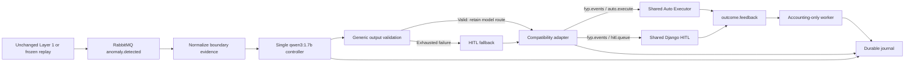

# Single-Agent Baseline System

## Purpose and scope

This primary baseline measures a single local LLM controller against deterministic Threshold control and the Proposed heterogeneous architecture, under the [frozen experiment design](../BASELINE_EXPERIMENT_DESIGN.md). It is not deliberately constrained to reproduce Proposed routes. Implementation and offline validation do not establish comparative performance.

One model-backed decision step interprets evidence, selects actions, assesses risk/confidence and chooses AUTO/HITL. A maximum of one structural-error regeneration is permitted. There is **no RAG, Chroma, Learning, EMA, separate Policy stage, Threshold routing table, conversational memory or multi-agent handoff**. Feedback cannot change future decisions.

## Architecture and components

One service process starts controller and accounting threads with independent broker connections plus a private metrics registry on 8030. The model client is a thin HTTP client, not an agent runtime. Module imports do not start inference or listeners. Capture/replay/analyzer and the Layer 3 adapter live in controller-neutral `common/`.

## Input and normalization

Fused incidents arrive through `anomaly.fused`: event ID, original timestamp/ingestion time, node/component, fused severity/confidence, fusion type, contributor records, fused timestamp and note. Map z_score_cpu_memory→cpu_memory_spike, z_score_error_rate→error_rate_surge, moving_average_throughput→throughput_drop, statistical_auth_rate→auth_failure_flood, distribution_shift_marker→schema_drift. Multiple contributors map to compound. An unfamiliar detector with otherwise valid structure maps to unknown and still reaches the model.

Structural `anomaly.schema_drift` incidents bypass Fusion and carry severity, node/component, context, metric/feature fields, Pydantic detector identity and detection metadata. Upstream risk is `layer1_reported_risk`, not ground truth or a binding risk constraint. Input confidence is null. The entire original payload remains in the journal; normalization and model conclusions never overwrite it. Raw malformed deliveries are retained as base64.

No usable ID means quarantine without model call or invented decision. Identifiable invalid fields produce `SA_INPUT_INVALID`; unsupported contract shape produces `SA_INPUT_UNSUPPORTED`. These dispatch empty-action HITL fallback records without model inference. Unknown semantics alone are not unsupported syntax.

## Prompt, schema and routing authority

Versioned `prompt.py` supplies the sole-controller instructions, sorted shared action list, boundary-only JSON and bounded retry feedback. Network/run identity, independent labels, evaluated outputs and retrieved history are excluded. Incident context remains untrusted data; delimiter characters are escaped in JSON. This reduces instruction confusion but does not prove prompt-injection immunity.

`schema.py` defines `sa-schema-v1`: exactly eight fields, no extras: anomaly_type, severity, affected_component, recommended_actions, confidence, risk_tier, routing_decision, reasoning. Severity is LOW/MEDIUM/HIGH/CRITICAL; risk is LOW/HIGH; route is AUTO/HITL; confidence is finite numeric [0,1], not bool; actions are exactly three distinct authoritative identifiers. Nonempty strings are required. Duplicate JSON keys and nonfinite numbers are rejected.

The action vocabulary is read from the literal `ALLOWED_ACTIONS` in `layer2/agents/schema_validator.py`; Proposed validation functions are never invoked. Prompt, schema and vocabulary SHA-256 values are recorded in every run manifest.

There is no severity→risk binding, risk→route rule or confidence threshold. Valid HIGH+AUTO, LOW+HITL, confidence 0+AUTO, CRITICAL+AUTO, schema+AUTO and compound+AUTO remain unchanged. Offline tests explicitly cover all six cases. Whether these recommendations are good is an independent evaluation question.

## Parsing, retries and failure semantics

Parsing tries direct JSON, Strategy-compatible fence removal, then a bounded first-brace/last-brace candidate. It never changes fields/actions/confidence or adds missing values. Extraction mode is recorded. An extracted value must still pass the strict schema.

Maximum two calls: initial generation plus one retry **only** for malformed JSON or schema failure. Retry repeats identical evidence with bounded issue codes (INVALID_JSON, MISSING_FIELD, EXTRA_FIELD, INVALID_ENUM, INVALID_CONFIDENCE, DUPLICATE_ACTION, UNKNOWN_ACTION, WRONG_ACTION_COUNT, INVALID_STRING, NOT_OBJECT). It supplies no preferred route.

Timeout, connection, HTTP/transport/runtime-envelope failure, input failure and broker failure do not trigger inference retries. Reasons are `SA_MODEL_DECISION`, `SA_JSON_INVALID`, `SA_SCHEMA_INVALID`, `SA_TIMEOUT`, `SA_MODEL_FAILURE`, `SA_INPUT_INVALID`, `SA_INPUT_UNSUPPORTED`, with `SA_INPUT_UNIDENTIFIABLE` quarantine and `SA_PUBLISH_FAILURE` evidence.

Exhausted or unavailable output produces HITL, empty actions, null accepted risk/confidence and an explicit generic review explanation. Raw attempted outputs remain separate. Fallback is neither valid model output nor a deterministic substitute action proposal. A broker/storage failure leaves work for reconciliation; it is not recast as a model recommendation.

Compared with existing Proposed Strategy, Single-Agent also retries malformed JSON (Proposed retries parsed schema failures only) and distinguishes transport errors from timeouts. This eligibility difference was explicitly approved; both have the same maximum generation-call budget.

## Model/runtime and warmup

Model `qwen3:1.7b`; `OLLAMA_HOST` defaults to `http://localhost:11434`; endpoint `/api/generate`, synchronous `stream=false`, `format=SCHEMA`, `num_ctx=2048`, `num_predict=512`, Requests timeout 35 seconds. No temperature, seed, GPU or thread option is added. The timeout is an HTTP timeout, not a hard total incident budget.

Per-attempt telemetry retains HTTP status/body, raw output, request duration and available total/load/prompt-evaluation/generation token counts and durations. Tokens/sec is eval_count/(eval_duration/1e9) only when valid telemetry exists; unavailable throughput is NaN in metrics, null in evidence. Missing runtime defaults are documented as unavailable rather than guessed. CPU-only execution must be verified on the actual node.

Live startup retrieves available model digest/Ollama version, preloads the model, then performs one fixed non-evaluation inference before measured workers begin. `warmup.json` is separate; no measured decision/attempt counter is incremented. For directly matched LLM latency, a future comparison must use an agreed common warmup/residency protocol. The completed Proposed Adaptive Ethernet run did not have matching dedicated warmup. Single-Agent preserves its current protocol and discloses that mismatch; shared routing-quality metrics remain comparable, subject to the common contract and its limitations. Load duration is retained as evidence of possible reload overhead, not asserted as a definitive reload detector. Identical settings do not guarantee bitwise deterministic LLM outputs.

## Native evidence, adapter and Layer 3

Native decisions retain ID/run/controller, normalized input and original event, input hash, receipt time, attempts, accepted output, last available raw route, final route, failure reason, fallback flag, accepted risk/confidence/actions, rationale and publication timings. Each attempt has start/end, raw response, extracted JSON, extraction mode, issues, validity and telemetry. Attempts are also independently journaled/exported before publication so a failed dispatch does not erase inference evidence. Top-level anomaly/severity remain boundary evidence; model classifications stay in accepted_model_output.

The adapter uses legacy `full_reasoning_chain.triage_result.original_event` and `strategy_result.llm_response` keys for serialization. Genuine accepted model risk/confidence/actions/reasoning are exposed. `policy_timestamp` aliases decision readiness; no Triage/Strategy/Policy execution, Policy latency, RAG or Learning is fabricated. Controller identity and fallback/validation status remain in raw evidence outside the reviewer UI.

Shared Auto Executor and HITL functions are exercised in tests without starting their import-time servers. Fallback nulls persist in SQLite. Repeated original IDs require fresh Layer 3 state because HitlIncident.event_id is unique; the shared decisions table and AUTO handler do not provide global exactly-once handling.

## Feedback and durability

Accounting consumes outcome.feedback exclusively and stores raw bytes before ACK. It retains event ID, outcome type, actual actions, notes and original controller envelope. This implementation requires matching nested event/run/controller identity because every baseline envelope supplies it. Missing identity is not guessed. Unexpected IDs, wrong runs, route mismatch, duplicates and conflicting feedback remain evidence and bounded metrics.

SQLite WAL/synchronous FULL provides durable prepared/confirmed decisions and append records. Confirmed duplicate deliveries do not call the model or republish; ID/body collisions quarantine. An unconfirmed prepared decision can be republished without re-inference by the controller object, but the CLI deliberately does not resume old directories. Journal and broker commits are not atomic; cross-system crash windows remain. Feedback never affects routing state.

## Metrics and observability

Prefix `fyp_single_agent_`, port 8030. Counters cover deliveries, unique incidents, malformed/duplicate input, model calls/timeouts/failures/retries, valid/invalid/schema-valid outputs, generated tokens/evaluation duration, decisions/actions, processing failures and feedback outcomes/errors/duplicates. Histograms cover per-attempt request duration, controller processing, publication and available replay-boundary times. Gauges expose last available token throughput and controller/feedback worker health. Labels use only bounded categories, never IDs/components/reasoning/confidence.

The legacy standalone Prometheus template has job `fyp-single-agent-baseline`, target `ai-brain-node:8030`, with shared Layer 1/3, RabbitMQ and node targets. It excludes inactive 8010–8013/8020. Formal Ethernet uses the shared deployment template, retaining inactive targets as DOWN and requiring Single-Agent :8030; never install the legacy template over it. The dedicated dashboard now uses fyp-layer1 and fyp-layer3-autoexec/fyp-layer3-hitl selectors. The dedicated Grafana dashboard has overview, Layer 1, Single-Agent control plane, Layer 3, infrastructure and hardware rows. Model-specific panels show validity/retries/calls/failures/latencies/throughput. Mode A Layer 1 application panels are N/A. Missing metrics are unavailable, not zero.

## Evaluation, ground truth and fairness

Mode A replays one checksummed boundary population with identical bytes, IDs, order and schedule across controllers. Fresh replay timestamps live in headers. Mode B uses unchanged SEG/Layer 1 and records the actual population, separately from Mode A. Formal Ethernet Mode B uses the shared evaluator with frozen routing-label-policy-v2 and native exports, including attempt.jsonl. No capture conversion is needed; see [ETHERNET_FULL_RUN.md](ETHERNET_FULL_RUN.md).

Legacy Mode A independent labels use incident_id, expected_route, safe_to_auto, expected_risk, acceptable_actions, prohibited_actions and ambiguity/provenance. They are unavailable to runtime code and must not be inferred from historical routes or human approvals. The legacy common analyzer defines FAR = unsafe routed AUTO/all labeled unsafe. FER = safe expected-AUTO routed HITL/all labeled safe expected-AUTO. Missing decisions are listed and do not count as correct route/risk; ambiguous cases remain in coverage/completion but outside quality denominators. Zero denominators are not computable. Raw model routes, final dispatched routes, fallback and model validity are separate.

Those legacy FAR/FER definitions are superseded for formal Ethernet Mode B: FAR = benchmark-ineligible AUTO / labeled anomaly AUTO; routing FER = expected AUTO routed HITL / expected AUTO with a valid route. Expected-AUTO controller coverage and missing before routing use the complete eligible corpus separately. NORMAL is excluded. Fallback HITL contributes a final route but its null risk is excluded from scoreable risk accuracy; it is never valid model output.

Other legacy metrics include action validity/relevance/acceptable-alternative coverage/prohibited count, completion, workload, feedback and latency distributions. Required-action categories need a separately frozen mapping. Attempt totals in the legacy analyzer cover confirmed decisions; attempt.jsonl includes additional attempts from interrupted dispatches. The shared evaluator hashes and counts this sidecar and detects malformed records, but does not certify attempt identity/sequence or compute model-validity rates; inspect native evidence separately. Preserve failed/incomplete runs and repeat observations under the pre-frozen statistical protocol.

## Network provenance, run state and reviewer presentation

Wi-Fi/Ethernet use the same source, prompt, schema, action space, options, Layer 3 and dashboard. Explicit broker environment variables and hostname resolution select endpoints. `--network-medium` is required live and appears only in run.json. Tests compare identical mocked decisions across both values.

The manifest records run/controller/network/host identity, Git commit and clean status, times, evaluation mode, declared dataset/capture checksum and speed, model/runtime identity and requested options, prompt/schema/vocabulary hashes, retry/warmup protocols and Python version. Deployment reference fields remain null until separately collected; no environment dump or secrets are stored. Declared checksums are provenance, not automatic validation against arbitrary live traffic.

Archive evidence; stop inactive controllers/Learning and stale publishers; reconcile queues/DLQ; isolate/reset both Layer 3 tables; start fresh run directories/processes; warm the model; verify workers and targets; then input. Mode B additionally resets Layer 1. See [the Ethernet runbook](ETHERNET_FULL_RUN.md) for formal Mode B commands. Once replay starts, any application-worker failure/restart invalidates that formal RUN_ID; preserve it and use a new cold run.

The optional settings/template overlay hides controller/model metadata, raw envelopes, routing codes, response protocol and Policy latency while displaying neutral Controller Risk Tier/Confidence, Recommended Actions and Decision Rationale. Backend business logic is unchanged. Reasoning style may reveal condition; complete blinding is not guaranteed.

## Limitations and evidence boundaries

Live Ollama, RabbitMQ, CPU residency, deployed scrape and Grafana import validation remain to be performed on a separate smoke set. Full payload/context budgets must be checked before formal capture freeze; this client does not tokenize or prove absence of server-side truncation. Runtime-default sampling may vary, and model reloads need telemetry review.

Shared Layer 3 AUTO is simulated handling, not verified recovery. Human approval is not independent correctness ground truth. No MTTR, causal superiority, learned adaptation, multi-agent coordination, RAG or memory benefit is claimed. Shared backend duplicate/feedback failure windows remain; neutral presentation does not change them. No formal results or labels were generated by implementation.
