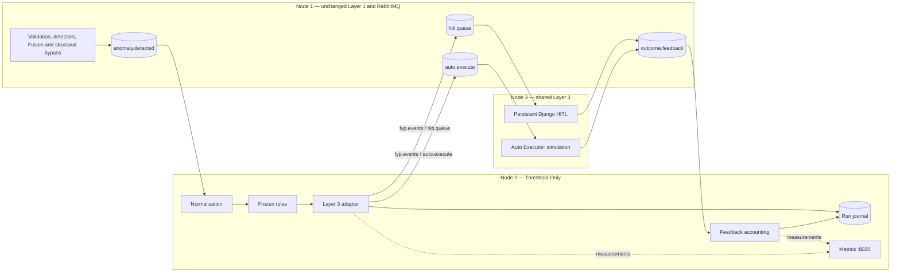

# Threshold-Only Baseline System

**Project:** Distributed Multi-Agent Coordination for Self-Healing Data Pipelines: A Human-in-the-Loop Approach on Commodity Hardware

## 1. Purpose

Threshold-Only represents conventional deterministic incident control in the three-condition comparison. It asks what useful behavior, if any, AI-assisted contextual control adds beyond a fixed rule table. It is a complete non-generative controller, not a weakened copy of the proposed Policy. No comparative result or architectural superiority is claimed here.

## 2. Architecture

All queues remain on the existing broker in vhost `fyp`. Threshold is the sole consumer of `anomaly.detected`; its separate accounting worker consumes `outcome.feedback`. One service starts both workers with independent broker connections and a shared metrics endpoint. Feedback has no decision-rule dependency.

## 3. Components

| Component | Responsibility |
|---|---|
| Normalizer | Validate identity and observable decision fields; distinguish fused/structural payloads while retaining the original. |
| Rule engine | First-match selection of risk, three actions, route, and deterministic rationale. |
| Compatibility adapter | Package native output into the nested fields consumed by existing Layer 3. |
| Journal | Durably retain deliveries, prepared/confirmed decisions, feedback, quarantine, and failures. |
| Feedback worker | Account for outcomes, duplicates, wrong-run messages, and unexpected identities; never adapt. |
| Metrics | Observe routing, processing, publication, errors, feedback, and worker health. |
| Capture/replay | Preserve exact incident bytes and ordering; reproduce a checksummed arrival schedule. |
| Analyzer | Compare canonical decisions with independent labels using the frozen denominators. |

## 4. Frozen rule table

Version `threshold-v1` is stored in [rules.json](rules.json). Its checksum is recorded in run metadata and decisions. Rules are evaluated in this exact order:

| Priority | Condition | Risk | Route | Reason |
|---|---|---|---|---|
| 1 | Unparseable input or no usable event ID | null | Quarantine; no decision | `TH_INPUT_UNIDENTIFIABLE` |
| 2 | Identifiable but invalid/inconsistent decision fields | null | HITL | `TH_INPUT_INVALID` |
| 3 | Structural schema bypass | HIGH | HITL | `TH_STRUCTURAL_SCHEMA` |
| 4 | Compound fused incident | HIGH | HITL | `TH_COMPOUND_REVIEW` |
| 5 | Single-detector schema incident | HIGH | HITL | `TH_SCHEMA_REVIEW` |
| 6 | Recognized CPU/error/throughput/auth; HIGH or CRITICAL | HIGH | HITL | `TH_SEVERITY_REVIEW` |
| 7 | Recognized CPU/error/throughput/auth; LOW or MEDIUM | LOW | AUTO | `TH_BOUNDED_RESPONSE` |
| 8 | Unknown family/detector identifier | null | HITL | `TH_UNSUPPORTED_INCIDENT` |

Rule 2 includes missing component/node, invalid severity/confidence types or ranges, duplicate/malformed contributors, conflicting fused fields, and inconsistent single/compound structure. Structural payloads must identify the Pydantic bypass and carry detection metadata. Unknown detector identifiers with otherwise valid structure reach rule 8; multiple valid distinct contributors reach the earlier compound rule.

No confidence AUTO threshold exists. Source timestamps may be missing without being invented. An unusable identity cannot be repaired from hidden labels or replaced with a fresh event ID.

## 5. Frozen action sets

Valid decisions carry exactly three distinct identifiers from the existing global action vocabulary. Rules 2/8 use `review`, rule 3/5 use `schema`, rule 4 uses `compound`, rule 6 uses the family intervention set, and rule 7 uses the family bounded set. Rule 1 has no actions.

| Set | Actions |
|---|---|
| review | `GENERIC_INVESTIGATE`, `MONITOR_AND_ALERT`, `CHECK_QUEUE_DEPTH` |
| schema | `HALT_INGESTION_REVIEW_SCHEMA`, `FLAG_FOR_SCHEMA_REVIEW`, `INVESTIGATE_UPSTREAM` |
| compound | `EMERGENCY_FULL_PIPELINE_REVIEW`, `COORDINATED_REMEDIATION`, `MONITOR_AND_ALERT` |
| cpu_memory_spike_bounded | `MONITOR_AND_ALERT`, `CHECK_QUEUE_DEPTH`, `LOG_AND_CONTINUE` |
| cpu_memory_spike_intervention | `SCALE_CONSUMER_RESOURCES`, `CHECK_QUEUE_DEPTH`, `MONITOR_AND_ALERT` |
| error_rate_surge_bounded | `INVESTIGATE_UPSTREAM`, `MONITOR_AND_ALERT`, `CHECK_QUEUE_DEPTH` |
| error_rate_surge_intervention | `CIRCUIT_BREAKER_OPEN`, `INVESTIGATE_UPSTREAM`, `MONITOR_AND_ALERT` |
| throughput_drop_bounded | `CHECK_QUEUE_DEPTH`, `INVESTIGATE_UPSTREAM`, `MONITOR_AND_ALERT` |
| throughput_drop_intervention | `RESTART_FAILED_CONSUMER`, `CHECK_QUEUE_DEPTH`, `INVESTIGATE_UPSTREAM` |
| auth_failure_flood_bounded | `RATE_LIMIT_AUTH`, `ALERT_SECURITY_TEAM`, `MONITOR_AND_ALERT` |
| auth_failure_flood_intervention | `ISOLATE_NODE`, `RATE_LIMIT_AUTH`, `ALERT_SECURITY_TEAM` |

Neither action sets nor routing rules are tuned to observed output proportions. The baseline reads the authoritative vocabulary without importing live agents.

## 6. Message contracts

**Fused input:** identity, original timestamp/ingestion time, node/component, `fused_severity`, `fused_confidence`, `fusion_type`, contributors, `fused_at`, and `note`. Fusion does not supply top-level anomaly type, raw metrics, or original free-text context. The normalizer maps the five current detector IDs; multiple contributors normalize to compound.

**Structural input:** `anomaly_type=schema_drift`, severity, computed Layer 1 risk, node/component, context, `bypass_fusion=true`, Pydantic detector identity, and metadata. Incoming risk is retained only inside the original payload. Structural input confidence is null.

**Native decision:** run/controller/rule identity and checksum; event ID, origin, family, severity, node/component; input confidence and its source; controller risk, actions, route, reason, rationale, input status; original event; receipt, decision-ready, and publication-confirmation timestamps; processing/publication durations and available replay timing. `controller` is `threshold_only`.

**Compatibility envelope:** original ID, run/controller identity, route/reason, decision timestamp under legacy `policy_timestamp`, and nested `full_reasoning_chain.triage_result` and `strategy_result.llm_response`. These are serialization aliases. The original event and deterministic rationale are preserved; model confidence is null. No fake Triage/Strategy execution, Policy latency, model validation, tokens, or inference calls are reported.

**Feedback:** original event ID, outcome type, actual actions, operator notes, reported resolution milliseconds, and original controller envelope. The recorder persists exact raw bytes and parsed payload where valid, together with accounting status and receive time. Baseline run/controller identity must agree with the nested envelope. Duplicate or conflicting feedback is retained.

## 7. Determinism

For identical normalized input and rule revision, risk, actions, route, reason, and rationale are identical. The rules contain no randomness, network lookup, learned memory, output-derived tuning, or feedback update. Operational timestamps, queues, storage cost, and measured latency can vary.

A repeated confirmed event ID is not republished. A different body reusing the same ID is quarantined. This is run accounting, not adaptive control.

## 8. Isolation from Proposed Layer 2

No LLM, Ollama, RAG, ChromaDB, Triage agent, Strategy agent, separate Policy agent, Learning agent, or adaptive threshold is active. Shared vocabulary access is read-only and side-effect-free. Proposed Layer 2 code, configuration, results, and dashboards remain unchanged.

Live startup requires explicit broker configuration and an explicit `--live` flag. It refuses competing consumers on the controller, proposed intermediate, and feedback queues. Manual run preparation must still exclude old gateway processes and stale publishers.

## 9. Layer 3 reuse

The existing Auto Executor, Django HITL consumer/views/models, shared SQLite writer, feedback publication, and metrics are reused. AUTO remains simulated; approval/rejection/modification record human outcomes, not service restoration.

The optional [neutral presentation overlay](../common/README.md#optional-neutral-hitl-presentation) changes only template selection through a separate settings module. Use it consistently for formal conditions. Existing application files are not rewritten. The native journal remains authoritative because shared SQLite column names retain their historical LLM terminology and lack a controller/run key.

## 10. Metrics and observability

Port `8020` is checked by binding before consumption. All metric names use `fyp_threshold_`:

| Suffix | Type | Bounded labels |
|---|---|---|
| `incident_deliveries_total` | Counter | none |
| `incidents_received_total` | Counter | origin |
| `malformed_input_total` | Counter | reason |
| `duplicate_incidents_total` | Counter | none |
| `decisions_total` | Counter | route, reason, risk |
| `action_sets_total` | Counter | status |
| `processing_failures_total` | Counter | stage |
| `controller_processing_seconds` | Histogram | none |
| `publish_seconds` | Histogram | none |
| `input_queue_wait_seconds` | Histogram | none |
| `boundary_to_decision_seconds` | Histogram | none |
| `feedback_received_total` | Counter | outcome |
| `feedback_duplicates_total` | Counter | none |
| `feedback_errors_total` | Counter | reason |
| `worker_up` | Gauge | worker |

Local processing covers receipt-side journaling, normalization and rule selection until decision readiness; publish timing covers confirmed broker publication. Boundary timing additionally includes queue/storage work when fresh replay headers support it. Missing boundary evidence is not replaced with original capture/event time. Histograms and counters are process-local observations, not a replacement for offline reconciliation.

A separate Prometheus template and Grafana dashboard provide shared Layer 1/3, broker, node, and Threshold panels. The template needs live-config reconciliation before deployment; it is not a claimed reproduction of the current server configuration. Mode A Layer 1 panels are explicitly N/A.

## 11. Evaluation modes and repetition

Mode A is primary: capture unchanged `anomaly.detected` output once, freeze checksums and schedule, and replay the same population into each controller. Mode B runs unchanged SEG/Layer 1 before the selected controller and shared Layer 3. Its actual incident population is measured, not forced to match an earlier total.

Prefer the full captured population. If repeated LLM runs are too costly, the approved candidate is one full run per architecture plus three repetitions on a frozen stratified subset. Balanced repeated order is Threshold/Single-Agent/Proposed, then Proposed/Threshold/Single-Agent, then Single-Agent/Proposed/Threshold. Final subset and repetition decisions must precede formal execution.

## 12. Fairness controls

Keep incident bytes, order, schedule, action vocabulary, handling backend, physical hosts, network condition, and annotation assumptions consistent. Freeze rule/action revisions and compare controller packages without attributing every effect solely to component count. Primary architectural comparisons use Wi-Fi; Ethernet remains a separate infrastructure comparison.

Independent labels are unavailable to running controllers. Neutral UI labels do not establish blinding if rationale exposes the condition. Use explicit timestamp boundaries, record incomplete/failed runs, and preserve duplicate side effects in reliability evidence.

## 13. Ground truth and FAR/FER

Follow the [independent annotation rubric](../datasets/README.md). Ambiguous records remain in workload/completion accounting but are excluded from quality denominators. Scoreable risk is LOW/HIGH. Unsafe incidents cannot be labeled AUTO-eligible.

- **FAR:** unsafe incidents routed AUTO / all independently labeled unsafe incidents.
- **FER:** safe incidents labeled expected AUTO but routed HITL / all independently labeled safe incidents expected AUTO.
- **Route/risk accuracy:** correct classifications / all scoreable labeled incidents, including missing decisions in the denominator.
- **Completion:** uniquely scoreable dispatched decisions / expected captured identities.

Zero denominators return `not computable`. Missing decisions do not inflate FAR/FER numerators; always interpret those rates with completion. Action validity, acceptable-alternative coverage, selected-action relevance, and prohibited-action counts are distinct. No comparison result is fabricated.

## 14. Cold state

Archive prior evidence. Stop proposed agents and Learning. Reconcile/drain relevant queues after preservation. Reset/isolate both Django HITL and the shared decision table on the selected gateway; do not change original IDs. Start a fresh journal and selected workers, verify ownership and monitoring, then replay the approved schedule.

Mode A needs no Layer 1 restart/reset. Mode B uses the frozen Layer 1 cold procedure. Threshold initialization never resets Chroma, EMA, or Ollama. Runtime reset commands are intentionally not automated by the baseline.

## 15. Known limitations

Static rules lack contextual generative reasoning or adaptive learning. Detector/Fusion confidence is not calibrated controller confidence. Compatibility keys and SQLite columns retain legacy names. Repeated event IDs require per-run Layer 3 isolation. AUTO is simulated handling, and feedback provides no MTTR or verified real recovery.

Broker confirmations and durable recording precede ACK, but their cross-system crash window remains: this is not exactly-once execution. Existing Layer 3 has its own duplicate/action/feedback failure limitations, unchanged here. Capture/replay partial failures require reconciliation; the CLI does not automatically resume old run directories.

Live RabbitMQ integration, deployed scrape configuration, and Grafana rendering must be validated in an isolated experiment environment. Offline tests and dry-run envelopes do not establish live end-to-end completion. Required-action-category scoring and other-controller native exports need their own frozen mappings before use. No hardware/network or comparative-performance claim follows from implementation alone.
