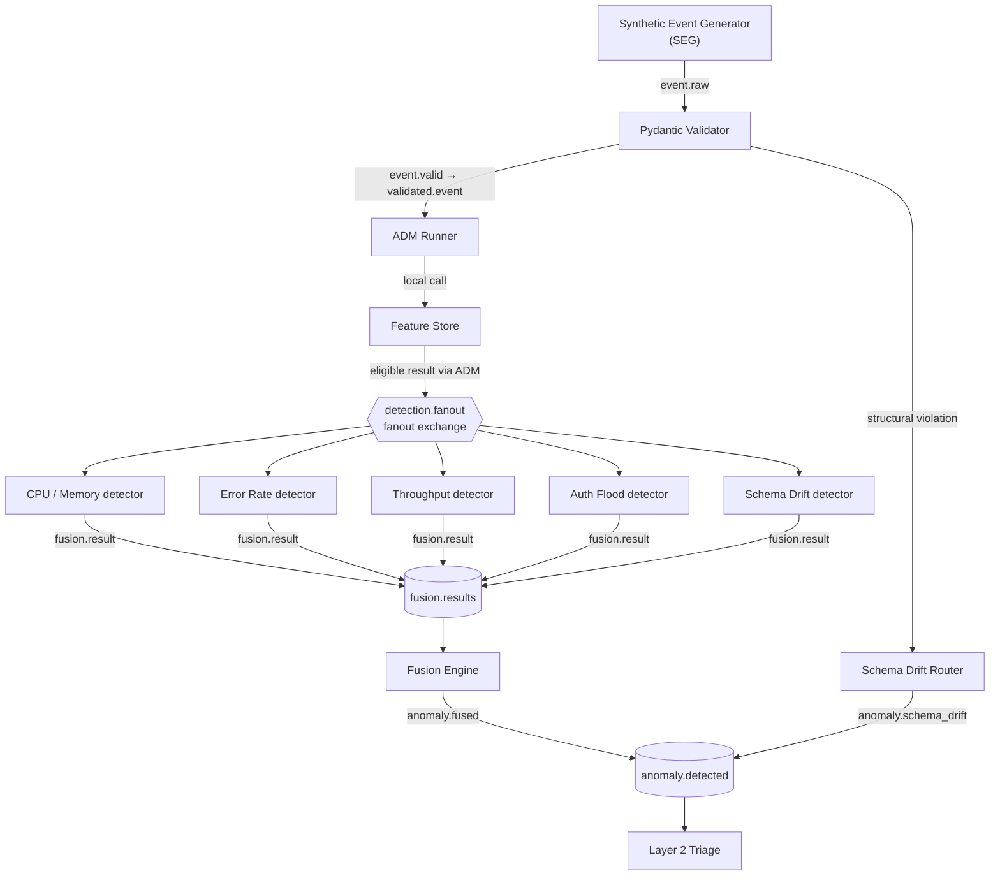
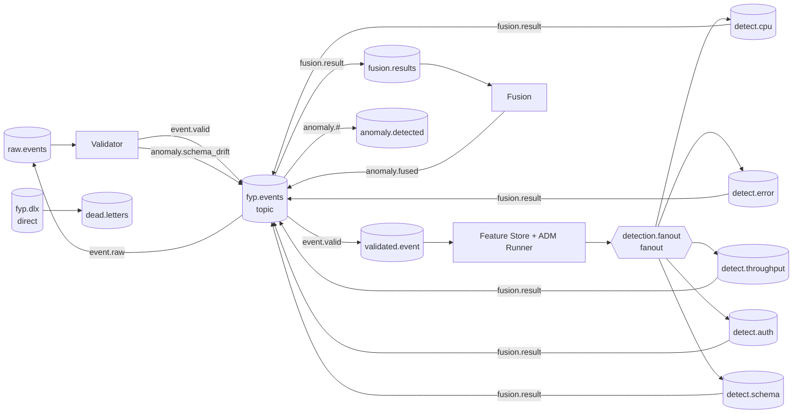

# Layer 1 — Real-Time Statistical Data Plane

Layer 1 is the deterministic detection and correlation plane in **Distributed Multi-Agent Coordination for Self-Healing Data Pipelines: A Human-in-the-Loop Approach on Commodity Hardware**. It receives
telemetry, validates its structure, derives statistical features, runs five
lightweight anomaly detectors, and publishes correlated incidents to
`anomaly.detected` for Layer 2.

The active runtime is deliberately statistical and rule-based. It has **no
active Random Forest, Isolation Forest, scikit-learn, joblib, or other ML-model
inference path**. The retained scripts in
`layer1/evaluation/historical/` are historical/offline experiments only and
must not be interpreted as production components.

This README is the Layer 1 overview. The detailed implementation reference is
[the component log](docs/layer1_component_log.md). For the complete
cross-layer reproduction procedure, use the root
[Full_Rerun.md](../Full_Rerun.md); this document intentionally is not a second
runbook.

## 1. Purpose in the overall architecture

Layer 1 turns raw telemetry into two categories of incidents:

1. **Fused statistical incidents**: valid events that pass through feature
   extraction, five detectors, and Fusion.
2. **Structural schema incidents**: malformed events that are reported
   immediately by the validation boundary.

Layer 2 receives both categories from `anomaly.detected`, normalizes their
different payload shapes during Triage, and owns AI reasoning and policy. Layer
1 does not choose remediation actions and does not make an LLM call.

## 2. Physical deployment and portability

The reference distributed environment uses the hostname `stream-node` as the
Layer 1 RabbitMQ endpoint and for the Layer 1 services' default connection
target. The synthetic corpus also uses the node labels `stream-node`,
`ai-brain-node`, and `gateway-node`. These names are configuration and
deployment identifiers, not a requirement to use fixed IP addresses.

RabbitMQ, each long-running Layer 1 consumer, and Prometheus scraping must be
reachable in the chosen deployment. The active source/configuration uses
hostnames rather than making an IP address part of the architecture.

Two local-output locations are portable:

| Purpose | Default | Override |
|---|---|---|
| Frozen Feature Store baselines | `layer1/feature_store/baselines/` | `LAYER1_BASELINES_DIR` |
| Detector JSONL evaluation copies | `layer1/runtime_results/` | `LAYER1_RESULTS_DIR` |

The detector configuration path can likewise be overridden with
`LAYER1_DETECTOR_CONFIG`. These variables allow a multi-terminal or
multi-machine experiment without documenting a developer-specific absolute
path.

## 3. High-level architecture

The normal path and the structural-bypass path are intentionally different.
Only structurally valid events can enter feature extraction and multi-detector
Fusion.



### Component summary

| Component | Active responsibility |
|---|---|
| Synthetic Event Generator (SEG) | Generates/replays the fixed evaluation corpus and separates evaluation-only ground truth from runtime payloads. |
| Pydantic Validator | Enforces the event schema and separates valid events from structural schema violations. |
| Schema Drift Router | Converts a structural validation failure into a direct, normalized schema-drift incident. |
| Feature Store | Maintains rolling state and component calibration baselines, then emits derived statistical features. |
| ADM Runner | Hosts the Feature Store in-process and publishes every eligible enriched event once to the detector fanout. |
| Five detectors | Independently evaluate the same enriched event using deterministic rules. |
| Fusion Engine | Correlates unique detector results by event ID, suppresses non-incidents, and publishes one fused incident when warranted. |
| RabbitMQ topology | Provides durable topic, fanout, and dead-letter routing contracts. |

## 4. RabbitMQ topology and event lifecycle

`fyp.events` is a **topic** exchange. It carries the normal ingress, validated
event, detector-result, and fused-output routing keys. `detection.fanout` is a
**fanout** exchange: its binding keys are empty and every eligible enriched
event is copied to all five detector queues. It does not distribute work by
routing key. `fyp.dlx` is a **direct** dead-letter exchange that routes failed
deliveries to `dead.letters`.



The relevant queues are `raw.events`, `validated.event`, `detect.cpu`,
`detect.error`, `detect.throughput`, `detect.auth`, `detect.schema`,
`fusion.results`, `anomaly.detected`, and `dead.letters`. The topology setup
also declares downstream queues outside Layer 1; they are not part of the
Layer 1 detection decision path.

### Normal validated event

1. SEG publishes a raw event to `fyp.events` with routing key `event.raw`.
2. The Validator accepts the event and republishes it as `event.valid`.
3. ADM Runner calls the in-process Feature Store. A cold component can be
   withheld while its baseline is calibrated.
4. Every eligible enriched event is published once to `detection.fanout`.
5. Each detector publishes exactly one normal or anomalous result with routing
   key `fusion.result`.
6. Fusion collects detector identities by `event_id` and publishes a fused
   incident only when its deterministic rules permit it.

### Structural schema violation

Examples include SEG's `missing_field` and `type_mutation` variants. They fail
normal Pydantic validation and are converted by the Schema Drift Router into
`anomaly.schema_drift` messages. They bypass the Feature Store, ADM fanout,
all detectors, and Fusion.

By contrast, `value_shift` is structurally valid. It continues through the
normal path, where the Schema Drift detector recognizes
`metric_values.distribution_shift_marker == 1.0`. This is the active
value-shift mechanism; PSI is not an active feature or detector signal.

## 5. Statistical detection and Feature Store behavior

The Feature Store has two distinct scopes:

| State | Key | Why |
|---|---|---|
| Rolling event window | `(node, affected_component)` | Avoids mixing observations for a component across nodes. |
| Calibration baseline | `affected_component` | Pools node observations for the same component to reach a baseline sooner. |

The calibration size is `20` events per component. During a cold-state run,
events for a component that has not reached its baseline are consumed and
acknowledged but not sent to `detection.fanout`. On reaching calibration,
the baseline is persisted and the event is eligible for feature extraction.

The active vector contains rolling mean, standard deviation, minimum, maximum,
Z-score, rate of change, spike count, short/long moving averages, Auth rolling
rate, and event-time silence information. For throughput, silence is based on
the event timestamp: a current zero reading is compared with the previous
non-zero reading; a non-zero current reading produces zero silence. Missing or
unparseable time safely produces zero, while no earlier non-zero reading in
the active window uses the `9999.0` sentinel.

The fixed corpus contains 19 unique components. Seventeen reach the Feature
Store and become baseline-calibrated; two appear only in structural schema
violations and never enter the Feature Store.

### Detector summary

| Detector | Model identity | Primary decision rules | Published anomaly type |
|---|---|---|---|
| CPU / Memory Spike | `z_score_cpu_memory` | Absolute CPU/MEM Z-score > 2, or raw CPU/MEM > 70%. | `cpu_memory_spike` |
| Error Rate Surge | `z_score_error_rate` | Absolute error-rate Z-score > 2, or raw error rate > 10%. | `error_rate_surge` |
| Throughput Drop | `moving_average_throughput` | Event-time silence, short/long moving-average fall, or raw throughput < 40 mps. | `throughput_drop` |
| Auth Failure Flood | `statistical_auth_rate` | Current/rolling auth failures > 20/min or change >= 15. | `auth_failure_flood` |
| Schema Drift | `distribution_shift_marker` | `distribution_shift_marker == 1.0`. | `schema_drift` |

Each detector consumes one dedicated `detect.*` queue, uses prefetch 1, and
publishes a result whether it detects an anomaly or not. The result preserves
`event_id`, `timestamp`, `ingestion_time`, `node`, and
`affected_component`, and includes `detected`, `anomaly_type`, `severity`,
`confidence`, `model_name`, and detector-specific `metadata`. This complete
five-result contract lets Fusion distinguish a normal detector outcome from a
missing detector result.

## 6. Fusion Engine behavior

Fusion consumes `fusion.results`, stores at most one result per
`model_name` for an `event_id`, and uses `processed_event_ids` to protect
against results received after finalization. It can finalize immediately once
all five expected model identities arrive. Otherwise, it uses a **3.0-second
primary correlation window** followed by a **0.75-second recovery window**,
for a maximum collection opportunity of approximately **3.75 seconds**.

Fusion publishes to `anomaly.fused` only if there is an anomalous detector
result and the decision passes the confidence rules. An all-normal set is
suppressed. A single anomaly below `min_confidence_to_publish = 0.30` is also
suppressed. A compound result has two or more anomalous, unique detector
models. Severity and the highest weighted confidence are retained with the
event context.

The Fast Path marks a CRITICAL, sufficiently weighted result as priority inside
the correlation logic. It increments Fast Path instrumentation but **does not**
skip correlation or publish an incident early.

## 7. Metrics and observability

The Validator exposes metrics on port 8002; Fusion uses port 8003; the Error,
Throughput, Auth, CPU, and Schema detectors use ports 8004–8008 respectively.
The ADM Runner and Feature Store do not expose independent HTTP metric
endpoints.

Important operational metrics include:

| Area | Implemented metrics |
|---|---|
| Validator | `fyp_validator_events_total`, `fyp_validator_valid_total`, `fyp_validator_schema_violations_total`, `fyp_validator_errors_total`, `fyp_validator_latency_seconds` |
| Each detector | `fyp_detector_evaluations_total`, `fyp_detector_anomalies_total`, `fyp_detector_errors_total`, `fyp_detector_latency_seconds` |
| Fusion | `fyp_fusion_published_total`, `fyp_fusion_suppressed_total`, `fyp_fusion_compound_total`, `fyp_fusion_fast_path_total`, `fyp_fusion_fast_path_triggered_total`, `fyp_fusion_correlation_wait_seconds`, `fyp_fusion_late_recovery_total`, `fyp_fusion_latency_seconds`, `fyp_fusion_errors_total`, `fyp_fusion_detectors_received` |

These are operational counters and histograms. Layer 1 does not claim live
MTTA, MTTR, FAR, FER, precision, or recall metrics from Prometheus alone.

## 8. Evaluation methodology

The authoritative Wi-Fi experiment is `wifi_cold_20260913_041045`. It used a
cold-state procedure: queues and prior baseline state were reset, fresh local
runtime results were collected, and the same fixed generated corpus was
replayed through independently running Layer 1 processes.

The production path receives only the event JSON. SEG writes ground truth
separately to the evaluation label artifact; labels are never an input to the
Feature Store, detectors, or Fusion.

| Corpus category | Events |
|---|---:|
| NORMAL | 1,000 |
| cpu_memory_spike | 200 |
| error_rate_surge | 200 |
| throughput_drop | 200 |
| auth_failure_flood | 200 |
| schema_drift | 150 |
| **Total** | **1,950** |

The 150 schema-drift records consist of 50 `missing_field`, 50
`type_mutation`, and 50 `value_shift` events. The first two categories are
structural bypasses; the third is valid and participates in detector/Fusion
processing.

## 9. Final Wi-Fi experimental results

The following values are the authoritative observed outcomes for
`wifi_cold_20260913_041045`:

| Stage or outcome | Observed count |
|---|---:|
| Validator received | 1,950 |
| Validator valid | 1,850 |
| Structural schema violations | 100 |
| Evaluations / runtime result records for **each** detector | 1,527 |
| Fusion published | 539 |
| Fusion suppressed | 988 |
| Fusion compound | 43 |
| Fusion Fast Path | 83 |
| Fusion late recovery | 0 |
| Fused messages delivered to `anomaly.detected` | 539 |
| Structural messages delivered to `anomaly.detected` | 100 |
| **Total Layer 1 incidents delivered toward Layer 2** | **639** |

The accounting relationships are exact:

```text
1,527 Fusion-eligible events = 539 published + 988 suppressed
639 anomaly.detected incidents = 539 fused + 100 structural bypass
```

The detector anomaly counters were CPU **197**, Error **150**, Auth **124**,
Schema **31**, and Throughput **141**. These are runtime detection counts,
not TP counts, and must not be converted into precision, recall, or false
positive claims without a separate evaluator that joins final-run labels and
outputs.

Observed dashboard summaries were approximately:

| Measurement | Observed value |
|---|---:|
| Detector processing latency p50 / p95 | 2.50 ms / 4.75 ms |
| Fusion processing latency p50 / p95 | 432 µs / 944 µs |
| Fusion correlation wait p50 / p95 | 5 ms / 9.50 ms |
| Fusion suppression rate | 64.7% |

Dashboard values are reported at their available visual precision. They are not
presented as raw-histogram exact values.

## 10. Interpretation and limitations

The experiment demonstrates a reproducible, lightweight statistical data plane
with explicit event accounting from ingress to Layer 2. It does not establish
universal detector performance or general scalability.

- Cold-start calibration intentionally withholds early events for each
  component, so detector/Fusion eligibility is lower than validated ingress.
- Thresholds and confidence scaling are workload-dependent and should be
  re-evaluated for a new data distribution.
- Structural schema violations bypass multi-detector Fusion by design.
- Valid value-shift detection is an explicit marker check, not distribution
  learning.
- The final run used a controlled synthetic corpus. Its counts and latency
  observations should not be generalized to other workloads without further
  measurement.
- Historical/offline detector performance figures, where retained, are not
  final Wi-Fi runtime precision/recall claims.

## 11. Directory guide

```text
layer1/
├── README.md                         Layer 1 overview (this file)
├── docs/
│   └── layer1_component_log.md       Detailed implementation reference
├── seg/                              Corpus generation and replay
├── validator/                        Pydantic validation and structural routing
├── feature_store/                    Rolling features and calibration baselines
├── adm/                              ADM runner, detector configs, five detectors
├── fusion_engine/                    Correlation and publication
├── rabbitmq/                         Exchange/queue topology declaration
└── evaluation/
    └── historical/                   Offline ML experiments; not runtime code
```

## 12. Further reading

- Read [the Layer 1 component log](docs/layer1_component_log.md) for source
  files, message contracts, detailed rules, failure paths, and per-component
  Mermaid diagrams.
- Read [Full_Rerun.md](../Full_Rerun.md) for the authoritative end-to-end
  setup and execution procedure. It is deliberately maintained outside the
  Layer 1 documentation boundary.
