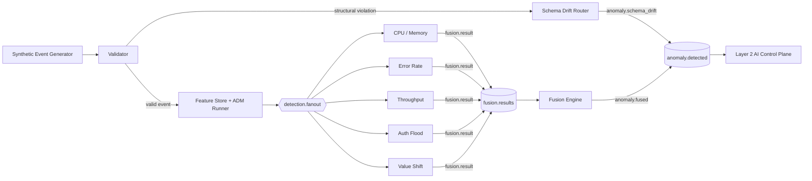
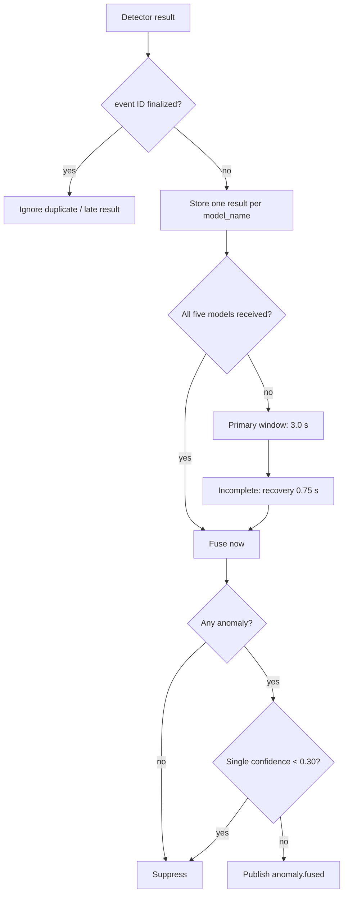

# Layer 1 — Real-Time Statistical Data Plane

Layer 1 validates telemetry, derives rolling statistical features, detects
anomalies with deterministic rules, and correlates signals before publishing to
`anomaly.detected`. AI reasoning is delegated to Layer 2. No Random Forest,
Isolation Forest, model artifact, or ML inference is in the runtime path.

## Architecture

Structural drift (missing field/type mutation) bypasses feature extraction and
Fusion. Structurally valid `value_shift` follows the normal path and uses the
deterministic `distribution_shift_marker` detector.

## Detectors and configuration

Thresholds are in [`adm/config/detector_config.json`](adm/config/detector_config.json),
loaded and validated at detector startup; safe code defaults apply if absent.

| Detector | Runtime rule |
|---|---|
| CPU / Memory | Absolute Z-score > 2.0, or raw CPU/MEM > 70% |
| Error rate | Absolute Z-score > 2.0, or raw error rate > 10% |
| Throughput | Silent crash, moving-average drop, or raw throughput < 40 mps |
| Auth flood | Current/rolling rate > 20/min, or rate change >= 15 |
| Value shift | `distribution_shift_marker == 1.0` |

Auth retained TP 124/200, FP 0, precision 100%, recall 62%, and F1 ~76.5%.
The 76 apparent misses are withheld by the upstream calibration gate; they do
not reach the detector. RF/Isolation Forest work is historical only under
`evaluation/historical/`.

## Feature Store

Rolling windows are per `(node, affected_component)`; calibration baselines are
per component, with `calibration_n = 20`. Calibration events are consumed but
not fanned out. Active features include rolling summaries, Z-scores,
rate-of-change, spike counts, moving averages, stream-time silence, and Auth
rate. PSI was removed because it was neither a decision signal nor reliable for
the small mixed windows.

`silence_duration_s` measures event-time between the current zero-throughput
event and its previous non-zero event, making replay deterministic. Invalid
timestamps safely yield `0.0`. Baselines use a module-relative default or
`LAYER1_BASELINES_DIR`; detector JSONL copies use `layer1/runtime_results/` or
`LAYER1_RESULTS_DIR`.

## Fusion

Fusion groups by `event_id`, deduplicates model identities and finalized IDs,
and uses the highest weighted detector confidence. A compound has two or more
anomalous detector models. Fast path records a CRITICAL, high-weight signal but
does not publish early; full correlation still completes.

## Final live distributed evaluation

| Measure | Result |
|---|---:|
| Generated / validated / Fusion eligible | 1,950 / 1,850 / 1,527 |
| Structural bypass anomalies | 100 |
| Fusion published / suppressed | 539 / 988 |
| Compound / fast-path incidents | 43 / 83 |
| Total `anomaly.detected` publications | 639 |

`539 + 988 = 1,527`; 639 is 539 fused incidents plus 100 structural bypass
anomalies. Live 5.0-second and 3.0-second primary windows, each with 0.75-second
recovery, produced identical observed counts for this workload. Final timing is
3.0 + 0.75 seconds; it is validated for this environment, not claimed universal.

## RabbitMQ and metrics

`detection.fanout` broadcasts every enriched event to the five detector queues.
`fyp.events` is the topic bus; `fusion.results` receives `fusion.result`, and
`anomaly.detected` receives `anomaly.#` for both fused and structural payloads.
Layer 2 Triage normalizes those two payload categories.

| Endpoint | Port |
|---|---:|
| Validator; Fusion | 8002; 8003 |
| Error; Throughput; Auth; CPU; Schema | 8004–8008 |

See the [component log](docs/layer1_component_log.md) for implementation detail.
