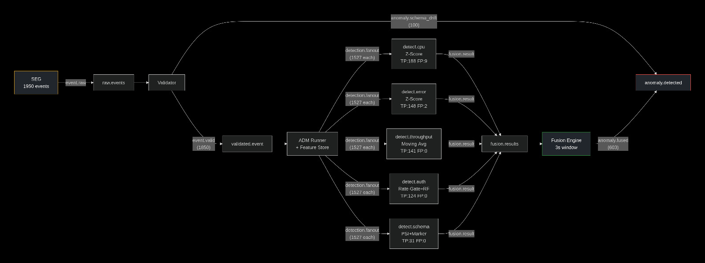

# Layer 1 User Guide — stream-node (192.168.18.101)

This guide covers installing, configuring, and running the full Layer 1 stack on Node 1
from scratch.  Complete **Phase 0 Infrastructure** before starting here — RabbitMQ,
static IPs, passwordless SSH, and NTP must all be verified first.

---

## 1. Prerequisites Checklist

Before running any Layer 1 component, verify the following on `stream-node`:

```bash
# Static IP and hostname
hostname          # must return "stream-node"
ip addr show      # 192.168.18.101 must be present

# RabbitMQ running with the fyp vhost
sudo systemctl status rabbitmq-server
sudo rabbitmqctl list_vhosts | grep fyp

# /etc/hosts cluster mapping (all three nodes)
grep "192.168.18" /etc/hosts
# Expected:
# 192.168.18.101  stream-node
# 192.168.18.102  ai-brain-node
# 192.168.18.103  gateway-node

# NTP synchronised
chronyc tracking | grep "Leap status"
```

---

## 2. Python Environment Setup

```bash
cd ~/fyp-pipeline
python3 -m venv .venv
source .venv/bin/activate

# Install all Layer 1 dependencies
pip install -r layer1/requirements_node1.txt
```

Key packages and their roles:

| Package | Used by |
|---|---|
| `pika` | All RabbitMQ consumers (Validator, ADM Runner, detectors, Fusion Engine) |
| `pydantic` | Validator (PipelineEvent schema) |
| `numpy`, `scikit-learn`, `joblib` | ADM detectors (Random Forest, Isolation Forest training) |
| `prometheus_client` | Metrics endpoints for Validator, detectors, and Fusion Engine |
| `structlog` | Structured logging across all components |

---

## 3. Dataset Download and Placement

The three evaluation datasets must be placed in `~/fyp-pipeline/datasets/`:

```
datasets/
├── KDD99/
│   └── kddcup.data_10_percent
├── Loghub/
│   └── HDFS/
│       └── HDFS_1/
│           ├── anomaly_label.csv
│           └── HDFS.log
├── NAB/
│   └── realKnownCause/
│       ├── ambient_temperature_system_failure.csv
│       ├── cpu_utilization_asg_misconfiguration.csv
│       └── machine_temperature_system_failure.csv
└── README.md
```

See `datasets/README.md` for download links and expected sizes.

---

## 4. Layer 1 Data Flow (Overview)



The pipeline path: **SEG → Validator → Feature Store + ADM Runner → 5 detectors → Fusion Engine → anomaly.detected**.

Schema‑drift events (`missing_field` / `type_mutation`) bypass the detectors and go directly
to `anomaly.detected`.  Normal events are suppressed by the Fusion Engine.

---

## 5. Cold‑Start vs. Warm‑Start

The Feature Store maintains per‑component baselines that are persisted to disk
(`adm/baselines/`).  Two evaluation modes exist:

| Mode | How to activate | Expected behaviour |
|---|---|---|
| **Cold‑start** | Delete `adm/baselines/*.json` before the run | Every component undergoes the 20‑event calibration phase. ~1 527 events forwarded to detectors, ~323 withheld. |
| **Warm‑start** | Keep baselines from a previous run | Most components reload their frozen baseline and skip calibration. ~1 820 events forwarded. |

**For reproducible evaluation results, always use cold‑start mode.**  
The commands in this guide assume a cold start unless stated otherwise.

---

## 6. Running the Synthetic Event Generator (SEG)

### 6.1 Generate the corpus (do once)

```bash
cd ~/fyp-pipeline/layer1/seg
python3 seg.py --mode generate --output ../../evaluation/
```

This creates `evaluation/events_1950.jsonl` (1 950 events) and `evaluation/labels.csv` (ground truth).

### 6.2 Replay the corpus onto RabbitMQ

```bash
cd ~/fyp-pipeline/layer1/seg
python3 seg.py --mode replay --speed 50 --input ../../evaluation/events_1950.jsonl
```

- `--speed 50` replays at 50× real‑time (finishes in ~30 s).
- Use `--speed 1` for a realistic 30‑minute HDFS‑style stream test.
- Events are published to `fyp.events` with routing key `event.raw`.
- **Timestamp note:** During replay, SEG adds an `ingestion_time` field to each event (real UTC time the event enters the pipeline). This is separate from the original synthetic `timestamp`.

Verify events are flowing:

```bash
watch -n 1 'sudo rabbitmqctl list_queues -p fyp name messages | grep raw.events'
```

---

## 7. Running the Pydantic Validator

```bash
cd ~/fyp-pipeline/layer1/validator
python3 validator.py
```

**What to expect:**
- `Loaded config from .../validator_config.json`
- `validator_initialised`
- `validator_started ... waiting_for_messages=True`

The Validator consumes from `raw.events`, validates every event against the
`PipelineEvent` schema, and routes:
- **Valid events** → `validated.event` (routing key `event.valid`)
- **Invalid events** → `anomaly.detected` directly (routing key `anomaly.schema_drift`)

Out of the 1 950‑event corpus, exactly **100 events** bypass to `anomaly.detected`
and **1 850** proceed to `validated.event`.

**Metrics:** The Validator exposes Prometheus metrics on port **8002** (events total, valid, schema violations, latency).

---

## 8. Running the Feature Store + ADM Runner

The Feature Store is an in‑process library called by the ADM Runner — no separate process needed.

```bash
cd ~/fyp-pipeline/layer1/adm
python3 adm_runner.py
```

**What to expect:**
- `feature_store_initialised`
- `adm_runner_started`

The ADM Runner consumes from `validated.event`, enriches each event with a
`feature_vector` (Z‑scores, rolling statistics, PSI scores, etc.), and fans out
the enriched event **once** to `detection.fanout`.  All five `detect.*` queues
receive identical copies.

During calibration (first 20 events per component), events are **withheld** — the
ADM Runner logs `event_withheld_calibrating` and does not fan them out.

### 8.1 Verify calibration progress

```bash
ls ~/fyp-pipeline/layer1/adm/baselines/
```

Baseline JSON files appear as components reach 20 events.  After a cold‑start run,
expect **17 baseline files**.

---

## 9. Running the Anomaly Detectors

Each detector is a standalone RabbitMQ consumer. For correct Fusion Engine correlation,
start all five detectors concurrently after the Fusion Engine is already running.

```bash
cd ~/fyp-pipeline/layer1/adm

python3 detectors/error_rate.py &
python3 detectors/throughput_drop.py &
python3 detectors/auth_flood.py &
python3 detectors/cpu_spike.py &
python3 detectors/schema_drift.py &

wait
```

Each detector publishes **every** result to `fusion.results` (routing key `fusion.result`),
whether it detected an anomaly or not.  This allows the Fusion Engine to know all
five detectors have processed the event.

### 9.1 Training the ML models (do once before first run)

Two detectors use pre‑trained models.  Train them once and the models are saved to `adm/models/`:

```bash
cd ~/fyp-pipeline/layer1/adm

# Random Forest for auth detector (KDD99 dataset)
python3 detectors/train_auth_model.py

# Isolation Forest for CPU detector (NAB dataset — trained but currently unused; Z‑score is primary)
python3 detectors/train_cpu_model.py
```

The CPU detector currently uses Z‑scores from the Feature Store; the Isolation Forest
model is saved for future hybrid confidence‑adjustment.

### 9.2 Detector Metrics

Each detector exposes Prometheus metrics on its own port:

| Detector | Port |
|---|---|
| `error_rate` | 8004 |
| `throughput_drop` | 8005 |
| `auth_flood` | 8006 |
| `cpu_spike` | 8007 |
| `schema_drift` | 8008 |

Metrics include evaluation counts, anomaly counts, detector errors, and latency histograms.

---

## 10. Running the Fusion Engine

Start the Fusion Engine **before** the detectors:

```bash
cd ~/fyp-pipeline/layer1/fusion_engine
python3 fusion_engine.py
```

The Fusion Engine:
- Consumes all detector results from `fusion.results`
- Groups them by `event_id` within a primary **5‑second** correlation window plus a **0.75‑second** late‑arrival recovery window
- Publishes a single fused decision to `anomaly.detected` (routing key `anomaly.fused`)
- Suppresses events where all five detectors return normal
- Preserves original `timestamp` and `ingestion_time` in fused events

Prometheus metrics are exposed on port **8003**.

---

## 11. Verifying End‑to‑End Layer 1 Output

After running all components, check the final queue depths:

```bash
sudo rabbitmqctl list_queues -p fyp name messages | grep -E "raw.events|validated.event|detect\.|fusion.results|anomaly.detected"
```

**Expected cold‑start results:**

| Queue | Messages |
|---|---|
| `raw.events` | 0 |
| `validated.event` | 0 |
| `detect.cpu` | 0 |
| `detect.error` | 0 |
| `detect.throughput` | 0 |
| `detect.auth` | 0 |
| `detect.schema` | 0 |
| `fusion.results` | 0 |
| `anomaly.detected` | 632 (100 bypass + 532 fused) |

### 11.1 Inspect fused results

```bash
wc -l ~/fyp-pipeline/layer1/fusion_engine/fusion_results.jsonl
head -1 ~/fyp-pipeline/layer1/fusion_engine/fusion_results.jsonl | python3 -m json.tool
```

A fused event should contain:
- `timestamp` – original synthetic event time
- `ingestion_time` – real time the event entered the pipeline
- `fused_at` – fusion processing time
- `fused_severity`, `fused_confidence`, `fusion_type`, `contributing_models`

### 11.2 Prometheus / Grafana

Prometheus on `gateway-node` scrapes all Layer 1 metrics endpoints:
- Fusion Engine: `stream-node:8003`
- Validator: `stream-node:8002`
- Detectors: `stream-node:8004`‑`8008`

Grafana dashboard "Agent Pipeline & Fusion Engine" visualises these metrics.

---

## 12. Complete Cold‑Start Run (single sequence)

```bash
# 1. Purge everything
rm -f ~/fyp-pipeline/layer1/adm/baselines/*.json
rm -f ~/fyp-pipeline/layer1/adm/*_results.jsonl
rm -f ~/fyp-pipeline/layer1/fusion_engine/fusion_results.jsonl

sudo rabbitmqctl purge_queue raw.events -p fyp
sudo rabbitmqctl purge_queue validated.event -p fyp
sudo rabbitmqctl purge_queue detect.cpu -p fyp
sudo rabbitmqctl purge_queue detect.error -p fyp
sudo rabbitmqctl purge_queue detect.throughput -p fyp
sudo rabbitmqctl purge_queue detect.auth -p fyp
sudo rabbitmqctl purge_queue detect.schema -p fyp
sudo rabbitmqctl purge_queue fusion.results -p fyp
sudo rabbitmqctl purge_queue anomaly.detected -p fyp

# 2. Terminal A — Validator
cd ~/fyp-pipeline/layer1/validator && python3 validator.py

# 3. Terminal B — ADM Runner
cd ~/fyp-pipeline/layer1/adm && python3 adm_runner.py

# 4. Terminal C — Replay
cd ~/fyp-pipeline/layer1/seg && python3 seg.py --mode replay --speed 50 --input ../../evaluation/events_1950.jsonl

# 5. Terminal D — Fusion Engine (start BEFORE detectors)
cd ~/fyp-pipeline/layer1/fusion_engine && python3 fusion_engine.py

# 6. Terminal E — All five detectors CONCURRENTLY
cd ~/fyp-pipeline/layer1/adm
python3 detectors/error_rate.py &
python3 detectors/throughput_drop.py &
python3 detectors/auth_flood.py &
python3 detectors/cpu_spike.py &
python3 detectors/schema_drift.py &
wait

# 7. Verify
sudo rabbitmqctl list_queues -p fyp name messages | grep -E "raw.events|validated.event|detect\.|fusion.results|anomaly.detected"
```

---

## 13. Warm‑Start Run

If you want to skip calibration (e.g., for quick re‑testing), **do not delete** the
`adm/baselines/` directory before the run.  The Feature Store will reload previously
frozen baselines and forward nearly all events immediately.

---

## 14. Running as Background Services

*(Systemd unit files — to be added when Layer 1 is production‑hardened.)*

---

## 15. Troubleshooting

| Symptom | Likely cause | Fix |
|---|---|---|
| `connection refused` to RabbitMQ | RabbitMQ not running or firewall blocking port 5672 | `sudo systemctl start rabbitmq-server` |
| Detector queues show 1 850 events instead of 1 527 | Baselines not cleared (warm‑start) | `rm -f adm/baselines/*.json` and re‑run |
| `fusion_results.jsonl` is empty or fused count too low | Detectors ran sequentially or Fusion Engine started too late | Run detectors concurrently with `&` and start Fusion Engine first |
| PSI scores are inflated (10–40 range) | Old Feature Store code without PSI fix | Update `feature_computers.py` to v1.2 |
| Prometheus target `stream-node:8003` shows "down" | Fusion Engine not running | Start Fusion Engine first |
| `ai-brain-node:9100` down in Prometheus | Node 2 is offline | Expected during Layer 1‑only development |
| Compound events = 0 despite overlapping detections | Detectors not run concurrently; correlation window too short | Run detectors in parallel; ensure `correlation_window_s=5.0` |
| `ingestion_time` is null in fused events | Old detector code or SEG replay missing the field | Ensure `ingestion_time` is added in `seg.py` replay and all detector return paths |