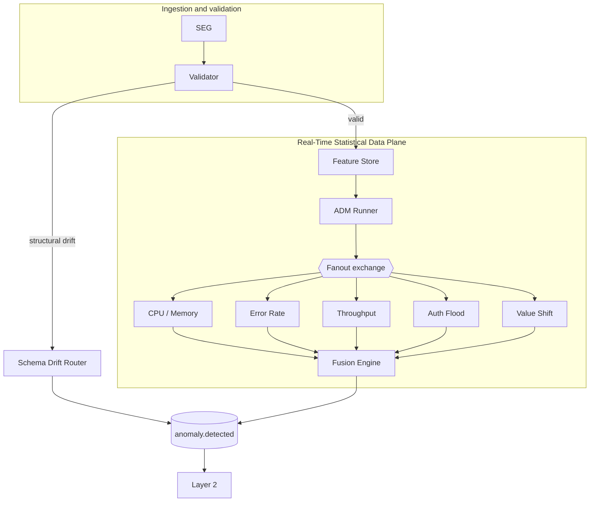
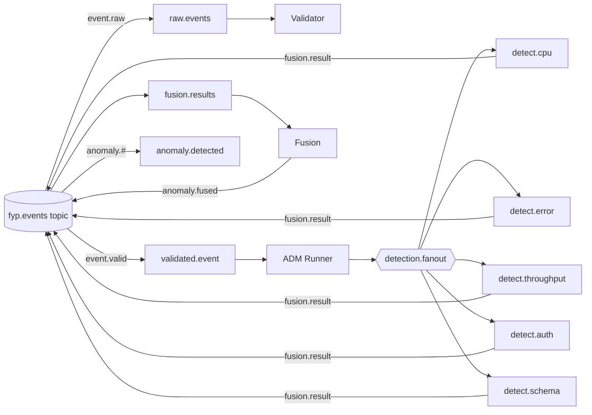
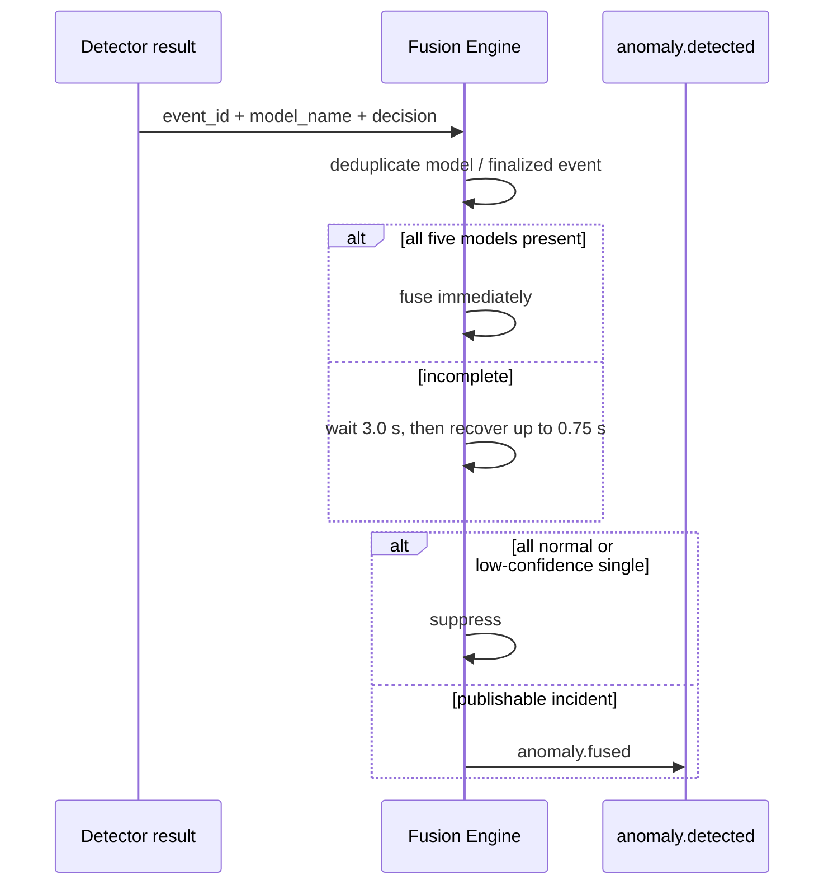

# Layer 1 Component Log — Real-Time Statistical Data Plane

## Purpose and boundary

Layer 1 is the deterministic data plane for the distributed self-healing
pipeline. It generates/ingests events, validates structure, computes rolling
features, runs five independent statistical detectors, and deterministically
correlates their results. It publishes to `anomaly.detected`; Layer 2 owns AI
reasoning and policy. Random Forest and Isolation Forest were evaluated
historically but are not active runtime dependencies.

## Validation and schema drift

Validator is the schema gate and exposes metrics on port 8002. Missing fields
and type mutations are structural anomalies. They are routed by
`SchemaDriftRouter` directly as `anomaly.schema_drift`, bypassing Feature Store,
ADM, detectors, and Fusion. Structurally valid `value_shift` events are
enriched and detected by `distribution_shift_marker == 1.0`.

This intentional dual path means the 100 structural bypass messages and fused
incidents are both consumed from `anomaly.detected`, but have different payload
shapes. Layer 2 Triage normalizes them.

## Feature Store and calibration

`FeatureStore` is called in-process by ADM Runner. Windows are keyed by
`(node, affected_component)`; calibration baselines are per component and pool
nodes. `calibration_n = 20`. Events received while a component calibrates are
acknowledged but withheld from detector fanout. Frozen baselines persist as
JSON, restore on restart, and use the module-relative default directory or
`LAYER1_BASELINES_DIR`.

The corpus defines 19 unique components. Seventeen can reach Feature Store and
therefore have baseline files; the remaining two occur only in structural
schema-drift bypass cases. Earlier statements about three uncalibrated
components referred to an older calibration arrangement.

Active features are rolling mean/std/min/max, Z-score, rate of change, spike
count, short/long moving averages, Auth rolling rate, and silence duration.
PSI was removed from the active vector because the small mixed windows did not
support a defensible runtime drift interpretation and out-of-range samples could
produce unstable bin proportions.

`silence_duration_s` is event-time: if the current throughput is zero, it is
the timestamp difference from the latest earlier non-zero observation. A
non-zero current value yields zero; absent/unparseable time yields zero; no
active observation in-window yields the `9999.0` sentinel. Replay therefore
does not depend on CPU scheduling or wall-clock processing speed.

## ADM detector configuration

All detection thresholds are defined in `adm/config/detector_config.json` and
loaded once at process startup by `detector_support.load_detector_config`.
Known keys are validated as numeric; unknown keys and invalid types fail fast.
Code defaults preserve behaviour when the file is unavailable.

| Detector | Configured primary gates | Output model name |
|---|---|---|
| CPU/Memory | Z > 2.0; CPU/MEM > 70% | `z_score_cpu_memory` |
| Error Rate | abs(Z) > 2.0; error rate > 10% | `z_score_error_rate` |
| Throughput | silence >=30s + <2 mps; MA <40%; raw <40 mps | `moving_average_throughput` |
| Auth Flood | current/rolling >20/min; rate change >=15 | `statistical_auth_rate` |
| Value Shift | marker == 1.0 | `distribution_shift_marker` |

The Auth detector uses current rate, rolling rate, and event-to-event rate
change. Its former RF could adjust confidence but never made the rate-gate
decision. Final Auth behaviour is TP 124/200, FP 0, precision 100%, recall
62%, F1 ~76.5%; 76 target events were withheld upstream during calibration.

Detector local result files default to `layer1/runtime_results/`; set
`LAYER1_RESULTS_DIR` to redirect them. The unused `BaseDetector` ABC was
removed rather than forcing an unnecessary refactor.

## RabbitMQ topology

`detection.fanout` is genuinely fanout: detector distribution does not depend
on routing keys. `fyp.events` is topic-based. `fyp.dlx` routes dead letters to
`dead.letters`. The topology also declares the downstream Layer 2 queues.

## Fusion Engine

Fusion consumes `fusion.results`, groups by `event_id`, and accepts a single
result per expected model identity. All five results finalize immediately;
otherwise the primary correlation window is 3.0 seconds with 0.75-second late
recovery (maximum 3.75 seconds). Timeouts use Fusion-side monotonic time;
`ingestion_time` is retained as metadata rather than used as the deadline.

An all-normal event is suppressed. A single anomaly is also suppressed when its
maximum weighted confidence is below `min_confidence_to_publish` (0.30).
Compound means two or more unique anomalous detector models. The fused
confidence is the maximum anomalous detector confidence after model weighting.
A CRITICAL result whose weight meets the fast-path threshold records priority,
but does not finalize/publish early; full correlation is retained. Duplicate and
late finalized results are ignored.

Fusion preserves event timestamp, ingestion time, node, affected component,
contributing models, severity, confidence, and fusion type. It publishes via
`anomaly.fused`; `anomaly.#` binds the final queue. Metrics are on port 8003:
published, suppressed, compound, fast-path, correlation wait, recovery,
detector-count, errors, and latency.

## Observability

| Component | Port |
|---|---:|
| Validator | 8002 |
| Fusion Engine | 8003 |
| Error Rate / Throughput / Auth / CPU / Schema detectors | 8004–8008 |

ADM Runner and Feature Store have no independent HTTP metrics endpoint.

## Final authoritative evaluation

The clean distributed run used RabbitMQ, independent Layer 1 processes,
Prometheus/Grafana, and the reproducible 1,950-event corpus (1,000 normal;
four 200-event anomaly classes; 150 schema-drift events).

| Result | Count |
|---|---:|
| Generated | 1,950 |
| Validated | 1,850 |
| Structural bypass | 100 |
| Detector/Fusion eligible | 1,527 |
| Fusion published | 539 |
| Fusion suppressed | 988 |
| Compound incidents | 43 |
| Fast-path incidents | 83 |
| `anomaly.detected` total | 639 |

Accounting is exact: 539 + 988 = 1,527; 539 fused + 100 bypass = 639.
Following RF/IF runtime removal, live runs with 5.0-second and 3.0-second
primary Fusion windows (both 0.75-second recovery) produced identical observed
processed, published, suppressed, compound, and fast-path counts. This validates
the 3.0-second setting for the evaluated workload/environment, not every future
workload.

## Historical and remaining considerations

Historical RF and IF training material is retained only in
`evaluation/historical/`. The final implementation is a lightweight,
reproducible statistical data plane. The principal operational caveat is that
calibration intentionally withholds early component events, so end-to-end corpus
recall must distinguish eligibility from detector decisions.
