# Layer 1 — Real-Time Statistical Data Plane

**Document:** Component log

## Purpose, scope, and evidence boundary

This is the detailed technical reference for Layer 1 of **Distributed Multi-Agent Coordination for Self-Healing Data Pipelines: A Human-in-the-Loop Approach on Commodity Hardware**. It documents the
active deterministic/statistical implementation: validation, rolling feature
derivation, five independent detectors, deterministic Fusion, and publication
to Layer 2.

The active source and JSON configuration under `layer1/` are authoritative.
The scripts under `layer1/evaluation/historical/` are retained historical/offline
experiments only. No Random Forest, Isolation Forest, scikit-learn, joblib, or
other ML-model inference is in the active Layer 1 runtime path.

The experiment observations below refer to the cold-state Wi-Fi experiment
`wifi_cold_20260913_041045`. Detector values are explicitly described as
**runtime detection counts**, not TP, FP, precision, recall, FAR, or FER.

## 1. Layer boundary and RabbitMQ contract

Layer 1 has two intentional paths:

- Valid events follow SEG → Validator → Feature Store → ADM Runner →
  `detection.fanout` → five detectors → `fusion.results` → Fusion →
  `anomaly.detected`.
- Structural validation failures follow SEG → Validator → Schema Drift Router
  → `anomaly.detected`, bypassing feature extraction, all detectors, and
  Fusion.

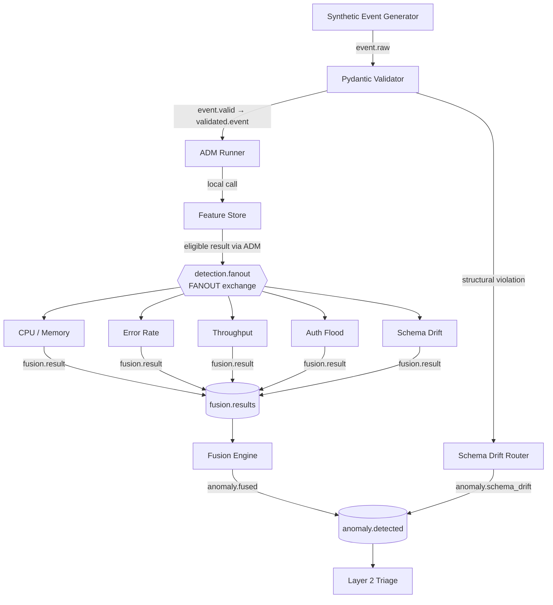

| Exchange or queue | Type / role | Active contract |
|---|---|---|
| `fyp.events` | Topic exchange | Main event bus for `event.raw`, `event.valid`, `fusion.result`, `anomaly.schema_drift`, and `anomaly.fused`. |
| `detection.fanout` | **Fanout exchange** | Broadcasts every eligible enriched event to all detector queues. It does not select a detector by routing key. |
| `fyp.dlx` | Direct exchange | Dead-letter exchange. |
| `raw.events` | Queue | Validator input, bound to `event.raw`. |
| `validated.event` | Queue | ADM Runner input, bound to `event.valid`. |
| `detect.cpu`, `detect.error`, `detect.throughput`, `detect.auth`, `detect.schema` | Queues | One dedicated detector queue each; all bind to `detection.fanout` using an empty binding key. |
| `fusion.results` | Queue | Fusion input, bound to `fusion.result`. |
| `anomaly.detected` | Queue | Final Layer 1 incident queue, bound to `anomaly.#`. |
| `dead.letters` | Queue | Receives the `fyp.dlx` dead-letter route. |

The queue/exchange declarations live in `rabbitmq/setup_topology.py`. The file
also declares downstream queues; those queues are not part of the Layer 1
detection decision path.

### Message contracts

| Stage | Key fields |
|---|---|
| Raw and validated events | `event_id`, `timestamp`, `anomaly_type`, `severity`, `affected_component`, `node`, `metric_values`, optional `context`; replayed events have `ingestion_time`. |
| Validated event | Original event plus `dedup_flag` and `validated_at`. |
| Enriched event | Validated event plus `feature_vector`, `calibrated`, `calibration_events_left`, and `window_depth`. |
| Standard detector result | `event_id`, `timestamp`, `ingestion_time`, `node`, `affected_component`, `detected`, `anomaly_type`, `severity`, `confidence`, `model_name`, `metadata`. An error result remains normal with error metadata. |
| Fused incident | Original timing/context plus `fused_severity`, `fused_confidence`, `fusion_type`, `contributing_models`, `fused_at`, and a Fast Path/standard note. |
| Structural incident | Router-built schema-drift incident with validation context and `bypass_fusion=true`. |

## 2. Synthetic Event Generator (SEG)

| Item | Detail |
|---|---|
| Files | `seg/seg.py`, `seg/event_templates.py`, `seg/noise_injector.py`, `seg/config/seg_config.json` |
| Main class | `SyntheticEventGenerator` |
| Input | Active SEG configuration and, for replay, a saved corpus. |
| Output | Runtime JSONL corpus, evaluation-only `labels.csv`, and `event.raw` messages. |
| Configuration | Corpus mix, seed, node labels, RabbitMQ connection, file names, timestamps, and replay defaults. |

SEG builds the synthetic corpus from normal/anomaly templates, applies noise,
shuffles the completed corpus, assigns UUIDs, and gives every event a
sequential exponentially spaced timestamp. The generation interval defines
corpus time; `--speed` changes only publication pacing during replay.

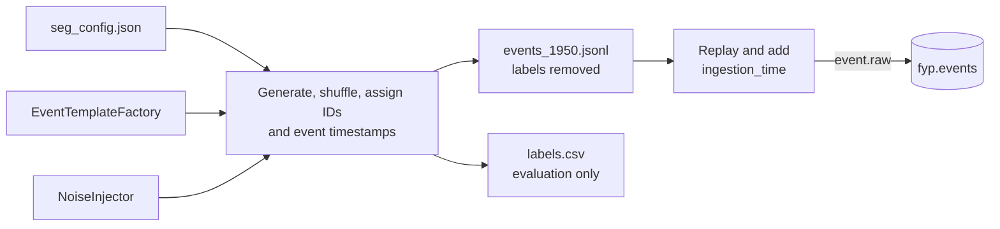

### Internal processing and important behavior

- `save_corpus` strips `ground_truth_label`, `ground_truth_risk_tier`,
  `ground_truth_action`, `expected_route`, and `safe_to_auto` from every
  runtime event. Labels are evaluation artefacts; production detectors never
  receive them.
- `load_config` requires a valid configuration rather than silently using stale
  hard-coded behaviour.
- The default RabbitMQ host is `stream-node`, with a CLI `--host` override.
  No fixed IP is architectural.
- `replay` adds a current UTC `ingestion_time` without changing the original
  synthetic `timestamp`. Downstream detector/Fusion records preserve both.

The schema-drift corpus partition has 50 `missing_field`, 50
`type_mutation`, and 50 `value_shift` events. The first two are deliberately
malformed. `value_shift` is structurally valid and contains
`distribution_shift_marker: 1.0` in `metric_values`. SEG has no Prometheus
endpoint; it records configuration/progress in logs.

## 3. Pydantic Validator

| Item | Detail |
|---|---|
| Files | `validator/validator.py` and `validator/config/validator_config.json` |
| Main schema | `PipelineEvent` |
| Input | `raw.events` from `fyp.events:event.raw` |
| Valid output | `fyp.events:event.valid` → `validated.event` |
| Structural output | Schema Drift Router → `fyp.events:anomaly.schema_drift` |
| Metrics port | 8002 |

The Validator is the schema boundary. It requires a UUID event ID, parseable
timestamp, permitted anomaly type/severity, non-empty component, recognised
node, and a non-empty numeric `metric_values` mapping. `context` is optional.
Valid events retain their timing/node/component context and receive
`dedup_flag` plus `validated_at`.

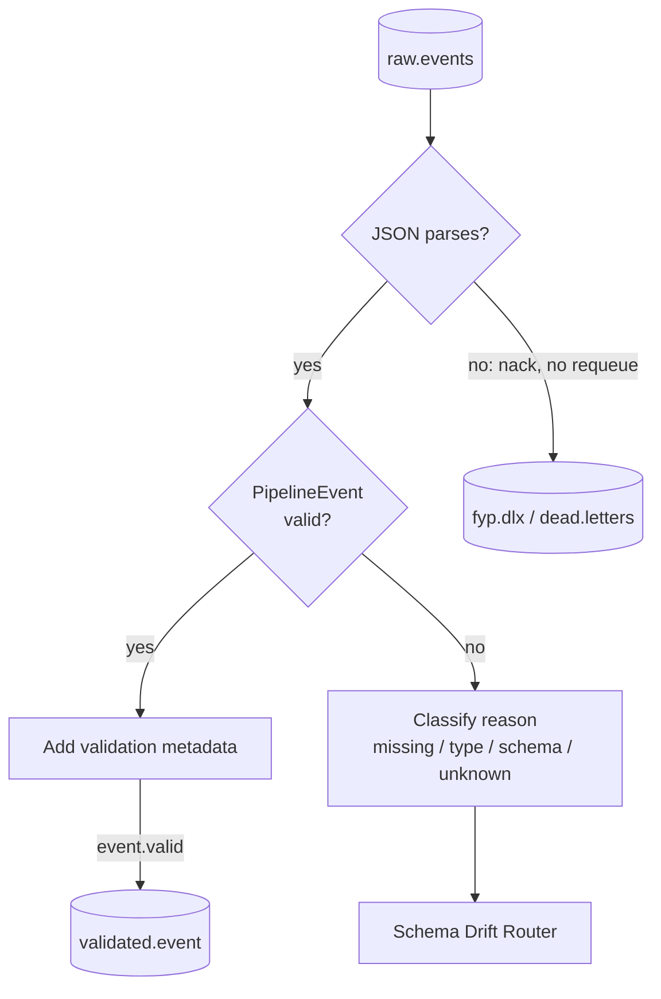

Invalid JSON is negatively acknowledged without requeue. A model-validation
failure is classified and reported structurally, not sent into the normal
detector path. The in-memory seen-ID record supports diagnostic deduplication
metadata; it does not silently discard a duplicate at validation.

| Metric | Meaning |
|---|---|
| `fyp_validator_events_total` | Messages received. |
| `fyp_validator_valid_total` | Events passing the Pydantic contract. |
| `fyp_validator_schema_violations_total{reason}` | Structural failures by classified reason. |
| `fyp_validator_errors_total` | Processing errors. |
| `fyp_validator_latency_seconds` | Processing-time histogram. |

The authoritative run received 1,950 events, accepted 1,850, and routed 100
structural schema violations.

## 4. Schema Drift Router

| Item | Detail |
|---|---|
| File and class | `validator/schema_drift_router.py`, `SchemaDriftRouter` |
| Input | A classified Validator structural failure. |
| Output | `fyp.events:anomaly.schema_drift`, then `anomaly.detected`. |
| Exclusion | No Feature Store, ADM Runner, detector, or Fusion call. |

The Router makes structural problems explicit Layer 1 incidents. It maps
missing-field failures to MEDIUM/LOW, type mutations to HIGH/HIGH, and generic
schema/unknown failures to MEDIUM/LOW (severity/risk tier). It preserves an
available source ID, or creates a fallback ID for traceability.

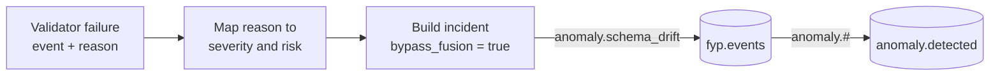

The structural payload is intentionally not a fused payload. Layer 2 Triage
normalizes both output categories after they arrive on `anomaly.detected`. The
Router defines no separate Prometheus metric family; the Validator's
`fyp_validator_schema_violations_total{reason}` records the originating
structural failure.

## 5. Feature Store

| Item | Detail |
|---|---|
| Files | `feature_store/feature_store.py`, `feature_computers.py`, `baseline_calibrator.py` |
| Main class | `FeatureStore` |
| Invocation | In-process library used by `ADMRunner`, not a standalone consumer. |
| Input / output | Validated event; `None` during calibration or an enriched event when calibrated. |
| Baseline path | `feature_store/baselines/` by default; `LAYER1_BASELINES_DIR` overrides it. |

Two keys avoid conflating two kinds of statistical state:

| State | Key | Purpose |
|---|---|---|
| Rolling window | `(node, affected_component)` | Prevents mixing component observations across nodes. |
| Baseline calibrator | `(affected_component,)` | Pools component observations across nodes to create one baseline sooner. |

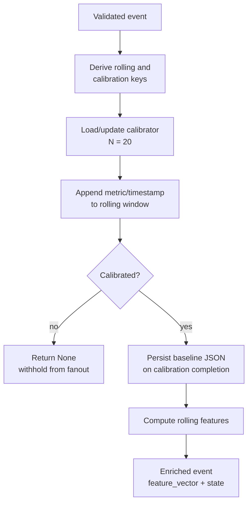

### Calibration, features, and failures

`CALIBRATION_N` is 20. During cold start, per-component events update baseline
and rolling state but are acknowledged without fanout. When calibration becomes
ready, the baseline is persisted and the event can be enriched. A saved
baseline is reloaded on later start-up.

The active features are rolling mean, standard deviation, minimum, maximum,
Z-score, raw (not time-normalised) rate of change, spike count, short/long moving averages, rolling
Auth rate, and event-time throughput silence. No active PSI feature, PSI
decision, or PSI-based Schema Drift logic remains.

Event-time silence follows strict safe semantics:

- A non-zero current throughput gives `silence_duration_s = 0`.
- A zero current value is compared with the previous non-zero event timestamp.
- Missing/unparseable time returns zero.
- No earlier non-zero record in the active window returns the `9999.0`
  sentinel.

The fixed corpus has 19 unique components. Seventeen become baseline calibrated
because they reach the Feature Store; two are structural-only and never do.
This cold-state gating explains why 1,850 valid events later become 1,527
detector/Fusion-eligible events.

Unreadable baselines cause a logged fresh calibration; baseline-save errors are
logged. Feature-computation errors produce an empty feature vector so the valid
event can continue, rather than turning it into a structural-bypass incident.
Feature Store has no Prometheus HTTP endpoint.

## 6. ADM Runner

| Item | Detail |
|---|---|
| File and class | `adm/adm_runner.py`, `ADMRunner` |
| Configuration | `adm/config/adm_config.json` |
| Input | `validated.event` |
| Output | One enriched message to `detection.fanout`, or no fanout while calibrating. |
| Consumer policy | QoS prefetch 1. |

ADM Runner bridges the validated queue and the detector family. It owns the
Feature Store instance. For an eligible event, it publishes **once** using an
empty routing key; RabbitMQ's fanout exchange delivers one copy to every
detector queue.

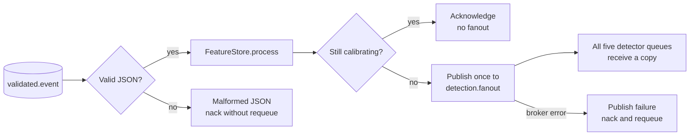

Malformed JSON is negatively acknowledged without requeue. Intentional
calibration withholding is acknowledged. A fanout publishing failure is
negatively acknowledged with requeue. ADM Runner exposes no separate
Prometheus endpoint.

## 7. Detector family: shared contract

| Detector | Source file | Queue | Model identity | Metrics port |
|---|---|---|---|---:|
| CPU / Memory Spike | `adm/detectors/cpu_spike.py` | `detect.cpu` | `z_score_cpu_memory` | 8007 |
| Error Rate Surge | `adm/detectors/error_rate.py` | `detect.error` | `z_score_error_rate` | 8004 |
| Throughput Drop | `adm/detectors/throughput_drop.py` | `detect.throughput` | `moving_average_throughput` | 8005 |
| Auth Failure Flood | `adm/detectors/auth_flood.py` | `detect.auth` | `statistical_auth_rate` | 8006 |
| Schema Drift | `adm/detectors/schema_drift.py` | `detect.schema` | `distribution_shift_marker` | 8008 |

Every detector uses prefetch 1, writes one normal/anomalous result to
`fyp.events:fusion.result`, and makes a local JSONL copy via
`detector_support.detector_results_path`. The local path defaults to
`layer1/runtime_results/` and can be redirected with `LAYER1_RESULTS_DIR`.

| Metric | Meaning |
|---|---|
| `fyp_detector_evaluations_total` | One input evaluated, labelled by detector and source anomaly type. |
| `fyp_detector_anomalies_total` | A detector made a positive decision, labelled the same way. |
| `fyp_detector_errors_total` | Detector decision errors. |
| `fyp_detector_latency_seconds` | Detector processing-time histogram. |

Detector JSON parse errors are negatively acknowledged without requeue.
Decision exceptions yield a normal result with error metadata so Fusion still
receives the detector identity. Publish failures are negatively acknowledged
with requeue. The configuration loader uses
`adm/config/detector_config.json` or `LAYER1_DETECTOR_CONFIG`, validates known
numeric settings, and retains safe code defaults when the file is unavailable.

### 7.1 CPU / Memory Spike Detector

**Role.** Detect resource saturation from raw CPU/memory readings and rolling
Z-scores.

| Inputs | Logic | Result |
|---|---|---|
| `z_score_cpu_percent`, `z_score_mem_percent`, `cpu_percent`, `mem_percent` | Positive if max absolute Z > 2 or raw CPU/MEM > 70%. Z >= 3/5 maps HIGH/CRITICAL; raw >= 85/95 maps HIGH/CRITICAL. | `cpu_memory_spike`; `z_score_cpu_memory` |

The confidence is the maximum capped Z/raw confidence. Metadata contains both
Z-scores, maximum Z, raw values, and reason. Invalid `metric_values` produces
a safe normal result.

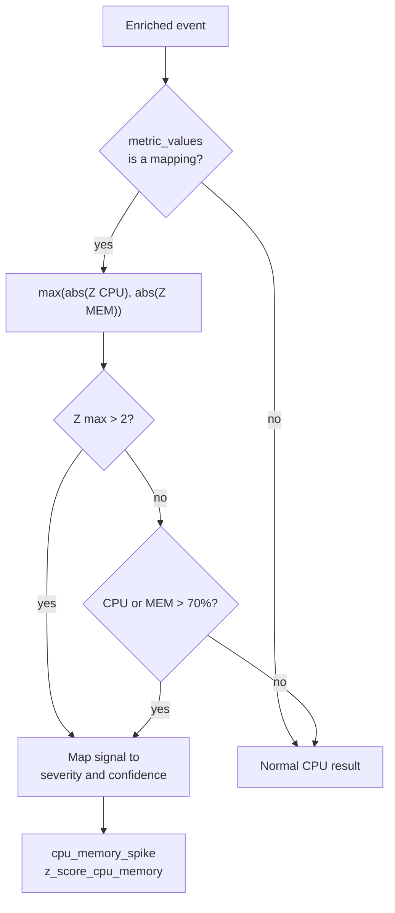

Observed final runtime count: **197 detections from 1,527 evaluations**. It is
not a TP count.

### 7.2 Error Rate Surge Detector

**Role.** Detect unexpected error-rate growth using rolling Z-score and raw
percentage gates.

| Inputs | Logic | Result |
|---|---|---|
| `z_score_error_rate_percent`, `error_rate_percent` | Positive if absolute Z > 2 or raw rate > 10%. Z >= 4/5 maps HIGH/CRITICAL; rate >= 18/30 maps HIGH/CRITICAL. | `error_rate_surge`; `z_score_error_rate` |

Confidence is the strongest capped Z-score/raw-rate contribution. Metadata
preserves the Z-score, raw rate, and chosen reason.

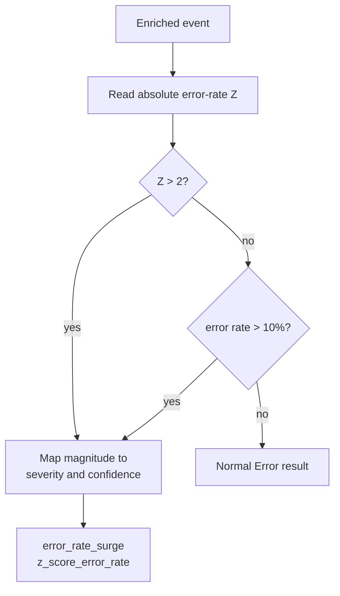

Observed final runtime count: **150 detections from 1,527 evaluations**. It
does not establish final-run precision or recall.

### 7.3 Throughput Drop Detector

**Role.** Detect silent or degrading throughput from event-time silence,
short/long moving averages, and a raw fallback.

| Inputs | Logic | Result |
|---|---|---|
| `short_ma_messages_per_second`, `long_ma_messages_per_second`, `silence_duration_s`, raw `messages_per_second` | Critical if raw < 2 mps and silence >= 30 s. Otherwise positive if long MA >= 5 and short MA < 40% of long MA, or raw < 40 mps. Drop >= 60/80% maps HIGH/CRITICAL; raw < 20 maps HIGH. | `throughput_drop`; `moving_average_throughput` |

The ordered logic is silence first, moving-average fall second, raw fallback
third. Confidence is the strongest silence/drop/raw contribution.

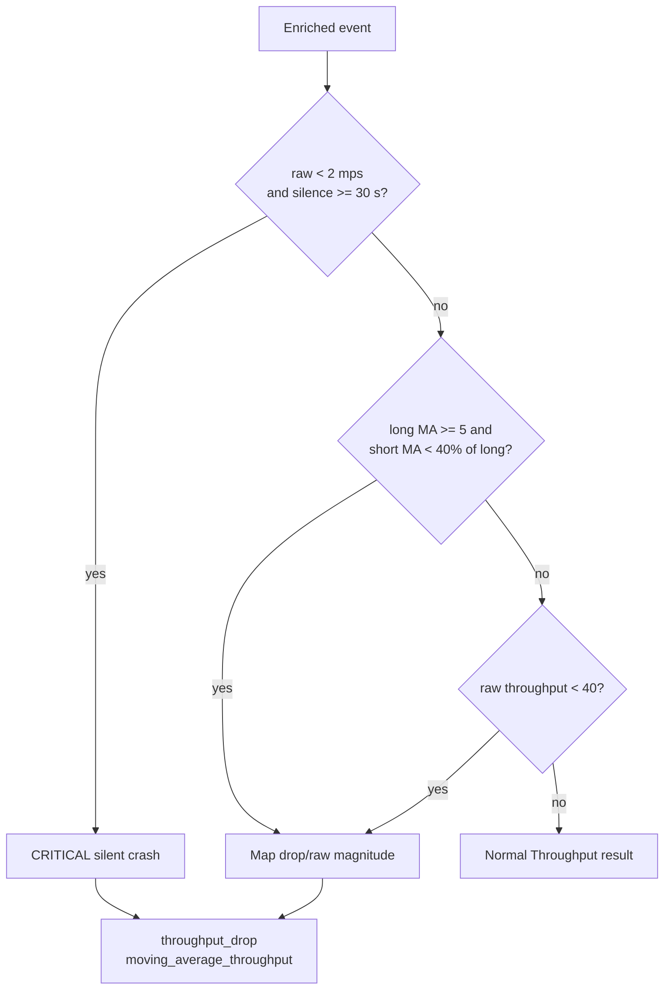

Observed final runtime count: **141 detections from 1,527 evaluations**.
Event-time silence avoids coupling the decision to replay processing speed.

### 7.4 Auth Failure Flood Detector

**Role.** Detect abrupt or sustained authentication-failure floods without a
machine-learning model.

| Inputs | Logic | Result |
|---|---|---|
| Raw `auth_failures_per_min`, rolling `auth_failures_per_min`, `rate_of_change_auth_failures_per_min` | Positive if current or rolling rate > 20/min, or rate change >= 15. Maximum current/rolling rate maps to MEDIUM below 40, HIGH at >= 40, and CRITICAL at >= 100. | `auth_failure_flood`; `statistical_auth_rate` |

The raw rate catches an abrupt flood before a rolling average dilutes it;
rolling rate and rate change preserve sensitivity to sustained/accelerating
behaviour. Metadata records all three values, thresholds, and firing reasons.

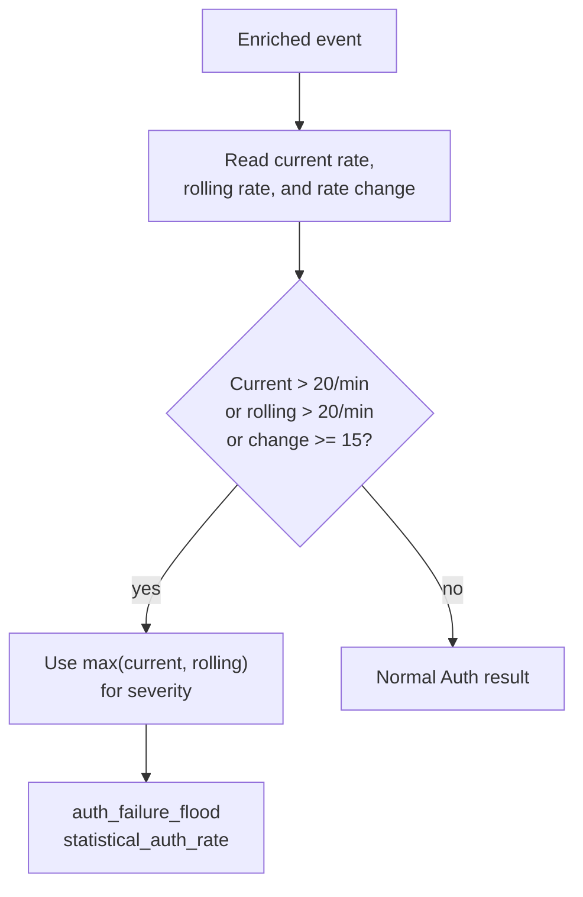

Observed final runtime count: **124 detections from 1,527 evaluations**.
Historical/offline figures, if cited in research, must stay separate from this
Wi-Fi run's runtime counter.

### 7.5 Schema Drift Detector

**Role.** Detect a structurally valid `value_shift` marker. It is distinct from
the Schema Drift Router, which reports malformed structure.

| Inputs | Logic | Result |
|---|---|---|
| `metric_values.distribution_shift_marker` | Positive only when the marker equals 1.0; MEDIUM severity and configured 0.7 confidence. | `schema_drift`; `distribution_shift_marker` |

No active PSI calculation or PSI signal is used. If `metric_values` is not a
mapping, the detector emits a normal result with a reason. A `missing_field` or
`type_mutation` event does not reach this detector because the Validator routes
it structurally first.

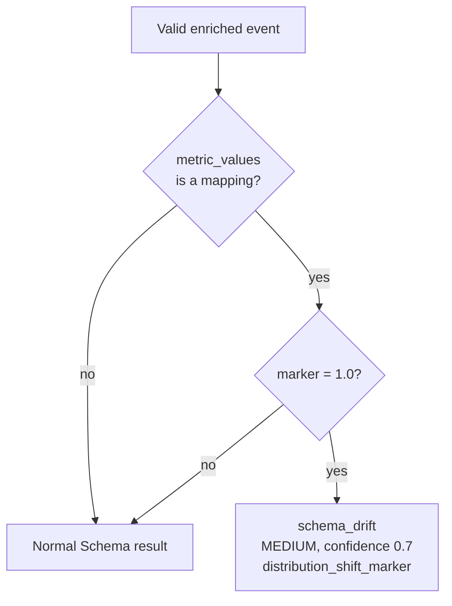

Observed final runtime count: **31 detections from 1,527 evaluations**. It is
not valid to derive `31/50` as final Wi-Fi recall from this counter alone.

## 8. Fusion Engine

| Item | Detail |
|---|---|
| Files | `fusion_engine/fusion_engine.py` and `fusion_engine/config/fusion_config.json` |
| Main class | `FusionEngine` |
| Input | `fusion.results` from `fyp.events:fusion.result` |
| Output | `fyp.events:anomaly.fused` → `anomaly.detected` |
| Metrics port | 8003 |
| Local copy | `fusion_engine/fusion_results.jsonl` |

Fusion is a deterministic correlator. It holds one result per unique
`model_name` for each `event_id`. Duplicate model results are ignored. After a
decision, `processed_event_ids` prevents a late/duplicate delivery from
creating another incident. The expected model identities are the five detector
names listed above.

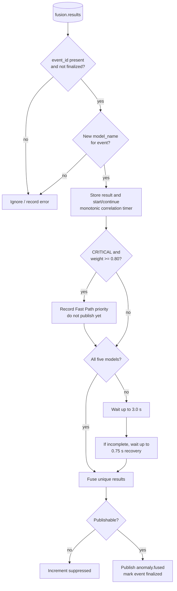

### Correlation, weighting, and publication

| Setting | Current implementation |
|---|---|
| Primary correlation window | 3.0 s |
| Late-recovery window | 0.75 s after an incomplete primary window |
| Maximum collection opportunity | Approximately 3.75 s |
| Single-anomaly publish floor | `min_confidence_to_publish = 0.30` |
| Compound incident | Two or more unique anomalous detector models. |
| All-normal result | Suppressed. |
| Single anomaly below 0.30 | Suppressed. |
| Fast Path | A CRITICAL result at configured weight >= 0.80 marks priority/instrumentation only. It does not finalize or publish early. |

Configured weights are Error 0.80, Throughput 0.75, Auth 0.85, CPU 0.80, and
Schema 0.70. Fusion selects the highest weighted anomalous confidence and
highest relevant severity. It preserves original `timestamp`,
`ingestion_time`, `node`, and `affected_component`; the deadline itself uses
Fusion-side monotonic time, not `ingestion_time`.

| Metric | Meaning |
|---|---|
| `fyp_fusion_published_total` | Published `anomaly.fused` incidents. |
| `fyp_fusion_suppressed_total` | Decisions that did not publish. |
| `fyp_fusion_compound_total` | Compound incidents. |
| `fyp_fusion_fast_path_total` | Fast Path-marked incidents. |
| `fyp_fusion_fast_path_triggered_total` | Fast Path trigger observations. |
| `fyp_fusion_correlation_wait_seconds` | Correlation wait histogram. |
| `fyp_fusion_late_recovery_total` | Recovery-window completions. |
| `fyp_fusion_latency_seconds` | Fusion processing/publishing histogram. |
| `fyp_fusion_errors_total` | Fusion errors. |
| `fyp_fusion_detectors_received` | Detector-result count distribution per correlated event. |

Fusion stores a local copy after successful publication. Missing event IDs,
duplicate model identities, and already finalised events must not create a new
publication. The recovery window avoids an indefinite wait for an incomplete
detector set.

## 9. Authoritative experiment instrumentation

### 9.1 Cold-state methodology

The `wifi_cold_20260913_041045` evaluation reset relevant RabbitMQ queues and
Feature Store baseline state, collected fresh runtime result files, and replayed
the same generated corpus through separately running Layer 1 processes.
Calibration intentionally withheld early events. Evaluation labels were kept
outside the production pipeline.

| Corpus partition | Events |
|---|---:|
| NORMAL | 1,000 |
| cpu_memory_spike | 200 |
| error_rate_surge | 200 |
| throughput_drop | 200 |
| auth_failure_flood | 200 |
| schema_drift | 150 |
| **Total** | **1,950** |

### 9.2 Event-accounting diagram and counts

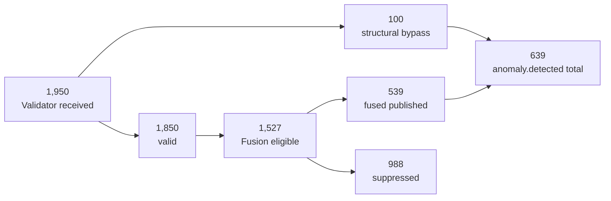

| Measure | Authoritative observation |
|---|---:|
| Validator received / valid / structural violations | 1,950 / 1,850 / 100 |
| Each detector's evaluations and local runtime result records | 1,527 |
| Fusion published / suppressed | 539 / 988 |
| Fusion compound / Fast Path / late recovery | 43 / 83 / 0 |
| Total `anomaly.detected` incidents | 639 |

```text
1,527 Fusion-eligible events = 539 published + 988 suppressed
639 anomaly.detected incidents = 539 fused + 100 structural bypass
```

| Detector | Final runtime detection count | Interpretation |
|---|---:|---|
| CPU / Memory | 197 | Operational count, not TP. |
| Error Rate | 150 | Operational count, not TP. |
| Auth Failure Flood | 124 | Operational count, not TP. |
| Schema Drift | 31 | Operational count, not TP. |
| Throughput | 141 | Operational count, not TP. |

| Dashboard measurement | Observed value |
|---|---:|
| Detector processing latency p50 / p95 | approximately 2.50 ms / 4.75 ms |
| Fusion processing latency p50 / p95 | approximately 432 µs / 944 µs |
| Fusion correlation wait p50 / p95 | approximately 5 ms / 9.50 ms |
| Fusion suppression rate | approximately 64.7% |

Dashboard observations are given at their available visual precision; they are
not substituted for raw histogram extraction.

## 10. Active implementation, historical work, and limitations

| Subject | Current status |
|---|---|
| CPU/Memory | Active raw-threshold and Z-score detector. |
| Auth | Active current/rolling/rate-change statistical detector. |
| Value shift | Active `distribution_shift_marker` detector. |
| Random Forest / Isolation Forest | Historical/offline scripts only in `evaluation/historical/`. |
| PSI | Not an active Feature Store feature or Schema Drift decision signal. |
| Runtime precision/recall | Not claimed from Prometheus detector counters. |

Important limits are explicit:

- Cold calibration reduces the detector/Fusion population relative to valid
  ingress; the 1,850-to-1,527 difference is expected stateful behaviour.
- Detector thresholds and confidence scaling are workload dependent.
- Structural violations intentionally bypass multi-detector corroboration.
- Value-shift detection is marker based, not learned distribution modelling.
- The authoritative workload is controlled synthetic telemetry. Its counts and
  latency observations should not be generalized without new experiments.
- Fast Path prioritizes correlation handling but never publishes early.

For the Layer 1 overview, see [README](../README.md). The root
[Full_Rerun.md](../../Full_Rerun.md) remains the authoritative complete
cross-layer runbook.
