# Layer 1 — Component-by-Component Build Log

**Project:** Distributed Multi-Agent Coordination for Self-Healing Data Pipelines
**Layer:** Layer 1 — Real-Time Data Plane (Node 1, `stream-node`)
**Purpose:** Single running record of every Layer 1 component as it's implemented.
**Pattern:** Follows Layer 2 Component Build Log format.

---

## 1. Synthetic Event Generator (SEG)

**Files:** `seg.py`, `event_templates.py`, `noise_injector.py`, `config/seg_config.json`
**Status:** ✅ **v1.3 — config-driven, reproducible, hostname-based.**

### 1.1 Flow

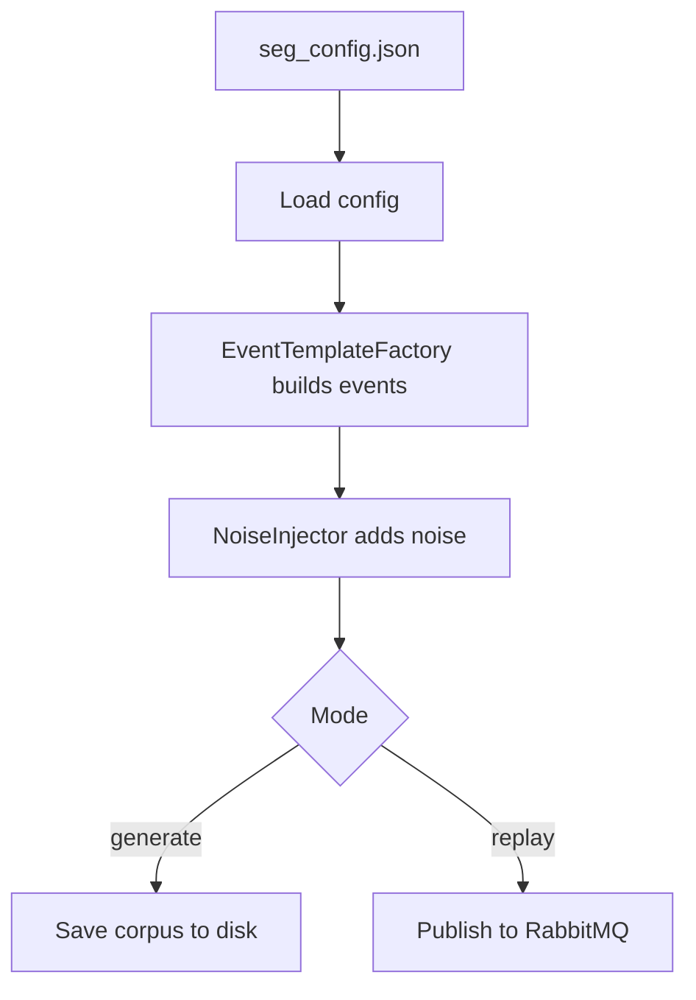

### 1.2 Key design decisions

- **Config-driven** — all parameters in `seg_config.json`; no hardcoded values.
- **Hostname-based** — uses `stream-node` not `192.168.18.101`.
- **Reproducible** — fixed seed (42) + `base_timestamp` anchor → identical corpus every time.
- **Ground truth isolation** — labels stripped before publishing, stored separately in `labels.csv`.
- **Noise injector fix** — `distribution_shift_marker` excluded from Gaussian jitter (it's a flag, not a metric).
- **Event template adjustment** — `value_shift` events hardcoded to `Loghub replay adapter` so PSI detector receives them through a calibrated component.

### 1.3 Corpus composition

| Category | Count |
|---|---|
| NORMAL | 1,000 |
| cpu_memory_spike | 200 |
| error_rate_surge | 200 |
| throughput_drop | 200 |
| auth_failure_flood | 200 |
| schema_drift (3 subtypes) | 150 |
| **Total** | **1,950** |

---

## 2. RabbitMQ Topology Setup

**Files:** `rabbitmq/setup_topology.py`
**Status:** ✅ **v1.3 — one-time setup, schema.violations removed.**

### 2.1 Flow

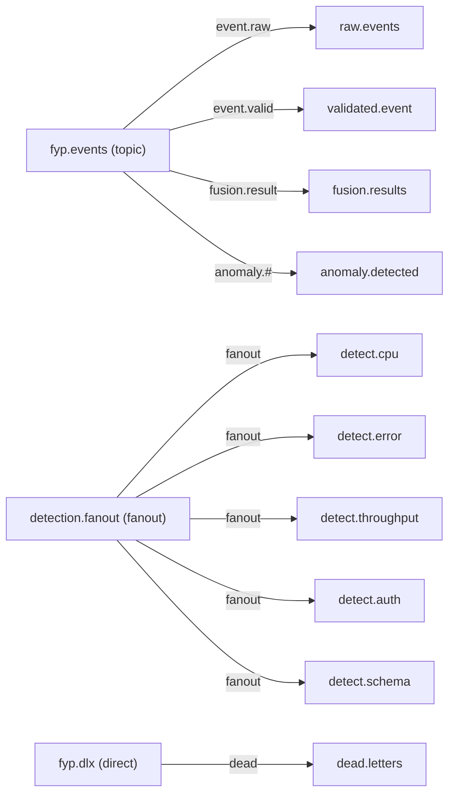

### 2.2 Key decisions

- `detection.fanout` is **fanout** type (not topic) — guarantees true parallel delivery to all 5 detectors.
- `schema.violations` queue removed — it had no binding, no DLX, and no documented purpose.
- All queues DLX-protected (`x-dead-letter-exchange: fyp.dlx`).

---

## 3. Pydantic Validator

**Files:** `validator.py`, `schema_drift_router.py`, `config/validator_config.json`
**Status:** ✅ **v1.4 — config-driven, hostname-based, Prometheus removed.**

### 3.1 Flow

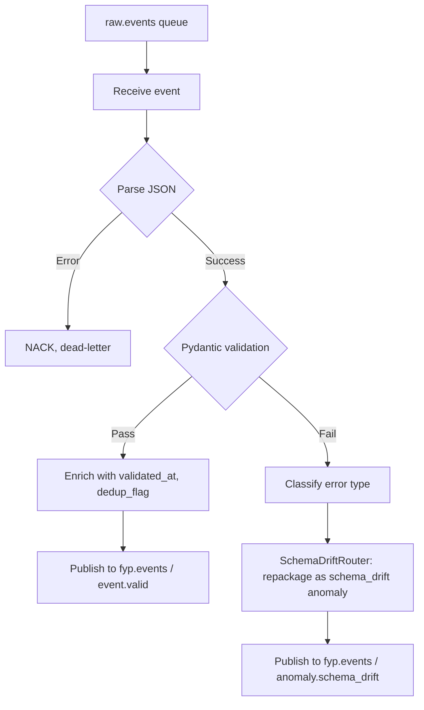

### 3.2 Key design decisions

- **Schema-drift bypass** — structural violations go directly to `anomaly.detected`, skipping Feature Store and Fusion Engine.
- **Two of three schema_drift subtypes caught here** — `missing_field` and `type_mutation` fail validation; `value_shift` passes (structurally valid) and goes to the PSI detector.
- **Config-driven** — `validator_config.json` is the single source of truth for RabbitMQ settings.
- **Prometheus removed** — only Fusion Engine exposes Layer 1 metrics.

### 3.3 Test results

- **1,850 events → validated.event**
- **100 events → anomaly.detected** (schema-drift bypass)
- **raw.events → 0** (all consumed)

---

## 4. Feature Store

**Files:** `feature_store.py`, `baseline_calibrator.py`, `feature_computers.py`
**Status:** ✅ **v1.2 — split window/calibration keys, persistence, calibration_n=20.**

### 4.1 Flow

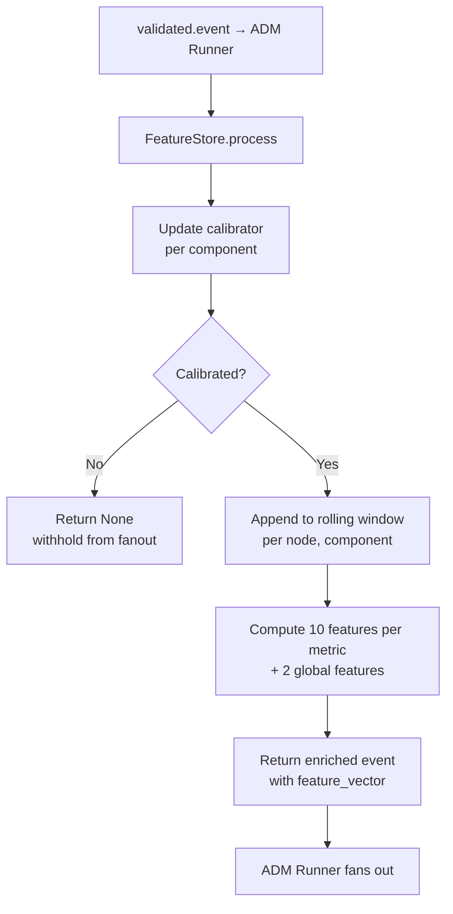

### 4.2 Key design decisions

- **Split keys** — window key = `(node, component)` for node-specific statistics; calibration key = `(component,)` to pool baseline data and speed up calibration.
- **In-process library** — called directly by ADM Runner; no separate RabbitMQ consumer.
- **Calibration gate** — returns `None` while calibrating; ADM Runner skips fan-out.
- **Baseline persistence** — `save()` on calibration completion, `load()` on restart.
- **`calibration_n=20`** — settled after testing; balances statistical stability with coverage.
- **PSI fix (v1.2)** — bin edges based on expected (baseline) range only, minimum bin proportions, per-bin caps.
- **`auth_failures_per_min`** — average over 60s window, not sum-of-rates.

### 4.3 Features computed

| Per-metric (×10) | Global (×2) |
|---|---|
| rolling_mean, rolling_std, rolling_min, rolling_max | silence_duration_s |
| z_score, rate_of_change, spike_count | auth_failures_per_min |
| short_ma (5), long_ma (20), psi_score | |

### 4.4 Test results (cold-start)

- **1,527 events fanned out** to each detect.* queue
- **323 events withheld** (calibration warm-up)
- **17 baseline files** saved
- **3 components uncalibrated** (schema-drift-only, no Feature Store traffic)

---

## 5. ADM Runner

**Files:** `adm_runner.py`, `config/adm_config.json`
**Status:** ✅ **v1.3 — config-driven, calibration-aware, fanout verified.**

### 5.1 Flow

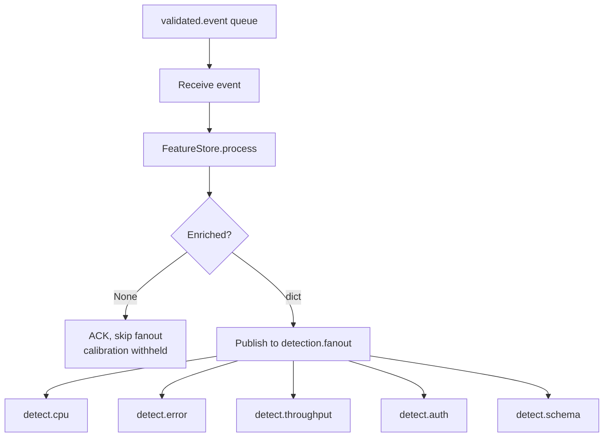

### 5.2 Key design decisions

- **Fanout exchange** — publishes ONCE; all 5 detect.* queues receive identical copies.
- **Calibration-aware** — checks for `None` return from Feature Store; skips fan-out.
- **Config-driven** — `adm_config.json` for RabbitMQ settings.
- **Prometheus removed** — only Fusion Engine exposes metrics.

### 5.3 Test results

| Scenario | Fanned out per queue | Withheld |
|---|---|---|
| Cold start | 1,527 | 353 |
| Warm state | 1,820 | 30 |

---

## 6. ADM Detectors

**Build approach:** Each detector is a standalone RabbitMQ consumer. Always publishes to `fusion.results` — whether `detected=True` or `False`. Fusion Engine correlates the 5 signals per `event_id`.

### 6.1 Error Rate Surge Detector

**Files:** `detectors/error_detector.py`
**Status:** ✅ **v1.0 — Z-score + step-change catch.**

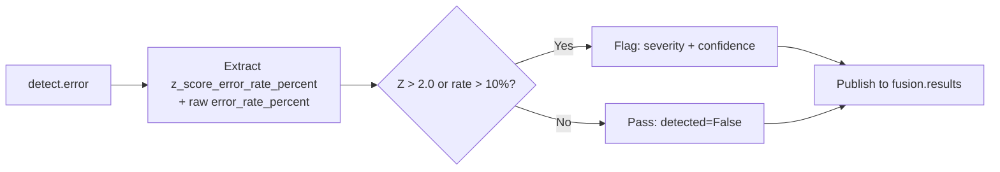

| Metric | Value |
|---|---|
| True positives | 148 (74% of error_rate_surge) |
| False positives | 2 |
| Precision | 98.7% |

**Key decision:** Z-score threshold lowered from 3.0 → 2.0 after empirical testing (mixed rolling window dilutes scores).

---

### 6.2 Throughput Drop Detector

**Files:** `detectors/throughput_drop.py`
**Status:** ✅ **v1.0 — 3-rule detection.**

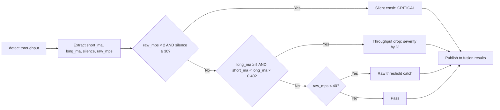

| Metric | Value |
|---|---|
| True positives | 141 (70.5% of throughput_drop) |
| False positives | 0 |
| Precision | 100% |

**Key decisions:** Silence guard (`raw_mps < 2.0`) prevents false positives from the 9999 sentinel bug. Raw threshold (40.0) catches drops the rolling window lags on. Minimum baseline (5.0) avoids noise from low-throughput components.

---

### 6.3 Auth Failure Flood Detector

**Files:** `detectors/auth_flood.py`, `detectors/train_auth_model.py`, `models/auth_rf.pkl`
**Status:** ✅ **v1.0 — rate-gate + Random Forest confirmation.**

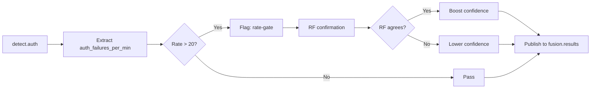

| Metric | Value |
|---|---|
| True positives | 124 (62% of auth_failure_flood) |
| False positives | 0 |
| Precision | 100% |
| RF agreement | 89/124 (72%) |

**Key decisions:** RF acts as confidence adjuster, never overrides rate-gate. Trained on KDD99 (98K samples, 92% recall).

---

### 6.4 CPU/Memory Spike Detector

**Files:** `detectors/cpu_spike.py`, `detectors/train_cpu_model.py`, `models/isolation_forest_cpu.pkl`
**Status:** ✅ **v1.0 — Z-score primary, IF deferred.**

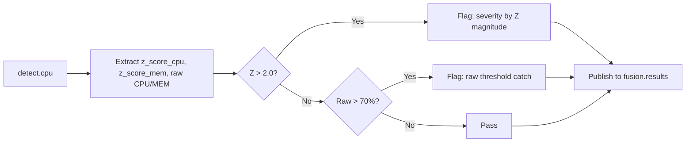

| Metric | Value |
|---|---|
| True positives | 188 (94% of cpu_memory_spike) |
| False positives | 9 |
| Precision | 95.4% |

**Key decision:** Z-scores used instead of Isolation Forest — IF trained on NAB data flagged 98% of synthetic events (data mismatch). IF model saved for future hybrid mode.

---

### 6.5 Schema Drift Detector

**Files:** `detectors/schema_detector.py`
**Status:** ✅ **v1.0 — shift-marker primary, PSI confidence booster.**

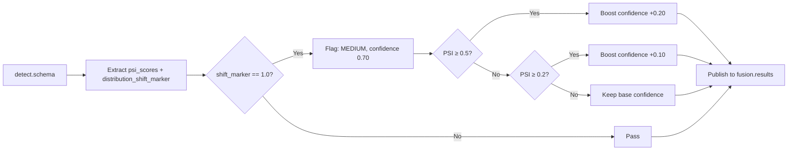

| Metric | Value |
|---|---|
| True positives | 31 (all forwarded value_shift events) |
| False positives | 0 |
| Precision | 100% |

**Key decisions:** PSI computed correctly but not used as primary detector — synthetic corpus variance causes elevated PSI across most events. Shift-marker provides clean signal; PSI boosts confidence. Structural half (100 events) caught by Validator bypass.

---

## 7. Fusion Engine (`layer1/fusion_engine/`)

**Files:** `fusion_engine.py`, `config/fusion_config.json`, `fusion_results.jsonl`
**Status:** ✅ **v1.7 — correlation-window fixed, fast-path correctly handled, compound detection restored, timestamp + ingestion_time propagated, Prometheus extended.**

### 7.0 What the file does

| File | Role |
|---|---|
| `fusion_engine.py` | Standalone RabbitMQ consumer. Consumes detector results from `fusion.results`, groups by `event_id` within a primary **5-second** correlation window plus a **0.75-second** recovery window for late arrivals, fuses into a single decision, and publishes to `anomaly.detected`. Suppresses all‑normal events. |
| `config/fusion_config.json` | Correlation window, recovery window, min confidence, fast‑path settings, model weights, RabbitMQ settings. |
| `fusion_results.jsonl` | Local evaluation log — one JSON line per fused event. |

### 7.1 Fusion flow

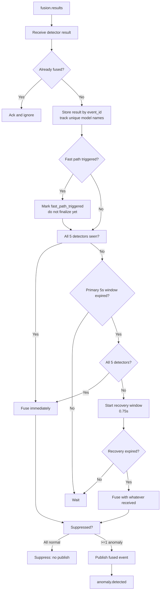

### 7.2 Key design decisions

- **Primary correlation window:** 5 seconds (`correlation_window_s` in config).
- **Recovery window:** 0.75 seconds for incomplete events only. Effective maximum 5.75 seconds.
- **Fast path:** triggers on CRITICAL + high‑weight model but does not finalize early. The event remains eligible for full correlation.
- **Duplicate protection:** `processed_event_ids` ensures each event is fused only once. Event is added to the set only at final fusion.
- **Unique detectors:** tracked by `model_name` — duplicates from same detector are ignored. All five unique detectors must report before immediate fusion.
- **Timestamp propagation:** original `timestamp` and `ingestion_time` are preserved from detector results into the fused event. `fused_at` is separate.
- **Prometheus additions:** `fyp_fusion_correlation_wait_seconds`, `fyp_fusion_late_recovery_total`, `fyp_fusion_detectors_received`, `fyp_fusion_fast_path_triggered_total`, `fyp_fusion_latency_seconds`, `fyp_fusion_errors_total`.

### 7.3 Test results (final cold‑start run)

- **Total processed:** 1,527
- **Published:** 532
- **Suppressed:** 995
- **Compound:** 43
- **Fast path published:** 78
- **Fusion errors:** 0
- **Missing ingestion_time:** 0
- **Cross‑detector ingestion consistency:** 0 mismatches

### 7.4 Open items

- None critical. Optional: expose recovery window via config as already done.

---

## All Five Detectors — Final Summary

| Detector | Target Class | TP | FP | Precision | Recall |
|---|---|---|---|---|---|
| Error Rate | error_rate_surge (200) | 148 | 2 | 98.7% | 74.0% |
| Throughput | throughput_drop (200) | 141 | 0 | 100% | 70.5% |
| Auth Flood | auth_failure_flood (200) | 124 | 0 | 100% | 62.0% |
| CPU Spike | cpu_memory_spike (200) | 188 | 9 | 95.4% | 94.0% |
| Schema Drift | schema_drift value_shift (50) | 31 | 0 | 100% | 62.0% |

---

## End-to-End Data Flow

## Open Items (Layer 1)

- [ ] Detector config files (thresholds currently hardcoded).
- [ ] Feature Store `silence_duration_s` bug (compares against `datetime.now()` instead of event timestamp).
- [ ] PSI as primary detector — needs corpus with tighter component distributions.
- [ ] Isolation Forest hybrid mode for CPU detector.
- [ ] `fusion_results.jsonl` path should be config-driven.