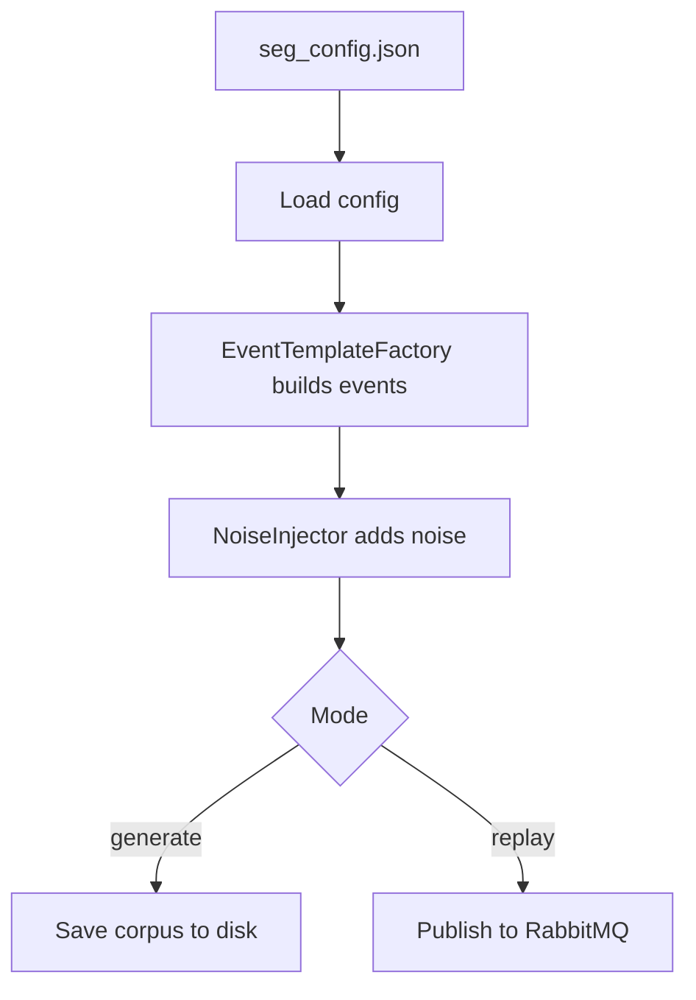
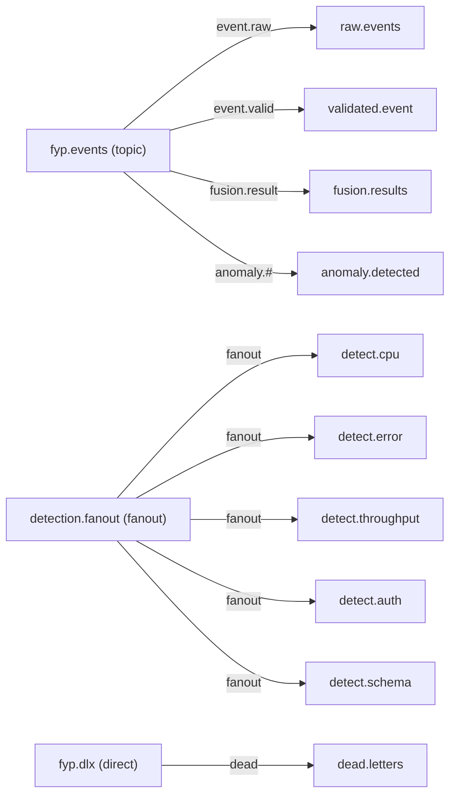
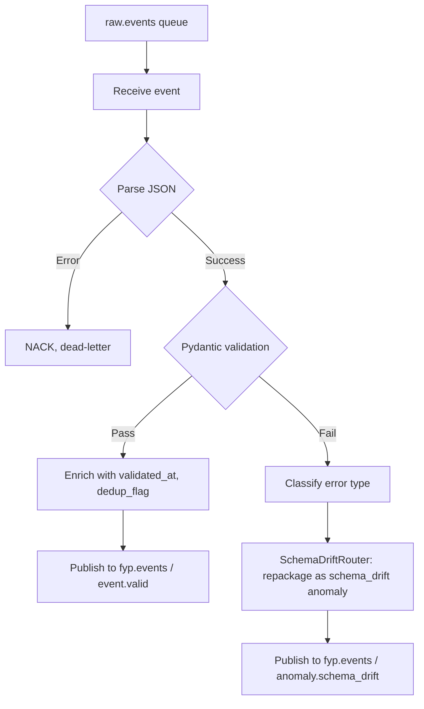
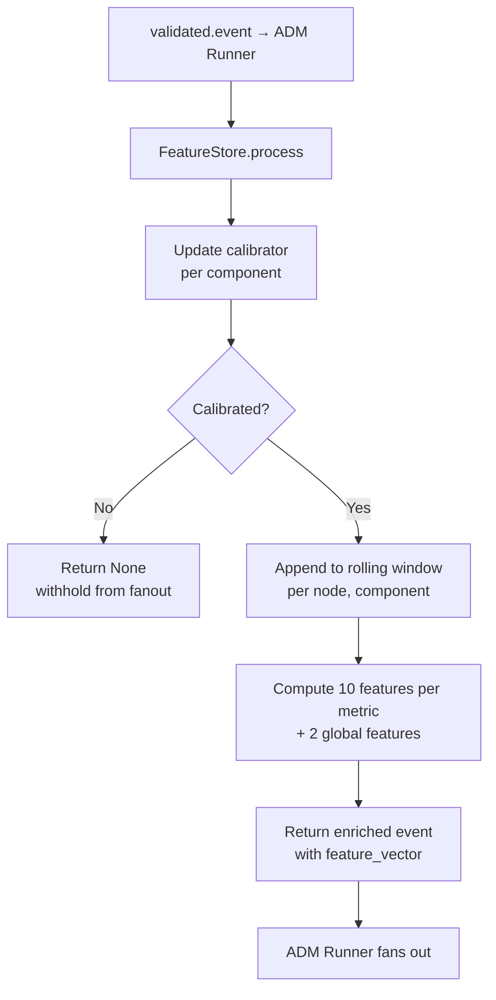
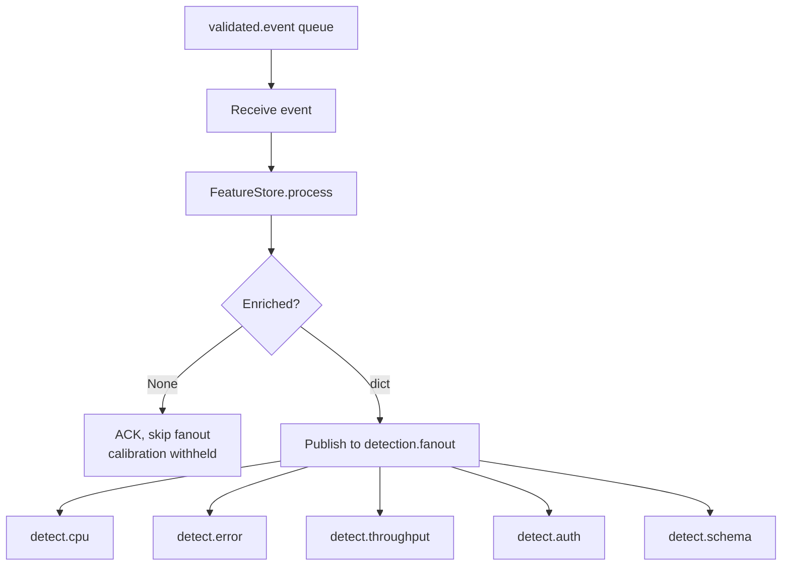
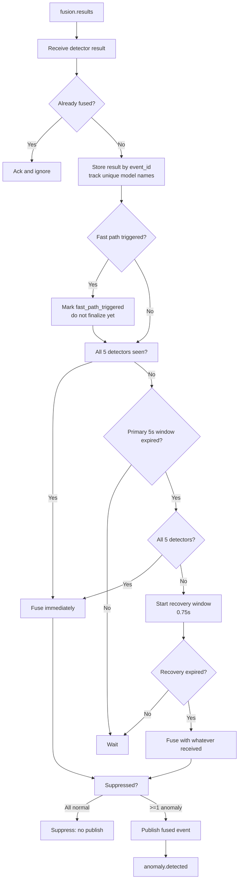
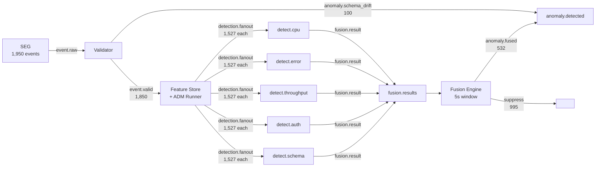

# Layer 1 — Component-by-Component Build Log

**Project:** Distributed Multi-Agent Coordination for Self-Healing Data Pipelines
**Layer:** Layer 1 — Real-Time Data Plane (Node 1, `stream-node`)
**Purpose:** Single running record of every Layer 1 component as implemented.

---

## 1. Synthetic Event Generator (SEG)

**Files:** `seg.py`, `event_templates.py`, `noise_injector.py`, `config/seg_config.json`
**Status:** ✅ **v1.3 — config-driven, reproducible, hostname-based.**

### 1.1 Flow

### 1.2 Key design decisions

- **Config-driven** — all parameters in `seg_config.json`; no hardcoded values.
- **Hostname-based** — uses `stream-node` not a hardcoded IP.
- **Reproducible** — fixed seed (42) + `base_timestamp` anchor → identical corpus every time.
- **Ground truth isolation** — labels stripped before publishing, stored separately in `labels.csv`.
- **Noise injector fix** — `distribution_shift_marker` excluded from Gaussian jitter (it's a flag, not a metric).
- **Event template adjustment** — `value_shift` events hardcoded to `Loghub replay adapter` so the PSI detector receives them through a component that builds a sufficient calibration baseline (50 events > calibration_n of 20).

### 1.3 Corpus composition

| Category | Count |
|---|---|
| NORMAL | 1,000 |
| cpu_memory_spike | 200 |
| error_rate_surge | 200 |
| throughput_drop | 200 |
| auth_failure_flood | 200 |
| schema_drift (3 subtypes) | 150 |
| **Total** | **1,950** |

---

## 2. RabbitMQ Topology Setup

**Files:** `rabbitmq/setup_topology.py`
**Status:** ✅ **v1.3 — one-time setup, schema.violations removed.**

### 2.1 Flow

### 2.2 Key decisions

- `detection.fanout` is **fanout** type (not topic) — guarantees true parallel delivery to all 5 detectors.
- `schema.violations` queue removed — it had no binding, no DLX, and no documented purpose.
- All queues DLX-protected (`x-dead-letter-exchange: fyp.dlx`).
- The `anomaly.#` topic binding on `anomaly.detected` catches both `anomaly.schema_drift` (from Validator bypass) and `anomaly.fused` (from Fusion Engine).

---

## 3. Pydantic Validator

**Files:** `validator.py`, `schema_drift_router.py`, `config/validator_config.json`
**Status:** ✅ **v1.5 — config-driven, hostname-based, Prometheus metrics on port 8002, preserves ingestion_time + node/affected_component.**

### 3.1 Flow

### 3.2 Key design decisions

- **Schema-drift bypass** — structural violations go directly to `anomaly.detected` (via `anomaly.schema_drift` routing key matched by `anomaly.#` binding), skipping Feature Store and Fusion Engine entirely.
- **Two of three schema_drift subtypes caught here** — `missing_field` and `type_mutation` fail validation; `value_shift` passes (structurally valid) and proceeds through the Feature Store → detection.fanout → Schema Drift Detector → Fusion Engine path.
- **Config-driven** — `validator_config.json` is the single source of truth for RabbitMQ settings.
- **Prometheus metrics** — exposed on port 8002: `fyp_validator_events_total`, `fyp_validator_valid_total`, `fyp_validator_schema_violations_total{reason}`, `fyp_validator_errors_total`, `fyp_validator_latency_seconds`.
- **Context preservation** — preserves `ingestion_time`, `node`, and `affected_component` for downstream.

### 3.3 Test results

- **1,850 events → validated.event**
- **100 events → anomaly.detected** (schema-drift bypass)
- **raw.events → 0** (all consumed)

---

## 4. Feature Store

**Files:** `feature_store.py`, `baseline_calibrator.py`, `feature_computers.py`
**Status:** ✅ **v1.2 — split window/calibration keys, persistence, calibration_n=20.**

### 4.1 Flow

### 4.2 Key design decisions

- **Split keys** — window key = `(node, component)` for node-specific statistics; calibration key = `(component,)` to pool baseline data across nodes and speed up calibration.
- **In-process library** — called directly by ADM Runner; no separate RabbitMQ consumer.
- **Calibration gate** — returns `None` while calibrating; ADM Runner skips fan-out.
- **Baseline persistence** — `save()` on calibration completion, `load()` on restart.
- **`calibration_n=20`** — settled after testing; balances statistical stability with coverage. (The `BaselineCalibrator` class default is 100, but ADM Runner instantiates with 20.)
- **PSI fix (v1.2)** — bin edges based on expected (baseline) range only, minimum bin proportions, per-bin caps.
- **`auth_failures_per_min`** — average over 60s window, not sum-of-rates.
- **Context preservation** — preserves original `node` and `affected_component` in enriched events.

### 4.3 Features computed

| Per-metric (×10) | Global (×2) |
|---|---|
| rolling_mean, rolling_std, rolling_min, rolling_max | silence_duration_s |
| z_score, rate_of_change, spike_count | auth_failures_per_min |
| short_ma (5), long_ma (20), psi_score | |

### 4.4 Test results (cold-start)

- **1,527 events fanned out** to each detect.* queue
- **323 events withheld** (calibration warm-up); arithmetic: 1,850 validated − 1,527 fanned out = 323
- **17 baseline files** saved (one per calibrated component)
- **2 components uncalibrated** — `SEG output` and `external data source` never receive validated events (they appear only in structural schema_drift events which fail Pydantic validation and are routed directly to `anomaly.detected`, bypassing the Feature Store entirely)

> **Historical note:** Earlier documentation reported "3 components uncalibrated" — this was accurate when `calibration_n` was 100. At that setting, `Loghub replay adapter` (which receives only 50 value_shift events through validation) could not reach the calibration threshold. When `calibration_n` was lowered to 20, `Loghub replay adapter` became calibrated, reducing the uncalibrated count from 3 to 2.

### 4.5 Calibration key mapping

19 unique `affected_component` values exist in the evaluation corpus. Of these:

- **17 components** receive events through validation → Feature Store → calibrate → baseline file saved.
- **2 components** (`SEG output`, `external data source`) only appear in structural schema_drift events that fail validation → never enter the Feature Store → no baseline file.

Total calibration states: 17 calibrated + 2 uncalibrated = 19, matching the 19 unique corpus components.

---

## 5. ADM Runner

**Files:** `adm_runner.py`, `config/adm_config.json`
**Status:** ✅ **v1.3 — config-driven, calibration-aware, fanout verified.**

### 5.1 Flow

### 5.2 Key design decisions

- **Fanout exchange** — publishes ONCE; all 5 detect.* queues receive identical copies.
- **Calibration-aware** — checks for `None` return from Feature Store; skips fan-out.
- **Config-driven** — `adm_config.json` for RabbitMQ settings.
- **No own Prometheus metrics** — ADM Runner itself does not expose a metrics endpoint. Individual detectors and other components expose their own metrics independently (see Prometheus section below).

### 5.3 Test results

| Scenario | Fanned out per queue | Withheld |
|---|---|---|
| Cold start | 1,527 | 323 |
| Warm state | 1,820 | 30 |

---

## 6. ADM Detectors

**Build approach:** Each detector is a standalone RabbitMQ consumer. Always publishes to `fusion.results` (via `fyp.events` exchange with routing key `fusion.result`) — whether `detected=True` or `False`. Fusion Engine correlates the 5 signals per `event_id`.

### Detector Threshold Summary

| Detector | Thresholds | Source |
|---|---|---|
| Error Rate | Z > 2.0, raw rate > 10% | Hardcoded module constants |
| Throughput | silence ≥ 30s + mps < 2.0 (crash), MA drop ratio 0.40 with min baseline 5.0, raw mps < 40 | Hardcoded module constants |
| Auth Flood | rate > 20 failures/min | Hardcoded module constant |
| CPU Spike | Z > 2.0, raw CPU > 70%, raw MEM > 70% | Hardcoded module constants |
| Schema Drift | shift_marker == 1.0 (primary), PSI ≥ 0.5 / ≥ 0.2 (confidence boost) | Hardcoded module constants |

> **Open item:** All detector thresholds are currently hardcoded as Python module-level constants. No detector config JSON files exist. Making these config-driven is a planned improvement.

### 6.1 Error Rate Surge Detector

**Files:** `detectors/error_rate.py`
**Status:** ✅ **v1.0 — Z-score + step-change catch. Prometheus on port 8004.**

| Metric | Value |
|---|---|
| True positives | 148 (74% of error_rate_surge) |
| False positives | 2 |
| Precision | 98.7% |

**Algorithm:** Flags when `|z_score_error_rate_percent| > 2.0` OR `error_rate_percent > 10%`. Severity derived from Z magnitude or raw rate. Confidence = max of Z-based and rate-based confidence.

**Key decision:** Z-score threshold lowered from 3.0 → 2.0 after empirical testing (mixed rolling window dilutes scores).

---

### 6.2 Throughput Drop Detector

**Files:** `detectors/throughput_drop.py`
**Status:** ✅ **v1.0 — 3-rule detection. Prometheus on port 8005.**

| Metric | Value |
|---|---|
| True positives | 141 (70.5% of throughput_drop) |
| False positives | 0 |
| Precision | 100% |

**Algorithm:** Three independent checks: (1) Silent crash: `raw_mps < 2.0 AND silence ≥ 30s` → CRITICAL. (2) MA drop: `long_ma ≥ 5.0 AND short_ma < long_ma × 0.40` → severity by drop %. (3) Raw threshold: `raw_mps < 40.0` → direct catch.

**Key decisions:** Silence guard prevents false positives from the 9999 sentinel. Raw threshold catches drops the rolling window lags on. Minimum baseline (5.0) avoids noise from low-throughput components.

---

### 6.3 Auth Failure Flood Detector

**Files:** `detectors/auth_flood.py`, `detectors/train_auth_model.py`, `models/auth_rf.pkl`
**Status:** ✅ **v1.0 — rate-gate + Random Forest confirmation. Prometheus on port 8006.**

| Metric | Value |
|---|---|
| True positives | 124 (62% of auth_failure_flood) |
| False positives | 0 |
| Precision | 100% |
| RF agreement | 89/124 (72%) |

**Algorithm:** Two-stage: (1) Rate-gate: `auth_failures_per_min > 20` → flag. (2) RF confirmation: maps event metrics to KDD99 feature space, predicts. RF agreement boosts confidence (+0.3 × RF probability); disagreement lowers it (−0.20). RF never overrides rate-gate.

**RF training:** KDD99 10% dataset. Binary classification (auth-related attacks vs normal). 18 numeric features. RandomForest(n_estimators=50, max_depth=10). ~98K training samples, ~92% recall on test set.

---

### 6.4 CPU/Memory Spike Detector

**Files:** `detectors/cpu_spike.py`, `detectors/train_cpu_model.py`, `models/isolation_forest_cpu.pkl`
**Status:** ✅ **v1.0 — Z-score primary, IF deferred. Prometheus on port 8007.**

| Metric | Value |
|---|---|
| True positives | 188 (94% of cpu_memory_spike) |
| False positives | 9 |
| Precision | 95.4% |

**Algorithm:** (1) Z-score: `max(|z_cpu|, |z_mem|) > 2.0` → flag with severity by magnitude. (2) Raw threshold: `cpu > 70% OR mem > 70%` → direct catch.

**Key decision:** Isolation Forest trained on NAB data (cpu_utilization + machine_temperature) is saved to `models/isolation_forest_cpu.pkl` but **not used** in current detection. The NAB-trained IF produced severe distribution mismatch on the synthetic corpus, flagging ~98% of events. The IF model is retained for potential future hybrid mode.

---

### 6.5 Schema Drift Detector

**Files:** `detectors/schema_drift.py`
**Status:** ✅ **v1.0 — shift-marker primary, PSI confidence booster. Prometheus on port 8008.**

| Metric | Value |
|---|---|
| Value-shift events generated | 50 |
| Value-shift events detected | 31 |
| False positives | 0 |
| Precision | 100% |
| Recall (value-shift) | 62% |

**Algorithm:** Primary: `distribution_shift_marker == 1.0` → flag as MEDIUM with base confidence 0.70. PSI boosts: `max_psi ≥ 0.5` → +0.20, `≥ 0.2` → +0.10.

**Key decisions:** PSI computed correctly but not used as primary detector — synthetic corpus variance causes elevated PSI across most events. Shift-marker provides clean signal; PSI boosts confidence only. The structural half of schema drift (100 events: 50 missing_field + 50 type_mutation) is caught earlier by the Validator/SchemaDriftRouter bypass and never reaches this detector.

**Note on recall:** 50 value_shift events are generated; all pass validation and enter the Feature Store. Of those forwarded to detectors after calibration, 31 were detected. The 19 undetected value_shift events either were withheld during calibration or had insufficient shift signal to trigger the marker check.

---

## 7. Fusion Engine

**Files:** `fusion_engine.py`, `config/fusion_config.json`, `fusion_results.jsonl`
**Status:** ✅ **v1.7 — 5-second correlation window, fast-path correctly handled, compound detection, timestamp + ingestion_time propagated, Prometheus on port 8003.**

### 7.0 What the file does

| File | Role |
|---|---|
| `fusion_engine.py` | Standalone RabbitMQ consumer. Consumes detector results from `fusion.results`, groups by `event_id` within a primary **5-second** correlation window plus a **0.75-second** recovery window for late arrivals, fuses into a single decision, and publishes to `anomaly.detected` (via routing key `anomaly.fused`, matched by the `anomaly.#` topic binding). Suppresses all-normal events. |
| `config/fusion_config.json` | Correlation window, recovery window, min confidence, fast-path settings, model weights, RabbitMQ settings. |
| `fusion_results.jsonl` | Local evaluation log — one JSON line per fused event. |

### 7.1 Fusion flow

### 7.2 Key design decisions

- **Primary correlation window:** 5 seconds (`correlation_window_s` in config).
- **Recovery window:** 0.75 seconds for incomplete events only. Effective maximum wait: 5.75 seconds.
- **Fast path:** triggers on CRITICAL + high-weight model (weight ≥ 0.80) but **does not finalize early**. The event is marked as fast-path priority and remains eligible for full correlation. This is fast-path priority marking, not early finalization.
- **Suppression definition:** An event is suppressed when (a) all received detectors returned `detected=False` (all normal), or (b) a single-detector anomaly has fused weighted confidence below `min_confidence_to_publish` (currently 0.3). Suppressed events are not published to `anomaly.detected`.
- **Duplicate protection:** `processed_event_ids` ensures each event is fused only once. Event is added to the set only at final fusion.
- **Unique detectors:** tracked by `model_name` — duplicates from same detector are ignored. All five unique detectors must report before immediate fusion.
- **Compound event:** ≥2 unique detectors returned `detected=True` for the same `event_id`.
- **Timestamp propagation:** original `timestamp` and `ingestion_time` are preserved from detector results into the fused event. `fused_at` is a separate Fusion Engine timestamp.
- **Context propagation:** fused event includes `node` and `affected_component` from the first detector result.

### 7.3 Prometheus metrics (port 8003)

`fyp_fusion_suppressed_total`, `fyp_fusion_published_total`, `fyp_fusion_compound_total`, `fyp_fusion_fast_path_total`, `fyp_fusion_fast_path_triggered_total`, `fyp_fusion_latency_seconds`, `fyp_fusion_errors_total`, `fyp_fusion_correlation_wait_seconds`, `fyp_fusion_late_recovery_total`, `fyp_fusion_detectors_received`.

### 7.4 Test results (final cold-start run)

- **Total processed:** 1,527
- **Published:** 532
- **Suppressed:** 995
- **Compound:** 43
- **Fast path published:** 78
- **Fusion errors:** 0
- **Missing ingestion_time:** 0
- **Cross-detector ingestion consistency:** 0 mismatches

---

## All Five Detectors — Final Summary

| Detector | Target Class | TP | FP | Precision | Recall |
|---|---|---|---|---|---|
| Error Rate | error_rate_surge (200) | 148 | 2 | 98.7% | 74.0% |
| Throughput | throughput_drop (200) | 141 | 0 | 100% | 70.5% |
| Auth Flood | auth_failure_flood (200) | 124 | 0 | 100% | 62.0% |
| CPU Spike | cpu_memory_spike (200) | 188 | 9 | 95.4% | 94.0% |
| Schema Drift | schema_drift value_shift (50) | 31 | 0 | 100% | 62.0% |

---

## Prometheus Metrics — Layer 1

| Component | Port | Key Metrics |
|---|---|---|
| Validator | 8002 | events_total, valid_total, schema_violations_total, errors_total, latency_seconds |
| Fusion Engine | 8003 | published_total, suppressed_total, compound_total, fast_path_total, latency_seconds, errors_total, correlation_wait_seconds, detectors_received |
| Error Rate Detector | 8004 | evaluations_total, anomalies_total, errors_total, latency_seconds |
| Throughput Detector | 8005 | evaluations_total, anomalies_total, errors_total, latency_seconds |
| Auth Flood Detector | 8006 | evaluations_total, anomalies_total, errors_total, latency_seconds |
| CPU Spike Detector | 8007 | evaluations_total, anomalies_total, errors_total, latency_seconds |
| Schema Drift Detector | 8008 | evaluations_total, anomalies_total, errors_total, latency_seconds |

ADM Runner and Feature Store do not expose their own Prometheus endpoints.

---

## End-to-End Data Flow

**Final `anomaly.detected` queue count:** 100 structural bypass + 532 fused = **632 messages**.

---

## Cold-Start Accounting

| Stage | Count | Notes |
|---|---|---|
| Generated | 1,950 | Full evaluation corpus |
| Validated (pass) | 1,850 | → validated.event queue |
| Structural schema bypass | 100 | → anomaly.detected directly (50 missing_field + 50 type_mutation) |
| Calibration withheld | 323 | 1,850 − 1,527 = 323; events consumed but not fanned out |
| Fanned out | 1,527 | To each of the 5 detect.* queues |
| Fused & published | 532 | Anomaly incidents published to anomaly.detected |
| Suppressed | 995 | All-normal or below min_confidence threshold |
| Compound incidents | 43 | ≥2 unique detectors flagged on same event |
| Total anomaly.detected | 632 | 100 bypass + 532 fused (these are separate; the 100 structural events are not included in the 532) |

---

## Open Items (Layer 1)

- [ ] **Detector config files** — thresholds currently hardcoded as module-level constants.
- [ ] **Feature Store `silence_duration_s` bug** — uses wall-clock `datetime.now()` vs corpus timestamps, producing inflated silence durations during replay.
- [ ] **PSI as primary detector** — needs corpus with tighter component distributions to be viable.
- [ ] **Isolation Forest hybrid mode** — IF model saved but unused due to NAB/synthetic distribution mismatch.
- [ ] **`fusion_results.jsonl` path** — should be config-driven.
- [ ] **Hardcoded absolute paths in detectors** — all 5 detectors write JSONL results to hardcoded paths (e.g., `/home/asim/fyp-pipeline/layer1/adm/error_results.jsonl`). Auth detector model path is also hardcoded.
- [ ] **Duplicate docstrings** — each detector file and validator have two consecutive docstring blocks; Python only uses the first.
- [ ] **BaseDetector ABC unused** — `base_detectors.py` defines an abstract interface that no detector inherits from.
- [ ] **Fusion Engine code comments** — several docstring/comment references within `fusion_engine.py` still mention "3 seconds" from v1.5/v1.6 era. The actual config value is 5 seconds. These are stale comments in the code, not a functional issue.