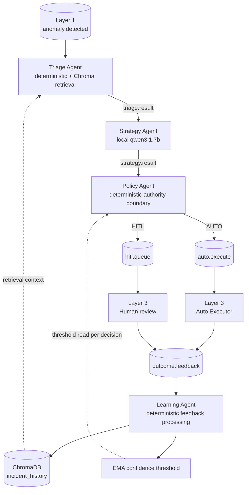

# Layer 2 — AI Control Plane

Layer 2 is the asynchronous control plane for **Distributed Multi-Agent
Coordination for Self-Healing Data Pipelines**. It accepts incidents from
Layer 1, normalizes and enriches them with historical context, asks a local
language model for a structured remediation proposal, and applies deterministic
safety policy before sending the incident to Layer 3.

The architecture is deliberately heterogeneous:

- **Triage** is deterministic classification plus ChromaDB retrieval, not an
  LLM agent.
- **Strategy** is the sole LLM-backed proposal generator.
- **Policy** is deterministic and owns execution eligibility.
- **Learning** is deterministic feedback processing, ChromaDB persistence, and
  EMA threshold adaptation; it is not an LLM agent.

This README is the practical Layer 2 overview. The detailed implementation
reference is [the Layer 2 component log](docs/layer2_component_log.md). The
repository-root [Full_Rerun.md](../Full_Rerun.md) remains the authoritative
cross-layer execution procedure; this document intentionally is not another
runbook.

## 1. Role and physical deployment

The reference Layer 2 deployment runs on **Node 2, `ai-brain-node`**:

| Attribute | Reference environment |
|---|---|
| Operating system | Ubuntu 24.04 Server |
| Hardware | AMD Ryzen 5, 8 GB RAM |
| Model execution | CPU-only local inference |
| Model service | Ollama |
| Historical memory | Persistent ChromaDB |

RabbitMQ is reached through the configured Layer 1 broker hostname, which
defaults to `stream-node`. The connection helper supports `RABBITMQ_HOST`,
`RABBITMQ_PORT`, `RABBITMQ_USER`, and `RABBITMQ_PASS` environment overrides;
the `fyp` virtual host and `fyp.events` exchange are active fixed topology
details. Ollama defaults to `http://localhost:11434` and supports the
`OLLAMA_HOST` override. ChromaDB persists module-relatively at
`layer2/chromadb_data`; the active client has no environment-path override.

## 2. Heterogeneous agent architecture

The agents are independently running RabbitMQ consumers/producers. They do not
call one another in-process.



| Agent | Classification | Primary responsibility |
|---|---|---|
| Triage | Deterministic + retrieval | Normalize Layer 1 payloads, select a response protocol, retrieve permitted historical context. |
| Strategy | **LLM-backed** | Generate a strictly constrained seven-field remediation proposal with `qwen3:1.7b`. |
| Policy | Deterministic | Validate eligibility and route only to AUTO or HITL. |
| Learning | Deterministic | Process outcome feedback, upsert memory, and update the confidence threshold. |

## 3. RabbitMQ flow and Layer 1/Layer 3 boundary

The Node 2 helper publishes durable JSON messages to the `fyp.events` topic
exchange. Relevant routing keys and queues are:

| Route | Producer | Consumer | Meaning |
|---|---|---|---|
| `anomaly.detected` | Layer 1 | Triage | Fused Layer 1 incidents and structural schema incidents. |
| `triage.result` | Triage | Strategy | Normalized incident, protocol, and retrieved context. |
| `strategy.result` | Strategy | Policy | Proposal plus deterministic validation state. |
| `auto.execute` | Policy | Layer 3 Auto Executor | Auto-eligible, policy-authorized incident. |
| `hitl.queue` | Policy | Layer 3 HITL workflow | Escalated incident. |
| `outcome.feedback` | Layer 3 | Learning | Completed AUTO or HITL outcome. |

Layer 1 contributes two payload families to `anomaly.detected`. Structural
schema incidents already have an anomaly type/severity. Fused incidents may
need Triage to derive an anomaly type from `contributing_models` and use
`fused_severity` as severity. Layer 2’s output authority ends at publishing an
AUTO/HITL route; Layer 3 performs execution or human review.

## 4. Triage: deterministic normalization and retrieval

Triage maps the normalized `(anomaly_type, severity)` pair through its
`PROTOCOL_TABLE` to a symbolic response protocol. Current Layer 1 detector
identities include:

| Detector model identity | Normalized anomaly type |
|---|---|
| `z_score_cpu_memory` | `cpu_memory_spike` |
| `z_score_error_rate` | `error_rate_surge` |
| `moving_average_throughput` | `throughput_drop` |
| `statistical_auth_rate` | `auth_failure_flood` |
| `distribution_shift_marker` | `schema_drift` |

Historical aliases `rate_gate_auth_rf` and `psi_detector` remain only for
replay/backfill compatibility. They are not evidence of active Layer 1 RF or
PSI inference.

Triage queries ChromaDB only after the collection contains at least three
documents. It performs a top-five similarity search, filters the result to
positive outcomes (`AUTO_EXECUTE_SUCCESS` and `HITL_APPROVED`), and may add an
opposite-risk-tier positive example when the selected context is one-sided.
Negative outcomes are stored by Learning but do not pass this retrieval filter.
A Chroma failure or cold collection produces empty context and does not stop
triage.

## 5. Strategy: constrained local structured generation

Strategy calls local Ollama `/api/generate` with `qwen3:1.7b`, a 35-second
timeout, and a JSON Schema in Ollama’s `format` request parameter. No cloud
LLM is used.

Every successful proposal must have exactly these seven fields, with no extras:

1. `anomaly_type`
2. `severity`
3. `affected_component`
4. `recommended_actions`
5. `confidence`
6. `risk_tier`
7. `reasoning`

The proposal must contain exactly three **distinct** symbolic actions from the
shared allowlist, a finite confidence in `[0, 1]`, an allowed severity, and an
allowed risk tier.

### Dynamic severity/risk constraints

For every request, Strategy copies the base response schema and binds:

| Incoming Triage severity | Required Strategy severity | Required risk tier |
|---|---|---|
| LOW | LOW | LOW |
| MEDIUM | MEDIUM | LOW |
| HIGH | HIGH | HIGH |
| CRITICAL | CRITICAL | HIGH |

This is implemented as per-request enum constraints, not fragile conditional
schema keywords. The system prompt repeats the same requirement, but the
Python `schema_validator` remains the final Strategy trust boundary.

### Exactly one bounded regeneration

After a parsable first response fails deterministic schema validation, Strategy
can make **one** complete regeneration request using the same dynamic schema
and validation guidance. It records `generation_attempts` and `retry_reason`,
and exposes `fyp_strategy_retry_total{reason}`.

There are never more than two model calls for an incident. Strategy does not
deduplicate actions in Python, inject fallback actions, weaken the retry schema,
or relax Policy. A parse failure or model-call exception is published as
invalid/timeout for Policy to route fail closed; it does not trigger an
unbounded repair loop.

## 6. Policy: deterministic fail-closed authority

Strategy proposes; Policy decides. Policy loads the current confidence threshold
on every decision and allows AUTO only after the proposal has passed all
required safety checks:

1. not timed out and valid JSON;
2. `schema_valid == true`;
3. a recognised risk tier and a finite confidence in `[0, 1]`;
4. exactly three actions, each in the shared allowlist;
5. no legacy `low_confidence` Fusion condition;
6. LOW risk tier;
7. confidence at or above the current threshold.

Any failed or uncertain check routes to `hitl.queue`. Duplicate actions are
rejected by the earlier deterministic Strategy schema validator; Policy then
fail-closes through the `schema_valid` gate. It does not independently repair
or deduplicate a proposal.

The principal outcomes are `LOW_RISK_HIGH_CONFIDENCE` (AUTO),
`HIGH_RISK`, `LOW_CONFIDENCE`, and `SCHEMA_INVALID` (HITL); source also
defines fail-closed `TIMEOUT`, `PARSE_ERROR`, `INVALID_RISK_TIER`,
`INVALID_CONFIDENCE`, `UNSUPPORTED_ACTION`, and legacy
`FUSION_LOW_CONFIDENCE` reasons.

## 7. Learning: deterministic feedback, memory, and EMA

Learning consumes `outcome.feedback` on Node 2. It constructs a deterministic
structured summary, upserts that summary/metadata into ChromaDB’s
`incident_history` collection, and applies an EMA threshold update. It makes
no Ollama call, no LLM summary, and no model-weight update.

The reset configuration is a threshold of `0.65`, EMA alpha `0.9`, and hard
bounds `[0.60, 0.90]`. For recognized outcome signals, Learning applies:

```text
new_threshold = 0.9 × current_threshold + 0.1 × outcome_signal
new_threshold = clamp(new_threshold, 0.60, 0.90)
```

Threshold persistence uses a same-directory temporary file, flush, `fsync`,
and `os.replace`. This avoids leaving a partially written threshold file.
Policy reads and clamps the persisted value on every message.

## 8. Observability and latency definitions

| Component | Metrics port | Principal metrics |
|---|---:|---|
| Triage | 8010 | `fyp_triage_latency_s`, `fyp_triage_processed_total`, `fyp_triage_timeout_total` |
| Strategy | 8011 | `fyp_strategy_latency_s`, schema-valid/invalid/timeout counters, `fyp_strategy_retry_total`, `fyp_strategy_tokens_per_s` |
| Policy | 8012 | `fyp_policy_latency_s`, `fyp_routing_decision_total`, `fyp_control_plane_processing_latency_seconds`, `fyp_end_to_end_decision_latency_seconds` |
| Learning | 8013 | `fyp_learning_outcomes_total`, ChromaDB/EMA counters, `fyp_feedback_completion_latency_seconds`, `fyp_learning_processing_latency_seconds` |

The final metric names deliberately distinguish processing, decision, feedback,
and Learning work:

| Metric concept | Definition |
|---|---|
| Control-Plane Processing Latency (CPL) | Sum of recorded Triage, Strategy, and Policy processing time; excludes inter-agent queue waiting. |
| End-to-End Decision Latency | Triage timestamp to Policy decision; includes queue/backlog delay. |
| Feedback Completion Latency | Policy decision timestamp to receipt of the related `outcome.feedback`. |
| Learning Processing Latency | Time spent processing feedback inside Learning. |

None of these measures verifies service recovery, so Layer 2 does not report a
service-recovery duration or recovery-time improvement.

## 9. Evaluation harness

Evaluation capture is opt-in. Set `LAYER2_EVALUATION_RUN_ID` to a safe run ID;
optionally set `LAYER2_EVALUATION_DIR` to change the root, which otherwise
defaults to `layer2/evaluation/results`. The live agents write best-effort
stage JSONL files:

```text
triage.jsonl       strategy.jsonl       policy.jsonl
feedback.jsonl     learning.jsonl
```

The offline analyzer joins the latest record per `event_id` and produces
`per_event.csv` and `evaluation_summary.json`. Evaluation writes are not part
of functional decision-making: invalid/missing run IDs disable capture, and
write errors are swallowed so telemetry cannot break a live decision.

## 10. Authoritative Wi-Fi experiment

The authoritative completed run is `wifi_cold_20260913_041045`. Layer 2
received **639 unique incidents**, exactly reconciling with Layer 1:

```text
539 fused Layer 1 incidents + 100 structural schema incidents = 639
```

Processing integrity was complete: no missing Strategy, Policy, feedback, or
Learning records; no pending HITL feedback; no unknown feedback IDs; no
malformed records; and zero duplicates in every stage. The final analyzer also
reported 1,950 ground-truth records with zero malformed records.

### Strategy and Policy results

| Measure | Final result |
|---|---:|
| Strategy incidents | 639 |
| Timeouts | 0 |
| Valid JSON / invalid JSON | 639 / 0 |
| Schema-valid / schema-invalid | 493 / 146 |
| Strategy Schema Validity Rate (SVR) | 77.15% |
| Schema-invalid rate | 22.85% |
| AUTO / HITL | 170 / 469 |
| AUTO / HITL percentage | 26.60% / 73.40% |

| Policy reason | Count | Percentage |
|---|---:|---:|
| `HIGH_RISK` | 258 | 40.38% |
| `LOW_CONFIDENCE` | 65 | 10.17% |
| `LOW_RISK_HIGH_CONFIDENCE` | 170 | 26.60% |
| `SCHEMA_INVALID` | 146 | 22.85% |

```text
258 + 65 + 170 + 146 = 639
```

The 146 schema-invalid proposals were not lost: deterministic Policy routed all
of them to HITL. The bounded generation procedure was already active, so this
is a genuine schema-compliance limitation of the evaluated system rather than
an absence of validation.

### Feedback, risk, and final learning state

- Feedback completed for **639/639** incidents: AUTO 170/170 and HITL
  469/469.
- Risk-tier accuracy was **513/630 = 81.43%** under the analyzer’s externally
  labelled-case semantics. The remaining nine incidents are not assigned
  invented labels.
- FAR and FER are **not computable**: authoritative `safe_to_auto` and
  `expected_route` labels were unavailable for the final run.
- ChromaDB contained **639** `incident_history` documents after the run.
- The final observed EMA threshold was **0.7291** after **639** updates
  (alpha 0.9; final observed timestamp
  `2026-09-13T06:36:14.445828+00:00`). This is experimental state, not the
  tracked reset configuration.

## 11. Authoritative latency interpretation

The offline analyzer is authoritative for final aggregate results where a
dashboard histogram is visually clipped.

| Measurement | Mean | Median | p95 | p99 | Max |
|---|---:|---:|---:|---:|---:|
| Triage processing | 0.005873 s | 0.001 s | 0.001 s | 0.001 s | 3.258 s |
| Strategy processing | 13.0546 s | 11.142 s | 19.409 s | 20.486 s | 22.084 s |
| Policy processing | 0.000156 s | ~0 s | 0.001 s | 0.001 s | 0.001 s |
| CPL | 13.0606 s | 11.17 s | 19.41 s | 20.487 s | 22.085 s |
| E2E decision | 4,105.09 s | 4,112.287 s | 7,901.77 s | 8,267.34 s | 8,354.47 s |
| Feedback completion | 37.611 s | 23.107 s | 126.545 s | 282.361 s | 367.597 s |
| Learning processing | 0.05897 s | 0.04609 s | 0.07773 s | 0.11969 s | 7.8868 s |

E2E median is approximately **68.5 minutes**, E2E p95 approximately
**131.7 minutes**, and the maximum approximately **139.2 minutes**. This is
not a contradiction with Strategy’s ~13 s processing time: CPU-only,
prefetch-one Strategy handling creates queue accumulation across 639 incidents.

```text
639 × 13.05 s ≈ 8,339 s ≈ 139 min
```

That approximate serialized work closely matches the observed maximum E2E
latency. It is a throughput/scalability limitation, not evidence of incident
loss. A dashboard’s visually clipped ~30-minute E2E p95 is not used as the
authoritative final p95.

## 12. Findings and limitations

The experiment demonstrates complete incident accounting, deterministic
fail-closed control, and a complete feedback loop—not unrestricted autonomous
recovery or universal production scalability.

- Strategy is the dominant component cost on tested CPU-only commodity
  hardware.
- The final SVR was 77.15%; 146 proposals remained invalid after the bounded
  generation procedure.
- Policy safely escalated all schema-invalid proposals and 73.40% of incidents
  overall to HITL.
- Feedback and Learning completed for every evaluated incident.
- Thresholds, prompt/model behaviour, and throughput are workload/hardware
  specific; the experiment uses synthetic incidents.
- Risk-tier accuracy is 81.43%, not 100%.
- FAR and FER require authoritative routing/safety labels and are currently not
  computable.
- A ChromaDB telemetry/library warning observed during execution did not block
  successful operations; the final state still had 639 documents and updates.
- Phase 0/model-selection work is preliminary/offline context, not the final
  639-incident Wi-Fi experiment.

## 13. Directory guide

```text
layer2/
├── README.md                         Layer 2 overview (this file)
├── docs/
│   └── layer2_component_log.md       Detailed implementation reference
├── agents/                           Triage, Strategy, Policy, Learning
├── chromadb_utils/                   Persistent client, retrieval, upsert
├── config/                           Resettable EMA threshold configuration
├── evaluation/                       Opt-in artefacts and offline analyzer
├── ollama/                           Local Ollama HTTP client
├── prompts/                          Strategy system prompt
├── rabbitmq/                         Node 2 connection/publishing helper
├── tests/                            Contract and regression tests
└── utils/                            Append-only JSONL file logger
```

## 14. Further reading

- See [the Layer 2 component log](docs/layer2_component_log.md) for exact
  protocol mappings, validation rules, policy ordering, metrics, evaluation
  fields, and detailed Mermaid diagrams.
- See [Layer 1 README](../layer1/README.md) for the upstream statistical data
  plane and why 539 fused plus 100 structural incidents entered Layer 2.
- See [Full_Rerun.md](../Full_Rerun.md) for end-to-end operation. It is not
  modified or duplicated here.
