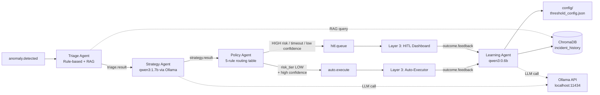

# Layer 2 User Guide — `ai-brain-node` (192.168.18.102)

This guide covers running the complete **AI Control Plane** on Node 2.

> **Prerequisite:** Layer 1 must be fully operational — all exchanges and queues declared on `stream-node`, with the Fusion Engine publishing to `anomaly.detected`.

---

## 1. Prerequisites Checklist

On `ai-brain-node`, verify the following before starting any agent.

**Hostname**

```bash
hostname          # must return "ai-brain-node"
```

**RabbitMQ (on stream-node) reachable**

```bash
python3 -c "
from rabbitmq.connection import get_connection
conn = get_connection()
ch = conn.channel()
print('OK')
conn.close()
"
```

**Ollama running with required models**

```bash
ollama list | grep qwen3
# Expected: qwen3:1.7b and qwen3:0.6b
```

**ChromaDB collection exists** (cold start is OK)

```bash
python3 -c "from chromadb_utils.client import get_collection; print(get_collection().count())"
```

**`/etc/hosts` cluster mapping** (same as Node 1)

```bash
grep "192.168.18" /etc/hosts
```

---

## 2. Python Environment

```bash
cd ~/fyp-pipeline/layer2
source .venv/bin/activate   # if not auto-activated
```

The virtual environment includes `pika`, `chromadb`, `sentence-transformers`, `ollama`, `prometheus-client`, etc. If any are missing, re-run:

```bash
pip install -r requirements_node2.txt
```

---

## 3. Layer 2 Data Flow



**Pipeline:** `anomaly.detected` → Triage Agent → `triage.result` → Strategy Agent (qwen3:1.7b) → `strategy.result` → Policy Agent → `auto.execute` or `hitl.queue`

**Feedback loop:** `outcome.feedback` → Learning Agent (qwen3:0.6b) → ChromaDB upsert + EMA threshold update

All agents connect to RabbitMQ on `stream-node`; Ollama and ChromaDB run locally on `ai-brain-node`.

---

## 4. Startup Order

Always start agents in this exact sequence:

| Order | Agent | Command (from `layer2/`) | Port |
|:-----:|-------|---------------------------|:----:|
| 1 | Triage Agent | `python3 agents/triage_agent.py` | 8010 |
| 2 | Strategy Agent | `python3 agents/strategy_agent.py` | 8011 |
| 3 | Policy Agent | `python3 agents/policy_agent.py` | 8012 |
| 4 | Learning Agent | `python3 agents/learning_agent.py` | 8013 |

- Triage must be first because it produces `triage.result` for the Strategy Agent.
- Learning can start anytime — it simply waits for `outcome.feedback`.

---

## 5. Running Each Agent

### 5.1 Triage Agent

```bash
cd ~/fyp-pipeline/layer2
python3 agents/triage_agent.py
```

**Expected output:**
```
triage_agent_started
triage_consuming queue=anomaly.detected
triage_complete event_id=... protocol=... rag_docs=... latency_ms=...
```

| Note | Detail |
|---|---|
| Idle behavior | If `anomaly.detected` is empty, it waits silently |
| Latency | Steady-state latency < 5 ms per event |
| Cold start | ChromaDB cold start (0 docs) → RAG context is empty; this is normal |

### 5.2 Strategy Agent

```bash
python3 agents/strategy_agent.py
```

**Expected output:**
```
strategy_agent_started model=qwen3:1.7b
strategy_consuming queue=triage.result model=qwen3:1.7b
strategy_complete event_id=... schema_valid=True latency_ms=...
```

| Note | Detail |
|---|---|
| First inference | May take 25–30 s; subsequent calls ~20–25 s |
| Timeout | 35 s. If exceeded, `timed_out=True` is set and the event still goes to `strategy.result` |
| Metrics | Prometheus metrics available on port 8011 |

### 5.3 Policy Agent

```bash
python3 agents/policy_agent.py
```

**Expected output:**
```
policy_agent_started
policy_consuming queue=strategy.result
policy_routed event_id=... decision=AUTO reason=LOW_RISK_HIGH_CONFIDENCE
```

| Note | Detail |
|---|---|
| Latency | Sub-ms per message |
| Config | Loads confidence threshold from `config/threshold_config.json` on every message |
| Routing | `auto.execute` if `risk_tier=LOW` **and** confidence ≥ threshold; otherwise `hitl.queue` |

### 5.4 Learning Agent

```bash
python3 agents/learning_agent.py
```

**Expected output:**
```
learning_agent_started model=qwen3:0.6b
learning_consuming queue=outcome.feedback
learning_complete event_id=... outcome=AUTO_EXECUTE_SUCCESS
```

| Note | Detail |
|---|---|
| Impact | Fires post-dispatch, zero impact on main pipeline |
| Summarization | Calls qwen3:0.6b (timeout 10 s); falls back to a default summary if the LLM fails |
| ChromaDB | Upserts incident into the `incident_history` collection |
| Threshold update | Updates EMA confidence threshold in `config/threshold_config.json` (hard bounds `[0.60, 0.90]`) |

---

## 6. Verification

### 6.1 Queue Depths

From any node with RabbitMQ access:

```bash
python3 -c "
from rabbitmq.connection import get_connection
conn = get_connection(); ch = conn.channel()
for q in ['anomaly.detected','triage.result','strategy.result','auto.execute','hitl.queue','outcome.feedback']:
    r = ch.queue_declare(q, passive=True)
    print(f'{q}: {r.method.message_count}')
conn.close()
"
```

### 6.2 ChromaDB Document Count

```bash
python3 -c "from chromadb_utils.client import get_document_count; print(get_document_count())"
```

### 6.3 EMA Threshold

```bash
cat config/threshold_config.json
```

### 6.4 Prometheus Metrics

```bash
curl -s http://localhost:8010/metrics | head   # Triage
curl -s http://localhost:8011/metrics | head   # Strategy
curl -s http://localhost:8012/metrics | head   # Policy
curl -s http://localhost:8013/metrics | head   # Learning
```

Gateway-node's Prometheus scrapes these ports automatically.

---

## 7. Stopping Agents

Press `Ctrl + C` in each agent's terminal.

- The current message is acknowledged **only after** the result is published — no message loss.
- Unprocessed messages remain in their queues for the next startup.

---

## 8. Full Pipeline Test

1. **Node 1:** Ensure Fusion Engine is running (and all Layer 1 components if re-running the corpus).
2. **Node 2:** Start Triage → Strategy → Policy → Learning (order matters).
3. **Node 3:** Start Auto-Executor and HITL consumer.
4. **Node 1:** Replay corpus:
   ```bash
   cd ~/fyp-pipeline/layer1/seg
   python3 seg.py --mode replay --speed 50 --input ../../evaluation/events_1950.jsonl
   ```
5. Monitor queues and the Grafana dashboard.

---

## 9. Troubleshooting

| Symptom | Likely Cause | Fix |
|---|---|---|
| `ModuleNotFoundError: No module named 'rabbitmq'` | Running from wrong directory | Run from `layer2/`, not inside `agents/` |
| ChromaDB hangs on startup | Internet required to verify sentence-transformers model | Set `HF_HUB_OFFLINE=1` (already in `chromadb_utils/client.py`) or ensure local cache exists |
| `Failed to send telemetry event ClientStartEvent` | Harmless ChromaDB telemetry warning | Ignore; or set `ANONYMIZED_TELEMETRY=False` in `.env` |
| Strategy Agent timeouts > 20% | Complex prompts or RAM pressure | Timeout is 35 s; if still too many, stop Learning Agent to free ~400 MB, or restart Ollama |
| `auto.execute` empty | All events are HIGH-risk or confidence below threshold | Check EMA threshold; lower temporarily to 0.55 for testing, or wait for Learning Agent to adjust |
| RabbitMQ connection refused | `stream-node` unreachable or RabbitMQ down | `ping stream-node`; `ssh stream-node "sudo systemctl restart rabbitmq-server"` |
| ChromaDB documents show `unknown` fields | Old data from before Learning Agent fix | Purely cosmetic; similarity search still works. Purge collection before final evaluation if needed |
| `ai-brain-node:8010` down in Prometheus | Agent not running | Start the corresponding agent |

---

## 10. Directory Reference

```
layer2/
├── agents/               # triage, strategy, policy, learning
├── chromadb_utils/        # client, query, upsert
├── ollama/                # HTTP client for Ollama
├── rabbitmq/              # connection helper
├── prompts/               # system prompts for qwen3 models
├── config/                # threshold_config.json
├── chromadb_data/         # persistent ChromaDB store (do not delete)
├── .env                   # environment variables
└── requirements_node2.txt
```

For detailed component-by-component build history, see `docs/layer2_component_log.md`.