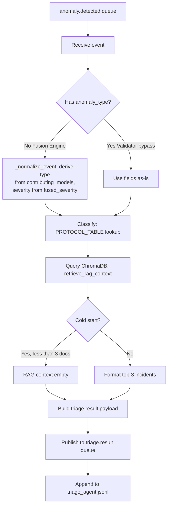
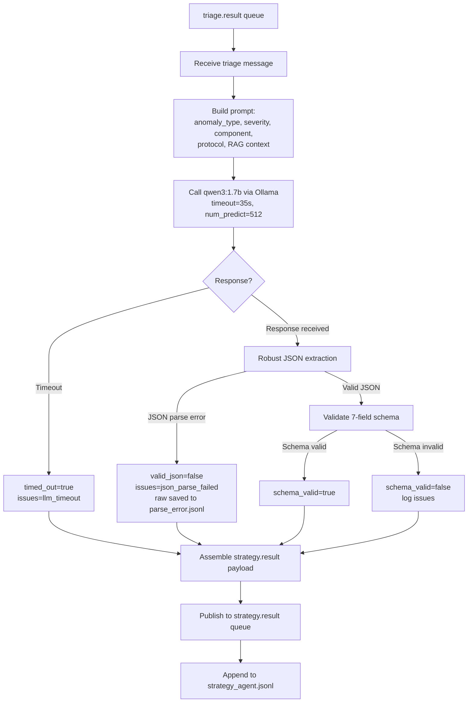
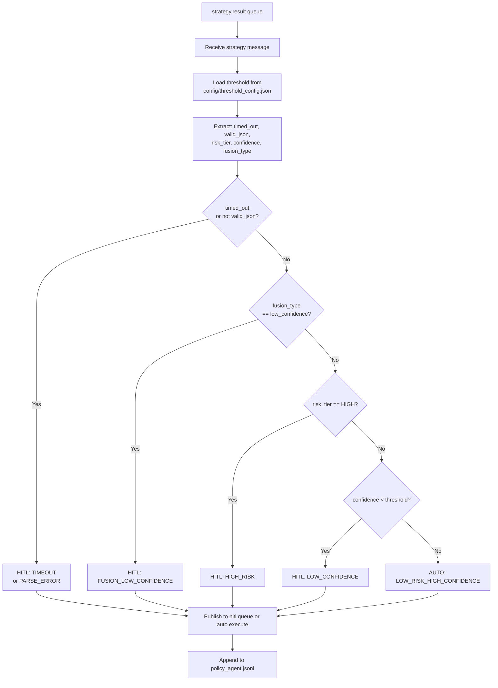
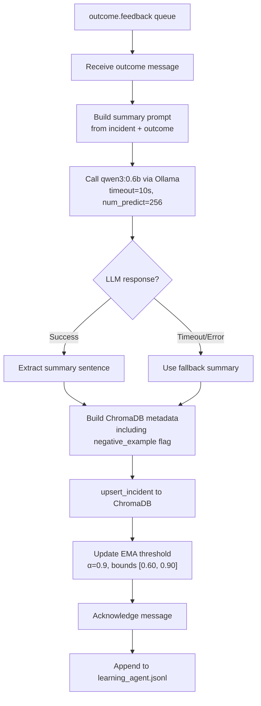

# Layer 2 — Component-by-Component Build Log

**Project:** Distributed Multi-Agent Coordination for Self-Healing Data Pipelines
**Layer:** Layer 2 — AI Control Plane (Node 2, `ai-brain-node`)
**Purpose:** A single, continuously maintained record documenting the implementation of each Layer 2 component.
**Format:** Follows the conventions established in the Layer 1 Component Build Log.

> **Final evaluation note:** This document has been updated following the final gapped run.
> The pipeline was executed across multiple sessions with intervening gaps.
> Consequently, **Prometheus counters reset upon restart** and cannot be treated as reliable cumulative totals.
> The final figures presented below are **reconstructed from persistent data** (SQLite, ChromaDB, detector files) unless explicitly identified as live-metric values.

> **Logging update:** All agents now write **append-only JSONL logs** to `layer2/logs/`.
> This enables accurate cumulative counts even when the pipeline is executed across multiple sessions.
> See Section 7 for further detail.

---

## 1. Triage Agent

**Files:** `agents/triage_agent.py`, `chromadb_utils/query.py`, `chromadb_utils/client.py`, `rabbitmq/connection.py`, `utils/file_logger.py`
**Status:** ✅ **v1.2 — Rule-based classification with ChromaDB RAG integration and persistent logging.**

### 1.0 Environment Prerequisites (Verified)

- `ai-brain-node` is SSH-accessible, with the virtual environment auto-activating.
- Ollama is running with `qwen3:1.7b` (1.4 GB) and `qwen3:0.6b` (522 MB).
- The ChromaDB collection `incident_history` exists.
- RabbitMQ connectivity to `stream-node:5672` is established.
- **Fix applied:** `chromadb_utils/client.py` was modified to include offline mode and an absolute `chromadb_data` path.

### 1.1 Files Built / Modified

| File | Action | Purpose |
|---|---|---|
| `rabbitmq/connection.py` | Replaced stub | Provides `get_connection()` and `publish()` helper functions |
| `chromadb_utils/client.py` | Added offline mode + absolute path | Prevents HuggingFace hang and avoids stray data directories |
| `chromadb_utils/query.py` | Built from stub | Implements three-step RAG retrieval |
| `agents/triage_agent.py` | Built from stub, with logging added | Performs classification and RAG retrieval; publishes `triage.result`; writes `triage_agent.jsonl` |
| `utils/file_logger.py` | New shared logger | Provides append-only JSONL logging for all agents |

### 1.2 Classification Logic

- **Lookup table:** `(anomaly_type, severity) → response_protocol` (18 entries).
- **Fallback sequence:** exact match → `(anomaly_type, HIGH)` → `GENERIC_INVESTIGATE`.
- **Fused event normalization:** derives `anomaly_type` from `contributing_models` and applies `fused_severity`.

### 1.3 RAG Retrieval

- Queries the ChromaDB `incident_history` collection.
- Retrieves the top five results by similarity, applies a positive-outcome filter and a risk-tier balance check, and returns up to three examples.
- On cold start (0 documents), returns an empty list (`[]`).

### 1.4 Final-Run Results (Previous Gapped Run)

- **Total events processed: 632**
  Reconstructed from downstream Policy decisions.
  Consistent with `532 fused + 100 validator-bypass = 632`.
- **Validator-bypass events:** 100 schema-drift events classified as `HALT_INGESTION_REVIEW_SCHEMA` or `FLAG_FOR_SCHEMA_REVIEW`.
- **Fused events:** 532 classified using derived anomaly types.
- **RAG context:** ChromaDB was initially empty and accumulated 632 documents by the end of the run.

### 1.5 Open Items

- [ ] The impact of RAG on risk-tier classification accuracy (H1) has not been formally measured within this gapped run.
- [ ] The count of fused/compound events is low; a corpus update may be warranted to capture more compound incidents.

---

## 2. Strategy Agent

**Files:** `ollama/client.py`, `agents/schema_validator.py`, `agents/strategy_agent.py`, `utils/file_logger.py`
**Status:** ✅ **v1.2 — qwen3:1.7b via Ollama, seven-field schema validation, 35-second timeout, robust JSON extraction, persistent logging.**

### 2.1 Files Built

| File | Action | Purpose |
|---|---|---|
| `ollama/client.py` | Replaced stub | Provides an Ollama HTTP wrapper |
| `agents/schema_validator.py` | Replaced stub | Performs seven-field JSON validation |
| `agents/strategy_agent.py` | Replaced stub; added logging and JSON extraction | Consumes `triage.result`, invokes the LLM, publishes `strategy.result`, and logs outcomes |
| `utils/file_logger.py` | New shared logger | Provides append-only JSONL logging |

### 2.2 Flow

### 2.3 Key Design Decisions

- The system prompt is loaded from `prompts/strategy_system_prompt.txt`.
- Timeout is set to `35 seconds` (increased from 30 s in v1.0).
- `num_predict=512`, adopted from the Phase 0 fix.
- **Robust JSON extraction** strips markdown code fences and extracts the first `{...}` object.
- On parse failure, the raw response is saved to `logs/parse_error.jsonl`.
- Prometheus metrics are exposed on port 8011.

### 2.4 Final-Run Results (Previous Gapped Run)

- **Total strategy requests processed: 632** (matching Triage Agent output).
- **Timeouts routed to HITL:** 4
- **Parse errors routed to HITL:** 83
- `valid_json == False` accounted for 4 + 83 = 87 events.
- The remaining `545` events contained valid JSON and were evaluated by the schema validator.
- **Exact schema_valid/invalid totals could not be recovered** from persistent data due to the Prometheus counter reset.
- **Risk-tier distribution (from the decisions table):** HIGH: 409, LOW: 133, MEDIUM: 1, MISSING: 89.
- **Confidence scores:** minimum 0.00, maximum 0.98, average 0.70.

### 2.5 Known Issues

- **Gapped execution invalidated live Prometheus metrics.**
- **RAG context** was available only for later events in the run.
- A **single continuous run** is required to establish a definitive schema-valid rate.
- Parse errors are expected to decrease once robust JSON extraction is applied in the subsequent run.

---

## 3. Policy Agent

**Files:** `agents/policy_agent.py`, `utils/file_logger.py`
**Status:** ✅ **v1.2 — Five-rule routing table, threshold-aware, MTTA computed from `triage_timestamp`, persistent logging.**

### 3.1 Flow

### 3.2 Key Design Decisions

- Routing is deterministic, with sub-millisecond latency.
- The threshold is loaded from disk on every message.
- Hard bounds are set at `[0.60, 0.90]`.
- The MTTA histogram measures the interval `triage_timestamp → policy_timestamp`.
- Prometheus metrics are exposed on port 8012.

### 3.3 Final-Run Results (Previous Gapped Run)

- **Total routed: 632**
- **AUTO routed:** 99 (15.7%)
- **HITL routed:** 533 (84.3%)

| Routing Reason | Count |
|----------------|-------|
| HIGH_RISK | 411 |
| LOW_RISK_HIGH_CONFIDENCE | 99 |
| PARSE_ERROR | 83 |
| LOW_CONFIDENCE | 35 |
| TIMEOUT | 4 |

- **Policy latency:** ≤2 ms.
- **Threshold values during the run:** started at 0.65, ended at 0.7108.

### 3.4 Interpretation

- The high HITL rate is driven predominantly by HIGH_RISK classifications (411 of 632).
- PARSE_ERROR (83) is the second-largest contributor; TIMEOUT is negligible (4) following the timeout increase.
- Auto-execution succeeded for all 99 routed events.

---

## 4. Learning Agent

**Files:** `chromadb_utils/upsert.py`, `agents/learning_agent.py`, `utils/file_logger.py`
**Status:** ✅ **v1.2 — qwen3:0.6b summarisation, ChromaDB upsert, EMA threshold update, MTTR computed from `triage_timestamp`, persistent logging.**

### 4.1 Files Built

| File | Action | Purpose |
|---|---|---|
| `chromadb_utils/upsert.py` | Replaced stub | Upserts incident summaries into ChromaDB |
| `agents/learning_agent.py` | Replaced stub, with logging added | Consumes `outcome.feedback`, invokes qwen3:0.6b, updates ChromaDB and the EMA threshold, and logs outcomes |
| `utils/file_logger.py` | New shared logger | Provides append-only JSONL logging |

### 4.2 Flow

### 4.3 Key Design Decisions

- The agent has zero impact on the main pipeline.
- `qwen3:0.6b` is used for lightweight summarisation.
- A fallback summary is applied if the LLM call fails.
- The EMA formula is: `new = α × old + (1 − α) × signal`.
- Prometheus metrics are exposed on port 8013.

### 4.4 Final-Run Results (Previous Gapped Run)

- **Outcomes processed:** 632
  - `AUTO_EXECUTE_SUCCESS`: 99
  - `HITL_APPROVED`: 448
  - `HITL_REJECTED`: 85
- **ChromaDB documents after run:** 632
- **EMA threshold:** initial 0.65, final 0.7108, across 632 updates.

### 4.5 Open Items

- [ ] EMA convergence (OQ6) has not yet been plotted across a continuous run.
- [ ] Summarisation quality (OQ5) has not been formally scored.
- [ ] Negative examples are stored but not yet used to refine RAG retrieval beyond the positive-outcome filter.

---

## 5. Control-Plane Latency (CPL)

**Status:** ⚠️ **Not measurable from the previous gapped run.**

- A filtered query for contiguous HITL events (`triage → strategy ≤ 60 s`) returned zero samples.
- Because the pipeline was stopped and restarted across sessions, triage and strategy timestamps were frequently separated by hours.
- The average CPL computed from raw persisted payloads (`~82,845 s`) is therefore invalid.

**Required action:**
The pipeline must be run **continuously**, from `anomaly.detected` through `outcome.feedback`, to capture valid CPL, MTTA, and MTTR figures. The newly added file logs will support this even in the presence of minor gaps.

---

## 6. Final Data Summary (Reconstructed from Persistent Data, Previous Gapped Run)

| Metric | Value |
|--------|-------|
| Detector result rows per detector | 1,527 each |
| Detector anomalies (sum) | 643 |
| Fusion published | 532 |
| Validator bypass | 100 |
| Total `anomaly.detected` events | 632 |
| Total Policy decisions | 632 |
| AUTO routed | 99 |
| HITL routed | 533 |
| HITL APPROVED | 448 |
| HITL REJECTED | 85 |
| Auto-Executor successes | 99 |
| ChromaDB documents | 632 |
| EMA threshold (final) | 0.7108 |
| EMA updates | 632 |
| Control-Plane Latency | ❌ Unavailable |

---

## 7. Persistent Logging (Added After Previous Run)

All four agents now write append-only JSONL logs via `utils/file_logger.py`, ensuring that results remain recoverable across restarts and multiple sessions.

| Log File | Written By | Content |
|----------|-----------|---------|
| `triage_agent.jsonl` | Triage Agent | Event ID, anomaly type, severity, protocol, RAG documents, latency (ms) |
| `strategy_agent.jsonl` | Strategy Agent | Event ID, JSON validity, schema validity, issues, latency (ms), tokens/second, timeout status |
| `policy_agent.jsonl` | Policy Agent | Event ID, decision, reason, threshold used, latency (ms) |
| `learning_agent.jsonl` | Learning Agent | Event ID, outcome type, summary, latency (ms) |
| `parse_error.jsonl` | Strategy Agent | Raw LLM response recorded upon JSON parsing failure |

**Log directory:** `layer2/logs/` (excluded from version control; cleared before each fresh run).

With these logs in place, future runs — whether continuous or gapped — will preserve cumulative agent-level counts and support precise post-run analysis.

---

> **Prepared following the final gapped run and subsequent logging enhancements.**
> A **single, uninterrupted evaluation run** remains necessary to obtain citable latency metrics; however, all cumulative counts are now independently recoverable from the persistent file logs.