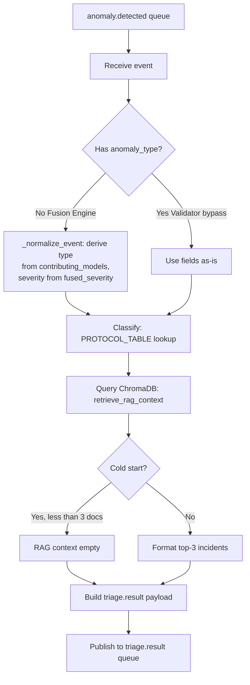
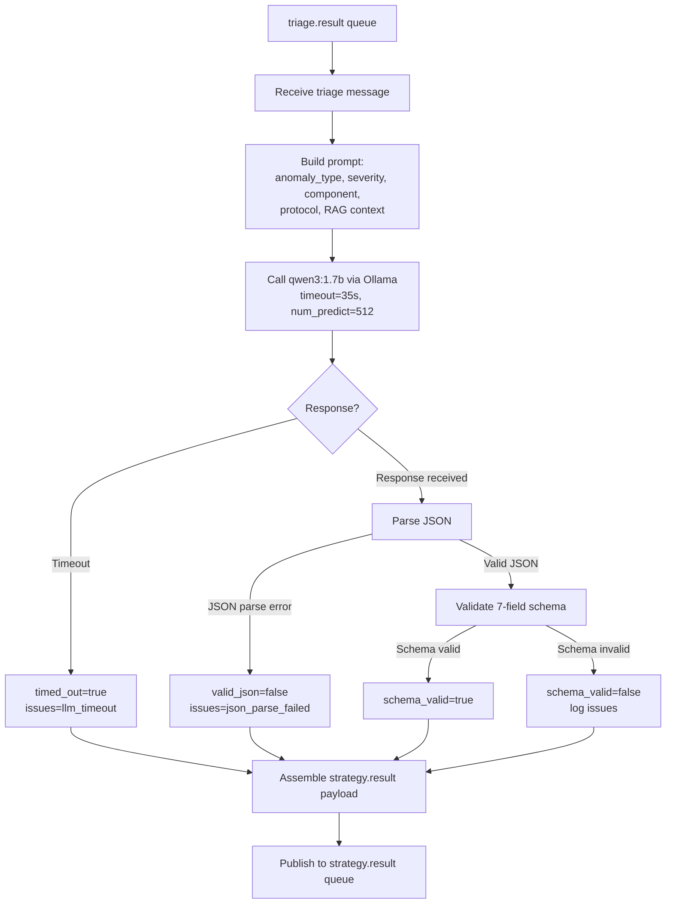
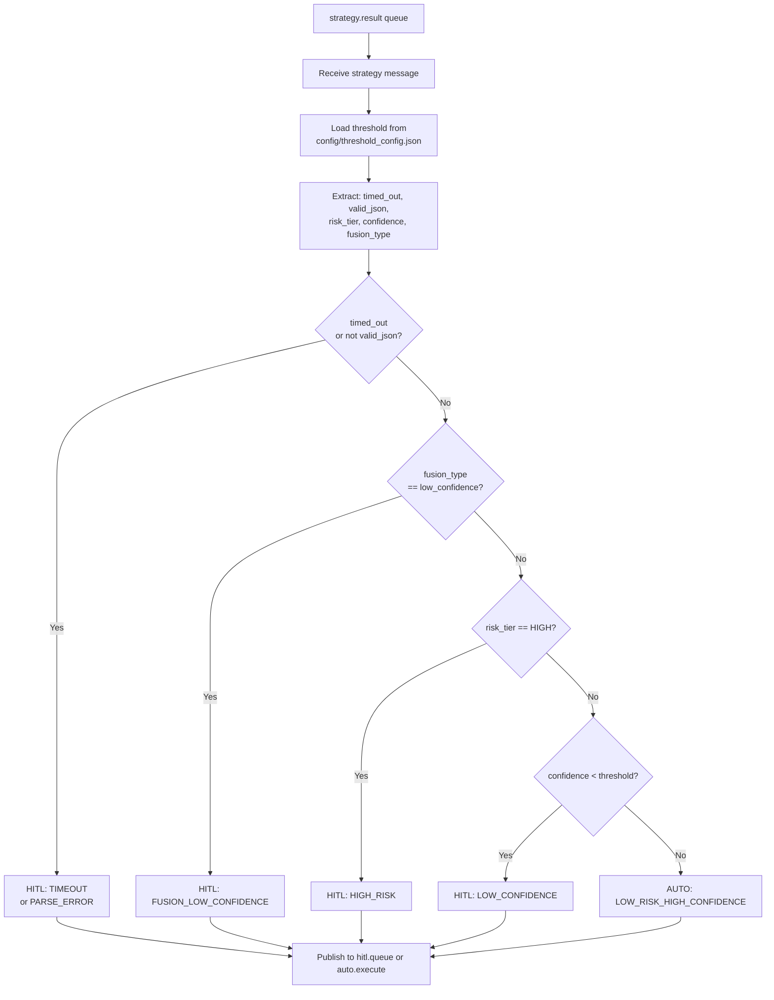
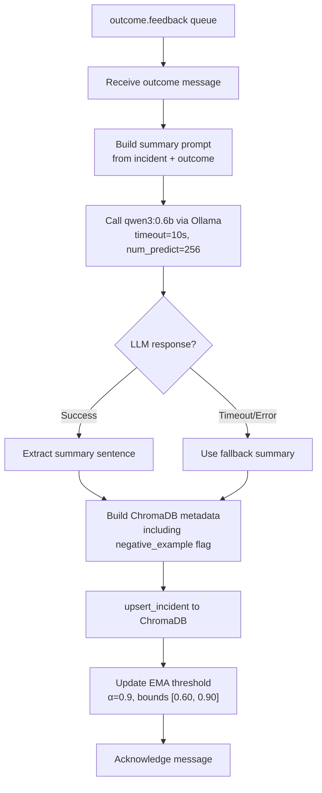

# Layer 2 — Component-by-Component Build Log

**Project:** Distributed Multi-Agent Coordination for Self-Healing Data Pipelines
**Layer:** Layer 2 — AI Control Plane (Node 2, `ai-brain-node`)
**Purpose:** Single running record of every Layer 2 component as it's implemented.
**Pattern:** Follows Layer 1 Component Build Log format.

> **Final evaluation note:** This file has been updated after the final run.
> The pipeline was executed in multiple sessions with gaps.
> Therefore, **Prometheus counters reset on restart** and are not reliable as cumulative totals.
> Final numbers below are **reconstructed from persistent data** (SQLite, ChromaDB, detector files) unless explicitly stated as live-metric values.

---

## 1. Triage Agent

**Files:** `agents/triage_agent.py`, `chromadb_utils/query.py`, `chromadb_utils/client.py`, `rabbitmq/connection.py`
**Status:** ✅ **v1.0 — rule-based classification + ChromaDB RAG.**

### 1.0 Environment Prerequisites (verified)

- `ai-brain-node` SSH accessible, venv auto-activates.
- Ollama running: `qwen3:1.7b` (1.4 GB) and `qwen3:0.6b` (522 MB).
- ChromaDB collection `incident_history` exists.
- RabbitMQ connected to `stream-node:5672`.
- **Fix applied:** `chromadb_utils/client.py` added offline mode and absolute `chromadb_data` path.

### 1.1 Files built/modified

| File | Action | Purpose |
|---|---|---|
| `rabbitmq/connection.py` | Replaced stub | `get_connection()` + `publish()` helpers |
| `chromadb_utils/client.py` | Added offline mode + absolute path | Prevents HuggingFace hang and stray data dir |
| `chromadb_utils/query.py` | Built from stub | 3-step RAG retrieval |
| `agents/triage_agent.py` | Built from stub | Classification + RAG + `triage.result` |

### 1.2 Classification logic

- **Lookup table:** `(anomaly_type, severity) → response_protocol` (18 entries).
- **Fallback:** exact → `(anomaly_type, HIGH)` → `GENERIC_INVESTIGATE`.
- **Fused event normalization:** derives `anomaly_type` from `contributing_models` and uses `fused_severity`.

### 1.3 RAG retrieval

- Query ChromaDB `incident_history`.
- Top-5 similarity → positive outcome filter → risk-tier balance check → return ≤3 examples.
- Cold start (0 docs) returns `[]`.

### 1.4 Final-run results

- **Total events processed: 632**
  Reconstructed from downstream Policy decisions (all Triage outputs eventually reached Policy).
  This matches `532 fused + 100 validator-bypass = 632`.

- **Validator bypass events:** 100 schema-drift events classified as `HALT_INGESTION_REVIEW_SCHEMA` or `FLAG_FOR_SCHEMA_REVIEW`.

- **Fused events:** 532 classified using derived anomaly types.

- **RAG context:**
  ChromaDB was initially empty. It accumulated 632 documents by the end of the run.
  Therefore, early events had no RAG context, while later events could retrieve prior incidents.

### 1.5 Open items

- [ ] RAG impact on risk-tier accuracy (H1) not formally measured in this gapped run.
- [ ] Fused/compound event count is low; corpus update may be needed for more compound incidents.

---

## 2. Strategy Agent

**Files:** `ollama/client.py`, `agents/schema_validator.py`, `agents/strategy_agent.py`
**Status:** ✅ **v1.1 — qwen3:1.7b via Ollama, 7-field schema validation, 35s timeout.**

### 2.1 Files built

| File | Action | Purpose |
|---|---|---|
| `ollama/client.py` | Replaced stub | Ollama HTTP wrapper |
| `agents/schema_validator.py` | Replaced stub | 7-field JSON validation |
| `agents/strategy_agent.py` | Replaced stub | Consumes `triage.result`, calls LLM, publishes `strategy.result` |

### 2.2 Flow

### 2.3 Key design decisions

- System prompt loaded from `prompts/strategy_system_prompt.txt`.
- Timeout: `35 seconds` (was 30s in v1.0).
- `num_predict=512` from Phase 0 fix.
- Prometheus metrics on port 8011.

### 2.4 Final-run results

- **Total strategy requests processed: 632** (same as Triage outputs).
- **Timeouts routed to HITL:** 4
- **Parse errors routed to HITL:** 83
- Therefore, `valid_json == False` accounted for 4 + 83 = 87 events.
- Remaining `545` events had valid JSON and were evaluated by the schema validator.

- **Exact schema_valid/invalid totals not recoverable** from persistent data.
  Prometheus counters were reset across sessions.
  We can only infer that the maximum schema-valid events ≤ 545.

- **Risk tier distribution (from decisions table):**
  - HIGH: 409
  - LOW: 133
  - MEDIUM: 1
  - MISSING: 89

- **Confidence scores:**
  - min: 0.00
  - max: 0.98
  - average: 0.70

### 2.5 Known issues

- **Gapped execution invalidated live Prometheus metrics**, especially schema_valid/invalid and latency histograms.
- **RAG context** was available only for later events.
- For a definitive schema-valid rate, a **single continuous run** is required.

---

## 3. Policy Agent

**Files:** `agents/policy_agent.py`
**Status:** ✅ **v1.1 — 5-rule routing table, threshold-aware, MTTA uses triage_timestamp.**

### 3.1 Flow

### 3.2 Key design decisions

- Deterministic, sub-ms routing.
- Threshold loaded from disk on every message.
- Hard bounds `[0.60, 0.90]`.
- MTTA histogram measures `triage_timestamp → policy_timestamp`.
- Prometheus metrics on port 8012.

### 3.3 Final-run results

- **Total routed: 632**
- **AUTO routed:** 99 (15.7%)
- **HITL routed:** 533 (84.3%)

| Routing Reason | Count |
|----------------|-------|
| HIGH_RISK | 411 |
| LOW_RISK_HIGH_CONFIDENCE | 99 |
| PARSE_ERROR | 83 |
| LOW_CONFIDENCE | 35 |
| TIMEOUT | 4 |

- **Policy latency:** ≤2 ms (sub-ms for almost all events).
- **Threshold used during run:** started at 0.65, ended at 0.7108 after Learning Agent updates.

### 3.4 Interpretation

- The high HITL rate is driven mostly by **HIGH_RISK** routing (411/632).
- `PARSE_ERROR` (83) is the second-largest HITL reason; `TIMEOUT` is almost negligible (4) after increasing timeout to 35s.
- `LOW_CONFIDENCE` (35) indicates some LOW-risk events were below the threshold.
- `AUTO` execution succeeded for all 99 routed events.

---

## 4. Learning Agent

**Files:** `chromadb_utils/upsert.py`, `agents/learning_agent.py`
**Status:** ✅ **v1.1 — qwen3:0.6b summarisation, ChromaDB upsert, EMA threshold update, MTTR uses triage_timestamp.**

### 4.1 Files built

| File | Action | Purpose |
|---|---|---|
| `chromadb_utils/upsert.py` | Replaced stub | Upserts incident summaries into ChromaDB |
| `agents/learning_agent.py` | Replaced stub | Consumes `outcome.feedback`, calls qwen3:0.6b, updates ChromaDB and EMA |

### 4.2 Flow

### 4.3 Key design decisions

- Zero impact on main pipeline.
- `qwen3:0.6b` for lightweight summarisation.
- Fallback summary if LLM fails.
- EMA formula: `new = α × old + (1 − α) × signal`.
- Prometheus metrics on port 8013.

### 4.4 Final-run results

- **Outcomes processed:** 632
  - `AUTO_EXECUTE_SUCCESS`: 99
  - `HITL_APPROVED`: 448
  - `HITL_REJECTED`: 85

- **ChromaDB documents after run:** 632
  Exactly one document per outcome; no missing upserts.

- **EMA threshold:**
  - Initial: 0.65
  - Final: 0.7108
  - Updates: 632

  Threshold increased because most outcomes were successful/approved, providing positive signals.

### 4.5 Open items

- [ ] EMA convergence (OQ6) not yet plotted across a continuous run.
- [ ] Summarisation quality (OQ5) not formally scored.
- [ ] Negative examples are stored but not yet used to refine RAG retrieval beyond the positive-outcome filter.

---

## 5. Control-Plane Latency (CPL)

**Status:** ⚠️ **Not measurable from this gapped run.**

- A filtered query for contiguous HITL events (`triage→strategy ≤ 60s`) returned **0 samples**.
- The pipeline was stopped and restarted across sessions, so triage and strategy timestamps were often hours apart.
- Therefore, the average CPL computed from raw persisted payloads (`~82,845 s`) is **invalid** and should **not** be used.

**Required action:**
Run the pipeline **continuously** from `anomaly.detected` through `outcome.feedback` to capture valid CPL, MTTA, and MTTR.

---

## 6. Final Data Summary (Persistent Reconstructed)

| Metric | Value |
|--------|-------|
| Detector result rows per detector | 1,527 each |
| Detector anomalies (sum) | 643 |
| Fusion published | 532 |
| Validator bypass | 100 |
| Total `anomaly.detected` events | 632 |
| Total Policy decisions | 632 |
| AUTO routed | 99 |
| HITL routed | 533 |
| HITL APPROVED | 448 |
| HITL REJECTED | 85 |
| Auto-Executor successes | 99 |
| ChromaDB docs | 632 |
| EMA threshold (final) | 0.7108 |
| EMA updates | 632 |
| Control-Plane Latency | ❌ Unavailable |

---

> **Prepared after final gapped run.**
> For citable latency metrics, a **single uninterrupted evaluation run** is required.