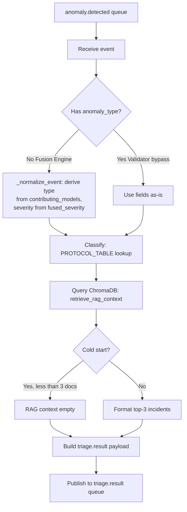
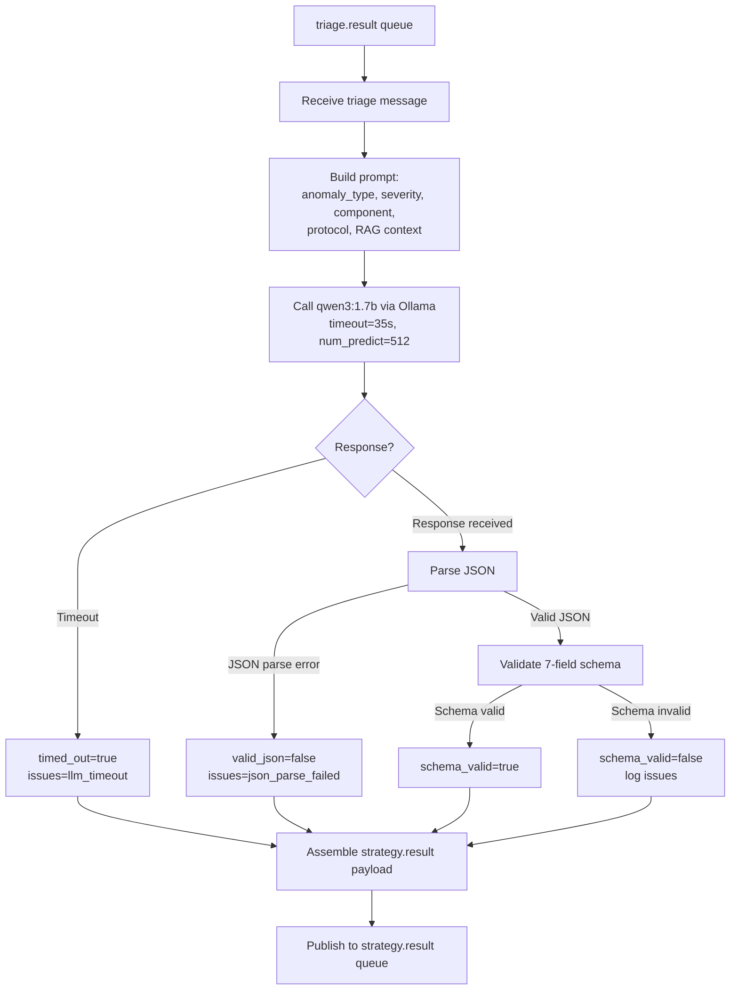
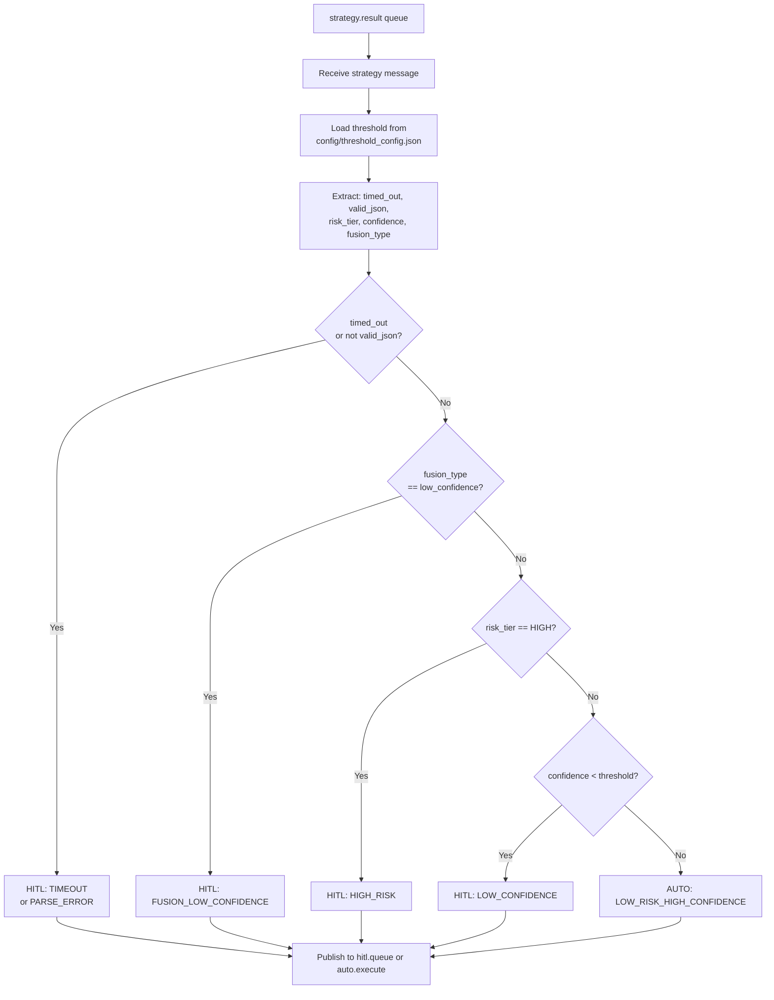

# Layer 2 — Component-by-Component Build Log

**Project:** Distributed Multi-Agent Coordination for Self-Healing Data Pipelines
**Layer:** Layer 2 — AI Control Plane (Node 2, `ai-brain-node`)
**Purpose:** Single running record of every Layer 2 component as it's implemented.
**Pattern:** Follows Layer 1 Component Build Log format.

---

## 1. Triage Agent

**Files:** `agents/triage_agent.py`, `chromadb_utils/query.py`, `chromadb_utils/client.py` (modified), `rabbitmq/connection.py` (built from stub)
**Status:** ✅ **v1.0 — rule-based classification + ChromaDB RAG, tested against 703-event corpus.**

### 1.0 Environment Prerequisites (verified)

- `ai-brain-node` SSH accessible, venv auto-activates
- Ollama running: `qwen3:1.7b` (1.4 GB) and `qwen3:0.6b` (522 MB)
- ChromaDB: collection `incident_history` exists, count = 0 (cold start)
- RabbitMQ: connected to `stream-node:5672`, `anomaly.detected` had 703 messages
- All Python packages present (pika, chromadb, sentence-transformers, prometheus_client, etc.)
- **Fix applied:** `chromadb_utils/client.py` — added `os.environ["HF_HUB_OFFLINE"] = "1"` to prevent HuggingFace connection hang on startup

### 1.1 Files built/modified

| File | Action | Purpose |
|---|---|---|
| `rabbitmq/connection.py` | Replaced stub with real code | `get_connection()` + `publish()` helpers |
| `chromadb_utils/client.py` | Added offline mode | Prevents HF hub hang; model loaded from local cache |
| `chromadb_utils/query.py` | Built from stub | 3-step RAG retrieval protocol (`retrieve_rag_context` + `format_rag_context`) |
| `agents/triage_agent.py` | Built from stub | Classification table + RAG + `triage.result` publisher |

### 1.2 Classification logic



- **Rule-based lookup table:** `(anomaly_type, severity)` → `response_protocol` (18 entries covering all 5 anomaly types + compound)
- **Fallback chain:** exact match → match on `(anomaly_type, "HIGH")` → `GENERIC_INVESTIGATE`
- **Fused event normalization:** Fusion Engine publishes only `fused_severity`/`contributing_models` (no `anomaly_type`). `_normalize_event()` derives `anomaly_type` from contributing model names via `MODEL_TO_TYPE` mapping, and uses `fused_severity` as `severity`. Single-model → specific type; multi-model → `"compound"`.

### 1.3 RAG retrieval

- Query ChromaDB `incident_history` with event text
- Top-5 similarity search → filter to positive outcomes → risk tier balance check → return ≤3 examples
- Cold start (0 docs): returns `[]` immediately, no error

### 1.4 Test results (full 703-event corpus)

- **All 703 messages processed** in under 2 seconds total (steady-state latency ≤ 1ms)
- **Validator bypass events (100):** `schema_drift` → `HALT_INGESTION_REVIEW_SCHEMA` or `FLAG_FOR_SCHEMA_REVIEW`
- **Fused events (603):** Correctly classified by derived type, e.g. `auth_failure_flood` + `CRITICAL` → `ISOLATE_NODE`
- **RAG context:** Empty for all (cold start — expected)
- **triage.result queue:** 703 messages, format confirmed valid

### 1.5 Open items

- [ ] Fused/compound event count is low (single-model dominates). Corpus update planned after all layers complete.
- [ ] RAG context will remain empty until Learning Agent populates ChromaDB (Layer 3 dependency).

### 1.6 Diagram

- **Source:** `docs/diagrams/triage_agent_flow.mmd`
- **PNG export:** `docs/diagrams/triage_agent_flow.png`

The flowchart above is also available as a standalone Mermaid file for easy editing and inclusion in the dissertation. Export to PNG for LaTeX embedding.

---

## 2. Strategy Agent

**Files:** `ollama/client.py` (new), `agents/schema_validator.py` (new), `agents/strategy_agent.py`
**Status:** ✅ **v1.0 — qwen3:1.7b via Ollama, 7-field schema validation, timeout handling, tested on 703 events.**

### 2.1 Files built

| File | Action | Purpose |
|---|---|---|
| `ollama/client.py` | Replaced stub | HTTP wrapper for local Ollama API (`generate()` function) |
| `agents/schema_validator.py` | Replaced stub | Validates 7-field JSON output (Phase 0 failure analysis fixes applied) |
| `agents/strategy_agent.py` | Replaced stub | Consumes `triage.result`, calls qwen3:1.7b, publishes `strategy.result` |

### 2.2 Flow



### 2.3 Key design decisions

- **System prompt** loaded from `prompts/strategy_system_prompt.txt`. Contains the extra-field constraint and `num_predict=512` from Phase 0.
- **Timeout** hard-coded at 30s. On timeout the event is still published to `strategy.result` with `timed_out=True`.
- **Prometheus** metrics on port 8011 (latency histogram, valid/invalid counters, timeout counter, tokens-per-second gauge).

### 2.4 Test results (full 703-event corpus)

- **Timeouts:** 180 (25.6%)
- **Schema valid rate:** 70.3% (703 − 180 = 523 responses; actual valid rate likely higher if timeouts had succeeded)
- **Latency** for successful calls: 22–29s (consistent with Phase 0 average of 20.19s)
- **Tokens/sec:** 16.3–16.4 (matches Phase 0 baseline)

### 2.5 Known issues

- **High timeout rate (25.6%)** — caused by 30s limit being too tight for complex prompts. Mitigations: increase `num_predict` cap, or accept some prompts will still need >30s. See improvement plan below.
- **RAG context empty** — ChromaDB still cold, Learning Agent not yet built.

---

## 3. Policy Agent

**Files:** `agents/policy_agent.py`
**Status:** ✅ **v1.0 — 5-rule routing table, threshold-aware, 100% correct routing on 703 events.**

### 3.1 Flow



### 3.2 Key design decisions

- **Deterministic** — no LLM, no ChromaDB. Sub-ms latency.
- **Threshold loaded from disk on every message** — allows Learning Agent updates to take effect without restarting the Policy Agent.
- **Hard bounds** [0.60, 0.90] enforced in `load_threshold()`.
- **Prometheus** metrics on port 8012 (latency histogram, routing decision counters by decision + reason).

### 3.3 Test results (full 703-event corpus)

- **Total routed:** 703
- **auto.execute:** 114 (16.2%)
- **hitl.queue:** 589 (83.8%)
- **Routing reasons:**
  - HIGH_RISK: 383 (54.5%)
  - TIMEOUT: 180 (25.6%)
  - LOW_RISK_HIGH_CONFIDENCE: 114 (16.2%)
  - LOW_CONFIDENCE: 26 (3.7%)
- **Policy latency:** ≤2ms (all messages)
- **Risk tier distribution:** HIGH 382, MISSING (timeouts) 181, LOW 135, MEDIUM 5
- **Confidence range:** 0.39–0.98, avg 0.84

### 3.4 Interpretation

- The 25.6% timeout rate is the primary factor limiting AUTO throughput — all timeouts go to HITL.
- Of the successful LLM responses, LOW risk tier was assigned to 135 events, but only 114 had confidence ≥0.65 and thus passed the threshold. The remaining 21 LOW-tier events had low confidence and were routed to HITL as LOW_CONFIDENCE.
- The 5 MEDIUM risk tier events are invalid (the LLM should never output MEDIUM as risk_tier) — these also went to HITL.

## 4. Learning Agent

**Files:** `chromadb_utils/upsert.py`, `agents/learning_agent.py`  
**Status:** ✅ **v1.0 – qwen3:0.6b summarisation, ChromaDB upsert, EMA threshold update, tested with simulated outcome.feedback.**

### 4.1 Files built

| File | Action | Purpose |
|---|---|---|
| `chromadb_utils/upsert.py` | Replaced stub | Upserts incident summaries into ChromaDB with metadata |
| `agents/learning_agent.py` | Replaced stub | Consumes `outcome.feedback`, calls qwen3:0.6b, upserts ChromaDB, updates EMA threshold |

### 4.2 Flow

```mermaid
flowchart TD
    A[outcome.feedback queue] --> B[Receive outcome message]
    B --> C[Build summary prompt<br/>from incident + outcome]
    C --> D[Call qwen3:0.6b via Ollama<br/>timeout=10s, num_predict=256]
    D --> E{LLM response?}
    E -- Success --> F[Extract summary sentence]
    E -- Timeout/Error --> G[Use fallback summary]
    F --> H[Build ChromaDB metadata<br/>including negative_example flag]
    G --> H
    H --> I[upsert_incident to ChromaDB]
    I --> J[Update EMA threshold<br/>α=0.9, bounds [0.60, 0.90]]
    J --> K[Acknowledge message]
```

### 4.3 Key design decisions

- **Zero latency impact on main pipeline** – fires post‑dispatch, consuming `outcome.feedback` asynchronously.
- **qwen3:0.6b** chosen for RAM budget compliance (~400 MB).
- **Fallback summary** – if Ollama call fails, uses a static text `"Incident {id} — {outcome_type}"` to ensure ChromaDB always gets a record.
- **EMA formula:** `new = α × old + (1−α) × signal`, with `α=0.9`. Outcome signals: AUTO_EXECUTE_SUCCESS→0.80, HITL_APPROVED→0.75, etc. Negative outcomes lower the threshold.
- **Prometheus** metrics on port 8013 (outcomes processed, threshold updates, ChromaDB upserts).

### 4.4 Test results (simulated outcome.feedback)

- **Single AUTO_EXECUTE_SUCCESS outcome published manually.**
- ChromaDB document count: 0 → 1 ✅
- EMA threshold updated: 0.65 → 0.665 ✅ (verified against formula)
- Learning Agent logs confirmed upsert and EMA update.

### 4.5 Open items

- Full testing requires Layer 3 to produce real `outcome.feedback` messages.
- ChromaDB growth rate (OQ4) and EMA convergence (OQ6) will be measured during full end‑to‑end evaluation.
- Currently the Learning Agent’s summarisation quality (OQ5) has not been formally evaluated – planned for Phase 2 week 8.