# Layer 2 Component Log — AI Control Plane

## Purpose and evidence boundary

This component log is the detailed implementation reference for Layer 2 of
**Distributed Multi-Agent Coordination for Self-Healing Data Pipelines**. It
describes the active asynchronous control plane: deterministic triage,
LLM-backed Strategy, deterministic Policy, deterministic Learning, persistent
ChromaDB memory, RabbitMQ communication, and opt-in evaluation instrumentation.

The active source, configuration, prompts, and tests under `layer2/` are the
implementation authority. The completed experiment observations are from
`wifi_cold_20260913_041045`. Results marked as final experiment values are
evidence from the supplied authoritative analyzer outcome; they are not
recomputed from runtime Prometheus counters in this document.

Only Strategy is an LLM-backed agent. Triage, Policy, and Learning are not LLM
agents. Phase 0/model-selection work is historical/preliminary context and is
not presented as the final 639-incident experiment.

## 1. Architecture, deployment, and message contract

### 1.1 Physical deployment

| Item | Active/reference detail |
|---|---|
| Layer 2 node | `ai-brain-node` (Node 2) |
| Operating system | Ubuntu 24.04 Server |
| Hardware | AMD Ryzen 5, 8 GB RAM |
| Inference mode | CPU-only local Ollama inference |
| Persistent memory | ChromaDB on Node 2 |
| Broker default | `stream-node`, configurable through RabbitMQ environment variables |

Node 2 defaults do not make a fixed IP part of the application contract. The
RabbitMQ helper reads `RABBITMQ_HOST`, `RABBITMQ_PORT`, `RABBITMQ_USER`, and
`RABBITMQ_PASS`; its active virtual host is `fyp` and its publishing exchange
is `fyp.events`. Ollama uses `OLLAMA_HOST` with default
`http://localhost:11434`. ChromaDB has the module-relative persistence path
`layer2/chromadb_data` and no active environment override.

### 1.2 Overall Layer 2 architecture

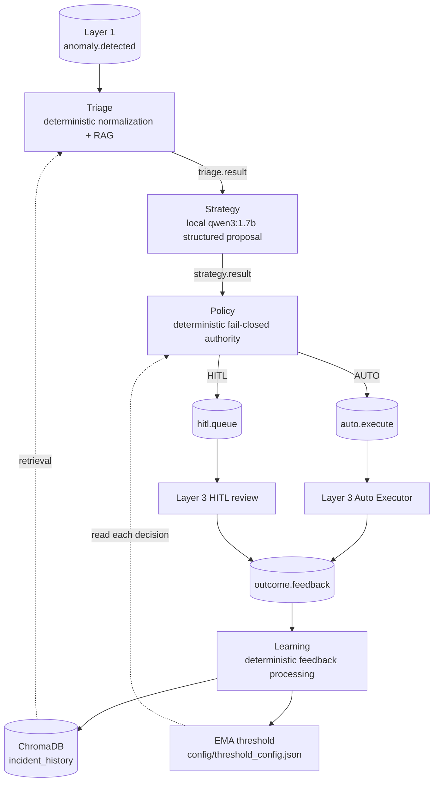

The four processes communicate through RabbitMQ messages rather than direct
agent-to-agent function calls. Each agent consumes with QoS prefetch 1. An
unhandled message-processing exception is negatively acknowledged without
requeue, so a malformed poison message cannot produce an infinite redelivery
loop.

### 1.3 RabbitMQ Layer 2 flow

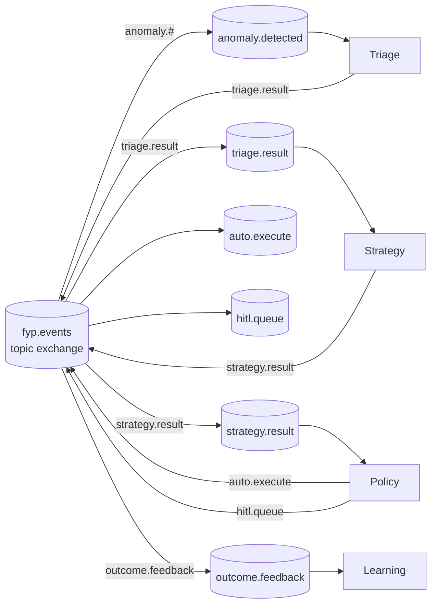

| Routing key / queue | Producer | Consumer | Contract |
|---|---|---|---|
| `anomaly.detected` | Layer 1 | Triage | Receives structural incidents and fused incidents. |
| `triage.result` | Triage | Strategy | Normalized type/severity, protocol, original event, and RAG context. |
| `strategy.result` | Strategy | Policy | Parsed proposal plus JSON/schema/timeout validation state. |
| `auto.execute` | Policy | Layer 3 Auto Executor | Policy-authorized AUTO outcome. |
| `hitl.queue` | Policy | Layer 3 HITL consumer | Mandatory review/escalation outcome. |
| `outcome.feedback` | Layer 3 | Learning | Complete AUTO or HITL outcome feedback. |

### 1.4 Inter-stage payloads

| Stage | Important fields and semantics |
|---|---|
| Layer 1 → Triage | `event_id` and timestamp/context. Structural events carry `anomaly_type`/`severity`; fused events can carry `contributing_models` and `fused_severity` instead. |
| Triage → Strategy | `event_id`, `triage_timestamp`, normalized `anomaly_type`/`severity`, `response_protocol`, RAG context, latency, and `original_event`. |
| Strategy → Policy | `llm_response`, `valid_json`, `schema_valid`, `issues`, `timed_out`, attempts/retry metadata, strategy timing, and the full Triage result. |
| Policy → Layer 3 | `routing_decision`, `routing_reason`, `threshold_used`, `policy_timestamp`, and the complete reasoning chain. |
| Layer 3 → Learning | `event_id`, `outcome_type`, actual actions and `full_policy_result`. |

## 2. Triage Agent

| Item | Detail |
|---|---|
| File / class | `agents/triage_agent.py`, `TriageAgent` |
| Input | `anomaly.detected` |
| Output | `fyp.events:triage.result` |
| Classification | Deterministic `PROTOCOL_TABLE` lookup with a safe generic fallback. |
| Retrieval | ChromaDB context from `retrieve_rag_context`; no LLM invocation. |
| Metrics port | 8010 |

Triage leaves a structural event’s `anomaly_type` and `severity` unchanged.
For a fused event missing those fields, `_normalize_event` derives a type from
the contributing detector model and obtains severity from `fused_severity`.
Two or more contributing models become `compound`; an unknown/empty model list
becomes `unknown`. The original event is retained in the outgoing payload.

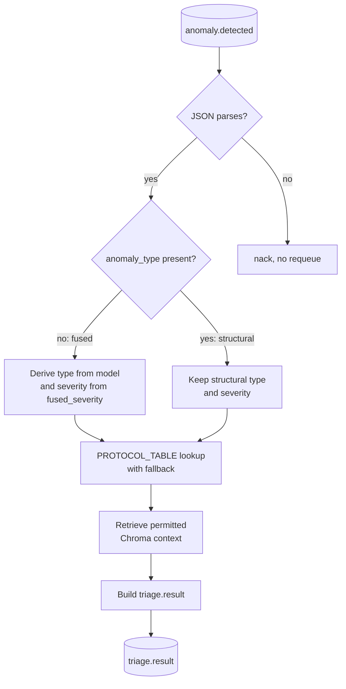

### 2.1 Detector identity normalization

| Active model identity | Triage anomaly type |
|---|---|
| `z_score_cpu_memory` | `cpu_memory_spike` |
| `z_score_error_rate` | `error_rate_surge` |
| `moving_average_throughput` | `throughput_drop` |
| `statistical_auth_rate` | `auth_failure_flood` |
| `distribution_shift_marker` | `schema_drift` |

The source retains `rate_gate_auth_rf` and `psi_detector` only as historical
replay/backfill aliases. Their compatibility mapping does not activate RF or
PSI runtime detection.

### 2.2 Active protocol mapping

| Anomaly type | Severity | Response protocol |
|---|---|---|
| cpu_memory_spike | CRITICAL / HIGH / MEDIUM / LOW | EMERGENCY_RESTART_CONSUMER / SCALE_CONSUMER_RESOURCES / MONITOR_AND_ALERT / LOG_AND_CONTINUE |
| error_rate_surge | CRITICAL / HIGH / MEDIUM / LOW | CIRCUIT_BREAKER_OPEN / RATE_LIMIT_ENDPOINT / INVESTIGATE_UPSTREAM / LOG_AND_CONTINUE |
| throughput_drop | CRITICAL / HIGH / MEDIUM | RESTART_ALL_CONSUMERS / RESTART_FAILED_CONSUMER / CHECK_QUEUE_DEPTH |
| auth_failure_flood | CRITICAL / HIGH / MEDIUM | ISOLATE_NODE / RATE_LIMIT_AUTH / ALERT_SECURITY_TEAM |
| schema_drift | HIGH / MEDIUM | HALT_INGESTION_REVIEW_SCHEMA / FLAG_FOR_SCHEMA_REVIEW |
| compound | CRITICAL / HIGH | EMERGENCY_FULL_PIPELINE_REVIEW / COORDINATED_REMEDIATION |

For an absent exact mapping, `classify` tries the same anomaly type at HIGH
severity, then uses `GENERIC_INVESTIGATE`. Every protocol in the active table
belongs to the shared Strategy/Policy action allowlist.

### 2.3 Triage RAG retrieval

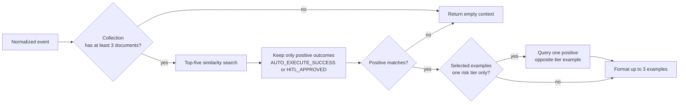

The Chroma query starts with at most five cosine-similar documents, filters
them to `AUTO_EXECUTE_SUCCESS` and `HITL_APPROVED`, and returns at most three.
If the initial selected positives have one risk tier, it attempts to append one
positive opposite-tier contrast. A Chroma failure is logged, but Triage
continues with empty RAG context. Negative feedback is stored in ChromaDB but
does not satisfy this outcome filter.

### 2.4 Triage observability and failure behavior

| Metric | Meaning |
|---|---|
| `fyp_triage_latency_s` | Processing latency histogram. |
| `fyp_triage_processed_total{anomaly_type}` | Successfully triaged inputs by normalized type. |
| `fyp_triage_timeout_total` | Records processing that exceeds the 5-second Triage SLA; it does not prevent publication. |

Triage records opt-in evaluation telemetry and append-only local JSONL logs.
Both telemetry/logging paths are non-authoritative to functional routing:
evaluation writes are best effort, and logger failure does not crash the agent.

## 3. Strategy Agent and output contract

| Item | Detail |
|---|---|
| Files | `agents/strategy_agent.py`, `agents/schema_validator.py`, `prompts/strategy_system_prompt.txt`, `ollama/client.py` |
| Input / output | `triage.result` → `fyp.events:strategy.result` |
| Model | `qwen3:1.7b` through local Ollama `/api/generate` |
| Default model-call timeout | 35 seconds |
| Structured generation | Response JSON Schema passed as Ollama’s `format` payload. |
| Metrics port | 8011 |

Strategy assembles the incident and retrieved context inside explicitly marked
untrusted delimiters. Its prompt asks the model to treat those sections as
data, not instructions. It calls Ollama synchronously with `num_ctx=2048` and
`num_predict=512`, then extracts a direct JSON object or a braced object after
removing optional Markdown fences.

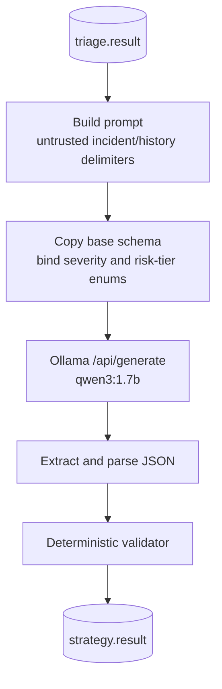

### 3.1 Exact seven-field response contract

```text
anomaly_type
severity
affected_component
recommended_actions
confidence
risk_tier
reasoning
```

`REQUIRED_FIELDS` is exact and `additionalProperties` is false. Application
validation requires:

| Field or rule | Active requirement |
|---|---|
| `severity` | One of LOW, MEDIUM, HIGH, CRITICAL. |
| `risk_tier` | LOW or HIGH, and must match `RISK_TIER_MAP`. |
| `confidence` | A non-boolean numeric value in `[0, 1]`. |
| `recommended_actions` | A list of exactly three values, all allowed and all distinct. |
| `anomaly_type`, `affected_component`, `reasoning` | Strings. |
| Object shape | No missing and no extra field. |

The shared risk-tier map is:

| Severity | Required risk tier |
|---|---|
| LOW | LOW |
| MEDIUM | LOW |
| HIGH | HIGH |
| CRITICAL | HIGH |

The validator reports failures such as `tier_mismatch:expected=LOW,got=HIGH`,
`duplicate_actions`, `bad_actions_count`, `bad_actions_value`, and
`bad_confidence`. It validates only; it does not repair output, deduplicate
actions, add a fallback action, or silently change risk semantics.

### 3.2 Bounded symbolic action vocabulary

```text
EMERGENCY_RESTART_CONSUMER     SCALE_CONSUMER_RESOURCES
MONITOR_AND_ALERT              LOG_AND_CONTINUE
CIRCUIT_BREAKER_OPEN           RATE_LIMIT_ENDPOINT
INVESTIGATE_UPSTREAM           RESTART_ALL_CONSUMERS
RESTART_FAILED_CONSUMER        CHECK_QUEUE_DEPTH
ISOLATE_NODE                   RATE_LIMIT_AUTH
ALERT_SECURITY_TEAM            HALT_INGESTION_REVIEW_SCHEMA
FLAG_FOR_SCHEMA_REVIEW         EMERGENCY_FULL_PIPELINE_REVIEW
COORDINATED_REMEDIATION        GENERIC_INVESTIGATE
```

The JSON Schema enumerates this exact allowlist and applies `uniqueItems: true`
with `minItems = maxItems = 3`. The system prompt repeats the requirement for
exactly three distinct action identifiers. The Python validator independently
checks it again, and Policy uses the same allowlist for final eligibility.
This limits an LLM proposal to known symbolic operations rather than arbitrary
commands or prose.

### 3.3 Dynamic severity/risk schema binding

`schema_for_triage_severity` deep-copies the base schema for every request.
When Triage supplies a recognised severity, it binds both existing enum fields:

| Triage severity | Per-request `severity` enum | Per-request `risk_tier` enum |
|---|---|---|
| LOW | [LOW] | [LOW] |
| MEDIUM | [MEDIUM] | [LOW] |
| HIGH | [HIGH] | [HIGH] |
| CRITICAL | [CRITICAL] | [HIGH] |

This is per-request enum binding, not a conditional JSON Schema construct. It
preserves the seven fields and combines with prompt instruction and the
authoritative application validator. The incoming Triage severity is copied;
Strategy is not allowed to reinterpret it.

### 3.4 Validation and one bounded retry

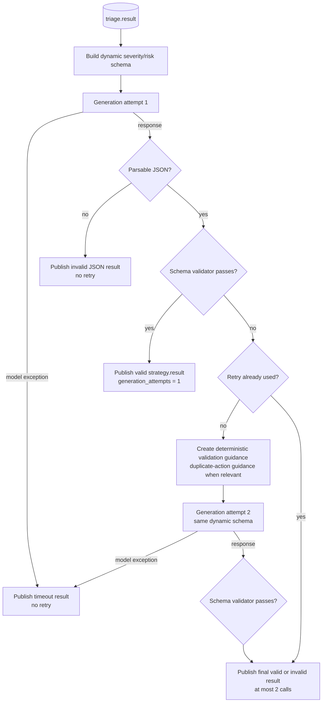

There can be at most two calls per incident. The retry is used only when the
first output is parsable JSON but fails deterministic schema validation. The
second prompt requests a complete seven-field object, keeps the same dynamic
schema, and gives a specific duplicate-action explanation when relevant.

An unparseable first response breaks out without a retry and is published with
`valid_json=false`. A model-call exception is represented as
`timed_out=true`. Neither path permits a fallback action, Python-side action
deduplication, a weaker second schema, or a Policy relaxation. Strategy publishes
its final validation state; it does not decide AUTO/HITL.

| Metric / record field | Meaning |
|---|---|
| `fyp_strategy_latency_s` | Strategy processing-time histogram. |
| `fyp_strategy_schema_valid_total` / `fyp_strategy_schema_invalid_total` | Final incident-level validity counters. |
| `fyp_strategy_timeout_total` | Model-call exceptions classified as timeout. |
| `fyp_strategy_retry_total{reason}` | One bounded regeneration after a parsable validation failure; reason is `duplicate_actions` or `schema_invalid`. |
| `fyp_strategy_tokens_per_s` | Latest reported generation throughput gauge. |
| `generation_attempts` / `retry_reason` | Per-event evaluation/output fields. |

## 4. Policy Agent: deterministic authority boundary

| Item | Detail |
|---|---|
| File / class | `agents/policy_agent.py`, `PolicyAgent` |
| Input / output | `strategy.result` → `auto.execute` or `hitl.queue` |
| Threshold source | `config/threshold_config.json`, loaded for every message and clamped. |
| AUTO principle | Valid, supported, LOW-risk proposal at/above the active threshold. |
| Metrics port | 8012 |

Policy is the authority boundary between an LLM proposal and execution. It
does not call an LLM, generate an action, repair a proposal, or authorize a
proposal merely because it is syntactically valid.

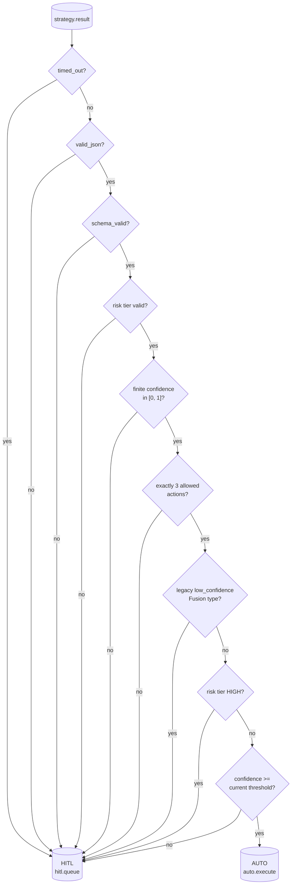

### 4.1 Exact fail-closed route order

| Order | Check | HITL reason when failed |
|---:|---|---|
| 1 | `timed_out` | `TIMEOUT` |
| 2 | `valid_json` | `PARSE_ERROR` |
| 3 | `schema_valid is true` | `SCHEMA_INVALID` |
| 4 | `risk_tier` is LOW or HIGH | `INVALID_RISK_TIER` |
| 5 | Confidence is numeric/non-boolean, finite, and in `[0, 1]` | `INVALID_CONFIDENCE` |
| 6 | Actions are a three-item list and every item is in `ALLOWED_ACTIONS` | `UNSUPPORTED_ACTION` |
| 7 | Historical `fusion_type == low_confidence` | `FUSION_LOW_CONFIDENCE` |
| 8 | Risk tier is HIGH | `HIGH_RISK` |
| 9 | Confidence is below the current threshold | `LOW_CONFIDENCE` |
| 10 | All checks pass | AUTO, `LOW_RISK_HIGH_CONFIDENCE` |

Policy does not directly calculate action uniqueness. The independent
`schema_valid` gate ensures an upstream duplicate-action validation failure
cannot be AUTO-authorized. This ordering makes malformed/uncertain proposals
safe by default.

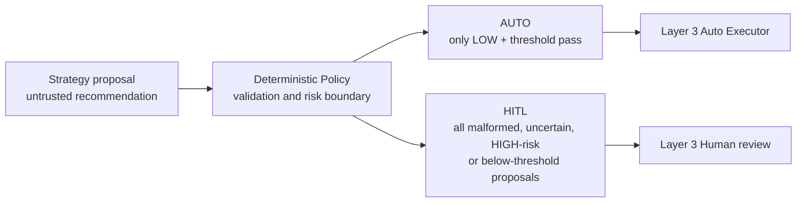

### 4.2 Policy metrics and latency semantics

| Metric | Meaning |
|---|---|
| `fyp_policy_latency_s` | Policy processing-time histogram. |
| `fyp_routing_decision_total{decision,reason}` | Final AUTO/HITL routes by exact reason. |
| `fyp_control_plane_processing_latency_seconds` | Triage + Strategy + Policy processing time, excluding queue wait. |
| `fyp_end_to_end_decision_latency_seconds` | Triage timestamp to Policy decision, including inter-agent backlog/queue wait. |
| `fyp_timestamp_missing_total{agent}` | Missing/unparseable timing context. |

Policy writes its opt-in evaluation record before it publishes to Layer 3. It
loads the threshold on every message; a read failure safely falls back to 0.65.

## 5. Learning Agent and adaptive threshold

| Item | Detail |
|---|---|
| File / class | `agents/learning_agent.py`, `LearningAgent` |
| Input | `outcome.feedback` |
| Outputs | ChromaDB upsert, EMA threshold file update, evaluation/logging records. |
| Summary mode | Deterministic; no Ollama dependency. |
| Metrics port | 8013 |

Learning receives completed Layer 3 feedback. It builds a stable semicolon
summary from outcome/policy/strategy/triage data, upserts it using `event_id`
as the Chroma document ID, updates the EMA when the outcome is recognised, and
acknowledges the message only after successful processing.

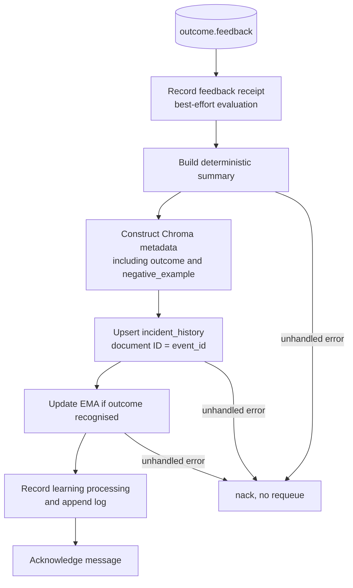

### 5.1 ChromaDB persistence and feedback metadata

| Item | Active behavior |
|---|---|
| Client | `chromadb.PersistentClient` at module-relative `chromadb_data`. |
| Collection | `incident_history`, created on first access. |
| Embeddings | `all-MiniLM-L6-v2` with cosine distance. |
| Upsert ID | `event_id`, so repeated writes are idempotent at document-ID level. |
| Negative outcomes | `AUTO_EXECUTE_FAILURE` and `HITL_REJECTED` set `negative_example=true`. |
| Retrieval effect | Stored negatives remain in memory but Triage’s positive-outcome filter excludes them from prompt context. |

This is historical/feedback memory, not model fine-tuning. The agent never
calls `ollama.client.generate`.

### 5.2 EMA update and atomic persistence

Recognized outcome signals are:

| Outcome type | Signal |
|---|---:|
| `AUTO_EXECUTE_SUCCESS` | 0.80 |
| `AUTO_EXECUTE_FAILURE` | 0.50 |
| `HITL_APPROVED` | 0.75 |
| `HITL_REJECTED` | 0.40 |
| `HITL_MODIFIED` | 0.60 |

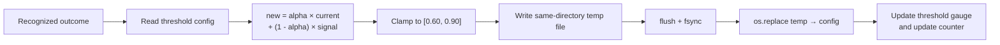

The reset configuration has confidence threshold 0.65, alpha 0.9, and update
count 0. The active formula is:

```text
new_threshold = 0.9 × current_threshold + 0.1 × outcome_signal
new_threshold = clamp(new_threshold, 0.60, 0.90)
```

The save procedure writes a same-directory temporary file, flushes, `fsync`s,
then calls `os.replace`. It persists `last_updated` and increments
`update_count`. Policy reads/clamps that file on each later policy decision.

### 5.3 Learning metrics and feedback timing

| Metric | Meaning |
|---|---|
| `fyp_learning_outcomes_total{outcome_type}` | Received outcome types. |
| `fyp_learning_threshold_updates_total` | EMA updates performed. |
| `fyp_learning_chromadb_upserts_total` | ChromaDB upserts performed. |
| `fyp_learning_confidence_threshold` | Current threshold gauge. |
| `fyp_feedback_completion_latency_seconds` | Policy decision timestamp to `outcome.feedback` receipt. |
| `fyp_learning_processing_latency_seconds` | Learning’s own feedback-processing time. |
| `fyp_timestamp_missing_total{agent}` | Missing/unparseable Policy timestamp. |

Feedback receipt telemetry is recorded before best-effort learning work.
Learning-processing telemetry is recorded after successful upsert/EMA work.
This distinction allows the analyzer to identify feedback that arrived but was
not fully processed.

## 6. Feedback loop and cross-layer safety flow

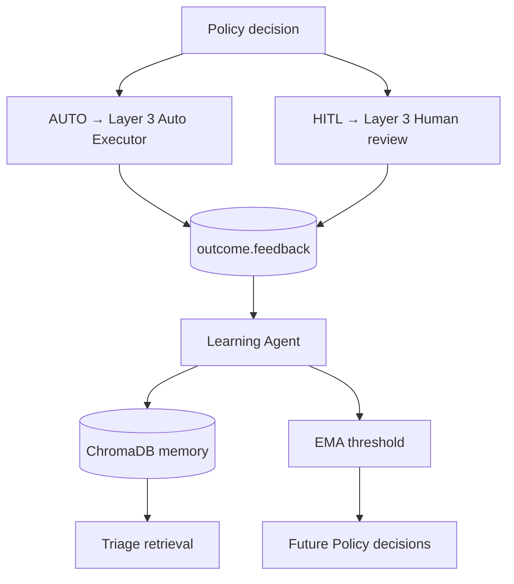

The loop stores feedback from both AUTO and HITL processes. It does not make
feedback completion synonymous with verified infrastructure recovery, and it
does not grant historical retrieval the authority to execute an action. Every
new proposal still crosses Strategy validation and Policy’s deterministic
boundary.

## 7. Evaluation telemetry and offline analyzer

| Item | Active implementation |
|---|---|
| Opt-in switch | `LAYER2_EVALUATION_RUN_ID` must match a safe run-ID pattern. |
| Optional root | `LAYER2_EVALUATION_DIR`; default `layer2/evaluation/results`. |
| Live stage artefacts | `triage.jsonl`, `strategy.jsonl`, `policy.jsonl`, `feedback.jsonl`, `learning.jsonl`. |
| Offline outputs | `per_event.csv` and `evaluation_summary.json`. |
| Safety property | Telemetry directory/file errors are swallowed and cannot interrupt a functional decision. |

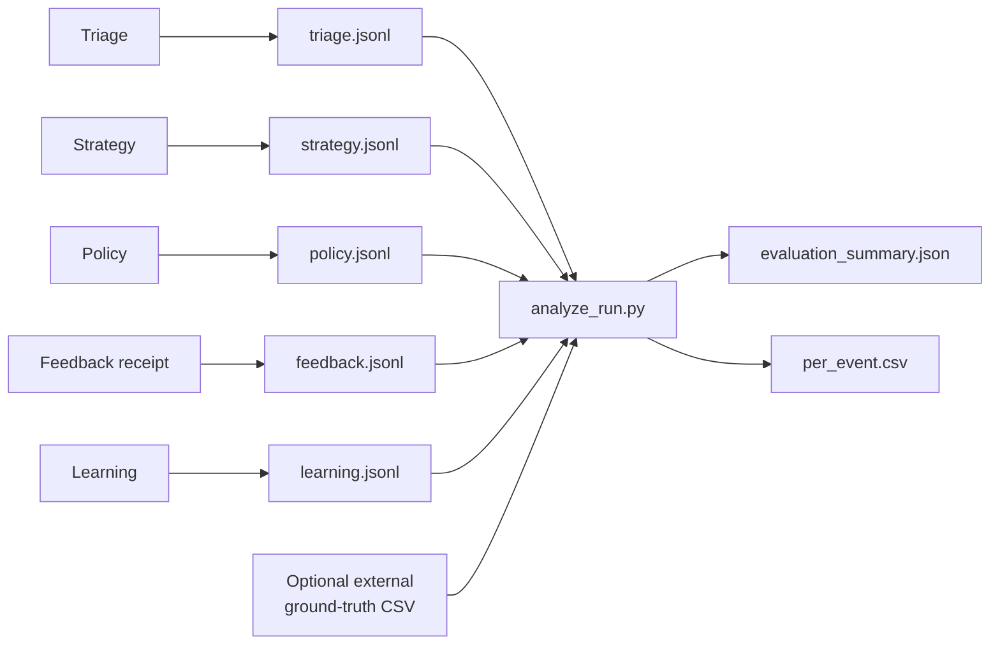

The recorder writes a timestamped JSONL object only when a valid run ID is
present. `analyze_run.py` uses the latest record per `event_id`, counts
duplicates/malformed input, optionally evaluates external labels, and keeps
FAR/FER unavailable when their necessary label fields are blank.

### 7.1 Latency definitions

| Analyzer metric | Definition |
|---|---|
| Triage / Strategy / Policy processing latency | The individual component’s own recorded processing duration. |
| Control-Plane Processing Latency (CPL) | Sum of complete Triage + Strategy + Policy component durations; queue wait excluded. |
| End-to-End Decision Latency | Triage timestamp to Policy timestamp; inter-agent queue/backlog wait included. |
| Feedback Completion Latency | Policy decision timestamp to feedback receipt, where feedback is expected. |
| Learning Processing Latency | Work completed inside Learning after feedback receipt. |

No metric in this section establishes actual service repair duration. The
older acknowledgement/recovery labels are intentionally absent from active
agent metrics and this documentation.

## 8. Observability inventory

| Component | Port | Exact metric names |
|---|---:|---|
| Triage | 8010 | `fyp_triage_latency_s`, `fyp_triage_processed_total`, `fyp_triage_timeout_total` |
| Strategy | 8011 | `fyp_strategy_latency_s`, `fyp_strategy_schema_valid_total`, `fyp_strategy_schema_invalid_total`, `fyp_strategy_timeout_total`, `fyp_strategy_retry_total`, `fyp_strategy_tokens_per_s` |
| Policy | 8012 | `fyp_policy_latency_s`, `fyp_routing_decision_total`, `fyp_control_plane_processing_latency_seconds`, `fyp_end_to_end_decision_latency_seconds`, `fyp_timestamp_missing_total` |
| Learning | 8013 | `fyp_learning_outcomes_total`, `fyp_learning_threshold_updates_total`, `fyp_learning_chromadb_upserts_total`, `fyp_learning_processing_latency_seconds`, `fyp_learning_confidence_threshold`, `fyp_feedback_completion_latency_seconds`, `fyp_timestamp_missing_total` |

The two latency metrics emitted by Policy distinguish component work from
queue-inclusive decision time. This is essential for interpreting the final
experiment, where Strategy processing is measured in seconds but accumulated
queue delay is measured in minutes.

## 9. Authoritative Wi-Fi experiment

### 9.1 Integrity and cross-layer accounting

The completed experiment is `wifi_cold_20260913_041045`. It reconciles
Layer 1’s output and all Layer 2 stages exactly:

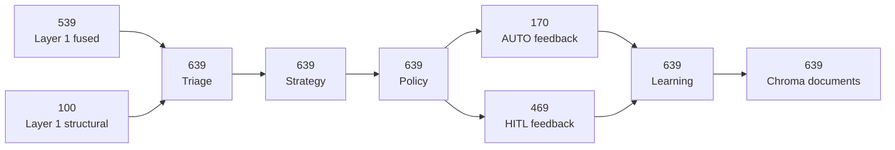

| Integrity measure | Final analyzer result |
|---|---:|
| Unique incidents | 639 |
| Missing Strategy / Policy | 0 / 0 |
| Missing feedback / pending HITL feedback | 0 / 0 |
| Unknown feedback IDs / missing Learning processing | 0 / 0 |
| Malformed run records | 0 |
| Duplicates: Triage / Strategy / Policy / Feedback / Learning | 0 / 0 / 0 / 0 / 0 |
| Ground-truth records / malformed ground-truth records | 1,950 / 0 |

### 9.2 Strategy, Policy, and feedback

| Strategy measure | Final result |
|---|---:|
| Total incidents | 639 |
| Timeouts | 0 |
| Valid JSON / invalid JSON | 639 / 0 |
| Schema-valid / schema-invalid | 493 / 146 |
| Schema Validity Rate | 493 / 639 = **77.15%** |
| Schema-invalid rate | 146 / 639 = **22.85%** |

The bounded retry mechanism was present in this frozen implementation. The 146
schema-invalid results therefore represent outputs that remained invalid under
the implemented constrained-generation procedure. They were not hidden,
silently repaired, or lost.

| Policy reason | Count | Percentage | Route |
|---|---:|---:|---|
| `HIGH_RISK` | 258 | 40.38% | HITL |
| `LOW_CONFIDENCE` | 65 | 10.17% | HITL |
| `LOW_RISK_HIGH_CONFIDENCE` | 170 | 26.60% | AUTO |
| `SCHEMA_INVALID` | 146 | 22.85% | HITL |
| **Total** | **639** | **100%** | — |

```text
258 + 65 + 170 + 146 = 639
170 AUTO + 469 HITL = 639
170 AUTO feedback + 469 HITL feedback = 639
```

All 146 schema-invalid Strategy proposals were routed to HITL, demonstrating
the intended fail-closed Policy behavior. Feedback completion was 639/639
overall, 170/170 for AUTO, and 469/469 for HITL.

### 9.3 Risk labels, FAR/FER, and final learning state

| Risk-tier analyzer result | Value |
|---|---:|
| Externally labelled cases | 630 |
| Correct Strategy risk tiers | 513 |
| Accuracy | 81.43% |

| Expected tier | Predicted tier | Count |
|---|---|---:|
| HIGH | HIGH | 336 |
| HIGH | LOW | 54 |
| LOW | HIGH | 63 |
| LOW | LOW | 177 |

The remaining nine incidents are not assigned fabricated labels. False
Automation Rate and False Escalation Rate are **not computable** for the final
run because authoritative `safe_to_auto` and `expected_route` values were not
provided. Risk-tier labels are not substitutes for either of those fields.

| Final observed Learning state | Value |
|---|---:|
| ChromaDB `incident_history` documents | 639 |
| EMA threshold | 0.7291 |
| EMA update count | 639 |
| EMA alpha | 0.9 |
| Final observed timestamp | 2026-09-13T06:36:14.445828+00:00 |

The tracked threshold configuration is still a resettable 0.65 / 0-update
baseline. The 0.7291 value is experiment evidence, not a configuration change
to reproduce automatically.

### 9.4 Authoritative aggregate latency

The offline analyzer is authoritative when a dashboard histogram is visually
clipped. In particular, the clipped roughly 30-minute dashboard view must not
replace the final E2E p95.

| Latency | Mean | Median | p95 | p99 | Max |
|---|---:|---:|---:|---:|---:|
| Triage processing | 0.005873 s | 0.001 s | 0.001 s | 0.001 s | 3.258 s |
| Strategy processing | 13.0546 s | 11.142 s | 19.409 s | 20.486 s | 22.084 s |
| Policy processing | 0.000156 s | ~0 s | 0.001 s | 0.001 s | 0.001 s |
| CPL | 13.0606 s | 11.17 s | 19.41 s | 20.487 s | 22.085 s |
| E2E decision | 4,105.09 s | 4,112.287 s | 7,901.77 s | 8,267.34 s | 8,354.47 s |
| Feedback completion | 37.611 s | 23.107 s | 126.545 s | 282.361 s | 367.597 s |
| Learning processing | 0.05897 s | 0.04609 s | 0.07773 s | 0.11969 s | 7.8868 s |

E2E decision median is approximately 68.5 minutes, p95 approximately 131.7
minutes, and maximum approximately 139.2 minutes. The causal interpretation
is queue accumulation behind CPU-only, prefetch-one Strategy inference:

```text
639 incidents × approximately 13.05 seconds Strategy processing
≈ 8,339 seconds ≈ 139 minutes
```

That estimate closely matches the E2E maximum. It identifies constrained
Strategy throughput as the experiment’s dominant scalability limitation; it is
not evidence of dropped incidents, because complete stage/feedback accounting
was observed.

## 10. Historical distinctions, warning, and limitations

| Subject | Current documentation position |
|---|---|
| Strategy model | Active local `qwen3:1.7b` only. |
| Learning LLM summary | Historical/stale design; not active. Learning is deterministic. |
| Phase 0/model selection | Preliminary/offline context; not final Wi-Fi system performance. |
| Old latency terminology | Not used; current metrics are component, CPL, E2E, feedback completion, and Learning processing latency. |
| Chroma telemetry warning | Experimental non-fatal library/telemetry warning; successful final state still had 639 documents and Learning updates. |

The final experiment supports a safety-oriented interpretation: the system
completed accounting for every incident, structured-output validation revealed
a substantial 22.85% remaining schema-invalid rate, and deterministic Policy
prevented those malformed proposals from reaching AUTO execution. It does not
prove universal scalability, production readiness, unrestricted autonomous
recovery, or actual service-recovery-time improvement.

Key limitations are:

- CPU-only local Strategy inference averaged about 13.05 seconds and produced
  substantial queue backlog at 639 incidents.
- Schema compliance remained imperfect despite strict schema/prompt constraints
  and a bounded retry.
- Threshold/model/prompt behavior is workload and hardware dependent.
- The evaluated incidents are synthetic and controlled.
- 73.40% of incidents required HITL under the final policy.
- Risk-tier accuracy was 81.43%, not 100%.
- FAR and FER need authoritative manual safety/routing labels before they can
  be evaluated.

For a readable overview, see [Layer 2 README](../README.md). The root
[Full_Rerun.md](../../Full_Rerun.md) remains the authoritative cross-layer
operation document.
