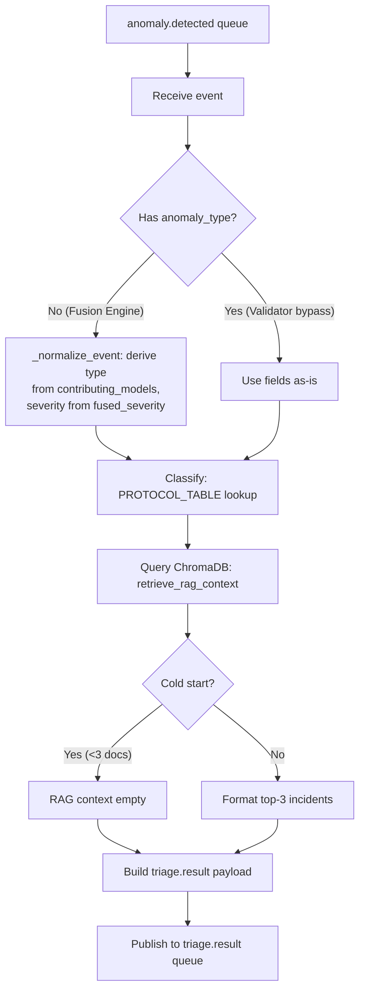

We'll add a clear Mermaid flowchart to the Triage Agent section of the build log. Here's the diagram and the updated file:

**Mermaid diagram (add after "### 1.2 Classification logic" section):**



Now, insert this diagram into the build log file. The updated section should look like:

```bash
cat > ~/fyp-pipeline/layer2_component_log.md << 'MDEOF'
# Layer 2 — Component-by-Component Build Log

**Project:** Distributed Multi-Agent Coordination for Self-Healing Data Pipelines
**Layer:** Layer 2 — AI Control Plane (Node 2, `ai-brain-node`)
**Purpose:** Single running record of every Layer 2 component as it's implemented.
**Pattern:** Follows Layer 1 Component Build Log format.

---

## 1. Triage Agent

**Files:** `agents/triage_agent.py`, `chromadb_utils/query.py`, `chromadb_utils/client.py` (modified), `rabbitmq/connection.py` (built from stub)
**Status:** ✅ **v1.0 — rule-based classification + ChromaDB RAG, tested against 703-event corpus.**

### 1.0 Environment Prerequisites (verified)
- `ai-brain-node` SSH accessible, venv auto-activates
- Ollama running: `qwen3:1.7b` (1.4 GB) and `qwen3:0.6b` (522 MB)
- ChromaDB: collection `incident_history` exists, count = 0 (cold start)
- RabbitMQ: connected to `stream-node:5672`, `anomaly.detected` had 703 messages
- All Python packages present (pika, chromadb, sentence-transformers, prometheus_client, etc.)
- **Fix applied:** `chromadb_utils/client.py` — added `os.environ["HF_HUB_OFFLINE"] = "1"` to prevent HuggingFace connection hang on startup

### 1.1 Files built/modified

| File | Action | Purpose |
|---|---|---|
| `rabbitmq/connection.py` | Replaced stub with real code | `get_connection()` + `publish()` helpers |
| `chromadb_utils/client.py` | Added offline mode | Prevents HF hub hang; model loaded from local cache |
| `chromadb_utils/query.py` | Built from stub | 3-step RAG retrieval protocol (`retrieve_rag_context` + `format_rag_context`) |
| `agents/triage_agent.py` | Built from stub | Classification table + RAG + `triage.result` publisher |

### 1.2 Classification logic


- **Rule-based lookup table:** `(anomaly_type, severity)` → `response_protocol` (18 entries covering all 5 anomaly types + compound)
- **Fallback chain:** exact match → match on `(anomaly_type, "HIGH")` → `GENERIC_INVESTIGATE`
- **Fused event normalization:** Fusion Engine publishes only `fused_severity`/`contributing_models` (no `anomaly_type`). `_normalize_event()` derives `anomaly_type` from contributing model names via `MODEL_TO_TYPE` mapping, and uses `fused_severity` as `severity`. Single-model → specific type; multi-model → `"compound"`.

### 1.3 RAG retrieval
- Query ChromaDB `incident_history` with event text
- Top-5 similarity search → filter to positive outcomes → risk tier balance check → return ≤3 examples
- Cold start (0 docs): returns `[]` immediately, no error

### 1.4 Test results (full 703-event corpus)
- **All 703 messages processed** in under 2 seconds total (steady-state latency ≤ 1ms)
- **Validator bypass events (100):** `schema_drift` → `HALT_INGESTION_REVIEW_SCHEMA` or `FLAG_FOR_SCHEMA_REVIEW`
- **Fused events (603):** Correctly classified by derived type, e.g. `auth_failure_flood` + `CRITICAL` → `ISOLATE_NODE`
- **RAG context:** Empty for all (cold start — expected)
- **triage.result queue:** 703 messages, format confirmed valid

### 1.5 Open items
- [ ] Fused/compound event count is low (single-model dominates). Corpus update planned after all layers complete.
- [ ] RAG context will remain empty until Learning Agent populates ChromaDB (Layer 3 dependency).
MDEOF

### 1.6 Diagram

- **Source:** `docs/diagrams/triage_agent_flow.mmd`
- **PNG export:** `docs/diagrams/triage_agent_flow.png`

The flowchart above is also available as a standalone Mermaid file for easy editing
and inclusion in the dissertation. Export to PNG for LaTeX embedding.