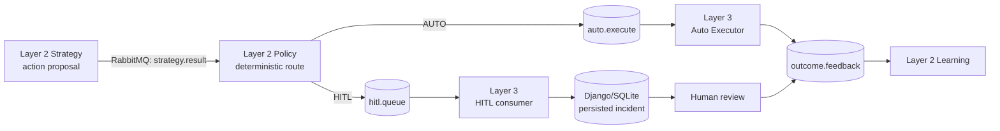

# Layer 3 — Execution, Human Oversight & Observability Layer

**Project:** Distributed Multi-Agent Coordination for Self-Healing Data Pipelines: A Human-in-the-Loop Approach on Commodity Hardware

Layer 3 bridges the deterministic decisions made in Layer 2 to controlled automatic handling, persistent human oversight, feedback generation, and cross-system observability. It runs primarily on **Node 3, `gateway-node`** (Ubuntu 24.04 Desktop, Intel Core i5, 8 GB RAM).

This is an implementation overview and experiment record, not an operations runbook. The complete end-to-end reproduction procedure is maintained in the root [Full_Rerun.md](../Full_Rerun.md). Detailed component contracts, failure semantics, and diagrams are in the [Layer 3 component log](docs/layer3_component_log.md).

## Role in the framework

Layer 2 Policy is the execution-authorisation boundary. Strategy proposes actions; Policy deterministically selects either an automatic route or human review; Layer 3 carries out that already-authorised route. Neither the Auto Executor nor the HITL dashboard decides whether an incident is eligible for automatic handling.



## Execution split

### AUTO path

The Auto Executor in `auto_executor/executor.py` consumes authorised messages from `auto.execute`. It extracts the Policy/Strategy action payload, performs the implementation's controlled simulated execution, records an `AUTO_EXECUTE` decision in `sqlite_logger/decisions.db`, and publishes an outcome to `outcome.feedback`. It exposes Prometheus metrics on port `8014`.

The result is an execution-path outcome, not evidence that a real service was restored. In particular, the final run's successful AUTO outcomes must not be read as independently verified end-service restoration.

### HITL path

The Django management command `consume_hitl` consumes `hitl.queue` and persists each incident as a `HitlIncident`. The dashboard presents only `PENDING` incidents for review together with the supplied reasoning payload. An operator can approve, reject, or modify the proposed action strings:

| Human workflow state | Decision-log value | Feedback outcome | Source behaviour |
|---|---|---|---|
| `APPROVED` | `APPROVE` | `HITL_APPROVED` | Records the decision and publishes feedback; it does not invoke the Auto Executor. |
| `REJECTED` | `REJECT` | `HITL_REJECTED` | Records an empty action set and still publishes feedback. |
| `MODIFIED` | `MODIFY` | `HITL_MODIFIED` | Records up to three non-empty edited action strings and emits feedback on a best-effort basis. |

Each terminal human status is protected by a conditional update from `PENDING`; a stale repeat action does not create another authoritative decision or increment a decision metric. The `decided_at` timestamp is stored when that terminal status is persisted.

## Persistent state is not queue depth

Two similarly named dashboard concepts intentionally measure different states:

| Dashboard concept | Authoritative source | Meaning |
|---|---|---|
| **HITL Queue Backlog** | `rabbitmq_queue_messages_ready{queue="hitl.queue"}` | Messages that RabbitMQ has not yet delivered to the HITL consumer. |
| **HITL Pending** | `sum(fyp_hitl_pending_incidents)` | Already-persisted Django incidents whose status is still `PENDING`. |

A zero RabbitMQ backlog therefore does **not** prove that no human work remains: the consumer may already have persisted incidents awaiting review. The pending gauge is database-backed and evaluated at Prometheus scrape time, so it remains authoritative across application restarts.

Human-decision latency is the elapsed time from a persisted incident's `arrived_at` timestamp to its recorded `decided_at` timestamp. It describes the review/decision portion of the workflow, not service restoration.

## Feedback generation and Learning

Both execution branches feed Layer 2 Learning through `outcome.feedback`. AUTO feedback includes the implementation's execution outcome, action list, notes, and measured execution duration. HITL feedback represents the human decision: rejected items intentionally send an empty action list, while modified items include the submitted replacement action strings. This ensures a rejected escalation remains visible to Learning rather than disappearing from the experiment record.

## Observability

Layer 3 hosts the central Prometheus/Grafana observability role for the three-node deployment. Grafana reads Prometheus; it does not participate in Policy, execution, or human-decision logic.

The versioned dashboard is `grafana/FYP_Hybrid_Agentic_Framework_Observability_v3_Node_Naming.json`, titled **Hybrid Agentic Framework — Final Research Observability**. It groups views into:

1. SYSTEM OVERVIEW
2. LAYER 1 — REAL-TIME STATISTICAL DATA PLANE
3. LAYER 2 — AI CONTROL PLANE
4. LAYER 3 — EXECUTION, HUMAN OVERSIGHT & OBSERVABILITY LAYER
5. SYSTEM / INFRASTRUCTURE HEALTH
6. HARDWARE / NODE RESOURCES

The Layer 3 panels include AUTO Attempts, AUTO Outcomes, AUTO Latency, Feedback Emitted, HITL Queue Backlog, HITL Decisions, Human Decision Latency, and Feedback Loop. Relevant exported metrics are:

| Area | Metrics |
|---|---|
| AUTO Executor | `fyp_auto_executor_attempts_total`, `fyp_auto_executor_outcomes_total`, `fyp_auto_executor_execution_latency_seconds`, `fyp_outcome_feedback_emitted_total` |
| HITL workflow | `fyp_hitl_pending_incidents`, `fyp_hitl_approved_total`, `fyp_hitl_rejected_total`, `fyp_hitl_modified_total`, `fyp_human_decision_latency_seconds` |
| Infrastructure | Prometheus target health, node exporters, RabbitMQ queue/dead-letter metrics, and node resource metrics |

The final Wi-Fi deployment included node exporters on port `9100`; Layer 1 instrumentation on approximately `8002–8008`; Layer 2 agents on `8010–8013`; the Django/HITL endpoint on `8000`; Auto Executor metrics on `8014`; Prometheus on `9090`; and RabbitMQ metrics on `15692`. No Prometheus configuration file is versioned under `layer3/`; these ports describe the audited experiment deployment, not a permanent target count.

## Final Wi-Fi experiment

The authoritative cold run was **`wifi_cold_20260913_041045`**.

| Layer 3 result | Final value |
|---|---:|
| AUTO attempts / outcomes | 170 / 170 |
| AUTO feedback emitted | 170 |
| AUTO execution latency, dashboard p50 / p95 | approximately 625 ms / 738 ms |
| HITL routed | 469 |
| HITL approved / rejected / modified | 325 / 143 / 1 |
| Persisted HITL pending at completion | 0 |
| Human-decision latency, dashboard p50 / p95 | approximately 20 s / 55.5 s |
| Total Layer 3 feedback | 639 |
| Prometheus targets | 19 UP / 0 DOWN (experiment-specific) |
| Dead-letter queue at completion | 0 |

The dashboard percentile values are histogram-derived approximations. They are not interchangeable with Layer 2's offline feedback-completion latency: mean 37.611 s, median 23.107 s, p95 126.545 s, p99 282.361 s, and maximum 367.597 s. That separate measure runs from Policy decision to receipt of `outcome.feedback`, whereas the Layer 3 human metric measures persisted availability to the recorded human decision.

### End-to-end accounting

```text
Layer 1: 539 fused + 100 structural schema violations = 639 incidents
Layer 2: 639 Triage = 639 Strategy = 639 Policy
Policy: 170 AUTO + 469 HITL = 639
Layer 3: 170 AUTO outcomes; 325 APPROVED + 143 REJECTED + 1 MODIFIED = 469
Feedback: 170 AUTO + 469 HITL = 639
Learning: 639 feedback events processed; 639 final ChromaDB documents
```

The final SQLite decision accounting independently matches the pipeline: `AUTO_EXECUTE=170`, `APPROVE=325`, `REJECT=143`, and `MODIFY=1`, for `639` decisions.

## Observed infrastructure behaviour

The 19-target / 0-down result is a property of the final experiment, not an architectural constant. All relevant queues finished with zero ready and zero unacknowledged messages; the dead-letter queue was zero. Temporary backlog accumulated and drained during processing, with the dominant bottleneck observed upstream in Layer 2 Strategy rather than in Layer 3.

Dashboard observations were qualitative: `ai-brain-node` carried the dominant Strategy workload (roughly 50% CPU during the observed period), memory was roughly within the 60–80% range, network traffic had temporary spikes, and its temperature briefly approached about 80°C before declining. These are graph-derived observations, not precision measurements.

## Scope and limitations

- The AUTO path is controlled/simulated and does not prove service restoration.
- Human-review throughput depends on reviewer availability; the one controlled experimental workflow should not be generalized to other teams or workloads.
- SQLite/Django persistence is adequate for this experiment but is not evidence of production-scale persistence or high-availability operation.
- Histogram percentiles shown in Grafana are approximations within the configured buckets.
- Centralised observability on `gateway-node` is itself an infrastructure dependency.
- The workload is synthetic, and Layer 2 Strategy—not Layer 3—was the dominant processing bottleneck in the final run.

## Repository layout

```text
layer3/
├── auto_executor/       authorised AUTO consumer and metrics exporter
├── dashboard/           Django HITL application and persistent workflow
├── grafana/             versioned Grafana dashboard definition
├── rabbitmq/            Layer 3 broker connection/publish helper
├── sqlite_logger/       shared SQLite decision writer and decision database
├── docs/
│   └── layer3_component_log.md
└── README.md
```

The former Layer 3 user guide's still-useful deployment context, component roles, queue relationships, and verification concepts have been consolidated here and in the component log. Runtime commands are deliberately left to the root runbook.
