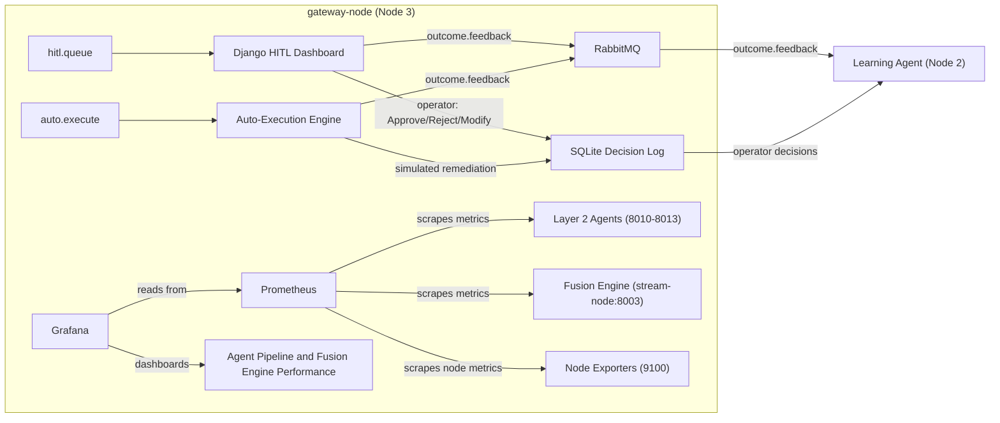

# Layer 3 User Guide — `gateway-node` (192.168.18.103)

This guide covers running the **HITL Dashboard**, **Auto-Execution Engine**, **Prometheus**, and **Grafana** on Node 3.

> **Prerequisite:** Layer 1 (Fusion Engine) and Layer 2 (all four agents) must be running and producing messages in `auto.execute` and `hitl.queue`.

---

## 1. Prerequisites Checklist

On `gateway-node`, verify the following before starting any component.

**Hostname**

```bash
hostname          # must return "gateway-node"
```

**RabbitMQ (on stream-node) reachable**

```bash
python3 -c "
import sys; sys.path.insert(0, '/home/spectre/fyp-pipeline/layer3')
from rabbitmq.connection import get_connection
conn = get_connection()
ch = conn.channel()
for q in ['auto.execute','hitl.queue','outcome.feedback']:
    r = ch.queue_declare(q, passive=True)
    print(f'{q}: {r.method.message_count}')
conn.close()
"
```

**Prometheus running**

```bash
sudo systemctl status prometheus
```

**Grafana running**

```bash
sudo systemctl status grafana-server
```

**Django environment**

```bash
cd ~/fyp-pipeline/layer3/dashboard
python3 manage.py check   # must print "System check identified no issues"
```

---

## 2. Python Environment

```bash
cd ~/fyp-pipeline/layer3
source .venv/bin/activate   # if not auto-activated
```

If packages are missing:

```bash
pip install -r requirements_node3.txt
```

---

## 3. Layer 3 Data Flow



The diagram source is also saved as `docs/layer3_data_flow.mmd` for standalone use and PNG export.

---

## 4. Startup Order

Start components in this order:

| Step | Component | Command | Notes |
|:----:|-----------|---------|-------|
| 1 | Prometheus | `sudo systemctl start prometheus` | Usually already running |
| 2 | Grafana | `sudo systemctl start grafana-server` | Usually already running |
| 3 | Auto-Executor | `python3 auto_executor/executor.py` | Consumes `auto.execute` |
| 4 | HITL Consumer | `python3 dashboard/manage.py consume_hitl` | Drains `hitl.queue` |
| 5 | Django Web Server | `python3 dashboard/manage.py runserver 0.0.0.0:8000` | Access at `http://192.168.18.103:8000` |

---

## 5. Running Each Component

### 5.1 Prometheus & Grafana (already set up from Phase 0)

```bash
sudo systemctl start prometheus
sudo systemctl start grafana-server
```

| Service | URL |
|---|---|
| Prometheus | `http://192.168.18.103:9090` |
| Grafana | `http://192.168.18.103:3000` (default login: `admin` / `admin`, unless changed) |

The scrape config (`/etc/prometheus/prometheus.yml`) should include:

- `stream-node:8003` (Fusion Engine)
- `ai-brain-node:8010,8011,8012,8013` (Layer 2 agents)
- `stream-node:9100`, `ai-brain-node:9100`, `gateway-node:9100` (Node Exporters)

### 5.2 Auto-Execution Engine

```bash
cd ~/fyp-pipeline/layer3
python3 auto_executor/executor.py
```

**Expected output:**
```
auto_executor_started
auto_executor_consuming queue=auto.execute
auto_executed event_id=... outcome=AUTO_EXECUTE_SUCCESS
```

| Note | Detail |
|---|---|
| Throughput | Processes each message in ~0.5 s |
| Storage | Writes to `sqlite_logger/decisions.db` |
| Feedback | Publishes `outcome.feedback` for the Learning Agent |

### 5.3 Django HITL Dashboard

#### 5.3.1 Queue Consumer (Terminal A)

```bash
cd ~/fyp-pipeline/layer3/dashboard
python3 manage.py consume_hitl
```

**Expected output:**
```
[HITL] Listening on hitl.queue …
[HITL] Stored <event_id>
```

Drains `hitl.queue` and creates `HitlIncident` rows. Let it run until the queue is empty, then `Ctrl + C`.

#### 5.3.2 Web Server (Terminal B)

```bash
cd ~/fyp-pipeline/layer3/dashboard
python3 manage.py runserver 0.0.0.0:8000
```

Open `http://192.168.18.103:8000` in a browser to see the queue.

---

## 6. Verification

### 6.1 Queue Depths

```bash
python3 -c "
import sys; sys.path.insert(0, '/home/spectre/fyp-pipeline/layer3')
from rabbitmq.connection import get_connection
conn = get_connection(); ch = conn.channel()
for q in ['auto.execute','hitl.queue','outcome.feedback']:
    r = ch.queue_declare(q, passive=True)
    print(f'{q}: {r.method.message_count}')
conn.close()
"
```

### 6.2 SQLite Decision Log

```bash
python3 -c "
import sqlite3
conn = sqlite3.connect('sqlite_logger/decisions.db')
rows = conn.execute(\"SELECT decision_type, COUNT(*) FROM decisions GROUP BY decision_type\").fetchall()
for r in rows: print(f'{r[0]}: {r[1]}')
conn.close()
"
```

### 6.3 Prometheus Targets

```bash
curl -s http://localhost:9090/api/v1/targets | python3 -c "
import sys, json
data = json.load(sys.stdin)
for t in data['data']['activeTargets']:
    print(f\"{t['labels'].get('instance','?')} — {t['health']}\")
"
```

### 6.4 Grafana Dashboard

Open `http://192.168.18.103:3000`, go to **Dashboards**, and select **Agent Pipeline & Fusion Engine Performance**. Panels will populate when the corresponding agents are running.

---

## 7. Stopping

| Component | How to stop |
|---|---|
| Auto-Executor & HITL Consumer | `Ctrl + C` in their terminals |
| Django Web Server | `Ctrl + C` |
| Prometheus / Grafana | `sudo systemctl stop prometheus grafana-server` (optional; leave running for monitoring) |

---

## 8. Troubleshooting

| Symptom | Likely Cause | Fix |
|---|---|---|
| `auto.execute` not draining | Auto-Executor not running | Start with `python3 auto_executor/executor.py` |
| `hitl.queue` not draining | HITL consumer not running | Start with `python3 manage.py consume_hitl` |
| Prometheus target `stream-node:8003` down | Fusion Engine not running on Node 1 | Start Fusion Engine; scrape will turn "up" when it does |
| `ModuleNotFoundError: No module named 'rabbitmq'` in Django | Path issue | Ensure `sys.path.insert(0, '/home/spectre/fyp-pipeline/layer3')` is in the script; run from `layer3/dashboard/` |
| `403 Forbidden` on Grafana import | Session expired | Log in again and retry |
| Decisions table shows duplicate event_ids | `consume_hitl` uses `update_or_create` — safe to re-run | Deduplication is handled |

---

## 9. Directory Reference

```
layer3/
├── auto_executor/       # auto.execute consumer
├── dashboard/           # Django HITL app
├── grafana/             # Dashboard JSON models
├── rabbitmq/            # RabbitMQ connection helper
├── sqlite_logger/       # decisions.db and write interface
├── requirements_node3.txt
└── User_Guide.md        # This file
```

For detailed component-by-component build history, see `docs/layer3_component_log.md`.